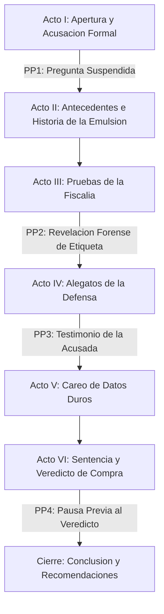

# Guion: "Mayonesa, ¿sabrosa embarrada que engorda?"
**Canal de YouTube:** `@JuicioAlimentoApetecible`
**Serie / Formato:** Juicio Alimento Apetecible
**Género:** Drama judicial divulgativo / Ciencia de los alimentos / Debate gastronómico
**Duración estimada:** 18:00 – 22:00 minutos
**Personajes:** Únicamente Beto, Beti y La Mayonesa (sin personajes adicionales).
**Objetivo del video:** Divulgación objetiva sobre alimentos reales del mercado, para que
el espectador tome mejores decisiones de compra. Todos los datos nutricionales y de
composición usados en este guion provienen del expediente base (`GuionJuicioAlimentoMayonesa.md`)
y no se introduce información científica nueva ni verificada fuera de esa fuente.

---

## Ficha Técnica de Producción

* **Acusador (Voz / Pantalla):**
BETO — Ingeniero bioquímico, especialista en nutrición y tecnología de alimentos.
Tono científico, didáctico, objetivo, respetuoso y profesional.
* **Defensora (Bancada):**
BETI — Madre de familia trabajadora, cocinera práctica y cotidiana.
Tono empático, alegre, risueña, perspicaz y conectada con el consumidor.
* **La Acusada:**
LA MAYONESA — Personificada / frasco en el estrado de los testigos. Voz chillona,
desfachatada y pícara, que en momentos clave interviene con testimonio propio.
* **Ambientación:**
Sala de tribunal judicial solemne combinada con elementos de laboratorio y cocina.
Pantallas de evidencia, estrado de testigos, mazo judicial y mesa de debate.
* **Estilo Audiovisual:**
Inspirado en dramas judiciales y series policiacas clásicas (estilo *Law & Order*),
apoyado con gráficos explicativos, macros de alimentos, material de archivo libre de
derechos y recreaciones dinámicas.
* **Banda Sonora y Efectos:**
Golpes de mazo judicial, acordes dramáticos de cuerdas, ritmos tensos de
sintetizador/bajo y transiciones de corte judicial (*doink-doink* / golpe seco de
campana grave). Un motivo musical breve y distintivo (pulso ascendente de dos notas)
se reserva para marcar los cuatro Plot Points del episodio.

---

## Convención del Guion Técnico

Esta sección define la simbología y terminología usada en la sección "Guion Técnico
Detallado por Escenas", para que cualquier miembro del equipo de producción interprete
el guion sin ambigüedad.

**Escalas de plano (Visual):**
| Abreviatura | Significado |
| :--- | :--- |
| PG | Plano General — ubica al personaje en el espacio completo de la sala. |
| PGC | Plano General Corto — encuadre amplio pero más cercano que el PG. |
| PA | Plano Americano — corte a la altura de los muslos, útil para diálogo con gesto corporal. |
| PM | Plano Medio — corte a la cintura, plano estándar de diálogo. |
| PMC | Plano Medio Corto — corte a la altura del pecho, mayor énfasis en el rostro. |
| PP | Primer Plano — rostro completo, énfasis emocional. |
| PPP | Primerísimo Primer Plano — detalle extremo de rostro u objeto (ojos, manos, etiqueta). |
| PD | Plano Detalle — objeto o textura aislada (cuchara, etiqueta, alimento). |

**Movimientos de cámara:**
| Término | Significado |
| :--- | :--- |
| Travelling / Dolly-in / Dolly-out | Desplazamiento físico de cámara hacia adelante o atrás. |
| Zoom-in / Zoom-out | Acercamiento o alejamiento óptico/digital sin desplazar la cámara. |
| Paneo (Pan) | Giro horizontal de cámara sobre su propio eje. |
| Whip Pan (Paneo de látigo) | Paneo muy rápido usado como transición entre dos puntos. |
| Arc Shot | Desplazamiento en semicírculo alrededor del sujeto. |
| Handheld | Cámara en mano, con ligera vibración orgánica. |
| Split Screen | Pantalla dividida para comparar dos elementos simultáneamente. |
| Estática | Cámara fija sobre trípode, sin movimiento. |

**Iluminación:** se especifica temperatura de color aproximada (K) cuando aplica, y el
tipo de fuente (cenital, spotlight, natural, clínica, cálida de estudio).

**Audio:** V.O. = voz en off; SFX = efecto de sonido puntual (foley); Score = música
incidental de fondo.

**Gráficos en pantalla:** Chyron = cartela inferior con texto identificador; Infografía
= gráfico de datos; Rótulo = texto centrado de énfasis.

**Marcador narrativo — Plot Point:**
> ⚡ **PLOT POINT #n** — Etiqueta que señala, tanto en el guion técnico como en el
> literario, cada uno de los **cuatro eventos significativos** diseñados para sostener
> la atención del espectador a lo largo del video (curiosidad inicial suspendida,
> revelación forense de etiqueta, testimonio inesperado de la acusada y pausa
> dramática previa al veredicto).

---

# I. Resumen Estructurado en los Principales Actos

### **Acto I: Apertura del Juicio y Acusación Formal (00:00 – 02:30)**
Presentación del caso en el tribunal. Se expone a la mayonesa como aderezo predilecto
de millones de hogares, señalada por promover sobrepeso y riesgo cardiovascular.
**⚡ PLOT POINT #1** — desde el primer minuto se plantea una preguntas abiertas que solo
se resolverán hasta el Acto VI: *¿la mayonesa engorda?, es aterogénica?, o es solo provoca 
sabor y placer?*

### **Acto II: Antecedentes e Historia — La Química del Origen (02:30 – 05:45)**
Origen de la salsa mayonesa e ingredientes básicos (yema de huevo, aceite vegetal,
ácido, mostaza, sal). Explicación bioquímica de la emulsión mediante la lecitina.

### **Acto III: Pruebas de la Fiscalía — La Radiografía Industrial (05:45 – 10:30)**
Inspección de marcas comerciales y lectura forense de etiquetas.
**⚡ PLOT POINT #2** — el momento de mayor tensión informativa del acto: Beto revela,
ingrediente por ingrediente, qué contiene realmente el frasco industrial promedio
(aceites refinados, almidón modificado, EDTA disódico) y su impacto calórico.

### **Acto IV: Alegatos de la Defensa — Practicidad, Sabor y Realidad Cotidiana (10:30 – 14:15)**
Beti presenta la defensa basada en la cocina real, el costo accesible y la seguridad
alimentaria de la versión comercial pasteurizada frente a la casera.
**⚡ PLOT POINT #3** — La propia Mayonesa, hasta entonces solo espectadora sarcástica,
interrumpe el juicio para dar su propio testimonio y defenderse con sus palabras.

### **Acto V: Careo y Contraste de Datos Duros (14:15 – 17:45)**
Tabla comparativa frontal: Mayonesa Casera vs. Industrial Clásica vs. Light vs.
Aderezo Económico. Se desmonta el mito de las versiones "Light".

### **Acto VI: Sentencia, Veredicto de Compra y Guía de Consumo (17:45 – 21:30)**
**⚡ PLOT POINT #4** — antes de leer el veredicto, Beto hace una pausa deliberada con
el mazo suspendido en el aire, sosteniendo la tensión de la pregunta abierta desde el
Acto I. Se resuelve la sentencia y se entrega la guía de compra inteligente.
Cierre con conclusión del video y recomendaciones prácticas para el espectador.

---

# II. Guion Técnico Detallado por Escenas

---

### ACTO I: APERTURA DEL JUICIO Y ACUSACIÓN FORMAL (00:00 – 02:30)

#### Escena 1 (00:00 – 00:40) — Gancho Visual y Pregunta Suspendida ⚡ PLOT POINT #1
* **Plano / Visual:**
PD cinematográfico con profundidad de campo reducida: una espátula unta una porción
generosa y cremosa de mayonesa sobre un pan caliente de torta que cruje, seguido de
cortes rápidos a un sándwich desbordante y un elote cubierto de mayonesa y queso.
* **Cámara / Movimiento:**
Cámara lenta (60 fps) con slider circular alrededor de los alimentos; corte con
zoom-in digital rápido hacia el estrado judicial.
* **Iluminación / Filtro:**
Luz cálida comercial gastronómica, alto contraste, saturación vibrante.
* **Audio / SFX / Música:**
Foley hiperrealista de cuchillo untando y pan crujiendo. Entra acorde grave de
violonchelo y golpe sordo de tambor judicial (*boom*).
* **Texto en Pantalla / Gráfico:**
Título animado: *"JUICIO AL ALIMENTO APETECIBLE: MAYONESA"*, seguido de un rótulo que
permanece en pantalla unos segundos: *"¿CULPABLE O INOCENTE? Lo sabrás al final de
este juicio."* — plantamiento explícito del Plot Point #1 como pregunta suspendida.

#### Escena 2 (00:40 – 01:20) — La Acusada en el Estrado
* **Plano / Visual:**
PA de la sala de juicio con paneles de madera caoba. Travelling hacia atrás revela el
banquillo de los acusados con el frasco de mayonesa personificado bajo luz cenital.
* **Cámara / Movimiento:**
Dolly-out fluido, ángulo normal a contrapicado suave.
* **Iluminación / Filtro:**
Tono azulado sobrio tipo juzgado de drama procesal, spotlight cenital sobre el frasco.
* **Audio / SFX / Música:**
Golpe musical de campana judicial (*doink-doink*); murmullo de sala silenciado con
tres golpes de mazo (*clac-clac-clac*).
* **Texto en Pantalla / Gráfico:**
Chyron: *"ACUSADA: Mayonesa Comercial | CARGOS: Promoción de Obesidad y Riesgo
Cardiovascular"*.

#### Escena 3 (01:20 – 02:30) — Lectura de Cargos y Declaración de la Defensa
* **Plano / Visual:**
PM de Beto con bata de laboratorio y corbata, sosteniendo el expediente. Whip pan
hacia Beti, de pie desde la bancada de la defensa con expresión confiada.
* **Cámara / Movimiento:**
Whip pan entre Beto y Beti, cerrando en PG que abarca ambos extremos de la sala.
* **Iluminación / Filtro:**
Contraste frío (pantalla de la fiscalía) vs. cálido (área de defensa de Beti).
* **Audio / SFX / Música:**
Cuerdas en pizzicato y sintetizador en tempo moderado (suspenso procesal).
* **Texto en Pantalla / Gráfico:**
Infografía lateral: *"EXPEDIENTE 01-MAYONESA: 90 a 100 kcal por cucharada / 70-80%
de contenido graso"*.

---

### ACTO II: ANTECEDENTES E HISTORIA — LA QUÍMICA DEL ORIGEN (02:30 – 05:45)

#### Escena 4 (02:30 – 03:50) — Origen y la Fórmula Clásica
* **Plano / Visual:**
PGC de cocina de época recreada (puerto de Mahón, 1756), disolviendo a toma cenital
(Flat Lay) con los cinco ingredientes puros: yema de huevo fresco, aceite vegetal,
limón, vinagre, sal y mostaza.
* **Cámara / Movimiento:**
Cenital con rotación suave de 45° y Dolly-in progresivo a cada ingrediente.
* **Iluminación / Filtro:**
Luz natural suave matutina, tonos dorados y orgánicos.
* **Audio / SFX / Música:**
Música de cámara clásica con violín solista; foley nítido de huevo rompiéndose y
gotas de limón cayendo.
* **Texto en Pantalla / Gráfico:**
Etiquetas flotantes: *"Yema de Huevo (Emulsionante)", "Aceite (Fase Grasa 75%)",
"Jugo de Limón / Ácido (Fase Acuosa)", "Sal y Especias"*.

#### Escena 5 (03:50 – 05:45) — La Ciencia de la Emulsión: ¿Magia o Bioquímica?
* **Plano / Visual:**
Animación 3D/microscópica: moléculas de lecitina con cabeza hidrófila y cola lipófila
atrapando microgotas de aceite suspendidas en agua.
* **Cámara / Movimiento:**
Vuelo de cámara 3D inmersivo entre partículas microscópicas en slow motion.
* **Iluminación / Filtro:**
Render vibrante: esferas doradas (grasa), filamentos azules (agua), conectores cian.
* **Audio / SFX / Música:**
Zumbido armónico electrónico de laboratorio con efectos acuosos (*pop*, *shimmer*).
* **Texto en Pantalla / Gráfico:**
Diagrama molecular: *"LECITINA: El puente entre el agua y el aceite"*.

---

### ACTO III: PRUEBAS DE LA FISCALÍA — LA RADIOGRAFÍA INDUSTRIAL (05:45 – 10:30)

#### Escena 6 (05:45 – 08:00) — Inspección Forense de Marcas ⚡ PLOT POINT #2
* **Plano / Visual:**
PMC en mesa de laboratorio con frascos comerciales representativos. Beto usa puntero
láser virtual para resaltar, uno por uno, los ingredientes en orden decreciente sobre
la etiqueta ampliada en pantalla — construyendo la revelación de forma progresiva
(primero el aceite, luego el huevo, luego los espesantes, luego los conservadores)
para sostener la tensión informativa del Plot Point.
* **Cámara / Movimiento:**
Tracking shot lateral frente a los frascos, alternando con PPP a las tablas
nutricionales; cada nuevo hallazgo se marca con un corte seco y un leve zoom-in de
énfasis.
* **Iluminación / Filtro:**
Luz clínica blanca neutra (5600K), nitidez extrema en las letras pequeñas del envase.
* **Audio / SFX / Música:**
Beat electrónico tenso con bajo procesado; cada hallazgo revelado se acompaña de un
sonido digital de escaneo (*beep*) y, en el hallazgo final, del motivo musical de
Plot Point.
* **Texto en Pantalla / Gráfico:**
Sellos destacados progresivos: *"ACEITE DE SOYA / CANOLA REFINADO" → "HUEVO: PORCIÓN
MÍNIMA" → "ALMIDÓN MODIFICADO DE MAÍZ" → "EDTA DISÓDICO"*, cerrando con el rótulo:
*"ESTO ES LO QUE REALMENTE COMPRAS"*.

#### Escena 7 (08:00 – 10:30) — El Sobrecargo Calórico y el Impacto Metabólico
* **Plano / Visual:**
Recreación 3D del flujo sanguíneo en una arteria humana, ilustrando la acumulación de
lípidos y colesterol LDL asociada al consumo excesivo. Se alterna con plano picado de
una cuchara sopera colmada cayendo sobre un platillo.
* **Cámara / Movimiento:**
Zoom digital continuo hacia el interior del vaso sanguíneo con pulsaciones rítmicas
que emulan el latido cardíaco.
* **Iluminación / Filtro:**
Tonos rojos intensos y sombras oscuras, tensión dramática y advertencia médica.
* **Audio / SFX / Música:**
Latido cardíaco en crescendo, sintetizador grave de alarma médica.
* **Texto en Pantalla / Gráfico:**
*"1 Cucharada (15g) ≈ 90-100 kcal, más del 90% en forma de grasa, y cerca de 100 mg
de sodio"*.

---

### ACTO IV: ALEGATOS DE LA DEFENSA — PRACTICIDAD, SABOR Y REALIDAD COTIDIANA (10:30 – 14:15)

#### Escena 8 (10:30 – 12:00) — La Prueba del Sabor en la Comida Popular
* **Plano / Visual:**
PM de Beti sosteniendo una torta recién preparada y una ensalada de atún. Tomas
dinámicas de puestos de comida callejera y mesas familiares compartiendo alimentos.
* **Cámara / Movimiento:**
Handheld fluido tipo documental, con acercamientos rápidos a los detalles apetitosos.
* **Iluminación / Filtro:**
Luz cálida de cocina de hogar, sombras suaves, sensación acogedora.
* **Audio / SFX / Música:**
Guitarra acústica alegre, risas de fondo, sonido ambiental de vajilla.
* **Texto en Pantalla / Gráfico:**
*"Palatabilidad y Saciedad", "Costo por porción: Menos de $2.00 MXN"*.

#### Escena 9 (12:00 – 13:15) — Seguridad Alimentaria: Casera vs. Industrial
* **Plano / Visual:**
Split screen: frasco casero con huevo crudo tras 48 horas (riesgo bacteriano) vs.
frasco industrial pasteurizado con pH ácido estable y sello hermético.
* **Cámara / Movimiento:**
Estática en split screen con zooms lentos simétricos en ambos lados.
* **Iluminación / Filtro:**
Luz neutra con comparador cromático.
* **Audio / SFX / Música:**
Efecto de balanza oscilando, campanas suaves de precisión.
* **Texto en Pantalla / Gráfico:**
*"CASERA: Vida útil 48 hrs / Riesgo de Salmonella" | "INDUSTRIAL: Pasteurizada / 6-12
meses"*.

#### Escena 10 (13:15 – 14:15) — El Testimonio Inesperado de la Acusada ⚡ PLOT POINT #3
* **Plano / Visual:**
PM del banquillo de los acusados. Hasta este punto La Mayonesa solo había lanzado
comentarios sarcásticos; ahora se incorpora en su asiento y pide la palabra
directamente al tribunal, rompiendo el formato de "observadora" para convertirse en
testigo activa de su propia defensa.
* **Cámara / Movimiento:**
Zoom-in lento hacia el frasco mientras "habla", cerrando en PPP sobre la etiqueta en
el momento de mayor énfasis emocional.
* **Iluminación / Filtro:**
El spotlight cenital que la ilumina se intensifica ligeramente, distinguiendo el
momento como un punto de giro dentro de la escena.
* **Audio / SFX / Música:**
Breve silencio de la sala antes de que hable (sala en suspenso), seguido del motivo
musical de Plot Point y murmullo sorprendido de fondo.
* **Texto en Pantalla / Gráfico:**
Chyron: *"LA ACUSADA TOMA LA PALABRA"*.

---

### ACTO V: CONTRASTE DE DATOS DUROS — CASERA VS. INDUSTRIAL (14:15 – 17:45)

#### Escena 11 (14:15 – 16:00) — El Careo Bioquímico en el Estrado
* **Plano / Visual:**
PG de la sala donde Beto y Beti se colocan frente a una pizarra holográfica
transparente, interactuando con los datos mientras debaten de pie.
* **Cámara / Movimiento:**
Arc shot de 180° alrededor de ambos interlocutores y la mesa de pruebas.
* **Iluminación / Filtro:**
Iluminación balanceada de debate televisivo, luces de recorte azules y ámbar.
* **Audio / SFX / Música:**
Percusión de thriller procesal con ritmo rápido de reloj (*tic-tac* metálico).
* **Texto en Pantalla / Gráfico:**
Tabla comparativa (ver tabla completa en la sección literaria, Acto V).

#### Escena 12 (16:00 – 17:45) — El Mito de las Grasas y las Versiones "Light"
* **Plano / Visual:**
PD a dos frascos: Mayonesa Regular frente a Mayonesa "Light". Beto abre ambos y
muestra la textura; la versión light sustituye grasa por agua y almidones.
* **Cámara / Movimiento:**
Zoom-in progresivo a las texturas en cucharas comparativas.
* **Iluminación / Filtro:**
Contraste nítido con reflejos en las superficies cremosas.
* **Audio / SFX / Música:**
Sonido de espátula deslizándose; acorde menor de revelación.
* **Texto en Pantalla / Gráfico:**
*"¡CUIDADO CON EL EFECTO LIGHT! Menos grasa, pero más carbohidratos y almidones
espesantes"*.

---

### ACTO VI: SENTENCIA, VEREDICTO DE COMPRA Y GUÍA DE CONSUMO (17:45 – 21:30)

#### Escena 13 (17:45 – 18:45) — Pausa Dramática Previa al Veredicto ⚡ PLOT POINT #4
* **Plano / Visual:**
PM de Beto en el estrado del juez, mazo levantado a media altura, congelado en el
aire por unos segundos. PP alternado a Beti conteniendo la respiración y a La
Mayonesa observando en silencio absoluto desde el banquillo.
* **Cámara / Movimiento:**
Estática prolongada con leve zoom-in casi imperceptible sobre el mazo suspendido,
seguido de corte a PP de cada personaje esperando.
* **Iluminación / Filtro:**
Luz dorada cenital sobre el estrado, resto de la sala ligeramente atenuado.
* **Audio / SFX / Música:**
Silencio casi total, con un único pulso grave de sintetizador que se repite (motivo
de Plot Point) hasta el golpe final de mazo.
* **Texto en Pantalla / Gráfico:**
Rótulo breve: *"EL MOMENTO DE LA VERDAD..."* — resolviendo directamente la pregunta
suspendida desde la Escena 1 (Plot Point #1).

#### Escena 14 (18:45 – 21:30) — Sentencia, Guía de Compra y Despedida
* **Plano / Visual:**
Continúa desde la Escena 13: Beto golpea el mazo (*¡CLAC!*) y lee la sentencia. Corte
a PG de la mesa final con un podio de tres lugares para la guía de compra: la menos
dañina, la opción Buena-Bonita-Barata y la que se debe evitar.
* **Cámara / Movimiento:**
Corte a plano frontal con ligero contrapicado para la sentencia; barrido horizontal
(pan) revelando los productos de la guía; zoom-out final hacia Beto y Beti
despidiéndose juntos a cuadro.
* **Iluminación / Filtro:**
Luz dorada solemne para la sentencia, transición a luz cálida y luminosa de estudio
para el cierre.
* **Audio / SFX / Música:**
Fanfarria orquestal suave de resolución de conflicto tras la sentencia; tema musical
de cierre alegre y dinámico con guitarra y percusión para la despedida.
* **Texto en Pantalla / Gráfico:**
*"VEREDICTO: CULPABLE POR EXCESO DE USO / INOCENTE SI SE DOSIFICA CON INTELIGENCIA"*,
seguido de tarjetas finales: *"Porción máxima sugerida: 1 cucharada cafetera (10-15g)
al día. ¡Suscríbete, en breve daremos inicio a otro juicio!. 

---

# III. Guion Literario

---

### **ACTO I: APERTURA DEL JUICIO Y ACUSACIÓN FORMAL**

**[ESCENA 1 — INT. SALA DE AUDIENCIA / COCINA — DÍA]** ⚡ PLOT POINT #1

*(El video inicia con un close-up de una cuchara esparciendo una nube blanca, densa y
cremosa de mayonesa sobre un bolillo tostado que cruje al contacto. Corte rápido a un
elote hervido cubierto con mayonesa, queso y chile piquín en polvo).*

**BETO (V.O.)**
*(Tono intrigante, voz profunda y cautivadora)*
Quizás está en tu refrigerador ahora mismo. Quizás es el secreto cotidiano que
transforma tu bolillo seco en una delicia torta. Aseguro, es parte del desayuno que llevas
al trabajo: práctico, económico y delicioso.

*(Corte seco. Pantalla a negro por un segundo. Suena el icónico golpe de mazo
judicial: ¡CLAC, CLAC, CLAC!).*

**BETO (V.O.)**
Pero detrás de esa tersa y apetitosa blancura, ¿se oculta una amenaza silenciosa para
tu corazón?, ¿aumenta tu cintura? Al final de este juicio lo sabrás con certeza: 
¿es aterogénica? ¿engorda?, ¿culpable... o inocente?.

*(Aparece el estrado de un juzgado solemne. En el banquillo de los acusados reposa
solitario, bajo un reflector, un frasco de mayonesa comercial con mirada altanera).*

**LA MAYONESA (ACUSADA)**
*(Voz chillona, desfachatada y pícara)*
¡Ay, por favor! ¡Para chismes, me como dos de lengua... con mucha mayonesa!

*(Música de fondo: tensión policiaca con cuerdas tensas y pulso bajo rítmico).*

**BETO (A cuadro, bata blanca impecable, corbata sobria)**
Silencio en la sala. Bienvenidos al tribunal de *Juicio al Alimento Apetecible*. Hoy
se sienta en el banquillo uno de los alimentos más consumidos del planeta: la
mayonesa. Se le imputan cargos graves: incitar al consumo desmedido de grasas
invisibles y favorecer el sobrepeso y aumentar el riesgo cardiovascular en quienes 
solo buscan comer sabroso. ¿Mayonesa, cómo se declara?

**BETI**
*(Entrando decidida desde la bancada de la defensa, acomodándose los papeles con una
sonrisa franca y energética)*
¡Objeción, fiscal! Mi clienta, la sabrosa Mayonesa, se declara totalmente
**inocente**. Aquí lo que hay es una campaña de desprestigio. La mayonesa no salta
del frasco a taparle las arterias a nadie; es la aliada del trabajador que necesita
comida rendidora y deliciosa. ¡Y hoy vamos a demostrar que la comida de verdad no
tiene por qué ser desabrida!

---

### **ACTO II: ANTECEDENTES E HISTORIA — LA QUÍMICA DEL ORIGEN**

**[ESCENA 2 — INT. SALA DE AUDIENCIA / MESA DE LABORATORIO — DÍA]**

**BETO**
*(Sonriendo con cortesía profesional)*
Estimada defensora, el tribunal aprecia su pasión. Pero antes de discutir culpas
actuales, repasemos los hechos: ¿qué es, en realidad, la mayonesa?

*(La pantalla muestra una mesa de madera con cinco ingredientes frescos, plano
cenital con iluminación impecable).*

**BETO (V.O.)**
La mayonesa es una auténtica maravilla de la fisicoquímica culinaria. Se elabora con
apenas cinco elementos básicos: una yema de huevo fresco, aceite puro vertido gota a
gota, unas gotas de jugo de limón o vinagre para aportar acidez, un toque de mostaza
y una pizca de sal, mezclados hasta lograr una consistencia cremosa.

**BETI**
*(Interviniendo con tono alegre y casero)*
¡Exactamente, Beto! Ingredientes que las familias tenemos en la cocina. ¿Dónde está
el delito en un poco de huevo y aceite?

**BETO**
*(Proyectando una gráfica molecular en 3D)*
El punto, Beti, es que la mayonesa no es una preparación convencional: es una
**emulsión de grasa en agua**. Logramos suspender millones de gotas diminutas de
aceite en un medio acuoso, y así obtenemos esa consistencia suave y sedosa. La
lecitina del huevo es la que enlaza esas moléculas de aceite con el agua.

**BETI**
*(Riendo con picardía)*
¡Pues bendito amarre de huevos, ingeniero! Porque gracias a esa textura suave,
comemos tortas y sándwiches más sabrosos.

**BETO**
*(Tono admonitorio pero amable)*
Cierto... pero ese mismo amarre esconde una sensación tramposa: al emulsionarse, la
grasa pierde su percepción aceitosa en el paladar. Puedes comerte cien calorías de
grasa concentrada en una sola cucharada, casi sin darte cuenta. Y eso, en la versión
casera tradicional. Lo que nos lleva al verdadero motivo por el que estamos hoy aquí:
la versión industrial que compramos en el supermercado.

---

### **ACTO III: PRUEBAS DE LA FISCALÍA — LA RADIOGRAFÍA INDUSTRIAL**

**[ESCENA 3 — INT. SALA DE AUDIENCIA / PANTALLA DE EVIDENCIAS — DÍA]** ⚡ PLOT POINT #2

*(A señal de Beto se proyectan en pantalla varios de los frascos comerciales de
mayonesa más vendidos, acompañados del sonido de escáner digital).*

**BETO**
Presento ante el tribunal la prueba pericial A: el análisis de composición de las
marcas dominantes del mercado. ¿Qué es lo que verdaderamente compra el ciudadano
cuando adquiere un frasco de mayonesa comercial? Vamos a leerlo juntos, ingrediente
por ingrediente.

*(Gráfico en pantalla haciendo zoom a las letras pequeñas de la lista de
ingredientes).*

**BETO**
Primer hallazgo: el tipo de aceite. En la industria no se utiliza aceite de oliva ni
aceites prensados en frío. La base principal es aceite de soya o de canola altamente
refinado.

*(Beat de música. Zoom al siguiente renglón de la etiqueta).*

**BETO**
Segundo hallazgo: el huevo entero o deshidratado representa apenas un porcentaje
mínimo de la fórmula.

*(Beat de música. Zoom al siguiente renglón).*

**BETO**
Tercer hallazgo: para abaratar costos y mantener la consistencia firme en anaquel
durante meses, muchas marcas introducen **almidón modificado de maíz** y jarabes de
azúcar para compensar la acidez.

*(Beat final de música, más intenso).*

**BETO**
Y cuarto hallazgo: conservadores como el **EDTA disódico**. Tribunal, esto es lo que
realmente compramos cuando llevamos un frasco genérico al carrito.

**BETI**
*(Cruzando los brazos, desafiante pero sonriente)*
A ver, a ver, señor perito. ¿Me está diciendo que el almidón y el EDTA son veneno?
Porque hasta donde yo sé, todas esas marcas cuentan con los permisos sanitarios de
ley y las compramos en cualquier tiendita de la esquina por un precio que no nos
vacía la cartera.

**BETO**
No son veneno agudo, Beti; son sustitutos tecnológicos diseñados para abaratar
costos y prolongar la vida útil del producto. Pero examinemos las consecuencias
metabólicas de consumirlos en exceso.

**[ESCENA 4 — INT. SALA DE AUDIENCIA — DÍA]**

*(Aparece una animación médica 3D de una arteria coronaria donde se ilustra la
acumulación de lípidos y colesterol LDL).*

**BETO (V.O.)**
Una sola porción estandarizada de mayonesa industrial equivale a quince gramos: una
cucharada sopera. En esa modesta cucharada hay aproximadamente **noventa a cien
kilocalorías**, de las cuales más del noventa por ciento es grasa pura, y contiene
cerca de cien miligramos de sodio. El problema real no es una cucharada; el problema
es que el consumidor promedio no usa cuchara medidora: unta una o dos cucharadas en
la torta, y si se come dos tortas, estaría ingiriendo más de trescientas calorías
provenientes de aceites vegetales refinados.

**BETO**
Si una persona sedentaria tiene el hábito cotidiano de consumir tortas, sándwiches y
burritos durante años, el exceso de energía acumulada y los lípidos oxidados en
sangre elevan los índices de triglicéridos y aceleran la formación de ateromas en las
arterias. Por lo cual, la acusación se sostiene: la mayonesa comercial es un promotor
directo del sobrepeso cuando se consume sin medida.

---

### **ACTO IV: ALEGATOS DE LA DEFENSA — PRACTICIDAD, SABOR Y REALIDAD COTIDIANA**

**[ESCENA 5 — INT. SALA DE AUDIENCIA / BANCO DE LA DEFENSA — DÍA]**

**BETI**
*(Se pone de pie, toma un frasco de mayonesa y lo coloca frente a la cámara con
calidez maternal y seguridad)*
Señor fiscal, sus números se ven muy bonitos en una pantalla de laboratorio, pero
usted no está pensando en la vida real de quienes salimos a trabajar desde las seis
de la mañana.

*(Beti muestra una lonchera con sándwiches bien preparados y una ensalada de
verduras mixtas).*

**BETI**
Primero: **el factor saciedad y rendimiento**. Una madre o un padre de familia que
prepara las tortas para sus hijos o para su jornada en la fábrica no tiene
presupuesto para comprar aguacate todos los días. Una cucharada de mayonesa cuesta
pocos pesos y le da sabor agradable a cualquier verdura hervida, además de aportar la
energía que mantiene satisfecho al trabajador.

**BETO**
*(Asintiendo con respeto)*
Es un punto económico válido, Beti, pero el riesgo vascular sigue presente...

**BETI**
*(Interrumpiendo con elocuencia)*
¡Momento, que no he terminado! Hablemos de **seguridad alimentaria**. Usted nos
presumió la mayonesa casera hecha con huevo crudo. Pero si una persona se lleva una
torta con mayonesa casera en el transporte público bajo treinta grados de calor
durante dos horas, ese huevo crudo se convierte en un nido de bacterias como la
*Salmonella*, capaz de mandarla directo a urgencias. En cambio, la mayonesa
comercial está pasteurizada, tiene su acidez controlada y garantiza que la comida no
se eche a perder. ¡Mi clienta salva estómagos de infecciones a diario!

**[ESCENA 6 — INT. SALA DE AUDIENCIA / BANQUILLO DE LOS ACUSADOS — DÍA]** ⚡ PLOT POINT #3

*(Silencio breve en la sala. La Mayonesa se incorpora en su asiento, y por primera
vez en el juicio pide la palabra directamente, dejando atrás el sarcasmo casual).*

**LA MAYONESA (ACUSADA)**
*(Voz más seria de lo habitual, aunque sin perder su chispa)*
Tribunal, si me lo permiten... quiero hablar yo misma. Llevo todo este juicio
escuchando que soy "silenciosa", "tramposa", "una bomba calórica". Y tienen razón en
los números, no los voy a negar. Pero nadie me obliga a nadie a comerme de más. Yo
solo soy una cucharada de sabor que alguien decide poner en su plato. Si me usan con
cabeza, cuido su comida de bacterias y le doy sabor a su día. Si me usan sin medida,
también soy responsable de eso... pero no lo soy yo sola.

**BETI**
*(Sonriendo, sorprendida y conmovida)*
¡Bien dicho, clienta! Eso es exactamente lo que este tribunal necesitaba escuchar: la
responsabilidad se comparte entre el producto y quien decide cuánto consumir.

**BETO**
*(Asintiendo, serio pero respetuoso)*
Es un testimonio válido. El tribunal lo toma en cuenta.

---

### **ACTO V: CONTRASTE DE DATOS DUROS — CASERA VS. INDUSTRIAL**

**[ESCENA 7 — INT. SALA DE AUDIENCIA / PESAJE Y COMPARACIÓN — DÍA]**

*(Beto y Beti se reúnen en la mesa central del tribunal. Sobre la mesa hay básculas
de precisión, recipientes medidores y tablas comparativas transparentes iluminadas).*

**BETO**
La defensa ha colocado sobre la mesa argumentos sumamente válidos: la practicidad, el
costo accesible y la responsabilidad compartida en el consumo. Pongamos entonces los
datos duros frente a frente para que nuestra audiencia juzgue con claridad absoluta.

*(Se despliega la tabla comparativa en pantalla).*

| Parámetro (Porción 15g / 1 Cucharada) | Mayonesa Casera (Aceite Girasol/Oliva) | Mayonesa Industrial Clásica | Mayonesa Reducida en Grasa ("Light") | Aderezo Tipo Mayonesa (Económica) |
| :--- | :--- | :--- | :--- | :--- |
| **Calorías** | 100 - 108 kcal | 90 - 95 kcal | 35 - 45 kcal | 50 - 65 kcal |
| **Grasas Totales** | 11 - 12 g | 10 g | 3 - 4 g | 4 - 6 g |
| **Grasas Saturadas** | 1.5 g | 1.5 g | 0.5 g | 1.0 g |
| **Carbohidratos / Azúcares** | 0.1 g | 0.5 g | 2.5 - 3.5 g | 4.0 - 6.0 g |
| **Sodio** | 20 - 40 mg | 95 - 130 mg | 120 - 160 mg | 150 - 200 mg |
| **Ingrediente Principal** | Aceite vegetal puro + Yema | Aceite vegetal + Agua + Huevo | Agua + Aceite + Almidón de Maíz | Agua + Almidón modificado + Azúcar |
| **Vida Útil en Refrigeración** | 48 a 72 horas máximo | 6 a 12 meses | 6 a 9 meses | 9 a 12 meses |

**BETO**
La tabla muestra que la mayonesa light y los aderezos tienen menos calorías
provenientes de grasa, pero tienen mayor contenido de carbohidratos y sodio.

**BETI**
*(Mirando la tabla con asombro)*
¿O sea que la gente que compra la versión "Light" creyendo que cuida su corazón, en
realidad está comiendo almidón y azúcar espesada?

**BETO**
*(Con tono firme y pedagógico)*
Exactamente, Beti. Ese es el gran engaño de la mercadotecnia. Para quitarle grasa a
una mayonesa cuya esencia es el aceite, la industria tiene que incluirle agua; y para
que el agua no quede líquida, le añaden almidón modificado, gomas vegetales y azúcar
para dar consistencia y sabor. Al final, el consumidor se confía porque dice "Light",
se sirve mayor porción y termina provocando un pico de glucosa e insulina en su
sangre, además de sobrecargar sus riñones con sodio.

**BETI**
O sea que el dicho popular tiene razón: resulta peor el remedio que la enfermedad si
no sabemos leer la etiqueta.

---

### **ACTO VI: SENTENCIA, VEREDICTO DE COMPRA Y GUÍA DE CONSUMO**

**[ESCENA 8 — INT. SALA DE AUDIENCIA / ESTRADO DEL JUEZ — DÍA]** ⚡ PLOT POINT #4

*(Beto regresa al estrado principal. Levanta el mazo... y se detiene a media altura.
Silencio total en la sala. Beti contiene la respiración. La Mayonesa observa,
inmóvil, desde el banquillo).*

**BETO**
*(Pausa larga, mirando directamente a cámara)*
Tras haber examinado las pruebas científicas de la fiscalía, los atenuantes prácticos
de la defensa y el testimonio de la propia acusada... este tribunal está listo para
resolver la pregunta que quedó abierta desde el inicio de este juicio.

*(Silencio de un segundo completo. El mazo sigue suspendido en el aire).*

**BETO**
Declaramos a la Mayonesa...

*(Beto golpea el mazo: ¡CLAC!).*

**BETO**
...**CULPABLE** de promover el sobrepeso y el riesgo cardiovascular **únicamente
cuando se consume en exceso sistemático y descontrolado**. Pero la declaramos
**ABSUELTA** de ser un alimento tóxico o prohibido en la mesa del hogar cuando se
utiliza con prudencia culinaria.

**BETI**
*(Sonriendo satisfecha, soltando el aire que contenía)*
¡Justicia pura! Entonces, Beto, para toda la gente trabajadora que nos está viendo:
¿cuál es la guía de compra definitiva? ¿Cuál es la mayonesa que de verdad conviene
comprar?

**BETO**
*(Tomando los productos en mano para orientar al espectador)*
Aquí tienen el dictamen de compra inteligente de *Juicio al Alimento Apetecible*:

**BETO**
1. **La "Menos Peor" / De Mayor Calidad Nutricional:** aquella cuya etiqueta indique
como primer ingrediente aceite de canola, girasol alto oleico o soya sin mezclas
hidrogenadas, que tenga huevo pasteurizado entre sus tres primeros ingredientes y
**cero almidones o jarabes añadidos**.

2. **La Mejor Opción Calidad-Precio (Buena, Bonita y Barata):** mayonesas
tradicionales con jugo de limón de marcas reconocidas que cumplen con la norma
oficial de al menos 65% de grasa emulsionada auténtica.

3. **La que DEBES EVITAR en tu carrito:** frascos que se autodenominan "aderezo a
base de mayonesa" ultra económicos, donde el primer ingrediente es agua y el segundo
es almidón de maíz modificado con saborizantes artificiales.

**BETI**
*(Haciendo el gesto con la mano de untar moderadamente)*
Y la regla de oro en la cocina: la mayonesa no es sopa, ¡es aderezo! Con una sola
cucharadita cafetera bien distribuida en el pan es más que suficiente.

**LA MAYONESA (ACUSADA)**
*(Con una sonrisa tranquila, ya sin sarcasmo)*
Y yo prometo seguir cuidando su comida... si ustedes prometen leer mi etiqueta antes
de meterme al carrito.

---

## IV. Conclusión del Video y Recomendaciones para el Espectador

**BETO**
*(Mirando a la cámara con una sonrisa empática, cerrando el juicio)*
Comer bien no significa privarse del sabor ni gastar una fortuna; significa tomar
decisiones informadas con criterio y datos reales en mano. Este juicio deja tres
aprendizajes concretos que puedes aplicar hoy mismo en tu próxima compra:

1. **Lee la lista de ingredientes, no solo el frente del empaque.** El orden importa:
si el aceite o el agua aparecen antes que el huevo, y el almidón modificado aparece
en los primeros lugares, estás comprando un sustituto, no una mayonesa tradicional.

2. **No te confíes de la palabra "Light" sin revisar la tabla nutricional.** Menos
grasa casi siempre significa más carbohidratos, azúcares o sodio añadidos para
compensar la textura y el sabor.

3. **La porción importa más que el producto en sí.** Una cucharadita cafetera
(10-15g) al día, dentro de una alimentación variada, no es lo mismo que dos o tres
cucharadas soperas diarias sostenidas durante años.

**BETI**
Y de mi parte, un consejo de cocina real: si trabajas fuera de casa y llevas comida
preparada, prefiere siempre la versión pasteurizada e industrial para transportes
largos bajo el sol, y guarda la mayonesa casera para el mismo día en que la preparas,
refrigerada y en poca cantidad.

**BETO**
Si este juicio te ayudó a despejar dudas sobre lo que compras para tu familia,
déjanos tu me gusta, suscríbete al canal `@JuicioAlimentoApetecible` y cuéntanos en
los comentarios: ¿qué alimento quieres que sentemos en el banquillo en el próximo
episodio?

**BETI**
¡Nos vemos en el próximo juicio! Y no le tengan miedo a la comida, ténganle respeto a
la porción.

*(Corte a pantalla final con música de cierre dinámica, enlaces a videos anteriores
del canal y tarjetas interactivas de suscripción).*

---
