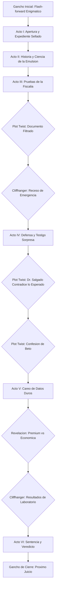

# Guion: "Mayonesa a Juicio — El Expediente que la Industria no Quiere que Veas"
**Canal de YouTube:** `@JuicioAlimentoApetecible`
**Serie / Formato:** Juicio Alimento Apetecible / Edición Extendida con Giros Dramáticos
**Género:** Drama judicial divulgativo / Ciencia de los alimentos / Suspenso investigativo
**Duración estimada:** 21:00 – 23:00 minutos

> Este guion parte de la base narrativa y de datos de `GuionJuicioAlimentoMayonesa.md` y de los lineamientos de marca de `JuicioAlimentoApetecible.md`, pero reestructura el video alrededor de **eventos significativos (plot points)** pensados para retener al espectador: un gancho de apertura, un documento filtrado, un testigo sorpresa, dos cliffhangers y una revelación final que se resuelve hasta el cierre.

---

## Ficha Técnica de Producción

* **Acusador (Voz / Pantalla):**
BETO (Ingeniero bioquímico, especialista en nutrición y tecnología de alimentos.
Tono científico, didáctico, objetivo, respetuoso y profesional).
* **Defensora (Bancada):**
BETI (Madre de familia trabajadora, cocinera práctica y cotidiana.
Tono empático, alegre, risueño, perspicaz y conectado con el consumidor).
* **La Acusada:**
LA MAYONESA (Personificada / Frasco en el estrado de los testigos).
* **Testigo Sorpresa (nuevo):**
DR. SALGADO (Cardiólogo clínico, invitado de último momento por la defensa.
Tono sereno, autorizado, ligeramente irónico con la fiscalía).
* **Voz del Mensajero (nuevo, cameo):**
Empleado del laboratorio independiente que irrumpe en la Escena 15 con resultados de última hora.
* **Ambientación:**
Sala de tribunal judicial solemne combinada con elementos de laboratorio y cocina.
Pantallas de evidencia, estrado de testigos, mazo judicial y mesa de debate.
* **Estilo Audiovisual:**
Inspirado en dramas judiciales y series de investigación (estilo *Law & Order* + documental
de "exposé" corporativo), apoyado con gráficos explicativos, macros de alimentos, material
de archivo libre de derechos y recreaciones dinámicas.
* **Banda Sonora y Efectos:**
Golpes de mazo judicial, acordes dramáticos de cuerdas, ritmos tensos de sintetizador/bajo,
transiciones de corte judicial (*doink-doink*), y un nuevo motivo musical de "alerta"
(pulso de sintetizador ascendente) reservado exclusivamente para los plot points.

---

# I. Mapa de Ganchos y Eventos Significativos (Plot Points)

Esta tabla es la columna vertebral de retención del video: cada evento está diseñado para
abrir o cerrar un "loop" narrativo que mantiene al espectador viendo hasta el final.

| # | Momento (mm:ss) | Evento Significativo | Mecanismo de Retención |
| :-- | :-- | :-- | :-- |
| **PP0** | 00:00 – 00:45 | **Gancho de apertura (flash-forward):** destellos de los momentos más intensos del juicio (mazo, folder "CONFIDENCIAL", Beti gritando "¡Objeción!", un mensajero irrumpiendo) antes del título. | Bucle abierto / curiosidad anticipada: promete un clímax sin revelarlo. |
| **PP1** | 02:15 | Beto muestra un **expediente sellado** que aún no puede abrir ("orden del tribunal"). | Objeto de deseo narrativo: el espectador quiere saber qué contiene. |
| **PP2** | 08:10 | **Documento filtrado:** un memo interno de "Industrias del Valle" expone cómo se sustituyó huevo real por almidón para abaratar costos. | Revelación tipo "exposé": indignación + shareability. |
| **PP3** | 10:40 | **Cliffhanger 1:** Beti pide un receso de emergencia justo cuando el juicio parece sentenciado. Corte a negro. | Interrupción abrupta antes de resolución = tensión sin resolver. |
| **PP4** | 11:00 | **Testigo sorpresa:** el Dr. Salgado, cardiólogo, entra sin ser anunciado y contradice la narrativa esperada. | Subversión de expectativas (el "médico" no dice lo que se esperaba). |
| **PP5** | 14:45 | **Confesión de Beto:** admite que él mismo consume mayonesa los fines de semana. | Humaniza al "villano" aparente; giro emocional/humor. |
| **PP6** | 17:20 | **Revelación shocking:** la marca "premium" resulta tener más sodio que la económica. | Dato contraintuitivo altamente comentable. |
| **PP7** | 18:40 | **Cliffhanger 2:** un mensajero irrumpe con resultados de un laboratorio independiente que podrían cambiar el veredicto. | Segundo bucle abierto justo antes del cierre. |
| **PP8** | 19:00 | **Resolución de PP2 y PP7:** el laboratorio confirma el memo filtrado pero matiza el riesgo real — ni satanización ni absolución total. | Pago del bucle: recompensa por haber seguido viendo. |
| **PP9** | 22:15 | **Gancho de cierre (post-créditos):** flash de la siguiente acusada del canal, sin nombrarla del todo. | Impulsa retención de canal / próximo video. |

---

# II. Resumen Estructurado en los Principales Actos

### **Acto 0: Gancho de Apertura (00:00 – 00:45)**
Montaje relámpago de los momentos más álgidos del juicio, sin contexto, para generar
curiosidad inmediata antes de mostrar el título del episodio.

### **Acto I: Apertura del Juicio y el Expediente Sellado (00:45 – 03:00)**
Presentación del caso, entrada de la acusada, lectura de cargos y aparición de un
folder confidencial que Beto guarda "para el momento oportuno".

### **Acto II: Antecedentes e Historia — La Química del Origen (03:00 – 06:00)**
Origen de la mayonesa, ingredientes base y la ciencia de la emulsión (lecitina).

### **Acto III: Pruebas de la Fiscalía y el Documento Filtrado (06:00 – 11:00)**
Análisis de marcas comerciales, apertura del expediente secreto (memo filtrado) y
cliffhanger de receso de emergencia.

### **Acto IV: Alegatos de la Defensa y Testigo Sorpresa (11:00 – 15:30)**
Entrada del Dr. Salgado, argumentos de practicidad y seguridad alimentaria, y
confesión personal de Beto.

### **Acto V: Careo de Datos Duros y Revelación (15:30 – 19:00)**
Tabla comparativa casera vs. industrial vs. light, revelación de sodio en la marca
premium y cliffhanger del mensajero de laboratorio.

### **Acto VI: Sentencia, Veredicto de Compra y Gancho de Cierre (19:00 – 23:00)**
Resolución de los dos cliffhangers, sentencia formal, guía de compra y teaser del
próximo episodio.

---

# III. Guion Técnico Detallado por Escenas

---

### ACTO 0: GANCHO DE APERTURA (00:00 – 00:45)

#### Escena 1 (00:00 – 00:45) — Flash-forward Enigmático
* **Plano / Visual:**
Montaje ultrarrápido de 6-8 microcortes (0.5-1 seg cada uno): el mazo golpeando con
fuerza, un folder rojo con sello "CONFIDENCIAL" siendo azotado sobre la mesa, Beti de
pie gritando con el dedo en alto, un hombre irrumpiendo con un sobre sellado, un
primer plano de La Mayonesa con expresión de pánico, la palabra "CULPABLE" parpadeando
en pantalla y desapareciendo antes de leerse por completo.
* **Cámara / Movimiento:**
Corte seco (jump cuts) sin transición, cámara en mano temblorosa, shutter alto para
efecto entrecortado tipo tráiler de suspenso.
* **Iluminación / Filtro:**
Contraste muy alto, viñeteado oscuro en los bordes, destellos estroboscópicos breves
en los cortes de mazo.
* **Audio / SFX / Música:**
Pulso de sintetizador ascendente (motivo de "alerta" del video) combinado con golpes
secos de mazo y un latido de corazón acelerado de fondo.
* **Texto en Pantalla / Gráfico:**
Texto superpuesto parpadeante: *"¿QUÉ ESCONDE LA MAYONESA QUE COMES A DIARIO?"* seguido
de corte abrupto a negro y aparición del título del episodio.

---

### ACTO I: APERTURA DEL JUICIO Y EL EXPEDIENTE SELLADO (00:45 – 03:00)

#### Escena 2 (00:45 – 01:30) — La Acusada en el Estrado
* **Plano / Visual:**
Plano Americano (PA) de la sala de juicio con paneles de madera caoba. Travelling hacia
atrás revelando el banquillo de los acusados donde reposa el frasco de mayonesa
personificado bajo luz cenital.
* **Cámara / Movimiento:**
Dolly-out fluido, ángulo normal a contrapicado suave.
* **Iluminación / Filtro:**
Tono azulado sobrio tipo juzgado de drama procesal, spotlight cenital sobre el frasco.
* **Audio / SFX / Música:**
Golpe musical de campana judicial (*doink-doink*), murmullo de sala silenciado con tres
golpes de mazo (*clac-clac-clac*).
* **Texto en Pantalla / Gráfico:**
Chyron: *"ACUSADA: Mayonesa Comercial | CARGOS: Promoción de Obesidad y Riesgo Cardiovascular"*.

#### Escena 3 (01:30 – 03:00) — Lectura de Cargos y el Folder Sellado
* **Plano / Visual:**
Plano Medio (PM) de Beto con bata de laboratorio, sosteniendo dos carpetas: una abierta
con el expediente estándar, y otra roja, cerrada, con sello "CONFIDENCIAL" que deja
sobre la mesa sin abrir. Paneo hacia Beti poniéndose de pie con confianza.
* **Cámara / Movimiento:**
Whip pan entre Beto y Beti, con Primerísimo Primer Plano (PPP) de 2 segundos al folder
rojo antes de continuar.
* **Iluminación / Filtro:**
Contraste frío (fiscalía) vs. cálido (defensa); el folder rojo recibe un golpe de luz
puntual que lo distingue visualmente del resto de la mesa.
* **Audio / SFX / Música:**
Cuerdas en pizzicato; al mostrarse el folder, un acorde disonante breve marca su
importancia sin resolverlo musicalmente (queda "en suspenso").
* **Texto en Pantalla / Gráfico:**
Infografía lateral: *"EXPEDIENTE 01-MAYONESA: 90-100 kcal por cucharada"*. Superpuesto
discreto sobre el folder rojo: *"Sellado por orden del tribunal — se abrirá más tarde"*.

---

### ACTO II: ANTECEDENTES E HISTORIA — LA QUÍMICA DEL ORIGEN (03:00 – 06:00)

#### Escena 4 (03:00 – 04:15) — Origen y la Fórmula Clásica
* **Plano / Visual:**
Plano General Corto de cocina de época recreada (puerto de Mahón, 1756), disolviendo
a toma cenital (Flat Lay) con los 5 ingredientes puros.
* **Cámara / Movimiento:**
Cenital con rotación suave de 45°, Dolly-in progresivo a cada ingrediente.
* **Iluminación / Filtro:**
Luz natural suave matutina, tonos dorados.
* **Audio / SFX / Música:**
Música de cámara clásica con violín solista; foley nítido de huevo rompiéndose.
* **Texto en Pantalla / Gráfico:**
Etiquetas flotantes: *"Yema de Huevo (Emulsionante)", "Aceite (Fase Grasa 75%)",
"Ácido (Fase Acuosa)", "Sal y Especias"*.

#### Escena 5 (04:15 – 06:00) — La Ciencia de la Emulsión
* **Plano / Visual:**
Animación 3D/microscópica: fosfolípidos de lecitina con cabeza hidrófila y cola
lipófila atrapando microgotas de aceite.
* **Cámara / Movimiento:**
Vuelo de cámara 3D inmersivo entre partículas en slow motion.
* **Iluminación / Filtro:**
Render vibrante: esferas doradas (grasa), filamentos azules (agua), conectores cian.
* **Audio / SFX / Música:**
Zumbido armónico electrónico con efectos acuosos (*pop*, *shimmer*).
* **Texto en Pantalla / Gráfico:**
Diagrama molecular: *"LECITINA: El puente entre el agua y el aceite"*.

---

### ACTO III: PRUEBAS DE LA FISCALÍA Y EL DOCUMENTO FILTRADO (06:00 – 11:00)

#### Escena 6 (06:00 – 07:30) — Inspección de Marcas en el Laboratorio Forense
* **Plano / Visual:**
PMC de mesa de laboratorio con 4 frascos comerciales representativos. Beto usa puntero
láser virtual sobre listas de ingredientes.
* **Cámara / Movimiento:**
Tracking shot lateral frente a los frascos; PPP a tablas nutricionales.
* **Iluminación / Filtro:**
Luz clínica blanca neutra (5600K), nitidez extrema en letras pequeñas.
* **Audio / SFX / Música:**
Beat electrónico tenso, sonidos de escaneo digital (*beep*).
* **Texto en Pantalla / Gráfico:**
Sellos: *"EXCESO CALORÍAS", "EXCESO GRASAS SATURADAS", "EXCESO SODIO"*.

#### Escena 7 (07:30 – 09:00) — PLOT TWIST: El Expediente Sellado se Abre
* **Plano / Visual:**
Beto finalmente rompe el sello del folder rojo (callback directo a la Escena 3).
Primer Plano de sus manos extrayendo un documento con membrete "Industrias del Valle —
Uso Interno" y párrafos resaltados en amarillo. Zoom-in progresivo al texto resaltado.
* **Cámara / Movimiento:**
Zoom-in lento y sostenido sobre el documento, simulando lectura junto al espectador;
corte a reacción de Beti con las cejas levantadas.
* **Iluminación / Filtro:**
Golpe de luz dramático sobre el papel, resto de la sala en penumbra parcial (efecto
"revelación").
* **Audio / SFX / Música:**
Activación del motivo de "alerta" (pulso de sintetizador ascendente) que crece en
intensidad hasta un acorde de impacto al mostrarse el texto completo.
* **Texto en Pantalla / Gráfico:**
Texto del documento ampliado en pantalla: *"...sustituir hasta 12% de yema por almidón
modificado sin afectar el puntaje de textura en pruebas de panel..."* Sello rojo
animado: *"DOCUMENTO FILTRADO — EXPEDIENTE 01-MAYONESA"*.

#### Escena 8 (09:00 – 10:40) — El Asalto a las Arterias y el Sobrecargo Calórico
* **Plano / Visual:**
Recreación 3D del flujo sanguíneo; formación de placas de ateroma. Corte a cuchara
sopera colmada cayendo sobre un platillo.
* **Cámara / Movimiento:**
Zoom digital continuo con pulsaciones rítmicas que emulan el latido cardíaco.
* **Iluminación / Filtro:**
Tonos rojos intensos, sombras oscuras.
* **Audio / SFX / Música:**
Latido cardíaco en crescendo, sintetizador grave de alarma médica.
* **Texto en Pantalla / Gráfico:**
*"1 Cucharada = 15g = 94 kcal vs. Gasto físico: 12 minutos de trote continuo"*.

#### Escena 9 (10:40 – 11:00) — CLIFFHANGER 1: Receso de Emergencia
* **Plano / Visual:**
Beto está a punto de resumir su acusación con tono conclusivo cuando Beti se levanta
de golpe, tirando su silla ligeramente hacia atrás. PM de Beti con expresión de
urgencia real (no de show).
* **Cámara / Movimiento:**
Corte brusco de PG a Primer Plano de Beti; freeze-frame de 0.5 seg antes del corte a
negro total.
* **Iluminación / Filtro:**
Corte abrupto a pantalla completamente negra.
* **Audio / SFX / Música:**
Silencio súbito de la música, seguido de un solo golpe de mazo fuera de cuadro y el
sonido de sala murmurando en la oscuridad.
* **Texto en Pantalla / Gráfico:**
Sobre fondo negro, texto blanco: *"RECESO DE EMERGENCIA SOLICITADO POR LA DEFENSA..."*

---

### ACTO IV: ALEGATOS DE LA DEFENSA Y TESTIGO SORPRESA (11:00 – 15:30)

#### Escena 10 (11:00 – 12:15) — PLOT TWIST: Entra el Testigo Sorpresa
* **Plano / Visual:**
Las puertas del tribunal se abren de par en par (Plano General). Entra el DR. SALGADO,
cardiólogo con bata blanca y estetoscopio, caminando con calma hacia el estrado de
testigos mientras toda la sala voltea a verlo.
* **Cámara / Movimiento:**
Travelling frontal siguiendo al Dr. Salgado desde la puerta hasta el estrado; corte a
reacción sorprendida de Beto (rompe su compostura habitual por primera vez).
* **Iluminación / Filtro:**
Reactivación de la luz de sala tras el receso, tono ligeramente más frío que resalta
la autoridad médica del personaje.
* **Audio / SFX / Música:**
Reingreso musical con acorde de cuerdas suspensivo, pasos resonando en el piso de
mármol.
* **Texto en Pantalla / Gráfico:**
Chyron: *"TESTIGO SORPRESA: Dr. Salgado — Cardiólogo Clínico, 15 años de experiencia"*.

#### Escena 11 (12:15 – 13:00) — El Testimonio que Nadie Esperaba
* **Plano / Visual:**
PM del Dr. Salgado en el estrado, sereno, dirigiéndose tanto al tribunal como a
cámara. Gráfico dividido en pantalla comparando "dieta con mayonesa moderada +
ejercicio" vs. "dieta ultraprocesada frita sin mayonesa" y sus respectivos perfiles
de riesgo.
* **Cámara / Movimiento:**
Estática frontal con zoom-in sutil durante la frase clave del testimonio.
* **Iluminación / Filtro:**
Luz clínica neutra, sobria, que refuerza credibilidad médica.
* **Audio / SFX / Música:**
Música baja casi imperceptible, dejando protagonismo total a la voz.
* **Texto en Pantalla / Gráfico:**
*"El verdadero patrón de riesgo no es un solo alimento: es la dieta completa y el
sedentarismo"*.

#### Escena 12 (13:00 – 14:00) — La Prueba del Sabor en la Comida Popular
* **Plano / Visual:**
PM de Beti sosteniendo una torta recién preparada y una ensalada de atún. Tomas
dinámicas de puestos de comida callejera y mesas familiares.
* **Cámara / Movimiento:**
Handheld fluido tipo documental, acercamientos rápidos a detalles apetitosos.
* **Iluminación / Filtro:**
Luz cálida de cocina de hogar, sensación acogedora.
* **Audio / SFX / Música:**
Guitarra acústica alegre, risas de fondo, sonido de vajilla.
* **Texto en Pantalla / Gráfico:**
*"Palatabilidad y Saciedad", "Costo por porción: Menos de $2.00 MXN"*.

#### Escena 13 (14:00 – 14:45) — Seguridad Alimentaria: Casera vs. Industrial
* **Plano / Visual:**
Split screen: frasco casero con huevo crudo tras 48 horas vs. frasco industrial
pasteurizado con sello hermético.
* **Cámara / Movimiento:**
Estática en split screen con zooms lentos simétricos.
* **Iluminación / Filtro:**
Luz neutra con comparador cromático.
* **Audio / SFX / Música:**
Efecto de balanza oscilando.
* **Texto en Pantalla / Gráfico:**
*"CASERA: Vida útil 48 hrs / Riesgo de Salmonella" | "INDUSTRIAL: Pasteurizada / 6-12 meses"*.

#### Escena 14 (14:45 – 15:30) — PLOT TWIST: La Confesión de Beto
* **Plano / Visual:**
PM de Beto, quien baja momentáneamente su tono formal. Corte a un inserto casero
(estilo "detrás de cámaras", grano de imagen distinto) de Beto un sábado en su cocina,
untando mayonesa en una ensalada de atún para su familia.
* **Cámara / Movimiento:**
Cambio de formato visual: de cámara de estudio pulida a estética handheld casera,
señalando claramente el cambio de "modo" al espectador.
* **Iluminación / Filtro:**
Luz doméstica cálida y desenfadada, contraste con la frialdad clínica previa de Beto.
* **Audio / SFX / Música:**
Acorde ligero de humor (pizzicato descendente juguetón), risa contenida de Beti fuera
de cuadro.
* **Texto en Pantalla / Gráfico:**
*"CONFESIÓN NO PLANEADA: hasta el fiscal tiene su cucharada culposa"*.

---

### ACTO V: CAREO DE DATOS DUROS Y REVELACIÓN (15:30 – 19:00)

#### Escena 15 (15:30 – 17:00) — El Careo Bioquímico en el Estrado
* **Plano / Visual:**
PG de Beto y Beti frente a una pizarra holográfica transparente, interactuando con
los datos de pie.
* **Cámara / Movimiento:**
Arc shot de 180° alrededor de ambos interlocutores y la mesa de pruebas.
* **Iluminación / Filtro:**
Iluminación de debate televisivo, luces de recorte azules y ámbar.
* **Audio / SFX / Música:**
Percusión de thriller procesal con ritmo de reloj (*tic-tac*).
* **Texto en Pantalla / Gráfico:**
Tabla técnica interactiva (ver tabla completa en la sección literaria, Acto V).

#### Escena 16 (17:00 – 17:45) — PLOT TWIST: Premium vs. Económica
* **Plano / Visual:**
PD a dos frascos: uno etiquetado "Gourmet — Aceite de Oliva Extra Virgen" y otro
genérico económico. Beto coloca ambos frente a un medidor de sodio digital que
enciende una luz roja sobre el frasco "premium".
* **Cámara / Movimiento:**
Zoom-in progresivo al display del medidor, terminando en freeze sobre la cifra.
* **Iluminación / Filtro:**
Contraste nítido, luz roja de advertencia sobre el frasco premium.
* **Audio / SFX / Música:**
Alarma digital breve (*beep-beep*), acorde de revelación.
* **Texto en Pantalla / Gráfico:**
*"SODIO POR PORCIÓN: 'Premium' 210 mg vs. Económica 140 mg — ¡MÁS CARA NO SIEMPRE ES
MÁS SANA!"*

#### Escena 17 (17:45 – 18:40) — El Mito de las Grasas y las Versiones "Light"
* **Plano / Visual:**
PD a Mayonesa Regular vs. "Light". Beto abre ambos frascos mostrando la textura.
* **Cámara / Movimiento:**
Zoom-in progresivo a texturas en cucharas comparativas.
* **Iluminación / Filtro:**
Contraste nítido con reflejos en superficies cremosas.
* **Audio / SFX / Música:**
Sonido de espátula deslizándose; acorde menor de revelación.
* **Texto en Pantalla / Gráfico:**
*"¡CUIDADO CON EL EFECTO LIGHT! Menos grasa, pero el doble de carbohidratos"*.

#### Escena 18 (18:40 – 19:00) — CLIFFHANGER 2: El Mensajero de Última Hora
* **Plano / Visual:**
Las puertas se abren de nuevo (eco visual de la Escena 10). Un empleado de laboratorio
entra apresurado con un sobre sellado, interrumpiendo a Beto a media frase.
* **Cámara / Movimiento:**
Corte brusco a PG de la puerta abriéndose; Primer Plano del sobre siendo entregado a
Beto; freeze-frame antes de que lo abra.
* **Iluminación / Filtro:**
Golpe de luz puntual sobre el sobre, resto de la sala atenuada.
* **Audio / SFX / Música:**
Reactivación abrupta del motivo de "alerta"; corte musical seco justo antes de que
Beto rompa el sello (segundo bucle abierto).
* **Texto en Pantalla / Gráfico:**
*"RESULTADOS DEL LABORATORIO INDEPENDIENTE — RECIÉN LLEGADOS"*.

---

### ACTO VI: SENTENCIA, VEREDICTO DE COMPRA Y GANCHO DE CIERRE (19:00 – 23:00)

#### Escena 19 (19:00 – 20:00) — Resolución: Se Abren los Resultados
* **Plano / Visual:**
PM de Beto leyendo el reporte en voz alta; Beti y el Dr. Salgado escuchan atentos.
Gráfico en pantalla que confirma parcialmente el documento filtrado (Escena 7) pero
matiza el nivel real de riesgo.
* **Cámara / Movimiento:**
Zoom-in lento sobre el reporte, luego corte a PG de los tres personajes procesando la
información juntos.
* **Iluminación / Filtro:**
La luz de la sala vuelve gradualmente a su tono cálido habitual, señalando resolución.
* **Audio / SFX / Música:**
El motivo de "alerta" se resuelve en un acorde mayor de calma.
* **Texto en Pantalla / Gráfico:**
*"CONFIRMADO: el almidón modificado sí sustituye huevo real para abaratar costos —
PERO dentro de límites permitidos y sin riesgo agudo comprobado en las cantidades
habituales de consumo"*.

#### Escena 20 (20:00 – 21:00) — La Sentencia del Tribunal
* **Plano / Visual:**
PM de Beto en el estrado del juez con el mazo en mano, Beti en primer plano
desenfocado (over-the-shoulder).
* **Cámara / Movimiento:**
Plano frontal con ligero contrapicado, corte a Beti asintiendo con sonrisa cómplice.
* **Iluminación / Filtro:**
Luz dorada cenital sobre el estrado, ambiente solemne y concluyente.
* **Audio / SFX / Música:**
Fanfarria orquestal suave, golpe final de mazo con eco (*¡CLAC!*).
* **Texto en Pantalla / Gráfico:**
*"VEREDICTO: CULPABLE POR EXCESO DE USO Y ETIQUETADO POCO TRANSPARENTE / INOCENTE SI
SE DOSIFICA Y SE LEE LA ETIQUETA CON CRITERIO"*.

#### Escena 21 (21:00 – 22:15) — Guía de Compra Inteligente y Despedida
* **Plano / Visual:**
PG de la mesa final con podio de tres lugares (menos dañina, mejor calidad-precio,
la que se debe evitar).
* **Cámara / Movimiento:**
Barrido horizontal revelando los productos, zoom-out hacia Beto y Beti despidiéndose
juntos.
* **Iluminación / Filtro:**
Luz cálida y luminosa de estudio de alta gama.
* **Audio / SFX / Música:**
Tema de cierre alegre y dinámico con guitarra y percusión brillante.
* **Texto en Pantalla / Gráfico:**
*"Porción máxima sugerida: 1 cucharada cafetera (10-15g) al día. ¡Suscríbete y activa
la campana!"*

#### Escena 22 (22:15 – 23:00) — Gancho de Cierre: Próximo Juicio
* **Plano / Visual:**
Tras el cierre habitual, corte a negro tipo "post-créditos". Destello de 2-3 segundos
de un nuevo alimento en un banquillo distinto (silueta parcial, no identificable del
todo), con un mazo golpeando fuera de cuadro.
* **Cámara / Movimiento:**
Corte seco único, sin transición, imitando el estilo de escena post-créditos.
* **Iluminación / Filtro:**
Muy oscura, apenas un spot sobre la silueta del próximo alimento.
* **Audio / SFX / Música:**
Un solo golpe de mazo y el motivo de "alerta" cortado abruptamente a silencio total.
* **Texto en Pantalla / Gráfico:**
*"PRÓXIMO JUICIO: ¿ABSUELTO O CULPABLE? Descúbrelo la próxima semana..."*

---

# IV. Guion Literario

---

### **ACTO 0: GANCHO DE APERTURA**

**[ESCENA 1 — MONTAJE / SIN UBICACIÓN FIJA]**

*(Cortes ultrarrápidos, sin diálogo articulado, solo fragmentos de audio superpuestos
entre sí, casi ininteligibles a propósito).*

**BETI (V.O., fragmento)**
¡Objeción...!

**VOZ DEL MENSAJERO (V.O., fragmento)**
...resultados de última hora...

**BETO (V.O., fragmento)**
...esto lo cambia todo...

*(Golpe de mazo. Corte a negro total. Silencio de un segundo completo).*

**BETO (V.O.)**
*(Tono grave, directo a cámara, sin música)*
Antes de que termine este juicio, algo va a cambiar el veredicto que tú ya diste en
tu cabeza. Bienvenido a *Juicio al Alimento Apetecible*.

*(Aparece el título animado: "MAYONESA A JUICIO — EL EXPEDIENTE QUE LA INDUSTRIA NO
QUIERE QUE VEAS").*

---

### **ACTO I: APERTURA DEL JUICIO Y EL EXPEDIENTE SELLADO**

**[ESCENA 2 — INT. SALA DE AUDIENCIA — DÍA]**

*(Aparece el estrado de un juzgado solemne. En el banquillo de los acusados reposa
solitario un frasco de mayonesa comercial con mirada altanera).*

**LA MAYONESA (ACUSADA)**
*(Voz chillona, desfachatada)*
¡Ay, por favor! ¡Para chismes, me como dos de lengua... con mucha mayonesa!

**BETO (A cuadro, bata blanca impecable)**
Silencio en la sala. Bienvenidos al tribunal de *Juicio al Alimento Apetecible*. Hoy
se sienta en el banquillo uno de los alimentos más consumidos del planeta: la
mayonesa. Se le imputan cargos graves de promover sobrepeso y riesgo cardiovascular.
¿Mayonesa, cómo se declara?

**BETI**
*(Entrando decidida desde la bancada de la defensa)*
¡Objeción, fiscal! Mi clienta se declara totalmente **inocente**. Hoy vamos a
demostrar que la comida de verdad no tiene por qué ser desabrida.

**[ESCENA 3 — INT. SALA DE AUDIENCIA — DÍA]**

*(Beto sostiene dos carpetas: la del expediente estándar y una roja, sellada, que
deja sobre la mesa sin abrir).*

**BETI**
*(Señalando la carpeta roja con curiosidad)*
Y eso, colega fiscal... ¿qué es? ¿Por qué trae un folder que ni siquiera ha abierto?

**BETO**
*(Con calma calculada)*
Todo a su tiempo, defensora. Este tribunal seguirá el orden establecido: primero los
antecedentes, luego las pruebas. Este documento se abrirá... cuando sea el momento.

**BETI**
*(Entrecerrando los ojos, sonriendo con desconfianza)*
Mmm... está bien, fiscal. Pero no se me olvida ese folder.

---

### **ACTO II: ANTECEDENTES E HISTORIA — LA QUÍMICA DEL ORIGEN**

**[ESCENA 4 — INT. SALA DE AUDIENCIA / MESA DE LABORATORIO — DÍA]**

**BETO**
Antes de discutir culpas actuales, mencionemos los hechos históricos. ¿Qué es en
realidad la mayonesa?

*(Pantalla: mesa con cinco ingredientes frescos en plano cenital).*

**BETO (V.O.)**
La mayonesa es una maravilla de la fisicoquímica culinaria: yema de huevo fresco,
aceite puro vertido gota a gota, jugo de limón o vinagre, mostaza y sal.

**BETI**
¡Exactamente, Beto! Ingredientes que las familias tenemos en la cocina. ¿Dónde está
el delito en un poco de huevo y aceite?

**[ESCENA 5 — INT. SALA DE AUDIENCIA — DÍA]**

**BETO**
*(Proyectando una gráfica molecular en 3D)*
El punto es que la mayonesa es una **emulsión de grasa en agua**. La lecitina del
huevo enlaza las moléculas de aceite con el agua, logrando una textura suave y sedosa.

**BETI**
*(Riendo)*
¡Pues bendito amarre de huevos, ingeniero!

**BETO**
*(Tono admonitorio pero amable)*
Cierto... pero ese mismo amarre oculta la percepción aceitosa en el paladar. Puedes
comer cien calorías de grasa concentrada casi sin darte cuenta. Y eso, en la versión
casera. Veamos qué pasa con la versión industrial.

---

### **ACTO III: PRUEBAS DE LA FISCALÍA Y EL DOCUMENTO FILTRADO**

**[ESCENA 6 — INT. SALA DE AUDIENCIA / PANTALLA DE EVIDENCIAS — DÍA]**

**BETO**
Presento la prueba pericial A: el análisis de composición de las marcas dominantes
del mercado. En la industria no se usa aceite prensado en frío, sino aceite de soya
o canola altamente refinado. El huevo entero representa apenas un porcentaje mínimo,
sustituido por almidón modificado, azúcares y conservadores como el EDTA disódico.

**BETI**
*(Cruzando los brazos)*
¿Me está diciendo que eso es veneno? Todas esas marcas tienen permisos sanitarios y
las compramos por un precio que no nos vacía la cartera.

**BETO**
No son veneno agudo, Beti. Son sustitutos para abaratar costos. Y hablando de abaratar
costos...

*(Beto se detiene. Toma la carpeta roja sellada de la mesa).*

**[ESCENA 7 — INT. SALA DE AUDIENCIA — DÍA]**

**BETO**
*(Rompiendo el sello lentamente)*
Este es el momento, defensora. Lo que voy a leer no es una suposición mía; es un
documento interno filtrado, obtenido por este tribunal, de una empresa que
identificaremos como "Industrias del Valle".

*(Primer plano al documento. Zoom-in al párrafo resaltado en amarillo).*

**BETO (leyendo)**
"...se autoriza sustituir hasta un doce por ciento de yema de huevo por almidón
modificado, sin afectar de forma perceptible el puntaje de textura en pruebas de
panel de consumidores..."

**BETI**
*(Con la boca entreabierta, genuinamente sorprendida)*
Espere... ¿me está diciendo que hay empresas que documentan, por escrito, cómo
engañar la textura para que no notemos que le quitaron huevo de verdad?

**BETO**
Exactamente lo que estoy diciendo, Beti. Y esto no es una teoría de conspiración: es
un memo real de uso interno.

**LA MAYONESA (ACUSADA)**
*(Voz temblorosa, por primera vez sin sarcasmo)*
Yo... yo no sabía nada de eso. A mí también me mintieron sobre mi propia receta.

**[ESCENA 8 — INT. SALA DE AUDIENCIA — DÍA]**

**BETO (V.O.)**
Una sola cucharada de mayonesa industrial son noventa a cien kilocalorías, más del
noventa por ciento en forma de grasa. El problema no es una cucharada: es que nadie
usa cuchara medidora. Si una persona sedentaria consume tortas y sándwiches durante
años, el exceso de energía y lípidos oxidados eleva los triglicéridos y acelera la
formación de ateromas en las arterias. Por lo cual, la acusación se sos...

**[ESCENA 9 — INT. SALA DE AUDIENCIA — DÍA]**

**BETI**
*(Poniéndose de pie de golpe, interrumpiendo)*
¡Alto ahí, fiscal! Solicito un receso de emergencia. Tengo algo que presentar y no
puede esperar ni un minuto más.

*(Corte abrupto a negro).*

---

### **ACTO IV: ALEGATOS DE LA DEFENSA Y TESTIGO SORPRESA**

**[ESCENA 10 — INT. SALA DE AUDIENCIA — DÍA]**

*(Las puertas del tribunal se abren de par en par. Entra el Dr. Salgado, cardiólogo,
caminando con calma hacia el estrado de testigos).*

**BETI**
Tribunal, presento a un testigo no programado: el Dr. Salgado, cardiólogo clínico con
quince años de experiencia tratando pacientes con enfermedad cardiovascular real.

**BETO**
*(Genuinamente descolocado, ajustándose los lentes)*
Esto... no estaba previsto en el orden del día, pero... el tribunal lo permite.

**[ESCENA 11 — INT. SALA DE AUDIENCIA — DÍA]**

**DR. SALGADO**
*(Tono sereno, mirando tanto al tribunal como a cámara)*
Gracias. Y quiero ser claro desde el principio: no vengo a defender a la mayonesa ni
a condenarla. Vengo a poner los pies en la tierra. En mi consulta, jamás he visto un
infarto causado por "la mayonesa" como alimento aislado. Lo que sí veo, todos los
días, es el patrón completo: comida frita, refrescos, cero actividad física y estrés
crónico. Culpar a un solo aderezo es buscar un villano fácil para un problema mucho
más complejo.

**BETO**
*(Con respeto genuino)*
Doctor, entonces... ¿la fiscalía está exagerando el riesgo?

**DR. SALGADO**
No exagerando, pero sí simplificando. El riesgo existe cuando el consumo es
descontrolado y forma parte de una dieta general dañina. En cantidades moderadas,
dentro de una alimentación balanceada, la evidencia no sostiene que sea, por sí sola,
"promotora de infartos".

**[ESCENA 12 — INT. SALA DE AUDIENCIA / BANCO DE LA DEFENSA — DÍA]**

**BETI**
*(Retomando su alegato con confianza renovada)*
Gracias, doctor. Y ahora sí, sigamos con la vida real. Una madre o un padre de
familia que prepara tortas para sus hijos no tiene presupuesto para aguacate todos
los días. Una cucharada de mayonesa cuesta pocos pesos y le da sabor a cualquier
verdura hervida.

**BETO**
Es un punto económico válido, Beti.

**[ESCENA 13 — INT. SALA DE AUDIENCIA — DÍA]**

**BETI**
Y hablemos de seguridad alimentaria. Si alguien lleva una torta con mayonesa casera
en el transporte público bajo treinta grados de calor, ese huevo crudo se convierte
en un nido de *Salmonella*. La mayonesa comercial, pasteurizada, garantiza que la
comida no se eche a perder.

**LA MAYONESA (ACUSADA)**
*(Recuperando algo de su confianza)*
¡Bien dicho, licenciada! Yo cuido la tripa y alegro el paladar.

**[ESCENA 14 — INT. SALA DE AUDIENCIA / INSERTO CASERO — DÍA]**

**BETI**
*(Con picardía)*
Fiscal Beto, sea honesto un segundo... ¿usted nunca se ha comido una cucharada de
más?

**BETO**
*(Pausa. Suspira, sonriendo apenas)*
...Está bien. Confieso. Los sábados, en mi ensalada de atún, le pongo mayonesa. Con
medida, pero le pongo.

*(Inserto casero: Beto en su cocina, un sábado, untando mayonesa en una ensalada de
atún para su familia, entre risas).*

**BETI**
*(Riendo a carcajadas)*
¡Lo sabía! ¡Hasta el fiscal tiene su cucharada culposa!

---

### **ACTO V: CAREO DE DATOS DUROS Y REVELACIÓN**

**[ESCENA 15 — INT. SALA DE AUDIENCIA / PESAJE Y COMPARACIÓN — DÍA]**

**BETO**
La defensa ha colocado argumentos sumamente inteligentes: la voz médica, la
practicidad y el costo accesible. Pongamos los datos duros frente a frente.

*(Se despliega la tabla comparativa en pantalla).*

| Parámetro (Porción 15g / 1 Cucharada) | Mayonesa Casera | Mayonesa Industrial Clásica | Mayonesa "Light" | Aderezo Económico |
| :--- | :--- | :--- | :--- | :--- |
| **Calorías** | 100 - 108 kcal | 90 - 95 kcal | 35 - 45 kcal | 50 - 65 kcal |
| **Grasas Totales** | 11 - 12 g | 10 g | 3 - 4 g | 4 - 6 g |
| **Grasas Saturadas** | 1.5 g | 1.5 g | 0.5 g | 1.0 g |
| **Carbohidratos / Azúcares** | 0.1 g | 0.5 g | 2.5 - 3.5 g | 4.0 - 6.0 g |
| **Sodio** | 20 - 40 mg | 95 - 130 mg | 120 - 160 mg | 150 - 200 mg |
| **Vida Útil en Refrigeración** | 48 - 72 horas | 6 - 12 meses | 6 - 9 meses | 9 - 12 meses |

**[ESCENA 16 — INT. SALA DE AUDIENCIA — DÍA]**

**BETO**
Y aquí viene un dato que sorprende incluso a este tribunal. Coloquemos dos frascos más
en la balanza: uno etiquetado "Gourmet, con aceite de oliva extra virgen", y uno
genérico económico.

*(El medidor de sodio digital enciende una luz roja sobre el frasco "premium").*

**BETO**
Doscientos diez miligramos de sodio por porción en la marca premium... contra ciento
cuarenta miligramos en la económica.

**BETI**
*(Con la boca abierta)*
¿O sea que pagamos más por una marca que en realidad tiene MÁS sal que la barata?

**BETO**
Así es. Muchas marcas "premium" compensan la pérdida de sabor por menos grasa —o por
presumir un aceite más caro— añadiendo más sal. El precio alto no es sinónimo
automático de mejor perfil nutricional.

**[ESCENA 17 — INT. SALA DE AUDIENCIA — DÍA]**

**BETI**
*(Mirando la tabla con asombro)*
¿O sea que la gente que compra la versión "Light" creyendo que cuida su corazón en
realidad está comiendo almidón y azúcar espesada?

**BETO**
Exactamente. Para quitarle grasa a una mayonesa, la industria añade agua; y para que
el agua no quede líquida, añade almidón modificado y azúcar. El consumidor se confía
porque dice "Light", se sirve mayor porción y termina provocando un pico de glucosa,
además de sobrecargar sus riñones con sodio.

**[ESCENA 18 — INT. SALA DE AUDIENCIA — DÍA]**

*(Las puertas se abren de golpe. Un empleado de laboratorio entra apresurado con un
sobre sellado).*

**VOZ DEL MENSAJERO**
¡Disculpe, fiscal! Resultados del laboratorio independiente... acaban de llegar y son
sobre el documento filtrado que presentó hoy.

*(Beto toma el sobre. Silencio total en la sala. Freeze antes de que lo abra).*

---

### **ACTO VI: SENTENCIA, VEREDICTO DE COMPRA Y GANCHO DE CIERRE**

**[ESCENA 19 — INT. SALA DE AUDIENCIA — DÍA]**

**BETO**
*(Leyendo en voz alta, con el Dr. Salgado y Beti escuchando atentos)*
El Laboratorio Nacional de Alimentos Independiente confirma la autenticidad del
documento filtrado en la Escena 7: en efecto, es práctica de la industria sustituir
huevo real por almidón modificado para abaratar costos.

**BETI**
*(Conteniendo el aliento)*
¿Pero...?

**BETO**
*(Continuando la lectura)*
Pero el mismo laboratorio aclara que, en las proporciones permitidas por la
normativa vigente y en el consumo habitual, no se ha comprobado un riesgo agudo
directo para la salud. Es decir: hay falta de transparencia en el etiquetado, no
necesariamente un peligro oculto mortal.

**DR. SALGADO**
Que es justo lo que yo les decía: el problema no es un ingrediente aislado. Es la
falta de información clara para que el consumidor decida con conocimiento de causa.

**[ESCENA 20 — INT. SALA DE AUDIENCIA / ESTRADO DEL JUEZ — DÍA]**

**BETO**
Tras examinar las pruebas científicas de la fiscalía, el testimonio médico
independiente y los atenuantes prácticos de la defensa, este tribunal emite su
veredicto formal.

*(Golpe de mazo: ¡CLAC!).*

**BETO**
Declaramos a la Mayonesa: **CULPABLE** de un etiquetado poco transparente sobre sus
sustitutos de huevo, y de fomentar el sobrepeso **únicamente cuando se consume en
exceso sistemático**. Pero la declaramos **ABSUELTA** de ser, por sí sola, la
responsable directa de infartos, y absuelta de ser un alimento prohibido en la mesa
del hogar cuando se usa con prudencia.

**BETI**
*(Sonriendo satisfecha)*
¡Justicia con matices, que es la justicia real! Beto, ¿cuál es la guía de compra
definitiva para la gente que va al mercado esta semana?

**[ESCENA 21 — INT. SALA DE AUDIENCIA — DÍA]**

**BETO**
Aquí tienen el dictamen de compra inteligente:

**BETO**
1. **La "Menos Peor":** aquella cuyo primer ingrediente sea aceite de canola, girasol
alto oleico o soya sin mezclas hidrogenadas, con huevo pasteurizado entre sus tres
primeros ingredientes y cero almidones añadidos.

2. **La Mejor Calidad-Precio:** mayonesas tradicionales de marcas reconocidas que
cumplen la norma de al menos 65% de grasa emulsionada auténtica.

3. **La que DEBES EVITAR:** frascos que se autodenominan "aderezo a base de
mayonesa", donde el primer ingrediente es agua y el segundo, almidón modificado con
saborizantes artificiales. Y recuerden: "premium" no siempre significa menos sodio.

**BETI**
Y la regla de oro: la mayonesa no es sopa, ¡es aderezo! Una cucharadita cafetera bien
distribuida es más que suficiente.

**BETO**
*(Mirando a cámara)*
Comer bien no significa privarse del sabor ni gastar una fortuna; significa tomar
decisiones informadas. Si este juicio te ayudó, déjanos tu me gusta, suscríbete al
canal `@JuicioAlimentoApetecible` y cuéntanos: ¿qué alimento quieres que sentemos en
el banquillo la próxima semana?

**BETI**
¡Nos vemos en el próximo juicio! Y no le tengan miedo a la comida, ténganle respeto a
la porción.

**[ESCENA 22 — GANCHO DE CIERRE / POST-CRÉDITOS]**

*(Corte a negro total. Silencio de un segundo. Un destello de dos segundos muestra la
silueta parcial de un nuevo alimento en un banquillo distinto. Un solo golpe de
mazo).*

**BETO (V.O., fuera de cuadro)**
*(Apenas audible)*
Tribunal... la próxima acusada ya está aquí.

*(Corte a negro. Texto final: "PRÓXIMO JUICIO: ¿ABSUELTO O CULPABLE? Descúbrelo la
próxima semana...").*

---
