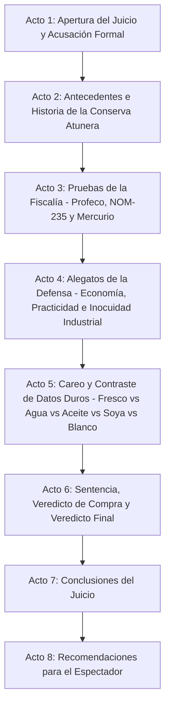

# Guion: "Atún Enlatado: ¿Superalimento del Mar o Trampa de Soya y Mercurio?"

**Canal de YouTube:** `@JuicioAlimentoApetecible`
**Serie / Formato:** Juicio Alimento Apetecible
**Género:** Drama judicial divulgativo / Ciencia de los alimentos / Debate nutricional
**Duración estimada:** 19:00 – 23:00 minutos

---

## 1. Resumen del Video

En este episodio de "Juicio Alimento Apetecible", Beto y Beti sientan en el banquillo de los acusados a uno de los conservas más veneradas y a la vez más sospechosas de la alacena moderna: **El Atún Enlatado**.

Beto, en su papel de fiscal e ingeniero bioquímico, fundamenta su acusación técnica en el **Estudio de Calidad de la Procuraduría Federal del Consumidor (Profeco), publicado en la Revista del Consumidor con motivo de la Cuaresma 2026**, así como en la **NOM-235-SE-2020** (Atún y bonita preenvasados — Denominación, Especificaciones, Información comercial y métodos de prueba) y en las guías conjuntas de la **FDA y la EPA de Estados Unidos sobre el consumo seguro de pescado y mercurio**. Beto desenmascara el fraude de etiquetado que permite hasta un 50% de relleno de soya, vegetales y leguminosas bajo la misma denominación de "atún"; expone marcas que mintieron sobre su verdadero contenido de proteína de soya (*Bodega Aurrerá*, declarando 14% cuando el laboratorio encontró entre 21% y 22%; *Ke Precio!* con apenas 19% de proteína y 18% de soya; *Precissimo* con solo 11% de proteína y hasta 19% de soya; *El Dorado* con 17.3% de proteína y 23% de soya); denuncia el fraude de masa drenada de la marca *Fresh* (declaró 100 g de atún escurrido y el laboratorio encontró entre 92.3 g y 95.9 g); y presenta el caso toxicológico más delicado de todos: la **bioacumulación de mercurio metílico**, un neurotóxico que se concentra de forma natural en los depredadores marinos de mayor tamaño y longevidad, obligando a la FDA y la EPA a establecer límites de consumo diferenciados por especie y por grupo poblacional (embarazadas, lactantes y niños).

Por su parte, Beti encabeza una defensa vibrante, práctica y económica del consumidor cotidiano: reivindica al atún enlatado como una de las fuentes de proteína completa más accesibles, versátiles y resistentes al tiempo que existen en el mercado, capaz de alimentar a una familia entera por menos de 15 pesos por porción sin necesidad de refrigeración durante años. Defiende la proeza tecnológica de la **esterilización comercial en autoclave (proceso retort a 121 °C)**, que elimina por completo el riesgo de *Clostridium botulinum* sin necesidad de un solo gramo de conservador químico añadido; expone su matriz nutricional de altísimo valor biológico (hasta 29 g de proteína, vitamina B12, vitamina D, selenio y ácidos grasos omega-3 EPA/DHA por porción); y defiende el avance real de la pesca responsable mediante las certificaciones **Dolphin Safe** y **MSC (Marine Stewardship Council)**, esta última otorgada por primera vez en el mundo a la pesquería mexicana de atún aleta amarilla y barrilete con caña y línea de Baja California.

El juicio culmina con un careo frontal de datos duros (Atún Fresco a la Parrilla vs. Enlatado en Agua vs. Enlatado en Aceite vs. Enlatado "Combinado" con Soya vs. Atún Blanco/Albacora), la desmitificación científica del miedo generalizado al mercurio, un veredicto de compra oficial con marcas aprobadas y sancionadas, y una guía práctica con las 4 reglas de oro para elegir, leer la etiqueta y consumir atún enlatado de forma inteligente y seguro para toda la familia.

---

## 2. Mapa Visual del Resumen Estructurado en Actos



* **Acto 1: Apertura del Juicio y Acusación Formal (00:00 – 02:20)**
  Planteamiento del caso judicial. Beto presenta los cargos: relleno de soya no declarado con precisión, fraude en masa drenada, bioacumulación de mercurio metílico y exceso de sodio oculto. Beti asume la defensa de la proteína más accesible, resistente y versátil de la despensa mundial.
* **Acto 2: Antecedentes e Historia (02:20 – 05:15)**
  Origen histórico: de la salazón ancestral fenicia y romana a la invención de la conserva hermética por Nicolas Appert (1809) y la lata de hojalata de Peter Durand (1810). El nacimiento de la industria atunera moderna en California y su consolidación en Ensenada y Mazatlán. La biología del atún como pez pelágico depredador de sangre parcialmente caliente y su lugar en la cadena trófica marina.
* **Acto 3: Pruebas de la Fiscalía (05:15 – 09:50)**
  Radiografía del Estudio Profeco Cuaresma 2026: marcas con soya oculta (*Bodega Aurrerá*, *Ke Precio!*, *Precissimo*, *El Dorado*) y fraude de masa drenada (*Fresh*). Lectura forense de la NOM-235-SE-2020 y su permisividad del 50% de relleno. El veredicto toxicológico del mercurio metílico según las guías FDA/EPA y el exceso de sodio por lata.
* **Acto 4: Alegatos de la Defensa (09:50 – 14:15)**
  Defensa del valor organoléptico, la economía y la conveniencia (listo en segundos, sin refrigeración). El triunfo de la esterilización comercial (retort) frente al riesgo de escombroidosis del pescado fresco mal conservado. Testimonio de La Lata de Atún en el estrado.
* **Acto 5: Careo y Contraste de Datos Duros (14:15 – 17:55)**
  Tablas comparativas científicas: Fresco a la Parrilla vs. Enlatado en Agua vs. Enlatado en Aceite vs. Combinado con Soya vs. Atún Blanco/Albacora. Desmitificación de los mitos del mercurio, la sustentabilidad Dolphin Safe/MSC y el verdadero impacto de los aditivos.
* **Acto 6: Sentencia, Veredicto de Compra y Veredicto Final (17:55 – 20:10)**
  Veredicto judicial: absuelto de ser "comida chatarra sin valor nutricional", pero sentenciado por fraude de etiquetado en marcas específicas. Dictamen de compra oficial: marcas aprobadas por Profeco vs. marcas sancionadas.
* **Acto 7: Conclusiones del Juicio (20:10 – 21:25)**
  Resumen ejecutivo de los hechos probados. Infografía de balance de riesgos y beneficios.
* **Acto 8: Recomendaciones para el Espectador (21:25 – 22:45)**
  Las 4 reglas de oro del consumidor inteligente: cómo leer la etiqueta, elegir la especie correcta y racionar el consumo según el grupo poblacional.

---

## 3. Escaleta, Mediante una Tabla Estructurada en Actos / Escenas

| Acto | Escena | Nombre / Descripción | Duración Estimada |
| :--- | :--- | :--- | :--- |
| **Acto 1** | Escena 1 | Gancho Visual e Introducción: El "pfft" del vacío, el tenedor hundiéndose y el mazo judicial | 00:00 – 00:45 |
| | Escena 2 | Declaración inicial y lectura de cargos de la Fiscalía (Beto) | 00:45 – 01:35 |
| | Escena 3 | Intervención inicial de la Defensa (Beti) y entrada de La Lata de Atún al estrado | 01:35 – 02:20 |
| **Acto 2** | Escena 4 | Origen histórico: De la salazón fenicia a Nicolas Appert y la industria atunera de Ensenada/Mazatlán | 02:20 – 03:45 |
| | Escena 5 | La ciencia detrás del acusado: Biología del atún, cadena trófica y bioacumulación de mercurio | 03:45 – 05:15 |
| **Acto 3** | Escena 6 | Radiografía del Estudio Profeco Cuaresma 2026: Soya oculta y proteína falseada | 05:15 – 06:50 |
| | Escena 7 | Lectura forense de etiquetas: NOM-235-SE-2020 y el fraude de masa drenada (*Fresh*) | 06:50 – 08:20 |
| | Escena 8 | El veredicto toxicológico: Mercurio metílico, guías FDA/EPA y sodio oculto | 08:20 – 09:50 |
| **Acto 4** | Escena 9 | Valor organoléptico, economía y conveniencia: El auxilio proteico de la alacena | 09:50 – 11:35 |
| | Escena 10 | Seguridad alimentaria: Esterilización comercial (retort) vs. riesgo de escombroidosis | 11:35 – 12:55 |
| | Escena 11 | Testimonio del alimento acusado (La Lata de Atún) en el banquillo | 12:55 – 14:15 |
| **Acto 5** | Escena 12 | Tabla comparativa frontal: Fresco vs. Agua vs. Aceite vs. Combinado con Soya vs. Blanco/Albacora | 14:15 – 16:05 |
| | Escena 13 | Debate de aditivos y desmitificación: Mercurio, sustentabilidad Dolphin Safe y MSC | 16:05 – 17:55 |
| **Acto 6** | Escena 14 | Sentencia judicial y veredicto de compra (marcas aprobadas vs. sancionadas) | 17:55 – 20:10 |
| **Acto 7** | Escena 15 | Resumen de los hechos probados y gráficos de la sentencia | 20:10 – 21:25 |
| **Acto 8** | Escena 16 | Alertas de salud, beneficios y las 4 reglas de oro del consumidor inteligente | 21:25 – 22:45 |

---

## 4. Ficha Técnica de Producción

* **Acusador (Fiscalía):**
  **BETO** (Ingeniero bioquímico, especialista en nutrición y tecnología de alimentos. Tono científico, riguroso, didáctico y respetuoso. Viste traje formal azul marino con corbata plateada, porta un expediente sellado de Profeco y maneja probetas con aceite y agua de gobierno, además de un cromatógrafo portátil para "detectar" mercurio).
* **Defensora (Bancada de la Defensa):**
  **BETI** (Joven profesionista trabajadora, experta en economía doméstica y cocina práctica cotidiana. Tono empático, resolutivo, ágil y contundente. Viste conjunto sastre casual en tonos arena y azul océano, con una carpeta de recetas rápidas y un abrelatas plateado brillante).
* **El Acusado en el Estrado:**
  **LA LATA DE ATÚN** (Personificada / Lata de conservas cilíndrica con etiqueta metálica brillante, un pequeño moño rojo en la tapa entreabierta y un cartel de "Inocente" apoyado a su costado, ubicada sobre el banquillo de testigos bajo un foco cenital).
* **Ambientación:**
  Sala de juzgado judicial moderna con paneles de madera de cedro, pantallas holográficas que proyectan mapas de rutas migratorias del atún en el océano Pacífico, una mesa forense con latas abiertas, una balanza analítica de precisión, tiras reactivas de frescura y un cromatógrafo simulado de mercurio junto a jarras con aceite de oliva y agua de gobierno.
* **Estilo Audiovisual:**
  Híbrido entre drama judicial procesal (*Law & Order*) y documental oceánico de divulgación científica (*Blue Planet* / *Kurzgesagt*), con tomas macro gastronómicas a 60 fps del brillo del aceite y las escamas de atún, animaciones 3D de biomagnificación trófica marina y gráficos limpios de datos de Profeco y la FDA/EPA.
* **Banda Sonora y Efectos:**
  Golpes secos de mazo judicial con reverberación profunda (*¡CLACK-BOOM!*), sintetizador tenso y cuerdas graves para las intervenciones forenses de Beto, piano rítmico y percusión ligera para las intervenciones de Beti, y efectos foley hiperrealistas (el característico "pfft" de vacío al abrir la lata, chapoteo de aceite y agua, graznidos de gaviotas y oleaje de fondo en las escenas históricas y oceánicas).
* **Indicaciones de Edición:**
  Ritmo dinámico sin tiempos muertos. Transiciones tipo "whip-pan" o cortes al golpe de mazo. Rótulos inferiores (*lower-thirds*) citando la NOM-235-SE-2020 y las guías FDA/EPA, y sellos de advertencia parpadeantes cuando se señale el exceso de sodio o el contenido de mercurio.

---

## 5. Convención del Guion Técnico

* **[PLANO / VISUAL]:**
  * `PG`: Plano General (vista panorámica de la sala judicial, fiscalía, estrado y defensa).
  * `PM`: Plano Medio (personaje de cintura hacia arriba).
  * `PP`: Primer Plano (rostro del personaje, capturando gestos de convicción, sorpresa o indignación).
  * `PD`: Primer Detalle (macro sobre el destape de la lata, el brillo del aceite escurriendo, la lectura de la etiqueta nutrimental, el golpe de mazo).
* **[CÁMARA / MOVIMIENTO DE CÁMARA]:** Slider lateral, Dolly frontal (travelling in/out), Paneo (pan horizontal), Tilt up/down vertical, Grúa cenital, Vuelo de cámara 3D inmersivo.
* **[ILUMINACIÓN / FILTROS]:** Luz fría judicial (5600K) en momentos de acusación técnica e inspección de etiquetas, Luz cálida oceánica (3200K) en planos históricos y de cocina cotidiana, Foco cenital directo sobre el acusado.
* **[AUDIO / SFX / MÚSICA]:** Sonido foley, música procesal dramática, golpes de mazo (*BOOM*), timbre judicial, suspenso con cuerdas graves, oleaje y graznidos de gaviotas.
* **[TEXTO EN PANTALLA / GRÁFICOS / ANIMACIONES]:** Infografías 2D/3D de biomagnificación trófica, mapas de rutas migratorias, tablas comparativas de Profeco, citas de la NOM-235-SE-2020 y comparativas de costo por gramo de proteína.

---

## 6. Guion Técnico Profesional Muy Detallado

### ACTO 1: APERTURA DEL JUICIO Y ACUSACIÓN FORMAL (00:00 – 02:20)

#### Escena 1 (00:00 – 00:45) — Gancho Visual e Introducción
* **Plano / Visual:** [PD] a 60 fps: Un tenedor se hunde en una lata de atún recién destapada, provocando un brillo aceitoso que resbala entre los trozos de carne rosada. Corte rápido al "pfft" del sello de vacío rompiéndose. Corte a una animación 3D de una molécula de mercurio metílico flotando en rojo dentro de un pez esquemático. Corte abrupto a un termómetro de sodio marcando niveles altos en una etiqueta nutrimental.
* **Cámara / Movimiento de cámara:** Dolly in rápido sobre el tenedor hundiéndose, transición en látigo (whip-pan) hacia el mazo judicial de madera sobre el estrado del juez.
* **Iluminación / Filtros:** Luz cálida de cocina (3200K) que vira instantáneamente a luz fría de tribunal forense (5600K).
* **Audio / SFX / Música:** Sonido foley del vacío al abrirse (*pfft*) y chapoteo de aceite. De pronto, golpe seco de mazo de roble con eco cavernoso (*¡CLACK-BOOM!*). Entra tema musical de tensión judicial con bajo pulsante y cellos oscuros.
* **Texto en Pantalla / Gráficos / Animaciones:** Rótulo animado en tipografía blanca y azul metálico: *"CASO Nº 60: ATÚN ENLATADO: ¿SUPERALIMENTO DEL MAR O TRAMPA DE SOYA Y MERCURIO?"*.

#### Escena 2 (00:45 – 01:35) — Declaración Inicial y Lectura de Cargos (Fiscalía)
* **Plano / Visual:** [PM] Beto de pie en la mesa de la Fiscalía. Abre un expediente sellado con el logotipo de la NOM-235-SE-2020 y coloca sobre la mesa dos latas abiertas: una de atún blanco y otra "combinada" con soya.
* **Cámara / Movimiento de cámara:** Slider lateral lento de izquierda a derecha, terminando en [PP] de Beto mirando fijamente al lente con expresión rigurosa y pedagógica.
* **Iluminación / Filtros:** Luz fría judicial directa (5600K) con contraluz azul tenue de fondo.
* **Audio / SFX / Música:** Pulso continuo de sintetizador tipo reloj (*tic-toc-tic-toc*) con notas graves de bajo.
* **Texto en Pantalla / Gráficos / Animaciones:** Lista animada de cargos:
  * 1. Relleno de soya no declarado con precisión (hasta 22% real vs. 14% en etiqueta).
  * 2. Fraude de masa drenada (hasta 7.7 g menos por lata).
  * 3. Bioacumulación de mercurio metílico neurotóxico.
  * 4. Exceso de sodio oculto (hasta 400 mg por lata).
  * 5. Pesca no certificada con riesgo para delfines y especies vulnerables.

#### Escena 3 (01:35 – 02:20) — Intervención Inicial de la Defensa (Beti)
* **Plano / Visual:** [PM] Beti en la mesa de la Defensa. Sonríe con confianza, sostiene una lata abierta con un tenedor y una ensalada verde a un costado. [PG] de la sala mostrando a La Lata de Atún en el banquillo de los acusados.
* **Cámara / Movimiento de cámara:** Travelling lateral suave hacia Beti; corte a [PP] de La Lata de Atún con un cartel de "Alimento de Emergencia".
* **Iluminación / Filtros:** Luz neutra luminosa y cálida sobre la bancada de Beti.
* **Audio / SFX / Música:** Acorde de piano esperanzador y dinámico, bajando el volumen para dar paso a la voz enérgica y convincente de Beti.
* **Texto en Pantalla / Gráficos / Animaciones:** Rótulo flotante: *"DEFENSA: 29 g de Proteína Completa + Vitamina B12 + Selenio + Omega-3 EPA/DHA por Lata"*.

---

### ACTO 2: ANTECEDENTES E HISTORIA (02:20 – 05:15)

#### Escena 4 (02:20 – 03:45) — Origen Histórico: De la Salazón Ancestral a la Industria Atunera
* **Plano / Visual:** [PG] Gráfica animada tipo mapa histórico: costas del Mediterráneo con fenicios y romanos salando pescado para conservarlo (el garum). Corte a un grabado del año 1809: Nicolas Appert presentando su método de conservación hermética a Napoleón Bonaparte para alimentar a los ejércitos franceses. Corte a la patente de Peter Durand de 1810 para la lata de hojalata. Corte a fotografías históricas en blanco y negro de las primeras enlatadoras de atún en California a inicios del siglo XX, y su consolidación en los puertos de Ensenada y Mazatlán.
* **Cámara / Movimiento de cámara:** Panorámica digital sobre el mapa histórico con zoom suave hacia la lata de hojalata original.
* **Iluminación / Filtros:** Tonalidad sepia histórica que transiciona a iluminación nítida de planta industrial moderna.
* **Audio / SFX / Música:** Cuerdas antiguas que evolucionan a sintetizadores modernos de ciencia. SFX de oleaje, graznidos de gaviotas y silbido de vapor industrial.
* **Texto en Pantalla / Gráficos / Animaciones:** Línea de tiempo interactiva:
  * *Siglo I a.C.*: Salazón fenicia y romana (el garum) como precursor de la conserva de pescado.
  * *1809-1810*: Nicolas Appert inventa la conserva hermética; Peter Durand patenta la lata de hojalata.
  * *Siglo XX*: Nace la industria atunera moderna en California, Ensenada y Mazatlán; el atún enlatado se convierte en ración esencial durante las Guerras Mundiales.

#### Escena 5 (03:45 – 05:15) — La Ciencia Detrás del Acusado: Biología y Cadena Trófica
* **Plano / Visual:** [PD] Animación 3D fotorrealista de un atún nadando a gran velocidad en mar abierto. Se visualiza su fisiología única: endotermia regional (capacidad de elevar su temperatura muscular por encima del agua circundante), lo que lo distingue de casi todos los demás peces. Corte a un diagrama de cadena trófica marina mostrando cómo el atún, como depredador tope, acumula mercurio metílico proveniente de presas menores.
* **Cámara / Movimiento de cámara:** Vuelo de cámara 3D inmersivo siguiendo al atún en su migración, luego zoom hacia el diagrama de biomagnificación trófica.
* **Iluminación / Filtros:** Fondo azul marino profundo con partículas bioluminiscentes y brillo dorado en las escamas del atún.
* **Audio / SFX / Música:** Música ambiental electrónica sofisticada (estilo documental oceánico). SFX de corrientes submarinas y zumbido de sonar.
* **Texto en Pantalla / Gráficos / Animaciones:** Ficha biológica de las principales especies comerciales:
  * *Aleta Amarilla (Thunnus albacares)*: Mediano-grande, base del atún "claro" premium.
  * *Barrilete / Skipjack (Katsuwonus pelamis)*: El más pequeño y abundante, base del atún "claro" estándar de lata.
  * *Albacora / Atún Blanco (Thunnus alalunga)*: Mayor tamaño y vida más larga, hasta 3 veces más mercurio que el claro.
  * *Aleta Azul (Thunnus thynnus)*: El más grande y longevo, reservado casi exclusivamente para sushi y sashimi de alto valor.

---

### ACTO 3: PRUEBAS DE LA FISCALÍA (05:15 – 09:50)

#### Escena 6 (05:15 – 06:50) — Radiografía del Estudio Profeco: Soya Oculta y Proteína Falseada
* **Plano / Visual:** [PM] Beto frente a una pantalla interactiva gigante proyectando la portada oficial de la *Revista del Consumidor* (Cuaresma 2026). Coloca sobre la mesa cuatro latas comerciales reales: *Bodega Aurrerá*, *Ke Precio!*, *Precissimo* y *El Dorado*.
* **Cámara / Movimiento de cámara:** Dolly in hacia la pantalla interactiva; corte rápido a [PD] de las letras minúsculas en el empaque que dicen "hidrolizado de proteína de soya".
* **Iluminación / Filtros:** Luz blanca quirúrgica (6000K). Las marcas señaladas reciben un foco rojo parpadeante de alerta.
* **Audio / SFX / Música:** Sonido de escáner digital (*bip-bip-bip*) y acorde disonante de advertencia.
* **Texto en Pantalla / Gráficos / Animaciones:** Tabla forense de infracciones Profeco:
  * *Bodega Aurrerá*: Declaró 14% de soya, el laboratorio encontró entre 21% y 22%. Clasificado como "información engañosa" (~$31 MXN).
  * *Ke Precio!*: 19% de proteína real y 18% de soya de relleno.
  * *Precissimo*: Solo 11% de proteína real y hasta 19% de soya.
  * *El Dorado*: 17.3% de proteína real y 23% de soya de relleno.

#### Escena 7 (06:50 – 08:20) — Lectura Forense de Etiquetas: NOM-235-SE-2020
* **Plano / Visual:** [PP] Beto sosteniendo la norma oficial mexicana. [PD] de una balanza de precisión pesando el contenido escurrido de la lata *Fresh* junto a su etiqueta que declara "100 g de masa drenada".
* **Cámara / Movimiento de cámara:** Slider horizontal lento comparando la balanza con el número declarado en la etiqueta.
* **Iluminación / Filtros:** Luz fría analítica sobre la mesa de pruebas.
* **Audio / SFX / Música:** Ritmo constante de suspenso procesal. SFX de clic metálico de la balanza.
* **Texto en Pantalla / Gráficos / Animaciones:** Parámetros obligatorios de la NOM-235-SE-2020:
  * Permite hasta 50% m/m de masa drenada en ingredientes opcionales (soya, vegetales, leguminosas, chile, mayonesa, ensaladas mixtas).
  * Relación de escurrido mínima: 65% m/m del contenido neto en todos los medios de cobertura (excepto bolsas retortables flexibles).
  * La denominación comercial debe corresponder a la especie con mayor porcentaje de masa drenada.
  * Caso *Fresh*: declaró 100 g de masa drenada; el laboratorio encontró entre 92.3 g y 95.9 g, además de un sello NOM-235 no sustentado y ausencia de advertencia por exceso de sodio.

#### Escena 8 (08:20 – 09:50) — El Veredicto Toxicológico: Mercurio Metílico y Sodio Oculto
* **Plano / Visual:** [PM] Beto coloca una lata de atún blanco/albacora junto a una de atún claro/skipjack. Animación 3D de una molécula de metilmercurio cruzando la barrera hematoencefálica en un cerebro humano.
* **Cámara / Movimiento de cámara:** Travelling frontal hacia las dos latas; paneo hacia el gráfico comparativo de mercurio por especie.
* **Iluminación / Filtros:** Luz dramática lateral con sombras marcadas.
* **Audio / SFX / Música:** Pulso grave de sintetizador y golpe de chelo (*thud*).
* **Texto en Pantalla / Gráficos / Animaciones:** Guías FDA/EPA de consumo seguro por mercurio:
  * *Atún claro/Skipjack ("Mejor opción")*: 2 a 3 porciones de 4 oz por semana para adultos, embarazadas, lactantes; niños 2 porciones/semana.
  * *Atún blanco/Albacora*: Hasta 3 veces más mercurio; limitar a 1 porción de 6 oz por semana.
  * *Sodio*: Hasta 400 mg por lata escurrida (~17-20% del límite diario recomendado por la OMS de 2000 mg/día).

---

### ACTO 4: ALEGATOS DE LA DEFENSA (09:50 – 14:15)

#### Escena 9 (09:50 – 11:35) — Valor Organoléptico, Economía y Conveniencia
* **Plano / Visual:** [PM] Beti se levanta con energía. Muestra una mesa con ensaladas, tortas y sushi improvisado hechos con atún de lata. Coloca una lata junto a un paquete de pechuga de pollo fresco y una calculadora.
* **Cámara / Movimiento de cámara:** Slider dinámico siguiendo el paso seguro de Beti por el estrado.
* **Iluminación / Filtros:** Luz cálida, brillante y luminosa (4000K).
* **Audio / SFX / Música:** Música rítmica optimista con marimba, piano y percusión ligera.
* **Texto en Pantalla / Gráficos / Animaciones:** Comparativa de costo por gramo de proteína:
  * Atún enlatado claro: ~$9 a $40 MXN por lata, listo en segundos, sin cocción ni refrigeración previa.
  * Versatilidad culinaria: ensaladas, tortas, pasta, sushi casero, guisos de emergencia.
  * Vida de anaquel: 2 a 4 años sin refrigeración, ideal para despensas familiares y kits de emergencia.

#### Escena 10 (11:35 – 12:55) — Seguridad Alimentaria: Esterilización Comercial vs. Escombroidosis
* **Plano / Visual:** [PG] Pantalla de tribunal mostrando un diagrama de un autoclave industrial (retort) calentando latas selladas a 121 °C. Corte a una animación de descomposición bacteriana de histidina en pescado fresco mal refrigerado, liberando histamina.
* **Cámara / Movimiento de cámara:** Dolly in hacia el rostro decidido de Beti; corte a [PD] del corte transversal de una lata de hojalata sellada.
* **Iluminación / Filtros:** Luz brillante de alta definición.
* **Audio / SFX / Música:** Golpes de cuerdas agudas que generan alivio. Sonido foley de vapor industrial y sellado metálico.
* **Texto en Pantalla / Gráficos / Animaciones:** Comparativa de seguridad microbiológica:
  * Proceso Retort (autoclave): 121 °C, esterilidad comercial garantizada, destruye esporas de *Clostridium botulinum* sin conservadores añadidos.
  * Atún fresco mal refrigerado: riesgo de escombroidosis por acumulación de histamina, con síntomas en minutos u horas (enrojecimiento, cefalea, taquicardia, diarrea).
  * Atún enlatado correctamente sellado: prácticamente libre de riesgo microbiológico durante toda su vida de anaquel.

#### Escena 11 (12:55 – 14:15) — Testimonio del Alimento Acusado en el Banquillo
* **Plano / Visual:** [PP] La Lata de Atún en el estrado de testigos. Foco cenital blanco. Beti se acerca respetuosamente para interrogarla.
* **Cámara / Movimiento de cámara:** Giro orbital de 180 grados alrededor del estrado del testigo.
* **Iluminación / Filtros:** Foco cenital directo (spotlight) sobre la lata brillante.
* **Audio / SFX / Música:** Voz en off distorsionada, suave y profunda representando al Atún. Fondo de violonchelo melancólico y oleaje lejano.
* **Texto en Pantalla / Gráficos / Animaciones:** Testimonio en subtítulos dorados: *"Nadé libre en el océano antes de llegar a tu mesa. No inventé la soya que algunos me añaden ni el mercurio que el mar me heredó. Solo soy el sustento más resistente que la humanidad supo conservar"*.

---

### ACTO 5: CAREO Y CONTRASTE DE DATOS DUROS (14:15 – 17:55)

#### Escena 12 (14:15 – 16:05) — Tabla Comparativa Frontal: Fresco, Agua, Aceite, Soya y Blanco
* **Plano / Visual:** [PG] Beto y Beti en el centro del juzgado frente a una mesa forense interactiva donde se despliega una mega tabla digital con cinco muestras de atún.
* **Cámara / Movimiento de cámara:** Paneo continuo de izquierda a derecha deteniéndose en cada muestra.
* **Iluminación / Filtros:** Iluminación neutral de laboratorio de análisis sensorial.
* **Audio / SFX / Música:** Duelo musical: bajo pulsante vs. piano rítmico.
* **Texto en Pantalla / Gráficos / Animaciones:** Tabla comparativa por porción de 100 g escurridos:
  1. *Fresco a la Parrilla*: 130 kcal | 28 g Prot | 1 g Grasa | 45 mg Sodio | Omega-3 alto.
  2. *Enlatado en Agua*: 116 kcal | 25-26 g Prot | 1 g Grasa | 320-380 mg Sodio | Omega-3 moderado.
  3. *Enlatado en Aceite*: 198 kcal | 29 g Prot | 8 g Grasa (1.3 g Sat) | 350-400 mg Sodio | Omega-3 mejor retenido.
  4. *Combinado con Soya (Barato)*: ~90 kcal | 11-19 g Prot | Variable | Sodio elevado | Menor densidad de omega-3.
  5. *Blanco/Albacora en Agua*: 128 kcal | 25 g Prot | 3 g Grasa | Sodio similar | Hasta 3x más mercurio.

#### Escena 13 (16:05 – 17:55) — Debate de Aditivos y Desmitificación Científica
* **Plano / Visual:** [PM] Beto y Beti intercambian argumentos. Beto explica la proteína de soya hidrolizada como relleno permitido por la NOM-235; Beti expone el mapa de certificación Dolphin Safe y MSC en las costas de Baja California.
* **Cámara / Movimiento de cámara:** Plano y contraplano rápido entre Beto y Beti con miradas de complicidad y respeto profesional.
* **Iluminación / Filtros:** Luz dinámica de debate judicial.
* **Audio / SFX / Música:** Sonido de campana de tribunal y acordes de clarificación científica.
* **Texto en Pantalla / Gráficos / Animaciones:** Desmitificación científica:
  * *¿Toda lata de atún tiene mercurio peligroso?*: No; depende de la especie y la frecuencia de consumo. El atún claro/skipjack es la opción de menor mercurio.
  * *¿El atún en agua no nutre?*: Falso; conserva la mayoría de la proteína, solo reduce grasa y calorías.
  * *Sustentabilidad*: La pesquería de atún aleta amarilla y barrilete con caña y línea de Baja California obtuvo la primera certificación MSC del mundo en su categoría; solo el 12% de la pesca mundial de atún está certificada como sustentable.

---

### ACTO 6: SENTENCIA, VEREDICTO DE COMPRA Y VEREDICTO FINAL (17:55 – 20:10)

#### Escena 14 (17:55 – 20:10) — Sentencia Judicial y Guía de Marcas Aprobadas por Profeco
* **Plano / Visual:** [PG] Sala en silencio solemne. Beto y Beti de pie frente al estrado del tribunal. El mazo judicial descansa sobre la madera. En la pantalla gigante se proyecta el sello de "SENTENCIA DEFINITIVA".
* **Cámara / Movimiento de cámara:** Dolly out solemne desde el mazo hacia el plano general de la sala, con cortes rápidos a [PP] de las marcas evaluadas.
* **Iluminación / Filtros:** Luz cenital solemne con contraste cinematográfico.
* **Audio / SFX / Música:** Redoble suave de tambores orquestales y golpe final de mazo (*¡CLACK-BOOM!*).
* **Texto en Pantalla / Gráficos / Animaciones:** Veredicto de Compra Profeco:
  * **MARCAS RECOMENDADAS (100% atún, sin soya):** *Great Value* (presentación en bolsa), *Dolores Premium Aleta Amarilla en Aceite*, *Tuny Clásico*, *Great Value* trozos en agua, *Oro de España*, *Tuny Gourmet*, *Yurrita*, línea premium de *Great Value*.
  * **MARCAS SANCIONADAS O CON ADVERTENCIA:** *Bodega Aurrerá* (soya oculta), *Ke Precio!* (baja proteína, alta soya), *Precissimo* (11% proteína real), *El Dorado* (23% soya), *Fresh* (masa drenada por debajo de lo declarado).
  * **ALERTA AL BOLSILLO:** Verifica siempre el porcentaje de soya declarado en la etiqueta; la ley permite hasta 50%, pero muchas marcas lo ocultan o lo subdeclaran.

---

### ACTO 7: CONCLUSIONES DEL JUICIO (20:10 – 21:25)

#### Escena 15 (20:10 – 21:25) — Resumen Ejecutivo y Gráficos de Sentencia
* **Plano / Visual:** [PM] Beto y Beti juntos en el centro de la sala, alternándose la palabra con fluidez y dinamismo didáctico.
* **Cámara / Movimiento de cámara:** Slider frontal suave con encuadre compartido.
* **Iluminación / Filtros:** Luz suave envolvente de estudio profesional.
* **Audio / SFX / Música:** Tema de cierre enérgico y concluyente.
* **Texto en Pantalla / Gráficos / Animaciones:** Infografía resumen:
  * *¿Es un fraude?*: Solo en marcas específicas que ocultan soya o falsean masa drenada; la mayoría cumple la norma.
  * *¿Es peligroso por el mercurio?*: Solo si se abusa de especies grandes (blanco/albacora) o se ignoran las guías de porciones semanales.
  * *¿Nutre?*: Sí, es de las fuentes de proteína completa más eficientes, económicas y duraderas del mercado.

---

### ACTO 8: RECOMENDACIONES PARA EL ESPECTADOR (21:25 – 22:45)

#### Escena 16 (21:25 – 22:45) — Las 4 Reglas de Oro del Consumidor Inteligente
* **Plano / Visual:** [PM] Beto y Beti con tarjetas informativas en mano, señalando los puntos clave para comprar en el supermercado. Cierre con llamada a la acción para suscribirse al canal.
* **Cámara / Movimiento de cámara:** Travelling lento in hacia los presentadores y zoom out final hacia el logotipo del canal `@JuicioAlimentoApetecible`.
* **Iluminación / Filtros:** Iluminación nítida y moderna.
* **Audio / SFX / Música:** Música alegre, rítmica y resolutiva de salida de video de YouTube.
* **Texto en Pantalla / Gráficos / Animaciones:** Tarjetas desplegables con las 4 Reglas de Oro:
  1. *Regla 1: Lee la etiqueta* (busca "100% atún" o "sin soya"; desconfía de "producto combinado" barato).
  2. *Regla 2: Alterna la especie* (prefiere claro/skipjack como base; limita el blanco/albacora a 1 porción semanal, especialmente embarazadas y niños).
  3. *Regla 3: Elige el medio según tu meta* (agua para menos calorías y sodio; aceite para más sabor y retención de omega-3).
  4. *Regla 4: Busca el sello Dolphin Safe o MSC* (apoya la pesca responsable sin dañar delfines ni ecosistemas).
  Botón animado de "Suscríbete y activa la campana".

---

## 7. Guion Literario Profesional Muy Detallado

### ACTO 1: APERTURA DEL JUICIO Y ACUSACIÓN FORMAL (00:00 – 02:20)

#### Escena 1: Gancho Visual y Apertura del Caso (00:00 – 00:45)
**Acción:**
La cámara abre con un plano macro hipnótico: un tenedor se hunde en una lata recién destapada, liberando un brillo aceitoso entre trozos de atún rosado. Se escucha el característico "pfft" del vacío rompiéndose. Corte a una animación 3D de una molécula roja de mercurio flotando dentro de la silueta de un pez. De pronto, un mazo de madera golpea con fuerza el estrado judicial.

**(BETO, tono firme, solemne y directo a cámara)**
Está en casi todas las alacenas del mundo. Es rápida, barata y se presume como el secreto proteico de deportistas y familias enteras. Pero hoy... la acusamos de esconder soya bajo el nombre de "atún", de robar gramos de contenido en la báscula y de cargar en su interior un metal pesado que preocupa a la ciencia.

**(BETI, tono curioso, cercano y con una sonrisa)**
Beto, por favor... ¿ahora también vamos a criminalizar a la lata que salvó más cenas de última hora que ningún otro alimento en la historia de la humanidad?

**(BETO, tono riguroso, levantando una carpeta judicial)**
Hoy sentamos en el banquillo de los acusados a uno de los productos más consumidos del planeta: El Atún Enlatado. ¿Es un tesoro nutricional del mar o una trampa de soya, sodio y mercurio disfrazada de salud? Que comience el juicio.

#### Escena 2: Declaración Inicial de la Fiscalía (00:45 – 01:35)
**Acción:**
Beto camina frente al estrado con paso medido. Coloca sobre la mesa del juez un expediente oficial de Profeco y dos latas abiertas: una de atún blanco puro y otra "combinada" con soya.

**(BETO, tono didáctico, respetuoso pero acusatorio)**
Honorables miembros del jurado y queridos consumidores: la fiscalía no viene a negar el valor histórico de esta conserva. Venimos a acusarla formalmente de cinco cargos graves. Primero: **relleno de soya no declarado con precisión**, marcas que dicen tener 14% de soya cuando el laboratorio oficial encontró hasta 22%. Segundo: **fraude en masa drenada**, latas que prometen 100 gramos de atún escurrido y entregan hasta 7.7 gramos menos. Tercero: **bioacumulación de mercurio metílico**, un neurotóxico que el propio océano deposita en los depredadores más grandes de su cadena alimenticia. Cuarto: **exceso de sodio oculto**, hasta 400 miligramos por lata. Y quinto: **pesca no certificada** que en ciertas flotas aún pone en riesgo a delfines y especies vulnerables.

#### Escena 3: Entrada del Acusado e Intervención de la Defensa (01:35 – 02:20)
**Acción:**
Beti se pone de pie con elegancia, sosteniendo una lata abierta con un tenedor y una ensalada verde al lado, colocándola junto a La Lata de Atún personificada en el banquillo de los testigos.

**(BETI, tono empático, vibrante y pragmático)**
¡Objeción, señor fiscal! No confunda los abusos de ciertas marcas tramposas con el valor real de esta conserva. Hablamos de la fuente de proteína completa más accesible, resistente y versátil que existe en el mercado: lista en segundos, sin refrigeración, con hasta 29 gramos de proteína, vitamina B12, vitamina D, selenio y ácidos grasos omega-3 por porción. Y gracias a la esterilización comercial industrial, puede durar años en la alacena sin un solo conservador químico añadido. ¡La defensa demostrará que el atún enlatado no es culpable de los fraudes de unas cuantas marcas, sino un aliado indispensable de la nutrición popular y de emergencia!

---

### ACTO 2: ANTECEDENTES E HISTORIA (02:20 – 05:15)

#### Escena 4: Origen Histórico y el Nacimiento de la Industria Atunera (02:20 – 03:45)
**Acción:**
En la pantalla interactiva se proyectan mapas del Mediterráneo antiguo, seguidos de un grabado de 1809 y fotografías industriales en blanco y negro de las primeras enlatadoras de California, Ensenada y Mazatlán.

**(BETO, tono explicativo y pedagógico)**
Para entender a la acusada, debemos viajar más de dos mil años atrás, a las costas del Mediterráneo. Fenicios y romanos ya salaban y fermentaban pescado para conservarlo, en una salsa llamada *garum*. Pero el gran salto tecnológico llegó en 1809, cuando el confitero francés Nicolas Appert descubrió que el calor y el sellado hermético preservaban los alimentos indefinidamente, ganando el premio que Napoleón Bonaparte ofrecía para alimentar a sus ejércitos. Un año después, el inglés Peter Durand patentó la lata de hojalata. A inicios del siglo XX, la industria atunera moderna nació en California y se consolidó con fuerza en los puertos de Ensenada y Mazatlán.

**(BETI, tono fascinado y risueño)**
O sea que cada vez que abrimos una lata, estamos usando la misma tecnología que alimentó a los soldados de dos guerras mundiales.

**(BETO, asintiendo con una ligera sonrisa)**
Exactamente, Beti. Y esa misma tecnología sigue siendo, hasta hoy, uno de los métodos de conservación más seguros jamás inventados.

#### Escena 5: La Ciencia Detrás del Acusado (03:45 – 05:15)
**Acción:**
Una animación 3D de alta resolución muestra a un atún nadando a gran velocidad, seguido de un diagrama de cadena trófica marina.

**(BETO, tono científico, señalando el diagrama holográfico)**
Miren la complejidad biológica de la acusada. El atún pertenece a la familia *Scombridae* y es de los pocos peces con **endotermia regional**: puede elevar la temperatura de sus músculos por encima del agua circundante, lo que le da una velocidad de nado excepcional. Pero como depredador tope de su cadena alimenticia, acumula en su carne el mercurio metílico que sus presas menores absorbieron antes que él. Cuanto más grande y longeva la especie, mayor la concentración.

**(BETI, tono entusiasta)**
¡Entonces no todos los atunes son iguales! Barrilete, aleta amarilla, blanco, aleta azul... cada uno con su propia historia.

**(BETO, tono admonitorio)**
Así es. Y esa diferencia entre especies es exactamente el corazón toxicológico de este juicio.

---

### ACTO 3: PRUEBAS DE LA FISCALÍA (05:15 – 09:50)

#### Escena 6: El Fraude de la Soya Oculta: Estudio Profeco (05:15 – 06:50)
**Acción:**
Beto activa la pantalla táctil forense, mostrando la portada oficial de la *Revista del Consumidor* de Cuaresma 2026. Coloca en el centro de la sala cuatro latas comerciales reales.

**(BETO, tono enérgico y acusador)**
Entremos al terreno de las pruebas irrefutables. El Laboratorio Nacional de Protección al Consumidor de la Profeco analizó decenas de marcas de atún enlatado en su estudio de Cuaresma 2026. ¿Y cuál fue uno de los hallazgos más alarmantes? **Bodega Aurrerá** declaraba 14% de soya en su etiqueta, pero el laboratorio encontró entre **21% y 22%** real, clasificando la información como francamente engañosa. **Ke Precio!** apenas alcanzó 19% de proteína real con 18% de soya de relleno. **Precissimo** llegó a un mínimo de 11% de proteína con hasta 19% de soya. Y **El Dorado** reportó solo 17.3% de proteína frente a un 23% de soya.

**(BETI, tono de indignación genuina)**
¡Eso es inaceptable, Beto! Sustituir el pescado por soya barata para inflar ganancias, sin decírselo claramente al consumidor, es un engaño directo al bolsillo de las familias.

**(BETO, asintiendo con gravedad)**
Coincido plenamente. Y aunque la ley permite cierto relleno, jamás debe ocultarse ni subdeclararse en la etiqueta.

#### Escena 7: Lectura Forense de Etiquetas: NOM-235-SE-2020 (06:50 – 08:20)
**Acción:**
Beto proyecta los requisitos legales obligatorios de la norma oficial. Sobre la mesa coloca una balanza de precisión pesando el contenido escurrido de la marca *Fresh*.

**(BETO, tono didáctico y técnico)**
Pongan mucha atención, consumidores, porque la norma mexicana vigente, la **NOM-235-SE-2020**, permite que hasta el **50% de la masa drenada** de una lata de atún esté compuesta por ingredientes opcionales: soya, vegetales, leguminosas, chile, mayonesa o ensaladas mixtas. No es ilegal, siempre que se declare con claridad. Además, exige una relación de escurrido mínima del **65%** respecto al contenido neto. Pero la marca **Fresh** declaraba **100 gramos** de masa drenada, y nuestro laboratorio forense encontró entre **92.3 y 95.9 gramos** reales, además de un sello NOM-235 sin sustento y ausencia de advertencia por exceso de sodio.

**(BETI, tono reflexivo y práctico)**
Es decir, la ley da margen para mezclar, pero exige honestidad total en la etiqueta. El problema no es la mezcla en sí, sino el engaño.

#### Escena 8: El Veredicto Toxicológico: Mercurio y Sodio (08:20 – 09:50)
**Acción:**
Beto coloca una lata de atún blanco/albacora junto a una de atún claro/skipjack. En la pantalla se proyecta una animación de metilmercurio cruzando la barrera hematoencefálica.

**(BETO, tono contundente)**
Hablemos del cargo más delicado. Las guías conjuntas de la FDA y la EPA de Estados Unidos clasifican al **atún claro o barrilete** como "mejor opción": adultos, embarazadas y lactantes pueden consumir de **2 a 3 porciones de 4 onzas por semana**, y los niños hasta 2 porciones. Pero el **atún blanco o albacora** contiene hasta **tres veces más mercurio**, por lo que se recomienda limitarlo a **una sola porción de 6 onzas semanales**. Y no olvidemos el sodio: hasta **400 miligramos por lata**, casi una quinta parte del límite diario recomendado por la OMS.

**(BETI, tono defensivo pero honesto)**
Son datos reales, Beto, y hay que respetarlos. Pero también hay que decir que ese mercurio no lo inventó la industria: es parte de la biología natural del océano, y se controla eligiendo bien la especie y la frecuencia, no evitando el atún por completo.

**(BETO, asintiendo)**
En eso, la fiscalía coincide contigo. El problema no es el atún en sí, sino el abuso sin información.

---

### ACTO 4: ALEGATOS DE LA DEFENSA (09:50 – 14:15)

#### Escena 9: Valor Organoléptico, Economía y Conveniencia (09:50 – 11:35)
**Acción:**
Beti da un paso al frente con energía. Coloca sobre la mesa ensaladas, tortas y sushi improvisado hechos con atún de lata, junto a un paquete de pechuga fresca y una calculadora.

**(BETI, tono elocuente, firme y apasionado)**
¡Señor fiscal, su análisis olvida el valor real que este alimento tiene para millones de familias! Una sola lata cuesta entre **9 y 40 pesos**, no requiere refrigeración, no necesita cocción, y puede prepararse en ensaladas, tortas, pastas o incluso sushi casero en menos de un minuto. Su costo por gramo de proteína es de los más bajos del mercado, incluso frente al pollo fresco. Y gracias a su vida de anaquel de **2 a 4 años**, es uno de los pilares de cualquier despensa de emergencia o presupuesto familiar ajustado.

**(BETO, tono respetuoso)**
Reconozco su practicidad, Beti. ¿Pero qué hay de su seguridad microbiológica a largo plazo?

**(BETI, tono triunfante)**
¡Ahí está la joya tecnológica que la fiscalía no puede rebatir!

#### Escena 10: Seguridad Alimentaria: Esterilización Comercial vs. Escombroidosis (11:35 – 12:55)
**Acción:**
Beti muestra en la pantalla un diagrama de un autoclave industrial calentando latas selladas, y luego una animación de descomposición bacteriana en pescado fresco mal refrigerado.

**(BETI, tono serio y contundente)**
El atún enlatado se somete a un proceso de **esterilización comercial en autoclave (retort)**, calentado a **121 grados Celsius** dentro de la lata ya sellada. Esto destruye por completo las esporas de *Clostridium botulinum* sin necesidad de un solo conservador químico añadido, garantizando años de seguridad en la alacena. Compárenlo con el atún fresco mal refrigerado, que puede desarrollar **escombroidosis**: una intoxicación por histamina que aparece minutos u horas después de comerlo, con enrojecimiento, dolor de cabeza, taquicardia y diarrea.

**(BETO, asintiendo categóricamente)**
En eso la fiscalía coincide al cien por ciento. La lata bien sellada es, microbiológicamente, de los alimentos más seguros que existen.

#### Escena 11: Testimonio del Alimento Acusado en el Banquillo (12:55 – 14:15)
**Acción:**
Un foco cenital ilumina a La Lata de Atún personificada en el banquillo. Se genera un silencio respetuoso en la sala de justicia.

**(BETI, tono suave)**
Díganos, testigo... ¿cuál es su declaración ante los cargos de este tribunal?

**(INVITADO - LA LATA DE ATÚN, voz en off suave, profunda y resonante)**
Nadé libre en mar abierto antes de llegar a tu mesa. Formé parte de una cadena de vida marina mucho más antigua que cualquier norma que hoy me regula. Yo no inventé la soya que algunas marcas me añaden en secreto, ni el mercurio que el propio océano depositó en mi carne durante mi crecimiento. Solo soy el sustento más resistente, portátil y accesible que la humanidad supo conservar. Solo pido que me elijan con información, no con miedo.

---

### ACTO 5: CAREO Y CONTRASTE DE DATOS DUROS (14:15 – 17:55)

#### Escena 12: Careo Frontal: Tabla Comparativa Definitiva (14:15 – 16:05)
**Acción:**
Beto y Beti se colocan frente a una mesa forense iluminada donde reposan cinco muestras etiquetadas. En la pantalla superior se despliega la tabla comparativa por porción de 100 gramos escurridos.

**(BETO, tono analítico)**
Vamos a contrastar los datos duros para que el consumidor sepa exactamente qué se está llevando a la boca. El **atún fresco a la parrilla** aporta 130 kilocalorías, 28 gramos de proteína, apenas 1 gramo de grasa y 45 miligramos de sodio, con el omega-3 más alto de todos. El **enlatado en agua** ofrece 116 kilocalorías, entre 25 y 26 gramos de proteína, 1 gramo de grasa, pero entre 320 y 380 miligramos de sodio. El **enlatado en aceite** sube a 198 kilocalorías y 29 gramos de proteína, con 8 gramos de grasa, mejor retención de omega-3, pero también más sodio.

**(BETI, tono contundente)**
Y ahí está la trampa que denunciamos juntos: el **combinado con soya barato** puede caer hasta 90 kilocalorías con solo 11 a 19 gramos de proteína real, mientras que el **atún blanco o albacora** en agua aporta 128 kilocalorías y 25 gramos de proteína, pero hasta tres veces más mercurio que el claro.

#### Escena 13: Desmitificación: Mercurio, Sustentabilidad y Aditivos (16:05 – 17:55)
**Acción:**
Beto y Beti intercambian argumentos científicos. Beto explica el marco legal de la soya como relleno permitido; Beti aborda el mapa de certificación Dolphin Safe y MSC en Baja California.

**(BETO, tono clarificador)**
Desmontemos el primer mito: **no toda lata de atún tiene mercurio peligroso**. Depende de la especie y de cuántas veces por semana la consumas. El atún claro o barrilete es, por mucho, la opción de menor riesgo.

**(BETI, tono orgullosa)**
Y desmontemos el segundo mito: **el atún en agua no es "menos nutritivo"**, simplemente tiene menos grasa y calorías; conserva casi toda su proteína. Y hablemos de algo hermoso: la pesquería de atún aleta amarilla y barrilete con caña y línea de Baja California obtuvo la **primera certificación MSC del mundo** en su categoría, demostrando que sí es posible pescar de forma responsable.

**(BETO, con respeto)**
Aunque hay que ser honestos: solo el **12%** de la pesca mundial de atún cuenta hoy con certificación de sustentabilidad. Todavía hay mucho camino por recorrer.

---

### ACTO 6: SENTENCIA, VEREDICTO DE COMPRA Y VEREDICTO FINAL (17:55 – 20:10)

#### Escena 14: Sentencia Judicial y Guía de Marcas Aprobadas (17:55 – 20:10)
**Acción:**
Sala en silencio solemne. Beto y Beti de pie frente al estrado del tribunal. El mazo judicial descansa sobre la madera.

**(BETO, tono solemne)**
Tras escuchar todas las pruebas, la fiscalía sostiene: el atún enlatado no es culpable de ser un "fraude nutricional" en general, pero sí se declara la culpabilidad específica de aquellas marcas que ocultaron soya o falsearon su masa drenada.

**(BETI, tono resolutivo)**
Y la defensa presenta con orgullo su veredicto de compra: marcas **100% atún y sin soya** como *Great Value* en bolsa, *Dolores Premium Aleta Amarilla en Aceite*, *Tuny Clásico*, *Great Value* en trozos y agua, *Oro de España*, *Tuny Gourmet* y *Yurrita* son opciones confiables y accesibles.

**(BETO, golpeando suavemente el expediente)**
Mientras que *Bodega Aurrerá*, *Ke Precio!*, *Precissimo*, *El Dorado* y *Fresh* quedan bajo advertencia oficial por incumplimientos comprobados de etiquetado.

**(Ambos, al unísono, mirando a cámara)**
¡Se dicta sentencia!

---

### ACTO 7: CONCLUSIONES DEL JUICIO (20:10 – 21:25)

#### Escena 15: Resumen Ejecutivo y Gráficos de Sentencia (20:10 – 21:25)
**Acción:**
Beto y Beti juntos en el centro de la sala, alternándose la palabra con fluidez y dinamismo didáctico.

**(BETO, tono conclusivo)**
Los hechos probados son claros: el fraude existe, pero está concentrado en marcas específicas, no en el alimento como tal.

**(BETI, tono cálido y firme)**
Y la nutrición también es real: proteína completa, vitamina B12, selenio y omega-3, a un costo que ninguna otra fuente animal puede igualar.

---

### ACTO 8: RECOMENDACIONES PARA EL ESPECTADOR (21:25 – 22:45)

#### Escena 16: Las 4 Reglas de Oro del Consumidor Inteligente (21:25 – 22:45)
**Acción:**
Beto y Beti sostienen tarjetas informativas, señalando los puntos clave para comprar en el supermercado. Cierre con llamada a la acción para suscribirse al canal.

**(BETO, tono práctico)**
**1. Lee la etiqueta:** busca "100% atún" o "sin soya"; desconfía de los "productos combinados" sospechosamente baratos.

**(BETI, tono práctico)**
**2. Alterna la especie:** usa el atún claro o barrilete como base diaria, y limita el blanco o albacora a una porción semanal, sobre todo si estás embarazada o cocinas para niños.

**(BETO, tono práctico)**
**3. Elige el medio según tu meta:** agua si cuidas el sodio y las calorías; aceite si buscas más sabor y mejor retención de omega-3.

**(BETI, tono alegre de despedida)**
**4. Busca el sello Dolphin Safe o MSC:** cada lata con esa certificación apoya una pesca que no daña a los delfines ni agota el océano.
¡Si este juicio te abrió los ojos, dale like al video, suscríbete al canal `@JuicioAlimentoApetecible` y déjanos en los comentarios qué alimento quieres que llevemos al banquillo de los acusados en el próximo episodio!

**(BETO, golpeando el mazo suavemente con una sonrisa)**
¡Se levanta la sesión!

---

## 8. Guion Profesional con la Mezcla del Guion Técnico y el Guion Literario

### ACTO 1: APERTURA DEL JUICIO Y ACUSACIÓN FORMAL (00:00 – 02:20)

#### Escena 1 — Gancho Visual y Apertura del Caso (00:00 – 00:45)
* **Plano / Visual:** [PD] a 60 fps: Un tenedor se hunde en una lata de atún recién destapada, provocando un brillo aceitoso que resbala entre los trozos de carne rosada. Corte rápido al "pfft" del sello de vacío rompiéndose. Corte a una animación 3D de una molécula de mercurio metílico flotando en rojo dentro de un pez esquemático. Corte abrupto a un termómetro de sodio marcando niveles altos en una etiqueta nutrimental.
* **Cámara / Movimiento de cámara:** Dolly in rápido sobre el tenedor hundiéndose, transición en látigo (whip-pan) hacia el mazo judicial de madera sobre el estrado del juez.
* **Iluminación / Filtros:** Luz cálida de cocina (3200K) que vira instantáneamente a luz fría de tribunal forense (5600K).
* **Audio / SFX / Música:** Sonido foley del vacío al abrirse (*pfft*) y chapoteo de aceite. De pronto, golpe seco de mazo de roble con eco cavernoso (*¡CLACK-BOOM!*). Entra tema musical de tensión judicial con bajo pulsante y cellos oscuros.
* **Texto en Pantalla / Gráficos / Animaciones:** Rótulo animado: *"CASO Nº 60: ATÚN ENLATADO: ¿SUPERALIMENTO DEL MAR O TRAMPA DE SOYA Y MERCURIO?"*.
* **Acción:** La cámara abre con un plano macro hipnótico: un tenedor se hunde en una lata recién destapada, liberando un brillo aceitoso entre trozos de atún rosado. Se escucha el característico "pfft" del vacío rompiéndose. Corte a una animación 3D de una molécula roja de mercurio flotando dentro de la silueta de un pez. De pronto, un mazo de madera golpea con fuerza el estrado judicial.
* **(BETO, tono firme, solemne y directo a cámara)**
  Está en casi todas las alacenas del mundo. Es rápida, barata y se presume como el secreto proteico de deportistas y familias enteras. Pero hoy... la acusamos de esconder soya bajo el nombre de "atún", de robar gramos de contenido en la báscula y de cargar en su interior un metal pesado que preocupa a la ciencia.
* **(BETI, tono curioso, cercano y con una sonrisa)**
  Beto, por favor... ¿ahora también vamos a criminalizar a la lata que salvó más cenas de última hora que ningún otro alimento en la historia de la humanidad?
* **(BETO, tono riguroso, levantando una carpeta judicial)**
  Hoy sentamos en el banquillo de los acusados a uno de los productos más consumidos del planeta: El Atún Enlatado. ¿Es un tesoro nutricional del mar o una trampa de soya, sodio y mercurio disfrazada de salud? Que comience el juicio.

#### Escena 2 — Declaración Inicial de la Fiscalía (00:45 – 01:35)
* **Plano / Visual:** [PM] Beto de pie en la mesa de la Fiscalía. Abre un expediente sellado con el logotipo de la NOM-235-SE-2020 y coloca sobre la mesa dos latas abiertas: una de atún blanco y otra "combinada" con soya.
* **Cámara / Movimiento de cámara:** Slider lateral lento de izquierda a derecha, terminando en [PP] de Beto mirando fijamente al lente con expresión rigurosa y pedagógica.
* **Iluminación / Filtros:** Luz fría judicial directa (5600K) con contraluz azul tenue de fondo.
* **Audio / SFX / Música:** Pulso continuo de sintetizador tipo reloj (*tic-toc-tic-toc*) con notas graves de bajo.
* **Texto en Pantalla / Gráficos / Animaciones:** Lista animada de cargos: 1. Relleno de soya no declarado con precisión. 2. Fraude de masa drenada. 3. Bioacumulación de mercurio metílico. 4. Exceso de sodio oculto. 5. Pesca no certificada.
* **Acción:** Beto camina frente al estrado con paso medido. Coloca sobre la mesa del juez un expediente oficial de Profeco y dos latas abiertas: una de atún blanco puro y otra "combinada" con soya.
* **(BETO, tono didáctico, respetuoso pero acusatorio)**
  Honorables miembros del jurado y queridos consumidores: la fiscalía no viene a negar el valor histórico de esta conserva. Venimos a acusarla formalmente de cinco cargos graves. Primero: **relleno de soya no declarado con precisión**, marcas que dicen tener 14% de soya cuando el laboratorio oficial encontró hasta 22%. Segundo: **fraude en masa drenada**, latas que prometen 100 gramos de atún escurrido y entregan hasta 7.7 gramos menos. Tercero: **bioacumulación de mercurio metílico**, un neurotóxico que el propio océano deposita en los depredadores más grandes de su cadena alimenticia. Cuarto: **exceso de sodio oculto**, hasta 400 miligramos por lata. Y quinto: **pesca no certificada** que en ciertas flotas aún pone en riesgo a delfines y especies vulnerables.

#### Escena 3 — Entrada del Acusado e Intervención de la Defensa (01:35 – 02:20)
* **Plano / Visual:** [PM] Beti en la mesa de la Defensa. Sonríe con confianza, sostiene una lata abierta con un tenedor y una ensalada verde a un costado. [PG] de la sala mostrando a La Lata de Atún en el banquillo de los acusados.
* **Cámara / Movimiento de cámara:** Travelling lateral suave hacia Beti; corte a [PP] de La Lata de Atún con un cartel de "Alimento de Emergencia".
* **Iluminación / Filtros:** Luz neutra luminosa y cálida sobre la bancada de Beti.
* **Audio / SFX / Música:** Acorde de piano esperanzador y dinámico, bajando el volumen para dar paso a la voz enérgica y convincente de Beti.
* **Texto en Pantalla / Gráficos / Animaciones:** Rótulo flotante: *"DEFENSA: 29 g de Proteína Completa + Vitamina B12 + Selenio + Omega-3 EPA/DHA por Lata"*.
* **Acción:** Beti se pone de pie con elegancia, sosteniendo una lata abierta con un tenedor y una ensalada verde al lado, colocándola junto a La Lata de Atún personificada en el banquillo de los testigos.
* **(BETI, tono empático, vibrante y pragmático)**
  ¡Objeción, señor fiscal! No confunda los abusos de ciertas marcas tramposas con el valor real de esta conserva. Hablamos de la fuente de proteína completa más accesible, resistente y versátil que existe en el mercado: lista en segundos, sin refrigeración, con hasta 29 gramos de proteína, vitamina B12, vitamina D, selenio y ácidos grasos omega-3 por porción. Y gracias a la esterilización comercial industrial, puede durar años en la alacena sin un solo conservador químico añadido. ¡La defensa demostrará que el atún enlatado no es culpable de los fraudes de unas cuantas marcas, sino un aliado indispensable de la nutrición popular y de emergencia!

---

### ACTO 2: ANTECEDENTES E HISTORIA (02:20 – 05:15)

#### Escena 4 — Origen Histórico y el Nacimiento de la Industria Atunera (02:20 – 03:45)
* **Plano / Visual:** [PG] Gráfica animada tipo mapa histórico: costas del Mediterráneo con fenicios y romanos salando pescado para conservarlo (el garum). Corte a un grabado del año 1809: Nicolas Appert presentando su método de conservación hermética a Napoleón Bonaparte. Corte a la patente de Peter Durand de 1810 para la lata de hojalata. Corte a fotografías históricas en blanco y negro de las primeras enlatadoras de atún en California, Ensenada y Mazatlán.
* **Cámara / Movimiento de cámara:** Panorámica digital sobre el mapa histórico con zoom suave hacia la lata de hojalata original.
* **Iluminación / Filtros:** Tonalidad sepia histórica que transiciona a iluminación nítida de planta industrial moderna.
* **Audio / SFX / Música:** Cuerdas antiguas que evolucionan a sintetizadores modernos de ciencia. SFX de oleaje, graznidos de gaviotas y silbido de vapor industrial.
* **Texto en Pantalla / Gráficos / Animaciones:** Línea de tiempo: *Siglo I a.C.*: Salazón fenicia y romana. *1809-1810*: Appert y Durand. *Siglo XX*: Industria atunera de California, Ensenada y Mazatlán.
* **Acción:** En la pantalla interactiva se proyectan mapas del Mediterráneo antiguo, seguidos de un grabado de 1809 y fotografías industriales en blanco y negro de las primeras enlatadoras de California, Ensenada y Mazatlán.
* **(BETO, tono explicativo y pedagógico)**
  Para entender a la acusada, debemos viajar más de dos mil años atrás, a las costas del Mediterráneo. Fenicios y romanos ya salaban y fermentaban pescado para conservarlo, en una salsa llamada *garum*. Pero el gran salto tecnológico llegó en 1809, cuando el confitero francés Nicolas Appert descubrió que el calor y el sellado hermético preservaban los alimentos indefinidamente, ganando el premio que Napoleón Bonaparte ofrecía para alimentar a sus ejércitos. Un año después, el inglés Peter Durand patentó la lata de hojalata. A inicios del siglo XX, la industria atunera moderna nació en California y se consolidó con fuerza en los puertos de Ensenada y Mazatlán.
* **(BETI, tono fascinado y risueño)**
  O sea que cada vez que abrimos una lata, estamos usando la misma tecnología que alimentó a los soldados de dos guerras mundiales.
* **(BETO, asintiendo con una ligera sonrisa)**
  Exactamente, Beti. Y esa misma tecnología sigue siendo, hasta hoy, uno de los métodos de conservación más seguros jamás inventados.

#### Escena 5 — La Ciencia Detrás del Acusado (03:45 – 05:15)
* **Plano / Visual:** [PD] Animación 3D fotorrealista de un atún nadando a gran velocidad en mar abierto. Se visualiza su endotermia regional. Corte a un diagrama de cadena trófica marina mostrando cómo el atún, como depredador tope, acumula mercurio metílico proveniente de presas menores.
* **Cámara / Movimiento de cámara:** Vuelo de cámara 3D inmersivo siguiendo al atún en su migración, luego zoom hacia el diagrama de biomagnificación trófica.
* **Iluminación / Filtros:** Fondo azul marino profundo con partículas bioluminiscentes y brillo dorado en las escamas del atún.
* **Audio / SFX / Música:** Música ambiental electrónica sofisticada. SFX de corrientes submarinas y zumbido de sonar.
* **Texto en Pantalla / Gráficos / Animaciones:** Ficha biológica: Aleta Amarilla, Barrilete/Skipjack, Albacora/Blanco (hasta 3x más mercurio), Aleta Azul.
* **Acción:** Una animación 3D de alta resolución muestra a un atún nadando a gran velocidad, seguido de un diagrama de cadena trófica marina.
* **(BETO, tono científico, señalando el diagrama holográfico)**
  Miren la complejidad biológica de la acusada. El atún pertenece a la familia *Scombridae* y es de los pocos peces con **endotermia regional**: puede elevar la temperatura de sus músculos por encima del agua circundante, lo que le da una velocidad de nado excepcional. Pero como depredador tope de su cadena alimenticia, acumula en su carne el mercurio metílico que sus presas menores absorbieron antes que él. Cuanto más grande y longeva la especie, mayor la concentración.
* **(BETI, tono entusiasta)**
  ¡Entonces no todos los atunes son iguales! Barrilete, aleta amarilla, blanco, aleta azul... cada uno con su propia historia.
* **(BETO, tono admonitorio)**
  Así es. Y esa diferencia entre especies es exactamente el corazón toxicológico de este juicio.

---

### ACTO 3: PRUEBAS DE LA FISCALÍA (05:15 – 09:50)

#### Escena 6 — El Fraude de la Soya Oculta: Estudio Profeco (05:15 – 06:50)
* **Plano / Visual:** [PM] Beto frente a una pantalla interactiva gigante proyectando la portada oficial de la *Revista del Consumidor* (Cuaresma 2026). Coloca sobre la mesa cuatro latas comerciales reales: *Bodega Aurrerá*, *Ke Precio!*, *Precissimo* y *El Dorado*.
* **Cámara / Movimiento de cámara:** Dolly in hacia la pantalla interactiva; corte rápido a [PD] de las letras minúsculas en el empaque que dicen "hidrolizado de proteína de soya".
* **Iluminación / Filtros:** Luz blanca quirúrgica (6000K). Las marcas señaladas reciben un foco rojo parpadeante de alerta.
* **Audio / SFX / Música:** Sonido de escáner digital (*bip-bip-bip*) y acorde disonante de advertencia.
* **Texto en Pantalla / Gráficos / Animaciones:** Tabla forense: *Bodega Aurrerá* 14% declarado vs. 21-22% real; *Ke Precio!* 19% proteína/18% soya; *Precissimo* 11% proteína/hasta 19% soya; *El Dorado* 17.3% proteína/23% soya.
* **Acción:** Beto activa la pantalla táctil forense, mostrando la portada oficial de la *Revista del Consumidor* de Cuaresma 2026. Coloca en el centro de la sala cuatro latas comerciales reales.
* **(BETO, tono enérgico y acusador)**
  Entremos al terreno de las pruebas irrefutables. El Laboratorio Nacional de Protección al Consumidor de la Profeco analizó decenas de marcas de atún enlatado en su estudio de Cuaresma 2026. ¿Y cuál fue uno de los hallazgos más alarmantes? **Bodega Aurrerá** declaraba 14% de soya en su etiqueta, pero el laboratorio encontró entre **21% y 22%** real, clasificando la información como francamente engañosa. **Ke Precio!** apenas alcanzó 19% de proteína real con 18% de soya de relleno. **Precissimo** llegó a un mínimo de 11% de proteína con hasta 19% de soya. Y **El Dorado** reportó solo 17.3% de proteína frente a un 23% de soya.
* **(BETI, tono de indignación genuina)**
  ¡Eso es inaceptable, Beto! Sustituir el pescado por soya barata para inflar ganancias, sin decírselo claramente al consumidor, es un engaño directo al bolsillo de las familias.
* **(BETO, asintiendo con gravedad)**
  Coincido plenamente. Y aunque la ley permite cierto relleno, jamás debe ocultarse ni subdeclararse en la etiqueta.

#### Escena 7 — Lectura Forense de Etiquetas: NOM-235-SE-2020 (06:50 – 08:20)
* **Plano / Visual:** [PP] Beto sosteniendo la norma oficial mexicana. [PD] de una balanza de precisión pesando el contenido escurrido de la lata *Fresh* junto a su etiqueta que declara "100 g de masa drenada".
* **Cámara / Movimiento de cámara:** Slider horizontal lento comparando la balanza con el número declarado en la etiqueta.
* **Iluminación / Filtros:** Luz fría analítica sobre la mesa de pruebas.
* **Audio / SFX / Música:** Ritmo constante de suspenso procesal. SFX de clic metálico de la balanza.
* **Texto en Pantalla / Gráficos / Animaciones:** NOM-235-SE-2020: hasta 50% m/m de relleno opcional; escurrido mínimo 65% m/m; denominación por especie dominante; caso *Fresh* con déficit de masa drenada.
* **Acción:** Beto proyecta los requisitos legales obligatorios de la norma oficial. Sobre la mesa coloca una balanza de precisión pesando el contenido escurrido de la marca *Fresh*.
* **(BETO, tono didáctico y técnico)**
  Pongan mucha atención, consumidores, porque la norma mexicana vigente, la **NOM-235-SE-2020**, permite que hasta el **50% de la masa drenada** de una lata de atún esté compuesta por ingredientes opcionales: soya, vegetales, leguminosas, chile, mayonesa o ensaladas mixtas. No es ilegal, siempre que se declare con claridad. Además, exige una relación de escurrido mínima del **65%** respecto al contenido neto. Pero la marca **Fresh** declaraba **100 gramos** de masa drenada, y nuestro laboratorio forense encontró entre **92.3 y 95.9 gramos** reales, además de un sello NOM-235 sin sustento y ausencia de advertencia por exceso de sodio.
* **(BETI, tono reflexivo y práctico)**
  Es decir, la ley da margen para mezclar, pero exige honestidad total en la etiqueta. El problema no es la mezcla en sí, sino el engaño.

#### Escena 8 — El Veredicto Toxicológico: Mercurio y Sodio (08:20 – 09:50)
* **Plano / Visual:** [PM] Beto coloca una lata de atún blanco/albacora junto a una de atún claro/skipjack. Animación 3D de una molécula de metilmercurio cruzando la barrera hematoencefálica en un cerebro humano.
* **Cámara / Movimiento de cámara:** Travelling frontal hacia las dos latas; paneo hacia el gráfico comparativo de mercurio por especie.
* **Iluminación / Filtros:** Luz dramática lateral con sombras marcadas.
* **Audio / SFX / Música:** Pulso grave de sintetizador y golpe de chelo (*thud*).
* **Texto en Pantalla / Gráficos / Animaciones:** Guías FDA/EPA: claro/skipjack "mejor opción" 2-3 porciones/semana; blanco/albacora máximo 1 porción de 6 oz/semana; sodio hasta 400 mg por lata.
* **Acción:** Beto coloca una lata de atún blanco/albacora junto a una de atún claro/skipjack. En la pantalla se proyecta una animación de metilmercurio cruzando la barrera hematoencefálica.
* **(BETO, tono contundente)**
  Hablemos del cargo más delicado. Las guías conjuntas de la FDA y la EPA de Estados Unidos clasifican al **atún claro o barrilete** como "mejor opción": adultos, embarazadas y lactantes pueden consumir de **2 a 3 porciones de 4 onzas por semana**, y los niños hasta 2 porciones. Pero el **atún blanco o albacora** contiene hasta **tres veces más mercurio**, por lo que se recomienda limitarlo a **una sola porción de 6 onzas semanales**. Y no olvidemos el sodio: hasta **400 miligramos por lata**, casi una quinta parte del límite diario recomendado por la OMS.
* **(BETI, tono defensivo pero honesto)**
  Son datos reales, Beto, y hay que respetarlos. Pero también hay que decir que ese mercurio no lo inventó la industria: es parte de la biología natural del océano, y se controla eligiendo bien la especie y la frecuencia, no evitando el atún por completo.
* **(BETO, asintiendo)**
  En eso, la fiscalía coincide contigo. El problema no es el atún en sí, sino el abuso sin información.

---

### ACTO 4: ALEGATOS DE LA DEFENSA (09:50 – 14:15)

#### Escena 9 — Valor Organoléptico, Economía y Conveniencia (09:50 – 11:35)
* **Plano / Visual:** [PM] Beti se levanta con energía. Muestra una mesa con ensaladas, tortas y sushi improvisado hechos con atún de lata. Coloca una lata junto a un paquete de pechuga de pollo fresco y una calculadora.
* **Cámara / Movimiento de cámara:** Slider dinámico siguiendo el paso seguro de Beti por el estrado.
* **Iluminación / Filtros:** Luz cálida, brillante y luminosa (4000K).
* **Audio / SFX / Música:** Música rítmica optimista con marimba, piano y percusión ligera.
* **Texto en Pantalla / Gráficos / Animaciones:** Costo por gramo de proteína: $9 a $40 MXN por lata; versatilidad culinaria; vida de anaquel de 2 a 4 años.
* **Acción:** Beti da un paso al frente con energía. Coloca sobre la mesa ensaladas, tortas y sushi improvisado hechos con atún de lata, junto a un paquete de pechuga fresca y una calculadora.
* **(BETI, tono elocuente, firme y apasionado)**
  ¡Señor fiscal, su análisis olvida el valor real que este alimento tiene para millones de familias! Una sola lata cuesta entre **9 y 40 pesos**, no requiere refrigeración, no necesita cocción, y puede prepararse en ensaladas, tortas, pastas o incluso sushi casero en menos de un minuto. Su costo por gramo de proteína es de los más bajos del mercado, incluso frente al pollo fresco. Y gracias a su vida de anaquel de **2 a 4 años**, es uno de los pilares de cualquier despensa de emergencia o presupuesto familiar ajustado.
* **(BETO, tono respetuoso)**
  Reconozco su practicidad, Beti. ¿Pero qué hay de su seguridad microbiológica a largo plazo?
* **(BETI, tono triunfante)**
  ¡Ahí está la joya tecnológica que la fiscalía no puede rebatir!

#### Escena 10 — Seguridad Alimentaria: Esterilización Comercial vs. Escombroidosis (11:35 – 12:55)
* **Plano / Visual:** [PG] Pantalla de tribunal mostrando un diagrama de un autoclave industrial (retort) calentando latas selladas a 121 °C. Corte a una animación de descomposición bacteriana de histidina en pescado fresco mal refrigerado, liberando histamina.
* **Cámara / Movimiento de cámara:** Dolly in hacia el rostro decidido de Beti; corte a [PD] del corte transversal de una lata de hojalata sellada.
* **Iluminación / Filtros:** Luz brillante de alta definición.
* **Audio / SFX / Música:** Golpes de cuerdas agudas que generan alivio. Sonido foley de vapor industrial y sellado metálico.
* **Texto en Pantalla / Gráficos / Animaciones:** Retort 121°C esterilidad comercial; escombroidosis por histamina en pescado fresco mal refrigerado.
* **Acción:** Beti muestra en la pantalla un diagrama de un autoclave industrial calentando latas selladas, y luego una animación de descomposición bacteriana en pescado fresco mal refrigerado.
* **(BETI, tono serio y contundente)**
  El atún enlatado se somete a un proceso de **esterilización comercial en autoclave (retort)**, calentado a **121 grados Celsius** dentro de la lata ya sellada. Esto destruye por completo las esporas de *Clostridium botulinum* sin necesidad de un solo conservador químico añadido, garantizando años de seguridad en la alacena. Compárenlo con el atún fresco mal refrigerado, que puede desarrollar **escombroidosis**: una intoxicación por histamina que aparece minutos u horas después de comerlo, con enrojecimiento, dolor de cabeza, taquicardia y diarrea.
* **(BETO, asintiendo categóricamente)**
  En eso la fiscalía coincide al cien por ciento. La lata bien sellada es, microbiológicamente, de los alimentos más seguros que existen.

#### Escena 11 — Testimonio del Alimento Acusado en el Banquillo (12:55 – 14:15)
* **Plano / Visual:** [PP] La Lata de Atún en el estrado de testigos. Foco cenital blanco. Beti se acerca respetuosamente para interrogarla.
* **Cámara / Movimiento de cámara:** Giro orbital de 180 grados alrededor del estrado del testigo.
* **Iluminación / Filtros:** Foco cenital directo (spotlight) sobre la lata brillante.
* **Audio / SFX / Música:** Voz en off distorsionada, suave y profunda representando al Atún. Fondo de violonchelo melancólico y oleaje lejano.
* **Texto en Pantalla / Gráficos / Animaciones:** Testimonio en subtítulos dorados: *"Nadé libre en el océano antes de llegar a tu mesa..."*.
* **Acción:** Un foco cenital ilumina a La Lata de Atún personificada en el banquillo. Se genera un silencio respetuoso en la sala de justicia.
* **(BETI, tono suave)**
  Díganos, testigo... ¿cuál es su declaración ante los cargos de este tribunal?
* **(INVITADO - LA LATA DE ATÚN, voz en off suave, profunda y resonante)**
  Nadé libre en mar abierto antes de llegar a tu mesa. Formé parte de una cadena de vida marina mucho más antigua que cualquier norma que hoy me regula. Yo no inventé la soya que algunas marcas me añaden en secreto, ni el mercurio que el propio océano depositó en mi carne durante mi crecimiento. Solo soy el sustento más resistente, portátil y accesible que la humanidad supo conservar. Solo pido que me elijan con información, no con miedo.

---

### ACTO 5: CAREO Y CONTRASTE DE DATOS DUROS (14:15 – 17:55)

#### Escena 12 — Careo Frontal: Tabla Comparativa Definitiva (14:15 – 16:05)
* **Plano / Visual:** [PG] Beto y Beti en el centro del juzgado frente a una mesa forense interactiva donde se despliega una mega tabla digital con cinco muestras de atún.
* **Cámara / Movimiento de cámara:** Paneo continuo de izquierda a derecha deteniéndose en cada muestra.
* **Iluminación / Filtros:** Iluminación neutral de laboratorio de análisis sensorial.
* **Audio / SFX / Música:** Duelo musical: bajo pulsante vs. piano rítmico.
* **Texto en Pantalla / Gráficos / Animaciones:** Tabla por 100 g escurridos: Fresco 130 kcal/28 g Prot; Agua 116 kcal/25-26 g Prot; Aceite 198 kcal/29 g Prot; Combinado con Soya ~90 kcal/11-19 g Prot; Blanco/Albacora 128 kcal/25 g Prot (3x mercurio).
* **Acción:** Beto y Beti se colocan frente a una mesa forense iluminada donde reposan cinco muestras etiquetadas. En la pantalla superior se despliega la tabla comparativa por porción de 100 gramos escurridos.
* **(BETO, tono analítico)**
  Vamos a contrastar los datos duros para que el consumidor sepa exactamente qué se está llevando a la boca. El **atún fresco a la parrilla** aporta 130 kilocalorías, 28 gramos de proteína, apenas 1 gramo de grasa y 45 miligramos de sodio, con el omega-3 más alto de todos. El **enlatado en agua** ofrece 116 kilocalorías, entre 25 y 26 gramos de proteína, 1 gramo de grasa, pero entre 320 y 380 miligramos de sodio. El **enlatado en aceite** sube a 198 kilocalorías y 29 gramos de proteína, con 8 gramos de grasa, mejor retención de omega-3, pero también más sodio.
* **(BETI, tono contundente)**
  Y ahí está la trampa que denunciamos juntos: el **combinado con soya barato** puede caer hasta 90 kilocalorías con solo 11 a 19 gramos de proteína real, mientras que el **atún blanco o albacora** en agua aporta 128 kilocalorías y 25 gramos de proteína, pero hasta tres veces más mercurio que el claro.

#### Escena 13 — Desmitificación: Mercurio, Sustentabilidad y Aditivos (16:05 – 17:55)
* **Plano / Visual:** [PM] Beto y Beti intercambian argumentos. Beto explica el marco legal de la soya como relleno permitido; Beti aborda el mapa de certificación Dolphin Safe y MSC en Baja California.
* **Cámara / Movimiento de cámara:** Plano y contraplano rápido entre Beto y Beti con miradas de complicidad y respeto profesional.
* **Iluminación / Filtros:** Luz dinámica de debate judicial.
* **Audio / SFX / Música:** Sonido de campana de tribunal y acordes de clarificación científica.
* **Texto en Pantalla / Gráficos / Animaciones:** Mitos desmentidos sobre mercurio y valor nutricional del agua; certificación MSC de Baja California; solo 12% de la pesca mundial de atún certificada sustentable.
* **Acción:** Beto y Beti intercambian argumentos científicos. Beto explica el marco legal de la soya como relleno permitido; Beti aborda el mapa de certificación Dolphin Safe y MSC en Baja California.
* **(BETO, tono clarificador)**
  Desmontemos el primer mito: **no toda lata de atún tiene mercurio peligroso**. Depende de la especie y de cuántas veces por semana la consumas. El atún claro o barrilete es, por mucho, la opción de menor riesgo.
* **(BETI, tono orgullosa)**
  Y desmontemos el segundo mito: **el atún en agua no es "menos nutritivo"**, simplemente tiene menos grasa y calorías; conserva casi toda su proteína. Y hablemos de algo hermoso: la pesquería de atún aleta amarilla y barrilete con caña y línea de Baja California obtuvo la **primera certificación MSC del mundo** en su categoría, demostrando que sí es posible pescar de forma responsable.
* **(BETO, con respeto)**
  Aunque hay que ser honestos: solo el **12%** de la pesca mundial de atún cuenta hoy con certificación de sustentabilidad. Todavía hay mucho camino por recorrer.

---

### ACTO 6: SENTENCIA, VEREDICTO DE COMPRA Y VEREDICTO FINAL (17:55 – 20:10)

#### Escena 14 — Sentencia Judicial y Guía de Marcas Aprobadas (17:55 – 20:10)
* **Plano / Visual:** [PG] Sala en silencio solemne. Beto y Beti de pie frente al estrado del tribunal. El mazo judicial descansa sobre la madera. En la pantalla gigante se proyecta el sello de "SENTENCIA DEFINITIVA".
* **Cámara / Movimiento de cámara:** Dolly out solemne desde el mazo hacia el plano general de la sala, con cortes rápidos a [PP] de las marcas evaluadas.
* **Iluminación / Filtros:** Luz cenital solemne con contraste cinematográfico.
* **Audio / SFX / Música:** Redoble suave de tambores orquestales y golpe final de mazo (*¡CLACK-BOOM!*).
* **Texto en Pantalla / Gráficos / Animaciones:** Veredicto de Compra Profeco: marcas recomendadas vs. marcas sancionadas (listado completo).
* **Acción:** Sala en silencio solemne. Beto y Beti de pie frente al estrado del tribunal. El mazo judicial descansa sobre la madera.
* **(BETO, tono solemne)**
  Tras escuchar todas las pruebas, la fiscalía sostiene: el atún enlatado no es culpable de ser un "fraude nutricional" en general, pero sí se declara la culpabilidad específica de aquellas marcas que ocultaron soya o falsearon su masa drenada.
* **(BETI, tono resolutivo)**
  Y la defensa presenta con orgullo su veredicto de compra: marcas **100% atún y sin soya** como *Great Value* en bolsa, *Dolores Premium Aleta Amarilla en Aceite*, *Tuny Clásico*, *Great Value* en trozos y agua, *Oro de España*, *Tuny Gourmet* y *Yurrita* son opciones confiables y accesibles.
* **(BETO, golpeando suavemente el expediente)**
  Mientras que *Bodega Aurrerá*, *Ke Precio!*, *Precissimo*, *El Dorado* y *Fresh* quedan bajo advertencia oficial por incumplimientos comprobados de etiquetado.
* **(Ambos, al unísono, mirando a cámara)**
  ¡Se dicta sentencia!

---

### ACTO 7: CONCLUSIONES DEL JUICIO (20:10 – 21:25)

#### Escena 15 — Resumen Ejecutivo y Gráficos de Sentencia (20:10 – 21:25)
* **Plano / Visual:** [PM] Beto y Beti juntos en el centro de la sala, alternándose la palabra con fluidez y dinamismo didáctico.
* **Cámara / Movimiento de cámara:** Slider frontal suave con encuadre compartido.
* **Iluminación / Filtros:** Luz suave envolvente de estudio profesional.
* **Audio / SFX / Música:** Tema de cierre enérgico y concluyente.
* **Texto en Pantalla / Gráficos / Animaciones:** Infografía resumen: fraude concentrado en marcas específicas; riesgo de mercurio manejable por especie y porción; alto valor nutricional comprobado.
* **Acción:** Beto y Beti juntos en el centro de la sala, alternándose la palabra con fluidez y dinamismo didáctico.
* **(BETO, tono conclusivo)**
  Los hechos probados son claros: el fraude existe, pero está concentrado en marcas específicas, no en el alimento como tal.
* **(BETI, tono cálido y firme)**
  Y la nutrición también es real: proteína completa, vitamina B12, selenio y omega-3, a un costo que ninguna otra fuente animal puede igualar.

---

### ACTO 8: RECOMENDACIONES PARA EL ESPECTADOR (21:25 – 22:45)

#### Escena 16 — Las 4 Reglas de Oro del Consumidor Inteligente (21:25 – 22:45)
* **Plano / Visual:** [PM] Beto y Beti con tarjetas informativas en mano, señalando los puntos clave para comprar en el supermercado. Cierre con llamada a la acción para suscribirse al canal.
* **Cámara / Movimiento de cámara:** Travelling lento in hacia los presentadores y zoom out final hacia el logotipo del canal `@JuicioAlimentoApetecible`.
* **Iluminación / Filtros:** Iluminación nítida y moderna.
* **Audio / SFX / Música:** Música alegre, rítmica y resolutiva de salida de video de YouTube.
* **Texto en Pantalla / Gráficos / Animaciones:** Tarjetas con las 4 Reglas de Oro y botón animado de "Suscríbete y activa la campana".
* **Acción:** Beto y Beti sostienen tarjetas informativas, señalando los puntos clave para comprar en el supermercado. Cierre con llamada a la acción para suscribirse al canal.
* **(BETO, tono práctico)**
  **1. Lee la etiqueta:** busca "100% atún" o "sin soya"; desconfía de los "productos combinados" sospechosamente baratos.
* **(BETI, tono práctico)**
  **2. Alterna la especie:** usa el atún claro o barrilete como base diaria, y limita el blanco o albacora a una porción semanal, sobre todo si estás embarazada o cocinas para niños.
* **(BETO, tono práctico)**
  **3. Elige el medio según tu meta:** agua si cuidas el sodio y las calorías; aceite si buscas más sabor y mejor retención de omega-3.
* **(BETI, tono alegre de despedida)**
  **4. Busca el sello Dolphin Safe o MSC:** cada lata con esa certificación apoya una pesca que no daña a los delfines ni agota el océano.
  ¡Si este juicio te abrió los ojos, dale like al video, suscríbete al canal `@JuicioAlimentoApetecible` y déjanos en los comentarios qué alimento quieres que llevemos al banquillo de los acusados en el próximo episodio!
* **(BETO, golpeando el mazo suavemente con una sonrisa)**
  ¡Se levanta la sesión!

---

## 9. Conclusiones del Video

```
========================================================================================
                         DICTAMEN JUDICIAL DEL JUICIO AL ATÚN ENLATADO
========================================================================================
  [ CARGO ANALIZADO ]              [ EVIDENCIA TÉCNICA ]              [ FALLO JUDICIAL ]
----------------------------------------------------------------------------------------
  ¿Es un fraude de soya?           50% de relleno permitido por ley;  CULPABLE SOLO EN
                                   marcas ocultan hasta 22-23% real.  MARCAS ESPECÍFICAS
----------------------------------------------------------------------------------------
  ¿Es peligroso por el mercurio?   Claro/skipjack = mejor opción;     ABSUELTO CON
                                   blanco/albacora hasta 3x más Hg.   MODERACIÓN POR ESPECIE
----------------------------------------------------------------------------------------
  ¿Es nutricionalmente valioso?    Hasta 29 g proteína, B12, D,       ABSUELTO CON MÉRITO
                                   selenio y omega-3 por porción.     NUTRICIONAL
----------------------------------------------------------------------------------------
  ¿Engaño en masa drenada?         Marcas declaran 100 g y entregan   CULPABLE LA MARCA
                                   hasta 7.7 g menos (Fresh).         FRESH (NOM-235)
========================================================================================
```

1. **El Atún Enlatado no es un fraude generalizado ni un alimento libre de riesgos:** Es una fuente de proteína completa, densa en micronutrientes (vitamina B12, vitamina D, selenio) y ácidos grasos omega-3, cuya reputación se ve manchada por prácticas deshonestas de marcas específicas.
2. **El dilema del relleno de soya:** La NOM-235-SE-2020 permite hasta 50% de ingredientes opcionales, pero exige declararlo con precisión. El problema no es la mezcla legal, sino el ocultamiento y la subdeclaración detectados por Profeco en 2026.
3. **El fenómeno del mercurio:** No todo el atún representa el mismo riesgo. El atún claro o barrilete es la opción de menor mercurio y apta para consumo frecuente; el atún blanco o albacora debe limitarse a una porción semanal, especialmente en embarazadas, lactantes y niños.
4. **Cuidado con la masa drenada y el sodio:** Verificar el peso escurrido real y preferir presentaciones en agua sin sal añadida reduce significativamente el sodio y las calorías innecesarias.

---

## 10. Recomendaciones para el Espectador

### Beneficios Comprobados
* **Proteína Completa y Económica:** Hasta 29 g de proteína de alto valor biológico por porción de 100 g en aceite, a un costo por gramo de proteína de los más bajos del mercado.
* **Perfil de Micronutrientes Superior:** Aporte relevante de vitamina B12, vitamina D, selenio y niacina (B3), esenciales para el sistema nervioso, la función tiroidea y la salud ósea.
* **Cardioprotección por Omega-3:** Ácidos grasos EPA y DHA que contribuyen a reducir triglicéridos y apoyar la salud cardiovascular.
* **Seguridad y Practicidad:** Esterilización comercial que garantiza inocuidad sin conservadores, con una vida de anaquel de 2 a 4 años ideal para la economía familiar y la preparación ante emergencias.

### Alertas de Salud
* **Exposición a Mercurio en Grupos Vulnerables:** Embarazadas, mujeres en lactancia y niños deben priorizar el atún claro/barrilete y limitar estrictamente el atún blanco/albacora a una porción semanal de 6 onzas.
* **Exceso de Sodio:** Hasta 400 mg por lata; las personas con hipertensión o enfermedad renal deben preferir presentaciones en agua sin sal añadida y revisar el etiquetado NOM-051.
* **Fraude de Etiquetado:** Verificar siempre el porcentaje de soya u otros rellenos declarado; desconfiar de marcas con precios sospechosamente bajos y sin la leyenda "100% atún".
* **Manejo Post-Apertura:** Una vez abierta la lata, refrigerar y consumir en un máximo de 2 a 3 días para evitar el riesgo de escombroidosis o contaminación cruzada.

---

## Referencias Consultadas

* Procuraduría Federal del Consumidor (Profeco). (2026). *Estudio de Calidad: Atún Envasado, Edición Cuaresma 2026*. Revista del Consumidor. [https://www.gob.mx/profeco/prensa/aplica-profeco-estudio-de-calidad-a-marcas-de-atun-envasado](https://www.gob.mx/profeco/prensa/aplica-profeco-estudio-de-calidad-a-marcas-de-atun-envasado)
* Secretaría de Economía. (2020). *Norma Oficial Mexicana NOM-235-SE-2020: Atún y bonita preenvasados-Denominación-Especificaciones-Información comercial y métodos de prueba*. Diario Oficial de la Federación. [https://www.dof.gob.mx/nota_detalle.php?codigo=5600758&fecha=18/09/2020](https://www.dof.gob.mx/nota_detalle.php?codigo=5600758&fecha=18/09/2020)
* U.S. Food and Drug Administration (FDA) & Environmental Protection Agency (EPA). *Questions & Answers from the FDA/EPA Advice about Eating Fish for Those Who Might Become or Are Pregnant or Breastfeeding and Children Ages 1 to 11 Years*. [https://www.fda.gov/food/consumers/questions-answers-fdaepa-advice-about-eating-fish-those-who-might-become-or-are-pregnant-or](https://www.fda.gov/food/consumers/questions-answers-fdaepa-advice-about-eating-fish-those-who-might-become-or-are-pregnant-or)
* Federal Register. (2017). *Advice About Eating Fish, From the Environmental Protection Agency and Food and Drug Administration; Revised Fish Advice*. [https://www.federalregister.gov/documents/2017/01/19/2017-01073/advice-about-eating-fish-from-the-environmental-protection-agency-and-food-and-drug-administration](https://www.federalregister.gov/documents/2017/01/19/2017-01073/advice-about-eating-fish-from-the-environmental-protection-agency-and-food-and-drug-administration)
* Marine Stewardship Council (MSC). *La pesquería de atún aleta amarilla y barrilete con caña y línea de Baja California en México gana la certificación del MSC*. [https://www.msc.org/es/sala-de-prensa/notas-de-prensa/la-pesquer%C3%ADa-de-at%C3%BAn-aleta-amarilla-y-barrilete-con-ca%C3%B1a-y-l%C3%ADnea-de-baja-california-en-m%C3%A9xico-gana-la-certificaci%C3%B3n-del-msc](https://www.msc.org/es/sala-de-prensa/notas-de-prensa/la-pesquer%C3%ADa-de-at%C3%BAn-aleta-amarilla-y-barrilete-con-ca%C3%B1a-y-l%C3%ADnea-de-baja-california-en-m%C3%A9xico-gana-la-certificaci%C3%B3n-del-msc)
* Ganar-Ganar. (2017). *Sólo 12% de la pesca mundial de atún está certificada como sustentable*. [https://ganar-ganar.mx/2017/09/08/12-la-pesca-mundial-atun-esta-certificada-sustentable/](https://ganar-ganar.mx/2017/09/08/12-la-pesca-mundial-atun-esta-certificada-sustentable/)
* Cocina Vital. (2026). *Revelan lista negra de atunes enlatados en 2026: estas marcas populares fallaron pruebas de calidad y etiquetado*. [https://www.cocinavital.mx/blog-de-cocina/tips-de-estilo-de-vida/profeco-alerta-estas-marcas-de-atun-que-millones-compran-en-mexico-reprobaron-pruebas-en-2026/2026/02/](https://www.cocinavital.mx/blog-de-cocina/tips-de-estilo-de-vida/profeco-alerta-estas-marcas-de-atun-que-millones-compran-en-mexico-reprobaron-pruebas-en-2026/2026/02/)
* Expansión. (2026). *Atún en agua vs. aceite: ¿Cuál es realmente mejor para tu salud y tu dieta según Profeco?*. [https://expansion.mx/ciencia-y-salud/2026/04/10/atun-en-agua-o-en-aceite-cuales-son-las-diferencias-en-la-salud-de-las-personas](https://expansion.mx/ciencia-y-salud/2026/04/10/atun-en-agua-o-en-aceite-cuales-son-las-diferencias-en-la-salud-de-las-personas)
* National Center for Biotechnology Information (NCBI/PMC). *Scombroid poisoning secondary to tuna ingestion: a case report*. [https://www.ncbi.nlm.nih.gov/pmc/articles/PMC7808775/](https://www.ncbi.nlm.nih.gov/pmc/articles/PMC7808775/)
