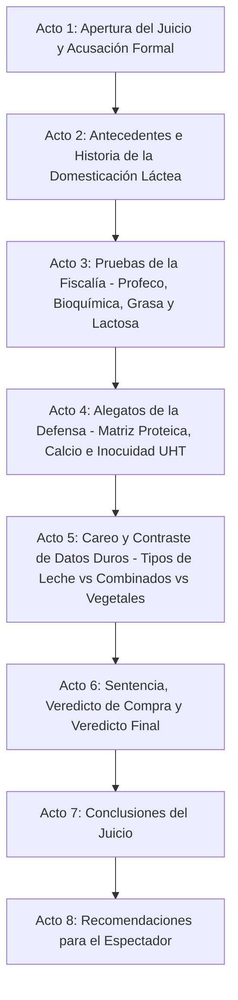

# Guion: "Leche: ¿Nutritiva o engorda tu cuerpo?"

**Canal de YouTube:** `@JuicioAlimentoApetecible`  
**Serie / Formato:** Juicio Alimento Apetecible  
**Género:** Drama judicial divulgativo / Ciencia de los alimentos / Debate nutricional  
**Duración estimada:** 19:00 – 23:00 minutos  

---

## 1. Resumen del Video

En este episodio de "Juicio Alimento Apetecible", Beto y Beti sientan en el banquillo de los acusados al líquido blanco más icónico, debatido y consumido de la historia de la humanidad: **La Leche de Vaca**.

Beto, en su papel de fiscal e ingeniero bioquímico, lidera una acusación técnica rigurosa basada en el marco normativo de la **NOM-155-SCFI-2012** (Denominaciones, especificaciones fisicoquímicas y métodos de prueba para leche) y en los **Estudios de Calidad del Laboratorio Nacional de Protección al Consumidor de la Profeco (Revista del Consumidor de Junio 2022 y Septiembre 2025)**. Beto desenmascara los engaños de la industria láctea: productos que se hacen pasar por leche pero en realidad son "productos lácteos combinados con grasa vegetal" (como el sonado caso de *Los 19 Hermanos* y *Lacti Lac*), el engaño del contenido neto (*Leche Querétaro* con hasta 75 ml menos), el impacto metabólico de la grasa saturada (grasa butírica que aporta 8 g de grasa y 150 kcal por vaso de 250 ml en leche entera), la carga de azúcares simples intrínsecos (12 g de lactosa por vaso) que eleva la glucosa posprandial, la epidemia silenciosa de hipolactasia o intolerancia a la lactosa que afecta a más del 60-70% de la población adulta en México e Hispanoamérica, y las trampas de la leche ultrafiltrada que incumple parámetros de sólidos no grasos.

Por su parte, Beti encabeza una sólida, empática y realista defensa del consumidor: reivindica a la leche como la matriz biológica natural más completa y accesible del planeta. Defiende su matriz proteica de altísimo valor biológico (8 a 9 gramos de proteína completa por vaso, compuesta por 80% caseína micelar de digestión lenta y 20% proteínas de suero o *whey* ricas en aminoácidos de cadena ramificada / BCAA y leucina), su insustituible densidad mineral en calcio biodisponible (300 mg/vaso), fósforo, magnesio, y vitaminas A, D, B2 (riboflavina) y B12. Crucialmente, Beti defiende la **seguridad alimentaria e inocuidad industrial**: la pasteurización y ultrapasteurización (UHT a 135-140 °C por 2-4 segundos) como uno de los más grandes hitos de la salud pública mundial que erradicó enfermedades mortales transmitidas por la leche bronca o cruda (*Mycobacterium bovis* / tuberculosis bovina, *Brucella abortus* / fiebre de Malta, *Listeria monocytogenes* y *Salmonella*). Además, defiende su economía como pilar de saciedad y nutrición para familias trabajadoras frente al costo desorbitado y la pobreza proteica de las "bebidas vegetales" de almendra o coco.

El juicio culmina con un careo frontal mediante tablas comparativas (Leche Entera vs. Semidescremada vs. Descremada / Light vs. Deslactosada vs. Producto Lácteo Combinado vs. Bebidas Vegetales), el análisis de la verdad sobre las hormonas y antibióticos, un veredicto de compra oficial y una guía práctica con las 4 reglas de oro para elegir la mejor leche en el supermercado según la meta de salud, edad y tolerancia digestiva.

---

## 2. Mapa Visual del Resumen Estructurado en Actos



* **Acto 1: Apertura del Juicio y Acusación Formal (00:00 – 02:20)**  
  Planteamiento del caso judicial. Beto presenta los cargos: alimento sobrevalorado, promotor de ganancia de grasa corporal por exceso de grasa saturada y lactosa, inflamación gastrointestinal en adultos intolerantes y fraude comercial en marcas adulteradas con grasa vegetal. Beti asume la defensa de la nutrición esencial, la accesibilidad proteica y el disfrute cotidiano.
* **Acto 2: Antecedentes e Historia (02:20 – 05:15)**  
  Origen histórico: la mutación genética de la persistencia de la lactasa hace 10,000 años en el Creciente Fértil y Europa. La evolución del ordeño tradicional a la era industrial. La revolución higiénica de Louis Pasteur en el siglo XIX y la invención del envasado aséptico Tetra Pak en el siglo XX.
* **Acto 3: Pruebas de la Fiscalía (05:15 – 09:50)**  
  Radiografía del Estudio de Profeco (Junio 2022 y Septiembre 2025). Marcas reprobadas: *Los 19 Hermanos* (grasa vegetal vendida como leche), *Lacti Lac*, y *Leche Querétaro* (faltante de volumen). El análisis bioquímico: 150 kcal por vaso entero, 8 g de grasa (5 g saturada), 12 g de azúcar simple (lactosa), el mecanismo del déficit de enzima lactasa en microvellosidades intestinales y el mito de que "el ser humano es el único animal que toma leche de otra especie".
* **Acto 4: Alegatos de la Defensa (09:50 – 14:15)**  
  Defensa de la densidad nutricional: proteína de máximo valor biológico (PDCAAS = 1.0), cinética de absorción caseína/suero para preservación muscular y saciedad. Calcio iónico absorbible (matriz calcio-fósforo-vitamina D). El triunfo de la pasteurización y ultrapasteurización (UHT) frente a la letalidad microbiológica de la leche cruda/bronca (*Brucella*, *Listeria*, *Tuberculosis*). Testimonio del Vaso de Leche en el estrado.
* **Acto 5: Careo y Contraste de Datos Duros (14:15 – 17:55)**  
  Tablas comparativas científicas: Leche Entera vs. Parcialmente Descremada vs. Descremada (Light) vs. Deslactosada vs. Producto Lácteo Combinado (*Nutri*) vs. Bebida de Almendra. Desmitificación de hormonas (BST/rBGH) y antibióticos. Explicación química de la leche deslactosada (ruptura enzimática lactosa = glucosa + galactosa = sabor más dulce sin azúcar añadido).
* **Acto 6: Sentencia, Veredicto de Compra y Veredicto Final (17:55 – 20:10)**  
  Veredicto judicial: Absuelta de ser un "veneno engordador", pero sentenciada por densidad calórica si se abusa y por venta engañosa de imitaciones con grasa vegetal. Dictamen de compra oficial: marcas con 100% leche y alto contenido proteico aprobadas por Profeco vs. marcas reprobadas.
* **Acto 7: Conclusiones del Juicio (20:10 – 21:25)**  
  Resumen ejecutivo de los hechos probados. Infografía de balance de macronutrientes y gráfico de sentencia.
* **Acto 8: Recomendaciones para el Espectador (21:25 – 22:45)**  
  Las 4 reglas de oro del consumidor inteligente: cómo elegir el tipo de leche según tu objetivo calórico, digestivo y económico, sin caer en fraudes mercadológicos.

---

## 3. Escaleta, Mediante una Tabla Estructurada en Actos / Escenas

| Acto | Escena | Nombre / Descripción | Duración Estimada |
| :--- | :--- | :--- | :--- |
| **Acto 1** | Escena 1 | Gancho Visual e Introducción: El torrente blanco, el vaso desbordado y el mazo judicial | 00:00 – 00:45 |
| | Escena 2 | Declaración inicial y lectura de cargos de la Fiscalía (Beto) | 00:45 – 01:35 |
| | Escena 3 | Intervención inicial de la Defensa (Beti) y entrada del Vaso de Leche al estrado | 01:35 – 02:20 |
| **Acto 2** | Escena 4 | Origen histórico: De la mutación de lactasa neolítica a la pasteurización de Louis Pasteur | 02:20 – 03:45 |
| | Escena 5 | La ciencia de la matriz láctea: Emulsión de grasa, suspensión micelar de caseína y solución acuosa | 03:45 – 05:15 |
| **Acto 3** | Escena 6 | Radiografía del Estudio Profeco: Leche verdadera vs. Fraude de grasa vegetal (*Los 19 Hermanos*, *Lacti Lac*) | 05:15 – 06:50 |
| | Escena 7 | Lectura forense de etiquetas: Grasa butírica (NOM-155-SCFI-2012) vs. Productos combinados | 06:50 – 08:20 |
| | Escena 8 | La carga metabólica: 150 kcal por vaso, grasa saturada, 12 g de lactosa e intolerancia gastrointestinal | 08:20 – 09:50 |
| **Acto 4** | Escena 9 | Valor biológico superior: Matriz proteica (Caseína + Whey), saciedad y biodisponibilidad de calcio | 09:50 – 11:35 |
| | Escena 10 | Seguridad alimentaria e inocuidad: Pasteurización / UHT vs. El peligro mortal de la leche bronca cruda | 11:35 – 12:55 |
| | Escena 11 | Testimonio del alimento acusado (El Vaso de Leche en el banquillo) | 12:55 – 14:15 |
| **Acto 5** | Escena 12 | Tabla comparativa frontal: Entera vs. Descremada vs. Deslactosada vs. Producto Combinado vs. Almendra | 14:15 – 16:05 |
| | Escena 13 | Desmitificación científica: ¿Hormonas y antibióticos? ¿Por qué la deslactosada sabe más dulce? | 16:05 – 17:55 |
| **Acto 6** | Escena 14 | Sentencia judicial y veredicto de compra (Marcas aprobadas por Profeco vs. reprobadas) | 17:55 – 20:10 |
| **Acto 7** | Escena 15 | Resumen de los hechos probados y gráficos de la sentencia | 20:10 – 21:25 |
| **Acto 8** | Escena 16 | Alertas de salud, beneficios y las 4 reglas de oro para comprar y consumir leche de forma inteligente | 21:25 – 22:45 |

---

## 4. Ficha Técnica de Producción

* **Acusador (Fiscalía):**  
  **BETO** (Ingeniero bioquímico, especialista en nutrición y tecnología de alimentos. Tono científico, didáctico, objetivo, elocuente y respetuoso. Viste traje formal azul marino con corbata sobria, bata de laboratorio accesible en el respaldo y maneja probetas graduadas, tablas analíticas y densímetros lácteos).
* **Defensora (Bancada de la Defensa):**  
  **BETI** (Joven profesionista trabajadora, experta en compras del hogar y gastronomía cotidiana. Tono empático, vivaz, risueño, pragmático y agudo. Viste atuendo sastre casual moderno en tonos beige claro y blanco marfil, con una carpeta de presupuesto familiar y un vaso de leche espumosa).
* **El Acusado en el Estrado:**  
  **EL VASO DE LECHE / CARTÓN DE LECHE** (Personificado / Vaso de vidrio con leche fresca y un envase de cartón UHT clásico con corbata diminuta y cartel de "Inocente", ubicado sobre el banquillo de los testigos bajo foco cenital).
* **Ambientación:**  
  Sala de juzgado judicial moderna y elegante con paneles de madera de nogal, pantallas táctiles holográficas para visualización molecular (micelas de caseína, moléculas de lactosa y glóbulos grasos), estrado de testigos y una mesa forense de alimentos con probetas de grasa butírica, placas de Petri con cultivos bacterianos de control y jarras de leche entera, descremada y bebidas vegetales.
* **Estilo Audiovisual:**  
  Híbrido entre drama judicial procesal (*Law & Order* / *The Good Wife*) y divulgación científica hiperestilizada (*Explained* / *Kurzgesagt*), con tomas macro gastronómicas a 60 fps en cámara lenta del vertido de leche, cinemáticas con slider, animaciones 3D de digestión enzimática y gráficos limpios de datos de Profeco.
* **Banda Sonora y Efectos:**  
  Golpes secos de mazo judicial con reverberación profunda (*¡CLACK-BOOM!*), notas pulsantes de bajo acústico y sintetizador tenso para las intervenciones forenses de Beto, arreglos de piano rítmico y cuerdas amables para las intervenciones de Beti, y efectos de sonido foley realistas (líquido espumoso cayendo en vaso de cristal, chasquido de tapón de rosca abriéndose, sonido de centrifugadora de laboratorio).
* **Indicaciones de Edición:**  
  Ritmo dinámico sin tiempos muertos. Transiciones tipo "whip-pan" o cortes al golpe de mazo. Inserción de rótulos inferiores (*lower-thirds*) para citar normas oficiales (NOM-155-SCFI-2012, NOM-243-SSA1-2010) y sellos de advertencia cuando se señale el exceso calórico o las grasas saturadas.

---

## 5. Convención del Guion Técnico

* **[PLANO / VISUAL]:**  
  * `PG`: Plano General (vista panorámica de la sala judicial, fiscalía, estrado y defensa).
  * `PM`: Plano Medio (personaje de cintura hacia arriba).
  * `PP`: Primer Plano (rostro del personaje, capturando gestos de convicción, duda o sorpresa).
  * `PD`: Primer Detalle (macro sobre el torrente de leche, gota salpicando en corona, lectura de sellos y tabla nutrimental, golpe de mazo).
* **[CÁMARA / MOVIMIENTO DE CÁMARA]:** Slider lateral, Dolly frontal (travelling in/out), Paneo (pan horizontal), Tilt up/down vertical, Grúa cenital.
* **[ILUMINACIÓN / FILTROS]:** Luz fría judicial (5600K) en momentos de acusación técnica e inspección de etiquetas, Luz cálida acogedora (3200K) en planos de desayuno y nutrición, Foco cenital directo sobre el acusado.
* **[AUDIO / SFX / MÚSICA]:** Sonido foley, música procesal dramática, golpes de mazo (*BOOM*), timbre judicial, suspenso con cuerdas graves y percusiones de reloj.
* **[TEXTO EN PANTALLA / GRÁFICOS / ANIMACIONES]:** Infografías 2D/3D con estructura molecular (micela de caseína, lactosa dividida en glucosa y galactosa), tablas comparativas de Profeco, citas de la NOM-155-SCFI-2012 y comparativas de costo por gramo de proteína.

---

## 6. Guion Técnico Profesional Muy Detallado

### ACTO 1: APERTURA DEL JUICIO Y ACUSACIÓN FORMAL (00:00 – 02:20)

#### Escena 1 (00:00 – 00:45) — Gancho Visual e Introducción
* **Plano / Visual:** [PD] a 60 fps: Una jarra de cristal inclina un chorro denso, blanco y sedoso de leche entera sobre un vaso alto; el líquido impacta el fondo generando una corona perfecta y una capa espumosa en la superficie. Corte rápido a un plato de cereal de chocolate inundado en leche. Corte abrupto a una báscula médica digital donde una persona sube y los dígitos parpadean en rojo. Corte a un estómago humano en animación 3D hinchándose con gas brillante y espasmos.
* **Cámara / Movimiento de cámara:** Dolly in rápido sobre el vaso salpicando, transición en látigo (whip-pan) hacia el mazo judicial de madera sobre el estrado del juez.
* **Iluminación / Filtros:** Luz cálida matutina (3200K) que vira instantáneamente a luz fría de tribunal forense (5600K).
* **Audio / SFX / Música:** Sonido foley líquido y cremoso (*glug-glug-splash*). De pronto, golpe seco de mazo de roble con eco cavernoso (*¡CLACK-BOOM!*). Entra tema musical de tensión judicial con bajo pulsante y cellos oscuros.
* **Texto en Pantalla / Gráficos / Animaciones:** Rótulo animado en tipografía blanca y azul metálico: *"CASO Nº 59: LECHE DE VACA: ¿NUTRITIVA O ENGORDA TU CUERPO?"*.

#### Escena 2 (00:45 – 01:35) — Declaración Inicial y Lectura de Cargos (Fiscalía)
* **Plano / Visual:** [PM] Beto de pie en la mesa de la Fiscalía. Viste traje azul marino impecable. Abre un expediente sellado con el logotipo de la NOM-155-SCFI-2012 y coloca una probeta con grasa amarilla espesa sobre la mesa.
* **Cámara / Movimiento de cámara:** Slider lateral lento de izquierda a derecha, terminando en [PP] de Beto mirando fijamente al lente con expresión rigurosa y pedagógica.
* **Iluminación / Filtros:** Luz fría judicial directa (5600K) con contraluz azul tenue de fondo.
* **Audio / SFX / Música:** Pulso continuo de sintetizador tipo reloj (*tic-toc-tic-toc*) con notas graves de bajo. Voz de Beto clara, autoritaria pero caballerosa.
* **Texto en Pantalla / Gráficos / Animaciones:** Lista animada de cargos:  
  * 1. Densidad calórica encubierta (150 kcal por vaso).  
  * 2. Grasa saturada aterogénica (5 g/vaso).  
  * 3. Azúcar simple natural (12 g de lactosa).  
  * 4. Intolerancia digestiva en más del 65% de adultos.  
  * 5. Venta de imitaciones con grasa vegetal.

#### Escena 3 (01:35 – 02:20) — Intervención Inicial de la Defensa (Beti)
* **Plano / Visual:** [PM] Beti en la mesa de la Defensa. Sonríe con confianza, sostiene un vaso de leche fresca con una galleta integral al lado y abre su carpeta de consumo familiar. [PG] de la sala mostrando al Vaso de Leche en el banquillo de los acusados.
* **Cámara / Movimiento de cámara:** Travelling lateral suave hacia Beti; corte a [PP] del Vaso de Leche con un cartel de "Alimento Básico".
* **Iluminación / Filtros:** Luz neutra luminosa y cálida sobre la bancada de Beti.
* **Audio / SFX / Música:** Acorde de piano esperanzador y dinámico, bajando el volumen para dar paso a la voz enérgica, cálida y convincente de Beti.
* **Texto en Pantalla / Gráficos / Animaciones:** Rótulo flotante: *"DEFENSA: 8 g de Proteína Completa (PDCAAS 1.0) + 300 mg Calcio Biodisponible + Inocuidad UHT"*.

---

### ACTO 2: ANTECEDENTES E HISTORIA (02:20 – 05:15)

#### Escena 4 (02:20 – 03:45) — Origen Histórico: La Mutación Neolítica y Louis Pasteur
* **Plano / Visual:** [PG] Gráfica animada tipo mapa histórico: Europa y Medio Oriente hace 10,000 años. Agricultores neolíticos domesticando vacas (*Bos taurus*). Ilustración de la mutación genética en el gen MCM6 que mantuvo encendido el gen de la lactasa (*LCT*). Corte a grabado histórico del siglo XIX: niños enfermos por leche contaminada en ciudades victorianas, seguido del retrato de Louis Pasteur en su laboratorio de 1864 aplicando calor controlado.
* **Cámara / Movimiento de cámara:** Panorámica digital sobre el mapa histórico con zoom suave hacia el tubo de ensayo de pasteurización.
* **Iluminación / Filtros:** Tonalidad sepia histórica que transiciona a iluminación nítida de laboratorio moderno.
* **Audio / SFX / Música:** Cuerdas barrocas acústicas que evolucionan a sintetizadores modernos de ciencia. SFX de viento antiguo y murmullo de vacas, seguido del silbido de vapor industrial.
* **Texto en Pantalla / Gráficos / Animaciones:** Línea de tiempo interactiva:  
  * *8,000 a.C.*: Domesticación y mutación de persistencia de lactasa.  
  * *1864*: Louis Pasteur patenta la pasteurización térmica.  
  * *1961*: Nace el envase aséptico Tetra Pak multicapa (UHT).

#### Escena 5 (03:45 – 05:15) — La Ciencia de la Matriz Láctea
* **Plano / Visual:** [PD] Animación 3D fotorrealista sumergiéndose dentro de una gota de leche. Se visualiza la triple naturaleza física: 1) Emulsión coloidal de glóbulos de grasa suspendidos; 2) Suspensión coloidal de micelas de caseína unidas por fosfato de calcio coloidal; 3) Solución acuosa verdadera de lactosa, proteínas de suero (*whey*), minerales y vitaminas hidrosolubles.
* **Cámara / Movimiento de cámara:** Vuelo de cámara 3D inmersivo atravesando una micela de caseína y rodeando un glóbulo graso con su membrana fosfolipídica.
* **Iluminación / Filtros:** Fondo azul marino oscuro con partículas moleculares fluorescentes y brillantes (blanco, dorado y azul cian).
* **Audio / SFX / Música:** Música ambiental electrónica sofisticada (estilo documental de física cuántica). SFX de zumbido molecular y burbujas microscópicas.
* **Texto en Pantalla / Gráficos / Animaciones:** Desglose químico porcentual de la leche entera cruda:  
  * Agua: 87.5%  
  * Grasa butírica: 3.5% – 4.0%  
  * Proteína: 3.2% (80% Caseína / 20% Suero)  
  * Lactosa: 4.8%  
  * Minerales y Vitaminas: 0.8%

---

### ACTO 3: PRUEBAS DE LA FISCALÍA (05:15 – 09:50)

#### Escena 6 (05:15 – 06:50) — Radiografía del Estudio Profeco: El Fraude de la Grasa Vegetal
* **Plano / Visual:** [PM] Beto frente a una pantalla interactiva gigante proyectando portadas de la *Revista del Consumidor* (Junio 2022 y Septiembre 2025). Coloca dos envases comerciales reales sobre la mesa: un cartón de leche auténtica y una bolsa de *Los 19 Hermanos* y *Lacti Lac*.
* **Cámara / Movimiento de cámara:** Dolly in hacia la pantalla interactiva; corte rápido a [PD] de las letras minúsculas en el empaque que dicen "Producto lácteo combinado con grasa vegetal".
* **Iluminación / Filtros:** Luz blanca quirúrgica (6000K). Las marcas fraudulentas reciben un foco rojo parpadeante de alerta.
* **Audio / SFX / Música:** Sonido de escáner digital (*bip-bip-bip*) y acorde disonante de advertencia.
* **Texto en Pantalla / Gráficos / Animaciones:** Tabla forense de infracciones Profeco:  
  * *Los 19 Hermanos*: Se vendía como leche pero contenía grasa vegetal + 36 ml menos de contenido neto.  
  * *Lacti Lac*: Denominación engañosa, imitación no advertida.  
  * *Leche Querétaro*: Hasta 75 ml menos del contenido neto declarado.

#### Escena 7 (06:50 – 08:20) — Lectura Forense de Etiquetas: NOM-155-SCFI-2012
* **Plano / Visual:** [PP] Beto sosteniendo la norma oficial mexicana. [PD] de un matraz donde se separa la grasa butírica (amarilla pura) frente al aceite de palma/soya hidrogenado utilizado en productos combinados baratos.
* **Cámara / Movimiento de cámara:** Slider horizontal lento comparando dos probetas con diferente densidad y color de grasa.
* **Iluminación / Filtros:** Luz fría analítica sobre las probetas.
* **Audio / SFX / Música:** Ritmo constante de suspenso procesal. SFX de líquido vertiéndose y choque de cristal de laboratorio.
* **Texto en Pantalla / Gráficos / Animaciones:** Parámetros obligatorios de la NOM-155-SCFI-2012:  
  * Proteína láctea mínima: 30 g por litro (70% caseína).  
  * Grasa butírica exclusiva (Cero grasa vegetal).  
  * Densidad a 15 °C: 1.029 – 1.034 g/ml.

#### Escena 8 (08:20 – 09:50) — La Bomba Metabólica: Grasa Saturada, Lactosa e Inflamación
* **Plano / Visual:** [PM] Beto toma un vaso de leche entera de 250 ml. Al lado coloca 3 terrones de azúcar (12 g) y una cucharada de manteca sólida (5 g de grasa saturada). Animación 3D del colon humano mostrando la fermentación bacteriana de la lactosa no digerida, produciendo gas metano, hidrógeno y diarrea osmótica.
* **Cámara / Movimiento de cámara:** Travelling frontal hacia los terrones de azúcar y la manteca; paneo hacia el gráfico de porcentaje de intolerantes en la población.
* **Iluminación / Filtros:** Luz dramática lateral con sombras marcadas.
* **Audio / SFX / Música:** Sonido de gorgoteo gástrico y golpe de chelo grave (*thud*).
* **Texto en Pantalla / Gráficos / Animaciones:** Radiografía metabólica por vaso (250 ml Leche Entera):  
  * Calorías: 150 kcal.  
  * Grasa total: 8 g (5 g grasa saturada = ácido mirístico, palmítico, láurico).  
  * Lactosa: 12 g de azúcar simple.  
  * Colesterol: 25 mg.  
  * Prevalencia de hipolactasia en adultos: 65% – 75%.

---

### ACTO 4: ALEGATOS DE LA DEFENSA (09:50 – 14:15)

#### Escena 9 (09:50 – 11:35) — Valor Biológico y Densidad Mineral Insustituible
* **Plano / Visual:** [PM] Beti se levanta con energía. Muestra una infografía comparativa de biodisponibilidad proteica y mineral. Coloca en la mesa un plato gigante con 500 gramos de espinacas cocidas frente a un solo vaso de leche para ilustrar la absorción real de calcio.
* **Cámara / Movimiento de cámara:** Slider dinámico siguiendo el paso seguro de Beti por el estrado.
* **Iluminación / Filtros:** Luz cálida, brillante y luminosa (4000K).
* **Audio / SFX / Música:** Música rítmica optimista con marimba, piano y percusión ligera. Voz empática y elocuente de Beti.
* **Texto en Pantalla / Gráficos / Animaciones:** Tabla de biodisponibilidad y calidad proteica:  
  * Puntuación PDCAAS: Leche = 1.0 (Máxima calidad biológica).  
  * 8 g Proteína = 6.4 g Caseína (digestión lenta y saciedad sostenida) + 1.6 g Suero (rica en Leucina para síntesis muscular).  
  * Calcio biodisponible: 300 mg/vaso (absorción del 32% facilitada por lactosa y fosfopéptidos de caseína vs 5% en espinacas por oxalatos).

#### Escena 10 (11:35 – 12:55) — Seguridad Alimentaria: Pasteurización y UHT vs. Leche Bronca
* **Plano / Visual:** [PG] Pantalla de tribunal mostrando fotografías históricas y placas bacterianas de *Mycobacterium bovis*, *Brucella abortus* y *Listeria monocytogenes*. Beti señala el proceso de ultrapasteurización UHT (138 °C por 2 segundos en flujo continuo) que garantiza esterilidad comercial sin conservadores químicos.
* **Cámara / Movimiento de cámara:** Dolly in hacia el rostro decidido de Beti; corte a [PD] del envase Tetra Pak multicapa (cartón, polietileno, aluminio).
* **Iluminación / Filtros:** Luz brillante de alta definición.
* **Audio / SFX / Música:** Golpes de cuerdas agudas que generan alivio. Sonido foley de sellado aséptico al vacío.
* **Texto en Pantalla / Gráficos / Animaciones:** Comparativa de seguridad microbiológica:  
  * Leche Bronca (Cruda): Alto riesgo de Brucelosis, Tuberculosis bovina, Fiebre Q y Salmonelosis.  
  * Leche Pasteurizada: Tratamiento a 72 °C por 15 s (requiere refrigeración obligatoria, vida de 10-15 días).  
  * Leche Ultrapasteurizada (UHT): Tratamiento a 135-140 °C por 2-4 s (vida de anaquel de 6 meses a temperatura ambiente sin conservadores).

#### Escena 11 (12:55 – 14:15) — Testimonio del Alimento Acusado en el Banquillo
* **Plano / Visual:** [PP] El Vaso de Leche fresca en el estrado de testigos. Foco cenital blanco. Beti se acerca respetuosamente para interrogarlo.
* **Cámara / Movimiento de cámara:** Giro orbital de 180 grados alrededor del estrado del testigo.
* **Iluminación / Filtros:** Foco cenital directo (spotlight) sobre el vaso de leche brillante con burbujas microscópicas.
* **Audio / SFX / Música:** Voz en off distorsionada, suave, profunda y melodiosa representando a la Leche. Fondo de violonchelo melancólico.
* **Texto en Pantalla / Gráficos / Animaciones:** Testimonio en subtítulos dorados: *"Fui el primer alimento que sostuvo tu vida. No inventé la grasa vegetal ni las trampas de anaquel. Solo soy la fórmula más perfecta de la naturaleza"*.

---

### ACTO 5: CAREO Y CONTRASTE DE DATOS DUROS (14:15 – 17:55)

#### Escena 12 (14:15 – 16:05) — Tabla Comparativa Frontal: Tipos de Leche, Combinados y Bebidas Vegetales
* **Plano / Visual:** [PG] Beto y Beti en el centro del juzgado frente a una mesa forense interactiva donde se despliega una mega tabla digital con 6 vasos de muestra.
* **Cámara / Movimiento de cámara:** Paneo continuo de izquierda a derecha deteniéndose en cada muestra.
* **Iluminación / Filtros:** Iluminación neutral de laboratorio de análisis sensorial.
* **Audio / SFX / Música:** Duelo musical: bajo pulsante vs. piano rítmico.
* **Texto en Pantalla / Gráficos / Animaciones:** Tabla comparativa por vaso de 250 ml:  
  1. *Entera*: 150 kcal | 8 g Prot | 8 g Grasa (5 g Sat) | 12 g Carb | $26 MXN/L  
  2. *Descremada (Light)*: 85 kcal | 8.5 g Prot | 0.5 g Grasa | 12 g Carb | $27 MXN/L  
  3. *Deslactosada Entera*: 150 kcal | 8 g Prot | 8 g Grasa | 12 g Glucosa/Galactosa | $28 MXN/L  
  4. *Deslactosada Light*: 85 kcal | 8.5 g Prot | 0.5 g Grasa | 12 g Glucosa/Galactosa | $29 MXN/L  
  5. *Lácteo Combinado (Grasa Veg.)*: 135 kcal | 4.5 g Prot | 6 g Grasa Veg. | 15 g Carb | $16 MXN/L  
  6. *Bebida de Almendra Comercial*: 40 kcal | 1 g Prot | 2.5 g Grasa Veg. | 1-5 g Carb | $48 MXN/L

#### Escena 13 (16:05 – 17:55) — Desmitificación: Hormonas, Antibióticos y la Ciencia de la Deslactosada
* **Plano / Visual:** [PM] Beto y Beti intercambian argumentos científicos. Beto explica la enzima lactasa recombinante y Beti aborda los controles de calidad veterinaria de la NOM-243-SSA1-2010. Animación de la molécula de lactosa partiéndose en glucosa y galactosa.
* **Cámara / Movimiento de cámara:** Plano y contraplano rápido entre Beto y Beti con miradas de complicidad y respeto profesional.
* **Iluminación / Filtros:** Luz dinámica de debate judicial.
* **Audio / SFX / Música:** Sonido de campana de tribunal y acordes de clarificación científica.
* **Texto en Pantalla / Gráficos / Animaciones:** Desmitificación científica:  
  * *¿Por qué la leche deslactosada sabe más dulce?*: Porque la lactasa rompe el disacárido en glucosa (dulzor 74) y galactosa (dulzor 32), que estimulan más las papilas gustativas que la lactosa entera (dulzor 16), ¡sin añadir un solo gramo de azúcar extra!  
  * *¿Tiene antibióticos u hormonas?*: La leche que ingresa a pasteurizadoras industriales pasa por pruebas rápidas de inhibidores microbianos (Beta-lactámicos/Tetraciclinas); pipas contaminadas se rechazan y destruyen por ley.

---

### ACTO 6: SENTENCIA, VEREDICTO DE COMPRA Y VEREDICTO FINAL (17:55 – 20:10)

#### Escena 14 (17:55 – 20:10) — Sentencia Judicial y Guía de Marcas Aprobadas por Profeco
* **Plano / Visual:** [PG] Sala en silencio solemne. Beto y Beti de pie frente al estrado del tribunal. El mazo judicial descansa sobre la madera. En la pantalla gigante se proyecta el sello de "SENTENCIA DEFINITIVA".
* **Cámara / Movimiento de cámara:** Dolly out solemne desde el mazo hacia el plano general de la sala, con cortes rápidos a [PP] de las marcas evaluadas.
* **Iluminación / Filtros:** Luz cenital solemne con contraste cinematográfico.
* **Audio / SFX / Música:** Redoble suave de tambores orquestales y golpe final de mazo (*¡CLACK-BOOM!*).
* **Texto en Pantalla / Gráficos / Animaciones:** Veredicto de Compra Profeco:  
  * **MARCAS RECOMENDADAS (100% Leche, excelente proteína y grasa butírica):**  
    *Alpura Clásica / Selecta*, *Lala Entera / 100*, *Santa Clara*, *Bové*, *Liconsa*, *Great Value*, *Sello Rojo*, *Los Volcanes*.  
  * **MARCAS SANCIONADAS O CON ADVERTENCIA:**  
    *Los 19 Hermanos* (adulteración con grasa vegetal), *Lacti Lac* (denominación engañosa), *Leche Querétaro* (faltante de volumen en 2022).  
  * **ALERTA AL BOLSILLO:** *Nutri* y similares son "productos lácteos combinados", NO leche; contienen la mitad de proteína y grasa vegetal de palma.

---

### ACTO 7: CONCLUSIONES DEL JUICIO (20:10 – 21:25)

#### Escena 15 (20:10 – 21:25) — Resumen Ejecutivo y Gráficos de Sentencia
* **Plano / Visual:** [PM] Beto y Beti juntos en el centro de la sala, alternándose la palabra con fluidez y dinamismo didáctico.
* **Cámara / Movimiento de cámara:** Slider frontal suave con encuadre compartido.
* **Iluminación / Filtros:** Luz suave envolvente de estudio profesional.
* **Audio / SFX / Música:** Tema de cierre enérgico y concluyente.
* **Texto en Pantalla / Gráficos / Animaciones:** Infografía resumen:  
  * *¿Engorda?*: Solo si genera superávit calórico por su grasa (150 kcal/vaso); la versión descremada aporta 85 kcal con toda la proteína.  
  * *¿Nutre?*: Sí, es el alimento proteico y mineral más eficiente y económico.  
  * *¿Inflama?*: Solo a personas con intolerancia a la lactosa o alergia a la proteína de leche de vaca (APLV).

---

### ACTO 8: RECOMENDACIONES PARA EL ESPECTADOR (21:25 – 22:45)

#### Escena 16 (21:25 – 22:45) — Las 4 Reglas de Oro del Consumidor Inteligente
* **Plano / Visual:** [PM] Beto y Beti con tarjetas informativas en mano, señalando los puntos clave para comprar en el supermercado. Cierre con llamada a la acción para suscribirse al canal.
* **Cámara / Movimiento de cámara:** Travelling lento in hacia los presentadores y zoom out final hacia el logotipo del canal `@JuicioAlimentoApetecible`.
* **Iluminación / Filtros:** Iluminación nítida y moderna.
* **Audio / SFX / Música:** Música alegre, rítmica y resolutiva de salida de video de YouTube.
* **Texto en Pantalla / Gráficos / Animaciones:** Tarjetas desplegables con las 4 Reglas de Oro:  
  1. *Regla 1: Verifica la palabra "LECHE"* (evita "producto lácteo", "fórmula láctea" o "alimento líquido").  
  2. *Regla 2: Selecciona según tu gasto calórico* (Descremada para déficit calórico, Entera para saciedad infantil/deportistas).  
  3. *Regla 3: Si tienes gases o distensión, elige Deslactosada* (misma nutrición, digestión perfecta).  
  4. *Regla 4: No pagues agua cara* (las bebidas vegetales de almendra tienen 1 g de proteína vs 8 g de la leche de vaca).  
  Botón animado de "Suscríbete y activa la campana".

---

## 7. Guion Literario Profesional Muy Detallado

### ACTO 1: APERTURA DEL JUICIO Y ACUSACIÓN FORMAL (00:00 – 02:20)

#### Escena 1: Gancho Visual y Apertura del Caso (00:00 – 00:45)
**Acción:**  
La cámara abre con un plano macro hipnótico: un chorro de leche blanca y densa golpea el fondo de un vaso de cristal, formando una corona perfecta y una nube de microespuma. Al lado, una persona devora un tazón de cereal rebosante de leche entera. De inmediato, corte a una báscula digital que marca aumento de peso y a un gráfico 3D de un colon hinchado de gas. De pronto, un mazo de madera golpea con fuerza el estrado judicial.

**(BETO, tono firme, solemne y directo a cámara)**  
Es el primer líquido que probaste al nacer. Durante décadas nos dijeron que era el secreto indispensable para tener huesos de acero, crecer fuertes y vivir sanos. Pero hoy... millones de personas la acusan de inflamar el vientre, llenar el cuerpo de grasa saturada, elevar el colesterol y provocar digestiones infernales.

**(BETI, tono curioso, cercano y con una sonrisa)**  
Beto, por favor... ¿ahora también vamos a criminalizar al clásico vaso de leche con galletas? ¡Es el desayuno de millones de familias trabajadoras, la proteína más barata y el ingrediente del licuado mañanero!

**(BETO, tono riguroso, levantando una carpeta judicial)**  
Hoy sentamos en el banquillo de los acusados al alimento más venerado y a la vez más adulterado de la historia moderna: la Leche de Vaca. ¿Es un superalimento insustituible o una trampa líquida cargada de azúcar y grasa que te está engordando sin que te des cuenta? Que comience el juicio.

#### Escena 2: Declaración Inicial de la Fiscalía (00:45 – 01:35)
**Acción:**  
Beto camina frente al estrado con paso medido. Coloca sobre la mesa del juez un expediente oficial de Profeco y dos probetas con líquido lechoso y grasa condensada.

**(BETO, tono didáctico, respetuoso pero acusatorio)**  
Honorables miembros del jurado y queridos consumidores: la fiscalía no viene a negar el valor histórico de este líquido blanco. Venimos a acusarla formalmente de tres cargos graves. Primero: **densidad energética oculta**. Un solo vaso de leche entera contiene 150 kilocalorías y hasta 8 gramos de grasa, de los cuales 5 gramos son pura grasa saturada aterogénica. Segundo: **carga de azúcares simples**. Cada vaso contiene 12 gramos de lactosa, un azúcar que el 70% de los adultos en nuestra región ya no puede digerir debido a la pérdida evolutiva de la enzima lactasa. Y tercero: **fraude al consumidor en los anaqueles**, donde corporaciones inescrupulosas venden mezclas de grasa vegetal barata bajo el disfraz de leche legítima.

#### Escena 3: Entrada del Acusado e Intervención de la Defensa (01:35 – 02:20)
**Acción:**  
Beti se pone de pie con elegancia, sirviendo un vaso de leche fresca con una espuma densa y colocándolo al lado del cartón de leche personificado en el banquillo de los testigos.

**(BETI, tono empático, vibrante y pragmático)**  
¡Objeción, señor fiscal! No confunda los abusos comerciales de ciertas marcas tramposas con la nobleza biológica del alimento. La leche auténtica no es un ultraprocesado inventado en un laboratorio químico; es la matriz biológica natural más completa del planeta. Hablamos de 8 gramos de proteína de máximo valor biológico por vaso, 300 miligramos de calcio altamente absorbible que ninguna bebida vegetal de moda puede igualar, y una tecnología de inocuidad como la pasteurización y el envasado UHT que salvó a la humanidad de epidemias mortales. ¡La defensa demostrará que la leche no es culpable de tus malos hábitos, sino una aliada indispensable de la nutrición popular!

---

### ACTO 2: ANTECEDENTES E HISTORIA (02:20 – 05:15)

#### Escena 4: Origen Histórico y la Revolución Higiénica de Pasteur (02:20 – 03:45)
**Acción:**  
En la pantalla interactiva se proyectan mapas de Europa y el Medio Oriente en el año 8000 a.C., mostrando la transición agrícola y la mutación de persistencia de lactasa, seguida de grabados de la Europa del siglo XIX.

**(BETO, tono explicativo y pedagógico)**  
Para entender a la acusada, debemos viajar 10,000 años atrás al Creciente Fértil. Originalmente, los seres humanos —como todos los mamíferos del planeta— dejábamos de producir la enzima lactasa al destetarnos en la infancia. Tomar leche de adultos era una garantía de dolor cólico y diarrea severa. Sin embargo, ocurrió una mutación genética aleatoria en el cromosoma 2: la persistencia de la lactasa. Quienes portaban este gen pudieron aprovechar las calorías, el agua y las proteínas del ganado en inviernos implacables, otorgándoles una ventaja evolutiva colosal.

**(BETI, tono fascinado y risueño)**  
O sea que poder disfrutar de un café con leche calientito de adultos es literalmente un superpoder mutante evolutivo.

**(BETO, asintiendo con una ligera sonrisa)**  
Así es, Beti. Pero el idilio tuvo un lado muy oscuro. En el siglo XIX, durante la Revolución Industrial, las vacas se hacinaban en establos urbanos insalubres junto a destilerías. La leche cruda o "leche bronca" transmitía tuberculosis bovina, fiebre tifoidea, brucelosis y escarlatina, cobrando la vida de miles de niños. Fue hasta 1864 cuando el químico francés Louis Pasteur descubrió que aplicando un choque térmico controlado se eliminaban los patógenos sin hervir el líquido. Nació la pasteurización, transformando a la leche de un vector mortal de contagio en el alimento seguro que hoy conocemos.

#### Escena 5: La Ciencia Detrás de la Matriz Láctea (03:45 – 05:15)
**Acción:**  
Una animación 3D de alta resolución sumerge al espectador dentro de una gota de leche. Se aprecian esferas de grasa flotando, racimos de proteínas micelares y moléculas de azúcar disueltas en agua.

**(BETO, tono científico, señalando las moléculas holográficas)**  
Miren la complejidad físico-química de la acusada. La leche no es simplemente "agua blanca". Es una obra maestra coloidal que coexiste en tres estados simultáneos: primero, una **emulsión de glóbulos grasos**, ricos en triglicéridos de cadena corta, media y larga; segundo, una **suspensión coloidal de micelas de caseína**, complejas estructuras proteicas unidas por puentes de fosfato de calcio que le otorgan su color blanco característico; y tercero, una **solución acuosa** donde flotan la lactosa, las proteínas solubles del suero, la riboflavina y los minerales.

**(BETI, tono entusiasta)**  
¡Es una estructura perfecta! La naturaleza diseñó este líquido precisamente para alimentar y hacer crecer a un ser vivo desde cero. ¿Cómo puede algo tan perfecto ser acusado de engordar y enfermar al cuerpo?

**(BETO, tono admonitorio)**  
Porque lo que fue diseñado para alimentar a un ternero lactante de 40 kilos no siempre encaja a la perfección en el metabolismo sedentario de un adulto moderno de oficina que se toma un litro diario sin moverse de su silla.

---

### ACTO 3: PRUEBAS DE LA FISCALÍA (05:15 – 09:50)

#### Escena 6: El Fraude de la Grasa Vegetal: Estudios Profeco (05:15 – 06:50)
**Acción:**  
Beto activa la pantalla táctil forense, mostrando las portadas oficiales de la *Revista del Consumidor* de la Profeco (Junio 2022 y Septiembre 2025). Coloca en el centro de la sala dos productos comerciales reales: un envase de leche pura y una bolsa de *Los 19 Hermanos*.

**(BETO, tono enérgico y acusador)**  
Entremos al terreno de las pruebas irrefutables. El Laboratorio Nacional de Protección al Consumidor de la Profeco ha realizado exhaustivos estudios a más de 85 marcas de leche y productos lácteos. ¿Y cuál fue uno de los hallazgos más alarmantes? ¡El engaño descarado al bolsillo del consumidor! Marcas como **Los 19 Hermanos** se comercializaban como leche entera, pero el laboratorio oficial comprobó que en realidad contenían **grasa vegetal añadida**, incumpliendo flagrantemente la NOM-155-SCFI-2012. Y por si fuera poco, ¡traían 36 mililitros menos de lo declarado!

**(BETI, tono de indignación genuina)**  
¡Eso es inaceptable, Beto! Sustituir la grasa de la leche por aceites vegetales baratos para inflar sus ganancias y engañar a quien compra de buena fe en la tiendita de la esquina merece todo el peso de la ley.

**(BETO, asintiendo con gravedad)**  
Exactamente. Y no fue el único caso: en el estudio de septiembre de 2025, la marca **Lacti Lac** fue inmovilizada con medidas precautorias por ostentar una denominación indebida que simulaba ser leche. Y en 2022, la tradicional **Leche Querétaro** entera pasteurizada fue exhibida por entregar hasta **75 mililitros menos** de producto en su presentación de un litro.

#### Escena 7: Lectura Forense de Etiquetas: NOM-155-SCFI-2012 (06:50 – 08:20)
**Acción:**  
Beto proyecta los requisitos legales obligatorios de la Norma Oficial Mexicana. Sobre la mesa coloca un matraz con grasa butírica pura y otro con aceite de palma vegetal refinado.

**(BETO, tono didáctico y técnico)**  
Pongan mucha atención, consumidores, porque la ley en México es muy clara. La **NOM-155-SCFI-2012** estipula que para llamarse legalmente **"LECHE"**, el producto debe provenir exclusivamente de la secreción mamaria de vacas sanas, aportar un mínimo de **30 gramos de proteína láctea por litro** —de la cual el 70% debe ser caseína— y su grasa debe ser 100% **grasa butírica propia de la leche**. Si a un producto le quitan la grasa butírica para venderla como crema o mantequilla y la rellenan con aceite de soya o de palma, ya NO es leche: es un **"producto lácteo combinado con grasa vegetal"**.

**(BETI, tono reflexivo y práctico)**  
Por eso en el supermercado vemos marcas baratísimas que dicen en letras gigantes un nombre llamativo, pero si miras abajo en letras chiquitas dice: "producto lácteo combinado". Pagas menos, pero estás comprando agua con aceite vegetal y la mitad de la proteína.

#### Escena 8: La Bomba Metabólica: Grasa Saturada y Lactosa (08:20 – 09:50)
**Acción:**  
Beto coloca frente a Beti un vaso de leche entera de 250 ml. Al lado pone tres cubos de azúcar blanca (12 g) y una porción sólida de grasa (8 g). En la pantalla se proyecta una animación de fermentación intestinal bacteriana.

**(BETO, tono contundente)**  
Hablemos de lo que pasa dentro de tu cuerpo. Un solo vaso de 250 mililitros de leche entera aporta: **150 kilocalorías**, **8 gramos de grasa** —de los cuales 5 gramos son ácidos grasos saturados como el mirístico y palmítico, vinculados al aumento del colesterol LDL si se consumen en exceso— y **12 gramos de lactosa pura**. Si te tomas dos vasos al día con el cereal y la cena, ¡estás metiendo 300 calorías líquidas y 24 gramos de azúcar simple a tu organismo!

**(BETI, tono defensivo)**  
¡Pero es el azúcar natural del alimento, Beto! No es jarabe de maíz de alta fructosa añadido en una fábrica.

**(BETO, tono implacable)**  
Para tu hígado y tu intestino delgado, la lactosa sigue siendo un disacárido de glucosa y galactosa. Y peor aún: en México, más del **65% de la población adulta padece hipolactasia**, es decir, sus microvellosidades intestinales dejaron de producir suficiente enzima lactasa. Al no poder desdoblarse, esa lactosa llega intacta al colon, donde las bacterias la fermentan vorazmente, produciendo gas metano, hidrógeno, distensión dolorosa, cólicos y diarrea osmótica. ¿Cómo llamas a un alimento que le inflama el estómago a dos de cada tres personas que lo beben?

---

### ACTO 4: ALEGATOS DE LA DEFENSA (09:50 – 14:15)

#### Escena 9: Matriz Proteica Superior y Calcio Biodisponible (09:50 – 11:35)
**Acción:**  
Beti da un paso al frente con energía. Coloca sobre la mesa una pirámide de aminoácidos esenciales y un plato con medio kilo de espinacas crudas frente al vaso de leche.

**(BETI, tono elocuente, firme y apasionado)**  
¡Señor fiscal, su análisis es reduccionista! Usted está juzgando a la leche como si fuera un puñado de nutrientes aislados en un tubo de ensayo, olvidando el concepto científico moderno más importante: la **matriz alimentaria**. La leche no es grasa y azúcar flotando; es un complejo nutricional donde sus componentes actúan en sinergia biológica. Hablemos de su proteína: un solo vaso aporta **8 gramos de proteína completa** con una calificación PDCAAS de **1.0**, la puntuación máxima de calidad biológica en nutrición humana.

**(BETO, tono respetuoso)**  
Reconozco la calidad de sus aminoácidos, Beti. ¿Pero qué ventaja tiene esa proteína sobre otras fuentes?

**(BETI, tono triunfante)**  
¡La cinética de absorción! La proteína láctea contiene un **80% de caseína micelar**, que se coagula en el estómago liberando aminoácidos de forma lenta y sostenida durante 6 a 8 horas, generando una saciedad brutal que evita los atracones de comida chatarra entre comidas. Y el otro **20% son proteínas del suero o *whey***, ricas en leucina, el aminoácido clave que dispara la síntesis muscular en deportistas y adultos mayores. Y sobre el calcio: un vaso aporta **300 mg de calcio iónico**. Para obtener la misma cantidad de calcio absorbible en vegetales tendrías que comerte 8 tazas de espinacas cocidas, porque los oxalatos de las verduras atrapan el calcio e impiden que tu cuerpo lo absorba. ¡La leche tiene una biodisponibilidad del 32% gracias a la sinergia con el fósforo y la vitamina D!

#### Escena 10: Inocuidad Industrial: UHT vs. Riesgo Mortal de Leche Bronca (11:35 – 12:55)
**Acción:**  
Beti muestra en la pantalla microfotografías de bacterias patógenas (*Brucella* y *Listeria*) y luego muestra el corte transversal de un envase multicapa aséptico Tetra Pak.

**(BETI, tono serio y contundente)**  
Hay otro argumento que la fiscalía no puede rebatir: la **seguridad alimentaria**. Hoy en día existen corrientes pseudocientíficas en redes sociales que promueven consumir "leche cruda o bronca sin pasteurizar", diciendo que es más natural. ¡Eso es una ruleta rusa microbiológica! La leche cruda es el medio de cultivo perfecto para *Brucella abortus*, causante de la fiebre de Malta que destruye las articulaciones y el bazo, y *Listeria monocytogenes*, causante de abortos espontáneos y meningitis.

**(BETO, asintiendo categóricamente)**  
En eso la fiscalía coincide al cien por ciento contigo, Beti. Jamás se debe consumir leche cruda sin hervir o pasteurizar.

**(BETI, tono didáctico)**  
Y gracias al proceso industrial **UHT (Ultra High Temperature)**, la leche se calienta a 138 grados Celsius durante apenas 2 a 4 segundos en flujo continuo y se enfría inmediatamente. Este choque térmico destruye el 100% de los microorganismos y sus esporas sin alterar significativamente las proteínas ni el calcio, permitiendo que un cartón se conserve fresco en tu alacena durante 6 meses sin necesidad de añadirle un solo gramo de conservadores químicos. ¡Eso es ciencia al servicio de la vida!

#### Escena 11: Testimonio del Alimento Acusado en el Banquillo (12:55 – 14:15)
**Acción:**  
Un foco cenital ilumina el Vaso de Leche personificado en el banquillo. Se genera un silencio respetuoso en la sala de justicia.

**(BETI, tono suave)**  
Díganos, testigo... ¿cuál es su declaración ante los cargos de este tribunal?

**(INVITADO - EL VASO DE LECHE, voz en off suave, cálida y resonante)**  
Llegué a este mundo para nutrir la vida cuando nada más podía hacerlo. He acompañado a la humanidad durante miles de años en su travesía por desiertos, inviernos y cosechas perdidas. Yo no inventé los aceites hidrogenados que usan para abaratarme, ni el sedentarismo que convierte mis calorías en grasa acumulada, ni las trampas de quienes me quitan el contenido neto en las fábricas. Soy simplemente el alimento más completo que la tierra y la biología pudieron forjar. Solo pido que me conozcan, que me respeten y que me beban con sabiduría.

---

### ACTO 5: CAREO Y CONTRASTE DE DATOS DUROS (14:15 – 17:55)

#### Escena 12: Careo Frontal: Tabla Comparativa Definitiva (14:15 – 16:05)
**Acción:**  
Beto y Beti se colocan frente a una mesa forense iluminada donde reposan seis vasos idénticos etiquetados. En la pantalla superior se despliega la tabla comparativa de macronutrientes por porción de 250 ml.

**(BETO, tono analítico)**  
Vamos a contrastar los datos duros para que el consumidor sepa exactamente qué se está llevando a la boca. Miremos la radiografía de cada opción del mercado:

**(BETI, señalando los dos primeros vasos)**  
Si buscas saciedad y sabor tradicional: la **Leche Entera** te da 150 kcal, 8 g de proteína y 8 g de grasa butírica. Pero si estás en un plan de control de peso o cuidando tus lípidos en sangre: la **Leche Descremada (Light)** te da exactamente los mismos 8.5 gramos de proteína de alta calidad y los mismos 300 mg de calcio, pero con solo **85 kilocalorías** y menos de 1 gramo de grasa. ¡Le quitamos la grasa saturada y conservamos todo el músculo!

**(BETO, señalando los vasos 3 y 4)**  
Y para el 65% de personas que sufren indigestión: la **Leche Deslactosada** (ya sea entera o light) aporta exactamente los mismos nutrientes. La única diferencia es que la industria le añade previamente la enzima lactasa para entregar los azúcares ya digeridos.

**(BETI, señalando con advertencia los vasos 5 y 6)**  
¡Y aquí están las dos grandes trampas del supermercado! El vaso 5 es el **Producto Lácteo Combinado**: cuesta 16 pesos el litro, pero solo tiene 4.5 gramos de proteína pobre y te meten aceite vegetal de palma. Y el vaso 6 es la famosa **Bebida Vegetal de Almendra**: te cobran hasta 50 pesos el litro, pero contiene 98% agua, menos de 1 gramo de proteína y un puñado de espesantes químicos. ¡Pagas precio de oro por agua pintada!

#### Escena 13: Desmitificación: ¿Por qué la Deslactosada sabe más Dulce? (16:05 – 17:55)
**Acción:**  
Beto proyecta una animación de la ruptura molecular del disacárido lactosa. Beti muestra un kit de pruebas rápidas de laboratorio.

**(BETI, con tono de intriga)**  
Beto, millones de personas me preguntan siempre: "Beti, ¿por qué la leche deslactosada sabe notablemente más dulce que la normal? ¿Acaso le agregan azúcar escondida para engañarnos?".

**(BETO, tono didáctico y revelador)**  
¡Excelente pregunta, Beti! Y la respuesta es pura bioquímica de los sentidos. La molécula de lactosa está formada por dos azúcares unidos: **glucosa y galactosa**. La lactosa intacta tiene un poder edulcorante muy bajo, de apenas 16 puntos en la escala de dulzor. Cuando la fábrica le añade la enzima lactasa líquida, rompe el enlace químico y libera la glucosa (que tiene un dulzor de 74) y la galactosa (dulzor de 32). Al beberla, esos azúcares libres estimulan con mucha mayor intensidad los receptores dulces de tus papilas gustativas, ¡pero químicamente tiene exactamente la misma cantidad de carbohidratos totales que la leche común! No tiene ni un solo gramo de azúcar añadido.

**(BETI, sonriendo)**  
¡Misterio resuelto! Y sobre el mito del "veneno lleno de hormonas y antibióticos", aclaremos que la regulación mexicana NOM-243-SSA1-2010 prohíbe terminantemente la presencia de residuos de antibióticos en la leche comercial. Si una pipa de establo da positivo a betalactámicos en las pruebas rápidas de recepción de la planta pasteurizadora, ¡la pipa completa de miles de litros se decomisa y se destruye de inmediato!

---

### ACTO 6: SENTENCIA, VEREDICTO DE COMPRA Y VEREDICTO FINAL (17:55 – 20:10)

#### Escena 14: Sentencia Judicial y Marcas Evaluadas (17:55 – 20:10)
**Acción:**  
Beto y Beti se colocan solemnemente a los costados del estrado. La pantalla gigante muestra el sello oficial de la sentencia de `@JuicioAlimentoApetecible`.

**(BETO, tono solemne y judicial)**  
Tras analizar la evidencia científica, los estudios de laboratorio de Profeco y los alegatos de ambas partes, este tribunal emite su sentencia definitiva sobre el caso de la Leche de Vaca:

**(BETI, tono claro y resolutivo)**  
**Se declara a la Leche Auténtica ABSUELTA** del cargo de ser un "veneno engordador o inflamatorio por naturaleza". La evidencia demuestra que es una de las fuentes más densas, biodisponibles y económicas de proteína completa y calcio para la nutrición humana.

**(BETO, tono firme y admonitorio)**  
**Pero se condena enérgicamente** el abuso calórico inconsciente de la leche entera en personas sedentarias con sobrepeso, y se declara **CULPABLES DE FRAUDE COMERCIAL** a las marcas que adulteran el producto con grasa vegetal barata o roban mililitros en el envase.

**(BETI, señalando la guía de marcas en pantalla)**  
Por lo tanto, este es el **Veredicto Oficial de Compra**:
* **MARCAS RECOMENDADAS Y APROBADAS POR PROFECO (100% Leche Pura):**  
  *Alpura Clásica / Selecta*, *Lala Entera / Lala 100*, *Santa Clara*, *Bové*, *Liconsa*, *Great Value*, *Sello Rojo*, *Los Volcanes*, *San Marcos*, *Tamariz*.  
* **MARCAS REPROBADAS O CON SANCIONES:**  
  *Los 19 Hermanos* (adulteración con grasa vegetal y faltante de contenido), *Lacti Lac* (denominación engañosa inmovilizada en 2025), *Leche Querétaro* (faltante de volumen verificado en 2022).  
* **PRODUCTOS QUE NO SON LECHE:**  
  *Nutri*, *FortiLeche*, *Mi Leche*: Recuerda que son **productos lácteos combinados**, con menor aporte proteico y adicionados con grasa vegetal.

---

### ACTO 7: CONCLUSIONES DEL JUICIO (20:10 – 21:25)

#### Escena 15: Resumen de los Hechos Probados (20:10 – 21:25)
**Acción:**  
Beto y Beti en el centro del juzgado se dirigen directamente a la cámara para resumir las conclusiones esenciales del episodio.

**(BETO, tono sintético y empático)**  
En conclusión: la leche de vaca no es ni un veneno mortal ni una pócima mágica obligatoria. Si tu cuerpo produce suficiente enzima lactasa y tus objetivos calóricos lo permiten, un vaso de leche es una herramienta fantástica para construir músculo, saciar el apetito y proteger tus huesos.

**(BETI, tono cálido y motivador)**  
Y si eres intolerante a la lactosa, la ciencia ya resolvió tu problema con la leche deslactosada. No necesitas gastar una fortuna en bebidas vegetales diluidas a menos que seas alérgico a la proteína de la leche o sigas un estilo de vida estrictamente vegano.

---

### ACTO 8: RECOMENDACIONES PARA EL ESPECTADOR (21:25 – 22:45)

#### Escena 16: Las 4 Reglas de Oro del Consumidor Inteligente (21:25 – 22:45)
**Acción:**  
Aparecen cuatro tarjetas gráficas interactivas numeradas en la pantalla mientras Beto y Beti se alternan para dar los consejos finales de compra.

**(BETO, tono directo)**  
Aquí tienes las **4 Reglas de Oro** para comprar leche como un profesional:
**1. Lee la denominación legal:** Asegúrate de que el envase diga la palabra solitaria **"LECHE"**. Si dice "producto lácteo", "fórmula láctea" o "alimento líquido", déjalo en el estante.

**(BETI, tono dinámico)**  
**2. Ajusta la grasa a tus metas:** Si estás buscando perder grasa corporal o tienes el colesterol elevado, compra **Leche Descremada o Light** (85 kcal por vaso). Si tienes un peso saludable o es para niños en desarrollo activo, la **Leche Entera** aporta vitaminas liposolubles esenciales.

**(BETO, tono práctico)**  
**3. No sufras de inflamación:** Si sientes pesadez o gases tras beberla, pásate a la versión **Deslactosada**. Mismos nutrientes, cero molestias estomacales.

**(BETI, tono alegre de despedida)**  
**4. Compara el costo por gramo de proteína:** No pagues 50 pesos por agua con esencia de almendras cuando un litro de leche auténtica te da 32 gramos de proteína pura por la mitad de precio.  
¡Si este juicio te abrió los ojos, dale like al video, suscríbete al canal `@JuicioAlimentoApetecible` y déjanos en los comentarios qué alimento quieres que llevemos al banquillo de los acusados en el próximo episodio!

**(BETO, golpeando el mazo suavemente con una sonrisa)**  
¡Se levanta la sesión!

---

## 8. Guion Profesional con la Mezcla de Guion Técnico y Guion Literario

### ACTO 1: APERTURA DEL JUICIO Y ACUSACIÓN FORMAL (Duración estimada: 00:00 – 02:20)

#### Escena 1: Gancho Visual y Apertura del Caso (00:00 – 00:45)
* **[PLANO / VISUAL]:** [PD] a 60 fps: Una jarra de cristal inclina un chorro denso, blanco y sedoso de leche entera sobre un vaso alto; el líquido impacta el fondo generando una corona perfecta y una capa espumosa en la superficie. Corte rápido a un plato de cereal de chocolate inundado en leche. Corte abrupto a una báscula médica digital donde una persona sube y los dígitos parpadean en rojo. Corte a un estómago humano en animación 3D hinchándose con gas brillante y espasmos.
* **[CÁMARA / MOVIMIENTO]:** Dolly in rápido sobre el vaso salpicando, transición en látigo (whip-pan) hacia el mazo judicial de madera sobre el estrado del juez.
* **[ILUMINACIÓN / FILTROS]:** Luz cálida matutina (3200K) que vira instantáneamente a luz fría de tribunal forense (5600K).
* **[AUDIO / SFX / MÚSICA]:** Sonido foley líquido y cremoso (*glug-glug-splash*). De pronto, golpe seco de mazo de roble con eco cavernoso (*¡CLACK-BOOM!*). Entra tema musical de tensión judicial con bajo pulsante y cellos oscuros.
* **[TEXTO EN PANTALLA]:** Título animado: *"CASO Nº 59: LECHE DE VACA: ¿NUTRITIVA O ENGORDA TU CUERPO?"*.
* **[ACCIÓN]:** Beto y Beti aparecen en plano general en sus respectivas bancadas judiciales. Beto sostiene un expediente azul y Beti un vaso de cristal.

**(BETO, tono firme, solemne y directo a cámara)**  
Es el primer líquido que probaste al nacer. Durante décadas nos dijeron que era el secreto indispensable para tener huesos de acero, crecer fuertes y vivir sanos. Pero hoy... millones de personas la acusan de inflamar el vientre, llenar el cuerpo de grasa saturada, elevar el colesterol y provocar digestiones infernales.

**(BETI, tono curioso, cercano y con una sonrisa)**  
Beto, por favor... ¿ahora también vamos a criminalizar al clásico vaso de leche con galletas? ¡Es el desayuno de millones de familias trabajadoras, la proteína más barata y el ingrediente del licuado mañanero!

**(BETO, tono riguroso, levantando una carpeta judicial)**  
Hoy sentamos en el banquillo de los acusados al alimento más venerado y a la vez más adulterado de la historia moderna: la Leche de Vaca. ¿Es un superalimento insustituible o una trampa líquida cargada de azúcar y grasa que te está engordando sin que te des cuenta? Que comience el juicio.

---

#### Escena 2: Declaración Inicial y Lectura de Cargos (00:45 – 01:35)
* **[PLANO / VISUAL]:** [PM] Beto de pie en la mesa de la Fiscalía. Viste traje azul marino impecable. Abre un expediente sellado con el logotipo de la NOM-155-SCFI-2012 y coloca una probeta con grasa amarilla espesa sobre la mesa.
* **[CÁMARA / MOVIMIENTO]:** Slider lateral lento de izquierda a derecha, terminando en [PP] de Beto mirando fijamente al lente con expresión rigurosa y pedagógica.
* **[ILUMINACIÓN / FILTROS]:** Luz fría judicial directa (5600K) con contraluz azul tenue de fondo.
* **[AUDIO / SFX / MÚSICA]:** Pulso continuo de sintetizador tipo reloj (*tic-toc-tic-toc*) con notas graves de bajo.
* **[TEXTO EN PANTALLA]:** Cargos Formales de la Fiscalía:  
  1. Densidad calórica líquida (150 kcal/vaso).  
  2. Grasa saturada aterogénica (5 g/vaso).  
  3. Azúcar simple natural (12 g lactosa).  
  4. Intolerancia digestiva en 65% de adultos.  
  5. Adulteración comercial con grasa vegetal.
* **[ACCIÓN]:** Beto camina lentamente mientras expone los tres pilares de la acusación formal.

**(BETO, tono didáctico, respetuoso pero acusatorio)**  
Honorables miembros del jurado y queridos consumidores: la fiscalía no viene a negar el valor histórico de este líquido blanco. Venimos a acusarla formalmente de tres cargos graves. Primero: **densidad energética oculta**. Un solo vaso de leche entera contiene 150 kilocalorías y hasta 8 gramos de grasa, de los cuales 5 gramos son pura grasa saturada aterogénica. Segundo: **carga de azúcares simples**. Cada vaso contiene 12 gramos de lactosa, un azúcar que el 70% de los adultos en nuestra región ya no puede digerir debido a la pérdida evolutiva de la enzima lactasa. Y tercero: **fraude al consumidor en los anaqueles**, donde corporaciones inescrupulosas venden mezclas de grasa vegetal barata bajo el disfraz de leche legítima.

---

#### Escena 3: Intervención de la Defensa y Entrada del Acusado (01:35 – 02:20)
* **[PLANO / VISUAL]:** [PM] Beti en la mesa de la Defensa. Sonríe con confianza, sostiene un vaso de leche fresca con una galleta integral al lado y abre su carpeta de consumo familiar. [PG] de la sala mostrando al Vaso de Leche en el banquillo de los acusados.
* **[CÁMARA / MOVIMIENTO]:** Travelling lateral suave hacia Beti; corte a [PP] del Vaso de Leche con un cartel de "Alimento Básico".
* **[ILUMINACIÓN / FILTROS]:** Luz neutra luminosa y cálida sobre la bancada de Beti.
* **[AUDIO / SFX / MÚSICA]:** Acorde de piano esperanzador y dinámico, bajando el volumen para dar paso a la voz de Beti.
* **[TEXTO EN PANTALLA]:** Rótulo de la Defensa: *"8 g Proteína Completa (PDCAAS 1.0) + 300 mg Calcio Biodisponible + Esterilidad UHT"*.
* **[ACCIÓN]:** Beti se pone de pie y presenta al vaso de leche colocado solemnemente en el estrado de testigos.

**(BETI, tono empático, vibrante y pragmático)**  
¡Objeción, señor fiscal! No confunda los abusos comerciales de ciertas marcas tramposas con la nobleza biológica del alimento. La leche auténtica no es un ultraprocesado inventado en un laboratorio químico; es la matriz biológica natural más completa del planeta. Hablamos de 8 gramos de proteína de máximo valor biológico por vaso, 300 miligramos de calcio altamente absorbible que ninguna bebida vegetal de moda puede igualar, y una tecnología de inocuidad como la pasteurización y el envasado UHT que salvó a la humanidad de epidemias mortales. ¡La defensa demostrará que la leche no es culpable de tus malos hábitos, sino una aliada indispensable de la nutrición popular!

---

### ACTO 2: ANTECEDENTES E HISTORIA (Duración estimada: 02:20 – 05:15)

#### Escena 4: Origen Histórico y Louis Pasteur (02:20 – 03:45)
* **[PLANO / VISUAL]:** [PG] Gráfica animada tipo mapa histórico: Europa y Medio Oriente hace 10,000 años. Agricultores neolíticos domesticando vacas (*Bos taurus*). Ilustración de la mutación genética en el gen MCM6 que mantuvo encendido el gen de la lactasa (*LCT*). Corte a grabado histórico del siglo XIX: niños enfermos por leche contaminada en ciudades victorianas, seguido del retrato de Louis Pasteur en su laboratorio de 1864 aplicando calor controlado.
* **[CÁMARA / MOVIMIENTO]:** Panorámica digital sobre el mapa histórico con zoom suave hacia el tubo de ensayo de pasteurización.
* **[ILUMINACIÓN / FILTROS]:** Tonalidad sepia histórica que transiciona a iluminación nítida de laboratorio moderno.
* **[AUDIO / SFX / MÚSICA]:** Cuerdas barrocas acústicas que evolucionan a sintetizadores modernos de ciencia. SFX de viento antiguo y murmullo de vacas, seguido del silbido de vapor industrial.
* **[TEXTO EN PANTALLA]:** Línea de tiempo histórica:  
  * *8,000 a.C.*: Domesticación y mutación de persistencia de lactasa.  
  * *1864*: Louis Pasteur patenta la pasteurización térmica.  
  * *1961*: Nace el envase aséptico Tetra Pak multicapa (UHT).
* **[ACCIÓN]:** Beto y Beti comentan los hitos evolutivos e higiénicos que transformaron el consumo de leche.

**(BETO, tono explicativo y pedagógico)**  
Para entender a la acusada, debemos viajar 10,000 años atrás al Creciente Fértil. Originalmente, los seres humanos —como todos los mamíferos del planeta— dejábamos de producir la enzima lactasa al destetarnos en la infancia. Tomar leche de adultos era una garantía de dolor cólico y diarrea severa. Sin embargo, ocurrió una mutación genética aleatoria en el cromosoma 2: la persistencia de la lactasa. Quienes portaban este gen pudieron aprovechar las calorías, el agua y las proteínas del ganado en inviernos implacables, otorgándoles una ventaja evolutiva colosal.

**(BETI, tono fascinado y risueño)**  
O sea que poder disfrutar de un café con leche calientito de adultos es literalmente un superpoder mutante evolutivo.

**(BETO, asintiendo con una ligera sonrisa)**  
Así es, Beti. Pero el idilio tuvo un lado muy oscuro. En el siglo XIX, durante la Revolución Industrial, las vacas se hacinaban en establos urbanos insalubres junto a destilerías. La leche cruda o "leche bronca" transmitía tuberculosis bovina, fiebre tifoidea, brucelosis y escarlatina, cobrando la vida de miles de niños. Fue hasta 1864 cuando el químico francés Louis Pasteur descubrió que aplicando un choque térmico controlado se eliminaban los patógenos sin hervir el líquido. Nació la pasteurización, transformando a la leche de un vector mortal de contagio en el alimento seguro que hoy conocemos.

---

#### Escena 5: La Ciencia de la Matriz Láctea (03:45 – 05:15)
* **[PLANO / VISUAL]:** [PD] Animación 3D fotorrealista sumergiéndose dentro de una gota de leche. Se visualizan los glóbulos de grasa suspendidos, las micelas de caseína unidas por fosfato cálcico y la fase acuosa con lactosa y suero.
* **[CÁMARA / MOVIMIENTO]:** Vuelo de cámara 3D inmersivo atravesando una micela de caseína y rodeando un glóbulo graso con su membrana fosfolipídica.
* **[ILUMINACIÓN / FILTROS]:** Fondo azul marino oscuro con partículas moleculares fluorescentes y brillantes (blanco, dorado y azul cian).
* **[AUDIO / SFX / MÚSICA]:** Música ambiental electrónica sofisticada. SFX de zumbido molecular y burbujas microscópicas.
* **[TEXTO EN PANTALLA]:** Composición química de la leche entera:  
  * Agua: 87.5%  
  * Grasa butírica: 3.5% – 4.0%  
  * Proteína: 3.2% (80% Caseína / 20% Suero)  
  * Lactosa: 4.8%  
  * Minerales y Vitaminas: 0.8%
* **[ACCIÓN]:** Beto explica la física coloidal mientras Beti destaca su diseño natural.

**(BETO, tono científico, señalando las moléculas holográficas)**  
Miren la complejidad físico-química de la acusada. La leche no es simplemente "agua blanca". Es una obra maestra coloidal que coexiste en tres estados simultáneos: primero, una **emulsión de glóbulos grasos**, ricos en triglicéridos de cadena corta, media y larga; segundo, una **suspensión coloidal de micelas de caseína**, complejas estructuras proteicas unidas por puentes de fosfato de calcio que le otorgan su color blanco característico; y tercero, una **solución acuosa** donde flotan la lactosa, las proteínas solubles del suero, la riboflavina y los minerales.

**(BETI, tono entusiasta)**  
¡Es una estructura perfecta! La naturaleza diseñó este líquido precisamente para alimentar y hacer crecer a un ser vivo desde cero. ¿Cómo puede algo tan perfecto ser acusado de engordar y enfermar al cuerpo?

**(BETO, tono admonitorio)**  
Porque lo que fue diseñado para alimentar a un ternero lactante de 40 kilos no siempre encaja a la perfección en el metabolismo sedentario de un adulto moderno de oficina que se toma un litro diario sin moverse de su silla.

---

### ACTO 3: PRUEBAS DE LA FISCALÍA (Duración estimada: 05:15 – 09:50)

#### Escena 6: El Fraude de la Grasa Vegetal: Estudios Profeco (05:15 – 06:50)
* **[PLANO / VISUAL]:** [PM] Beto frente a una pantalla interactiva gigante proyectando portadas de la *Revista del Consumidor* (Junio 2022 y Septiembre 2025). Coloca dos envases comerciales reales sobre la mesa: un cartón de leche auténtica y una bolsa de *Los 19 Hermanos* y *Lacti Lac*.
* **[CÁMARA / MOVIMIENTO]:** Dolly in hacia la pantalla interactiva; corte rápido a [PD] de las letras minúsculas en el empaque que dicen "Producto lácteo combinado con grasa vegetal".
* **[ILUMINACIÓN / FILTROS]:** Luz blanca quirúrgica (6000K). Las marcas fraudulentas reciben un foco rojo parpadeante de alerta.
* **[AUDIO / SFX / MÚSICA]:** Sonido de escáner digital (*bip-bip-bip*) y acorde disonante de advertencia.
* **[TEXTO EN PANTALLA]:** Hallazgos Profeco:  
  * *Los 19 Hermanos*: Comercializada como leche pero con grasa vegetal + 36 ml menos de producto.  
  * *Lacti Lac*: Denominación indebida, imitación no advertida (Inmovilizada en 2025).  
  * *Leche Querétaro*: Hasta 75 ml menos del contenido neto en 2022.
* **[ACCIÓN]:** Beto exhibe los dictámenes oficiales de los estudios de calidad de la Profeco.

**(BETO, tono enérgico y acusador)**  
Entremos al terreno de las pruebas irrefutables. El Laboratorio Nacional de Protección al Consumidor de la Profeco ha realizado exhaustivos estudios a más de 85 marcas de leche y productos lácteos. ¿Y cuál fue uno de los hallazgos más alarmantes? ¡El engaño descarado al bolsillo del consumidor! Marcas como **Los 19 Hermanos** se comercializaban como leche entera, pero el laboratorio oficial comprobó que en realidad contenían **grasa vegetal añadida**, incumpliendo flagrantemente la NOM-155-SCFI-2012. Y por si fuera poco, ¡traían 36 mililitros menos de lo declarado!

**(BETI, tono de indignación genuina)**  
¡Eso es inaceptable, Beto! Sustituir la grasa de la leche por aceites vegetales baratos para inflar sus ganancias y engañar a quien compra de buena fe en la tiendita de la esquina merece todo el peso de la ley.

**(BETO, asintiendo con gravedad)**  
Exactamente. Y no fue el único caso: en el estudio de septiembre de 2025, la marca **Lacti Lac** fue inmovilizada con medidas precautorias por ostentar una denominación indebida que simulaba ser leche. Y en 2022, la tradicional **Leche Querétaro** entera pasteurizada fue exhibida por entregar hasta **75 mililitros menos** de producto en su presentación de un litro.

---

#### Escena 7: Lectura Forense de Etiquetas: NOM-155-SCFI-2012 (06:50 – 08:20)
* **[PLANO / VISUAL]:** [PP] Beto sosteniendo la norma oficial mexicana. [PD] de un matraz donde se separa la grasa butírica (amarilla pura) frente al aceite de palma/soya hidrogenado utilizado en productos combinados baratos.
* **[CÁMARA / MOVIMIENTO]:** Slider horizontal lento comparando dos probetas con diferente densidad y color de grasa.
* **[ILUMINACIÓN / FILTROS]:** Luz fría analítica sobre las probetas.
* **[AUDIO / SFX / MÚSICA]:** Ritmo constante de suspenso procesal. SFX de líquido vertiéndose y choque de cristal de laboratorio.
* **[TEXTO EN PANTALLA]:** NOM-155-SCFI-2012:  
  * Proteína láctea mínima: 30 g/Litro (≥70% caseína).  
  * Grasa butírica: Exclusiva (Cero grasa vegetal).  
  * Densidad a 15 °C: 1.029 – 1.034 g/ml.
* **[ACCIÓN]:** Beto y Beti comparan las etiquetas frontales y la lista de ingredientes de ambos tipos de productos.

**(BETO, tono didáctico y técnico)**  
Pongan mucha atención, consumidores, porque la ley en México es muy clara. La **NOM-155-SCFI-2012** estipula que para llamarse legalmente **"LECHE"**, el producto debe provenir exclusivamente de la secreción mamaria de vacas sanas, aportar un mínimo de **30 gramos de proteína láctea por litro** —de la cual el 70% debe ser caseína— y su grasa debe ser 100% **grasa butírica propia de la leche**. Si a un producto le quitan la grasa butírica para venderla como crema o mantequilla y la rellenan con aceite de soya o de palma, ya NO es leche: es un **"producto lácteo combinado con grasa vegetal"**.

**(BETI, tono reflexivo y práctico)**  
Por eso en el supermercado vemos marcas baratísimas que dicen en letras gigantes un nombre llamativo, pero si miras abajo en letras chiquitas dice: "producto lácteo combinado". Pagas menos, pero estás comprando agua con aceite vegetal y la mitad de la proteína.

---

#### Escena 8: La Bomba Metabólica: Grasa Saturada, Lactosa e Intolerancia (08:20 – 09:50)
* **[PLANO / VISUAL]:** [PM] Beto toma un vaso de leche entera de 250 ml. Al lado coloca 3 terrones de azúcar (12 g) y una cucharada de manteca sólida (5 g de grasa saturada). Animación 3D del colon humano mostrando la fermentación bacteriana de la lactosa no digerida, produciendo gas metano, hidrógeno y diarrea osmótica.
* **[CÁMARA / MOVIMIENTO]:** Travelling frontal hacia los terrones de azúcar y la manteca; paneo hacia el gráfico de porcentaje de intolerantes en la población.
* **[ILUMINACIÓN / FILTROS]:** Luz dramática lateral con sombras marcadas.
* **[AUDIO / SFX / MÚSICA]:** Sonido de gorgoteo gástrico y golpe de chelo grave (*thud*).
* **[TEXTO EN PANTALLA]:** Perfil metabólico por vaso (250 ml Leche Entera):  
  * Calorías: 150 kcal.  
  * Grasa total: 8 g (5 g saturada).  
  * Lactosa: 12 g azúcar simple.  
  * Colesterol: 25 mg.  
  * Prevalencia de intolerancia: 65% – 75%.
* **[ACCIÓN]:** Beto demuestra el impacto calórico y digestivo de la leche entera en adultos.

**(BETO, tono contundente)**  
Hablemos de lo que pasa dentro de tu cuerpo. Un solo vaso de 250 mililitros de leche entera aporta: **150 kilocalorías**, **8 gramos de grasa** —de los cuales 5 gramos son ácidos grasos saturados como el mirístico y palmítico, vinculados al aumento del colesterol LDL si se consumen en exceso— y **12 gramos de lactosa pura**. Si te tomas dos vasos al día con el cereal y la cena, ¡estás metiendo 300 calorías líquidas y 24 gramos de azúcar simple a tu organismo!

**(BETI, tono defensivo)**  
¡Pero es el azúcar natural del alimento, Beto! No es jarabe de maíz de alta fructosa añadido en una fábrica.

**(BETO, tono implacable)**  
Para tu hígado y tu intestino delgado, la lactosa sigue siendo un disacárido de glucosa y galactosa. Y peor aún: en México, más del **65% de la población adulta padece hipolactasia**, es decir, sus microvellosidades intestinales dejaron de producir suficiente enzima lactasa. Al no poder desdoblarse, esa lactosa llega intacta al colon, donde las bacterias la fermentan vorazmente, produciendo gas metano, hidrógeno, distensión dolorosa, cólicos y diarrea osmótica. ¿Cómo llamas a un alimento que le inflama el estómago a dos de cada tres personas que lo beben?

---

### ACTO 4: ALEGATOS DE LA DEFENSA (Duración estimada: 09:50 – 14:15)

#### Escena 9: Matriz Proteica Superior y Calcio Biodisponible (09:50 – 11:35)
* **[PLANO / VISUAL]:** [PM] Beti se levanta con energía. Muestra una infografía comparativa de biodisponibilidad proteica y mineral. Coloca en la mesa un plato gigante con 500 gramos de espinacas cocidas frente a un solo vaso de leche para ilustrar la absorción real de calcio.
* **[CÁMARA / MOVIMIENTO]:** Slider dinámico siguiendo el paso seguro de Beti por el estrado.
* **[ILUMINACIÓN / FILTROS]:** Luz cálida, brillante y luminosa (4000K).
* **[AUDIO / SFX / MÚSICA]:** Música rítmica optimista con marimba, piano y percusión ligera.
* **[TEXTO EN PANTALLA]:** Biodisponibilidad y Calidad Proteica:  
  * PDCAAS = 1.0 (Puntuación perfecta).  
  * 8 g Proteína = 6.4 g Caseína (digestión lenta 6-8 h) + 1.6 g Suero (Leucina muscular).  
  * Calcio biodisponible: 300 mg/vaso (Absorción 32% vs 5% en espinacas).
* **[ACCIÓN]:** Beti refuta la acusación explicando la matriz biológica y la biodisponibilidad.

**(BETI, tono elocuente, firme y apasionado)**  
¡Señor fiscal, su análisis es reduccionista! Usted está juzgando a la leche como si fuera un puñado de nutrientes aislados en un tubo de ensayo, olvidando el concepto científico moderno más importante: la **matriz alimentaria**. La leche no es grasa y azúcar flotando; es un complejo nutricional donde sus componentes actúan en sinergia biológica. Hablemos de su proteína: un solo vaso aporta **8 gramos de proteína completa** con una calificación PDCAAS de **1.0**, la puntuación máxima de calidad biológica en nutrición humana.

**(BETO, tono respetuoso)**  
Reconozco la calidad de sus aminoácidos, Beti. ¿Pero qué ventaja tiene esa proteína sobre otras fuentes?

**(BETI, tono triunfante)**  
¡La cinética de absorción! La proteína láctea contiene un **80% de caseína micelar**, que se coagula en el estómago liberando aminoácidos de forma lenta y sostenida durante 6 a 8 horas, generando una saciedad brutal que evita los atracones de comida chatarra entre comidas. Y el otro **20% son proteínas del suero o *whey***, ricas en leucina, el aminoácido clave que dispara la síntesis muscular en deportistas y adultos mayores. Y sobre el calcio: un vaso aporta **300 mg de calcio iónico**. Para obtener la misma cantidad de calcio absorbible en vegetales tendrías que comerte 8 tazas de espinacas cocidas, porque los oxalatos de las verduras atrapan el calcio e impiden que tu cuerpo lo absorba. ¡La leche tiene una biodisponibilidad del 32% gracias a la sinergia con el fósforo y la vitamina D!

---

#### Escena 10: Inocuidad Industrial: Pasteurización y UHT vs. Leche Bronca (11:35 – 12:55)
* **[PLANO / VISUAL]:** [PG] Pantalla de tribunal mostrando fotografías históricas y placas bacterianas de *Mycobacterium bovis*, *Brucella abortus* y *Listeria monocytogenes*. Beti señala el proceso de ultrapasteurización UHT (138 °C por 2 segundos en flujo continuo) que garantiza esterilidad comercial sin conservadores químicos.
* **[CÁMARA / MOVIMIENTO]:** Dolly in hacia el rostro decidido de Beti; corte a [PD] del envase Tetra Pak multicapa (cartón, polietileno, aluminio).
* **[ILUMINACIÓN / FILTROS]:** Luz brillante de alta definición.
* **[AUDIO / SFX / MÚSICA]:** Golpes de cuerdas agudas que generan alivio. Sonido foley de sellado aséptico al vacío.
* **[TEXTO EN PANTALLA]:** Seguridad Microbiológica:  
  * Leche Cruda: Vector de Brucelosis, Tuberculosis, Listeriosis y Salmonella.  
  * Leche Pasteurizada: 72 °C por 15 s (Refrigeración obligatoria).  
  * Leche UHT: 135-140 °C por 2-4 s (Esterilidad comercial, 6 meses sin conservadores).
* **[ACCIÓN]:** Beti alerta sobre los peligros de la leche bronca y defiende la tecnología de envasado UHT.

**(BETI, tono serio y contundente)**  
Hay otro argumento que la fiscalía no puede rebatir: la **seguridad alimentaria**. Hoy en día existen corrientes pseudocientíficas en redes sociales que promueven consumir "leche cruda o bronca sin pasteurizar", diciendo que es más natural. ¡Eso es una ruleta rusa microbiológica! La leche cruda es el medio de cultivo perfecto para *Brucella abortus*, causante de la fiebre de Malta que destruye las articulaciones y el bazo, y *Listeria monocytogenes*, causante de abortos espontáneos y meningitis.

**(BETO, asintiendo categóricamente)**  
En eso la fiscalía coincide al cien por ciento contigo, Beti. Jamás se debe consumir leche cruda sin hervir o pasteurizar.

**(BETI, tono didáctico)**  
Y gracias al proceso industrial **UHT (Ultra High Temperature)**, la leche se calienta a 138 grados Celsius durante apenas 2 a 4 segundos en flujo continuo y se enfría inmediatamente. Este choque térmico destruye el 100% de los microorganismos y sus esporas sin alterar significativamente las proteínas ni el calcio, permitiendo que un cartón se conserve fresco en tu alacena durante 6 meses sin necesidad de añadirle un solo gramo de conservadores químicos. ¡Eso es ciencia al servicio de la vida!

---

#### Escena 11: Testimonio del Alimento Acusado en el Banquillo (12:55 – 14:15)
* **[PLANO / VISUAL]:** [PP] El Vaso de Leche fresca en el estrado de testigos. Foco cenital blanco. Beti se acerca respetuosamente para interrogarlo.
* **[CÁMARA / MOVIMIENTO]:** Giro orbital de 180 grados alrededor del estrado del testigo.
* **[ILUMINACIÓN / FILTROS]:** Foco cenital directo (spotlight) sobre el vaso de leche brillante con burbujas microscópicas.
* **[AUDIO / SFX / MÚSICA]:** Voz en off distorsionada, suave, profunda y melodiosa representando a la Leche. Fondo de violonchelo melancólico.
* **[TEXTO EN PANTALLA]:** Subtítulos dorados: *"Fui el primer alimento que sostuvo tu vida. No inventé la grasa vegetal ni las trampas de anaquel. Solo soy la fórmula más perfecta de la naturaleza"*.
* **[ACCIÓN]:** El vaso de leche responde en el estrado con serenidad.

**(BETI, tono suave)**  
Díganos, testigo... ¿cuál es su declaración ante los cargos de este tribunal?

**(INVITADO - EL VASO DE LECHE, voz en off suave, cálida y resonante)**  
Llegué a este mundo para nutrir la vida cuando nada más podía hacerlo. He acompañado a la humanidad durante miles de años en su travesía por desiertos, inviernos y cosechas perdidas. Yo no inventé los aceites hidrogenados que usan para abaratarme, ni el sedentarismo que convierte mis calorías en grasa acumulada, ni las trampas de quienes me quitan el contenido neto en las fábricas. Soy simplemente el alimento más completo que la tierra y la biología pudieron forjar. Solo pido que me conozcan, que me respeten y que me beban con sabiduría.

---

### ACTO 5: CAREO Y CONTRASTE DE DATOS DUROS (Duración estimada: 14:15 – 17:55)

#### Escena 12: Careo Frontal: Tabla Comparativa Definitiva (14:15 – 16:05)
* **[PLANO / VISUAL]:** [PG] Beto y Beti en el centro del juzgado frente a una mesa forense interactiva donde se despliega una mega tabla digital con 6 vasos de muestra.
* **[CÁMARA / MOVIMIENTO]:** Paneo continuo de izquierda a derecha deteniéndose en cada muestra.
* **[ILUMINACIÓN / FILTROS]:** Iluminación neutral de laboratorio de análisis sensorial.
* **[AUDIO / SFX / MÚSICA]:** Duelo musical: bajo pulsante vs. piano rítmico.
* **[TEXTO EN PANTALLA]:** Tabla comparativa nutricional por porción de 250 ml:  
  * Entera: 150 kcal | 8 g Prot | 8 g Grasa (5 g Sat) | 12 g Carb | $26 MXN  
  * Descremada: 85 kcal | 8.5 g Prot | 0.5 g Grasa | 12 g Carb | $27 MXN  
  * Deslactosada: 150 kcal (o 85 kcal Light) | 8 g Prot | 12 g Glucosa/Galactosa | $28 MXN  
  * Combinado (*Nutri*): 135 kcal | 4.5 g Prot | 6 g Grasa Veg. | $16 MXN  
  * Almendra Comercial: 40 kcal | 1 g Prot | 2.5 g Grasa Veg. | $48 MXN
* **[ACCIÓN]:** Beto y Beti analizan muestra por muestra los pros y contras calóricos, proteicos y económicos.

**(BETO, tono analítico)**  
Vamos a contrastar los datos duros para que el consumidor sepa exactamente qué se está llevando a la boca. Miremos la radiografía de cada opción del mercado:

**(BETI, señalando los dos primeros vasos)**  
Si buscas saciedad y sabor tradicional: la **Leche Entera** te da 150 kcal, 8 g de proteína y 8 g de grasa butírica. Pero si estás en un plan de control de peso o cuidando tus lípidos en sangre: la **Leche Descremada (Light)** te da exactamente los mismos 8.5 gramos de proteína de alta calidad y los mismos 300 mg de calcio, pero con solo **85 kilocalorías** y menos de 1 gramo de grasa. ¡Le quitamos la grasa saturada y conservamos todo el músculo!

**(BETO, señalando los vasos 3 y 4)**  
Y para el 65% de personas que sufren indigestión: la **Leche Deslactosada** (ya sea entera o light) aporta exactamente los mismos nutrientes. La única diferencia es que la industria le añade previamente la enzima lactasa para entregar los azúcares ya digeridos.

**(BETI, señalando con advertencia los vasos 5 y 6)**  
¡Y aquí están las dos grandes trampas del supermercado! El vaso 5 es el **Producto Lácteo Combinado**: cuesta 16 pesos el litro, pero solo tiene 4.5 gramos de proteína pobre y te meten aceite vegetal de palma. Y el vaso 6 es la famosa **Bebida Vegetal de Almendra**: te cobran hasta 50 pesos el litro, pero contiene 98% agua, menos de 1 gramo de proteína y un puñado de espesantes químicos. ¡Pagas precio de oro por agua pintada!

---

#### Escena 13: Desmitificación: ¿Por qué la Deslactosada sabe más Dulce? (16:05 – 17:55)
* **[PLANO / VISUAL]:** [PM] Beto y Beti intercambian argumentos científicos. Beto proyecta la ruptura molecular de la lactosa en glucosa y galactosa. Beti muestra el protocolo de pruebas de antibióticos de la NOM-243-SSA1-2010.
* **[CÁMARA / MOVIMIENTO]:** Plano y contraplano rápido entre Beto y Beti con dinamismo y gestos de complicidad didáctica.
* **[ILUMINACIÓN / FILTROS]:** Luz dinámica de debate judicial.
* **[AUDIO / SFX / MÚSICA]:** Sonido de campana de tribunal y acordes de clarificación científica.
* **[TEXTO EN PANTALLA]:**  
  * Escala de Dulzor Relativo: Lactosa = 16 | Galactosa = 32 | Glucosa = 74 | Sacarosa = 100.  
  * Control de Antibióticos: NOM-243-SSA1-2010 (Cero tolerancia a betalactámicos).
* **[ACCIÓN]:** Beto explica la química del sabor dulce en la leche deslactosada y Beti desmiente la presencia de hormonas/antibióticos.

**(BETI, con tono de intriga)**  
Beto, millones de personas me preguntan siempre: "Beti, ¿por qué la leche deslactosada sabe notablemente más dulce que la normal? ¿Acaso le agregan azúcar escondida para engañarnos?".

**(BETO, tono didáctico y revelador)**  
¡Excelente pregunta, Beti! Y la respuesta es pura bioquímica de los sentidos. La molécula de lactosa está formada por dos azúcares unidos: **glucosa y galactosa**. La lactosa intacta tiene un poder edulcorante muy bajo, de apenas 16 puntos en la escala de dulzor. Cuando la fábrica le añade la enzima lactasa líquida, rompe el enlace químico y libera la glucosa (que tiene un dulzor de 74) y la galactosa (dulzor de 32). Al beberla, esos azúcares libres estimulan con mucha mayor intensidad los receptores dulces de tus papilas gustativas, ¡pero químicamente tiene exactamente la misma cantidad de carbohidratos totales que la leche común! No tiene ni un solo gramo de azúcar añadido.

**(BETI, sonriendo)**  
¡Misterio resuelto! Y sobre el mito del "veneno lleno de hormonas y antibióticos", aclaremos que la regulación mexicana NOM-243-SSA1-2010 prohíbe terminantemente la presencia de residuos de antibióticos en la leche comercial. Si una pipa de establo da positivo a betalactámicos en las pruebas rápidas de recepción de la planta pasteurizadora, ¡la pipa completa de miles de litros se decomisa y se destruye de inmediato!

---

### ACTO 6: SENTENCIA, VEREDICTO DE COMPRA Y VEREDICTO FINAL (Duración estimada: 17:55 – 20:10)

#### Escena 14: Sentencia Judicial y Marcas Evaluadas (17:55 – 20:10)
* **[PLANO / VISUAL]:** [PG] Sala en silencio solemne. Beto y Beti de pie frente al estrado del tribunal. El mazo judicial descansa sobre la madera. En la pantalla gigante se proyecta el sello de "SENTENCIA DEFINITIVA".
* **[CÁMARA / MOVIMIENTO]:** Dolly out solemne desde el mazo hacia el plano general de la sala, con cortes rápidos a [PP] de las marcas evaluadas.
* **[ILUMINACIÓN / FILTROS]:** Luz cenital solemne con contraste cinematográfico.
* **[AUDIO / SFX / MÚSICA]:** Redoble suave de tambores orquestales y golpe final de mazo (*¡CLACK-BOOM!*).
* **[TEXTO EN PANTALLA]:** Veredicto de Compra Oficial (Profeco 2022 / 2025):  
  * **Aprobadas (100% Leche Pura):** Alpura, Lala, Santa Clara, Bové, Liconsa, Great Value, Sello Rojo, Los Volcanes.  
  * **Sancionadas:** Los 19 Hermanos (grasa vegetal), Lacti Lac (denominación engañosa), Leche Querétaro (faltante de volumen en 2022).  
  * **Advertencia:** Nutri / FortiLeche (Productos combinados con grasa vegetal).
* **[ACCIÓN]:** Beto y Beti leen el veredicto oficial y el dictamen de marcas comerciales.

**(BETO, tono solemne y judicial)**  
Tras analizar la evidencia científica, los estudios de laboratorio de Profeco y los alegatos de ambas partes, este tribunal emite su sentencia definitiva sobre el caso de la Leche de Vaca:

**(BETI, tono claro y resolutivo)**  
**Se declara a la Leche Auténtica ABSUELTA** del cargo de ser un "veneno engordador o inflamatorio por naturaleza". La evidencia demuestra que es una de las fuentes más densas, biodisponibles y económicas de proteína completa y calcio para la nutrición humana.

**(BETO, tono firme y admonitorio)**  
**Pero se condena enérgicamente** el abuso calórico inconsciente de la leche entera en personas sedentarias con sobrepeso, y se declara **CULPABLES DE FRAUDE COMERCIAL** a las marcas que adulteran el producto con grasa vegetal barata o roban mililitros en el envase.

**(BETI, señalando la guía de marcas en pantalla)**  
Por lo tanto, este es el **Veredicto Oficial de Compra**:
* **MARCAS RECOMENDADAS Y APROBADAS POR PROFECO (100% Leche Pura):**  
  *Alpura Clásica / Selecta*, *Lala Entera / Lala 100*, *Santa Clara*, *Bové*, *Liconsa*, *Great Value*, *Sello Rojo*, *Los Volcanes*, *San Marcos*, *Tamariz*.  
* **MARCAS REPROBADAS O CON SANCIONES:**  
  *Los 19 Hermanos* (adulteración con grasa vegetal y faltante de contenido), *Lacti Lac* (denominación engañosa inmovilizada en 2025), *Leche Querétaro* (faltante de volumen verificado en 2022).  
* **PRODUCTOS QUE NO SON LECHE:**  
  *Nutri*, *FortiLeche*, *Mi Leche*: Recuerda que son **productos lácteos combinados**, con menor aporte proteico y adicionados con grasa vegetal.

---

### ACTO 7: CONCLUSIONES DEL JUICIO (Duración estimada: 20:10 – 21:25)

#### Escena 15: Resumen de los Hechos Probados (20:10 – 21:25)
* **[PLANO / VISUAL]:** [PM] Beto y Beti juntos en el centro de la sala, alternándose la palabra con fluidez y dinamismo didáctico.
* **[CÁMARA / MOVIMIENTO]:** Slider frontal suave con encuadre compartido.
* **[ILUMINACIÓN / FILTROS]:** Luz suave envolvente de estudio profesional.
* **[AUDIO / SFX / MÚSICA]:** Tema de cierre enérgico y concluyente.
* **[TEXTO EN PANTALLA]:** Resumen de Conclusiones:  
  * *¿Engorda?*: Solo si hay superávit calórico total (150 kcal vs 85 kcal).  
  * *¿Nutre?*: Sí, proteína PDCAAS 1.0 y 300 mg calcio absorbible.  
  * *¿Inflama?*: Solo si hay intolerancia a la lactosa (solución: deslactosada) o alergia a la proteína de leche (APLV).
* **[ACCIÓN]:** Beto y Beti sintetizan las lecciones aprendidas durante el juicio.

**(BETO, tono sintético y empático)**  
En conclusión: la leche de vaca no es ni un veneno mortal ni una pócima mágica obligatoria. Si tu cuerpo produce suficiente enzima lactasa y tus objetivos calóricos lo permiten, un vaso de leche es una herramienta fantástica para construir músculo, saciar el apetito y proteger tus huesos.

**(BETI, tono cálido y motivador)**  
Y si eres intolerante a la lactosa, la ciencia ya resolvió tu problema con la leche deslactosada. No necesitas gastar una fortuna en bebidas vegetales diluidas a menos que seas alérgico a la proteína de la leche o sigas un estilo de vida estrictamente vegano.

---

### ACTO 8: RECOMENDACIONES PARA EL ESPECTADOR (Duración estimada: 21:25 – 22:45)

#### Escena 16: Las 4 Reglas de Oro del Consumidor Inteligente (21:25 – 22:45)
* **[PLANO / VISUAL]:** [PM] Beto y Beti con tarjetas informativas en mano, señalando los puntos clave para comprar en el supermercado. Cierre con llamada a la acción para suscribirse al canal.
* **[CÁMARA / MOVIMIENTO]:** Travelling lento in hacia los presentadores y zoom out final hacia el logotipo del canal `@JuicioAlimentoApetecible`.
* **[ILUMINACIÓN / FILTROS]:** Iluminación nítida y moderna.
* **[AUDIO / SFX / MÚSICA]:** Música alegre, rítmica y resolutiva de salida de video de YouTube.
* **[TEXTO EN PANTALLA]:** 4 Reglas de Oro de Compra + Botón animado de "Suscríbete y activa la campana".
* **[ACCIÓN]:** Beto y Beti brindan las cuatro recomendaciones clave y cierran el juicio con el mazo.

**(BETO, tono directo)**  
Aquí tienes las **4 Reglas de Oro** para comprar leche como un profesional:
**1. Lee la denominación legal:** Asegúrate de que el envase diga la palabra solitaria **"LECHE"**. Si dice "producto lácteo", "fórmula láctea" o "alimento líquido", déjalo en el estante.

**(BETI, tono dinámico)**  
**2. Ajusta la grasa a tus metas:** Si estás buscando perder grasa corporal o tienes el colesterol elevado, compra **Leche Descremada o Light** (85 kcal por vaso). Si tienes un peso saludable o es para niños en desarrollo activo, la **Leche Entera** aporta vitaminas liposolubles esenciales.

**(BETO, tono práctico)**  
**3. No sufras de inflamación:** Si sientes pesadez o gases tras beberla, pásate a la versión **Deslactosada**. Mismos nutrientes, cero molestias estomacales.

**(BETI, tono alegre de despedida)**  
**4. Compara el costo por gramo de proteína:** No pagues 50 pesos por agua con esencia de almendras cuando un litro de leche auténtica te da 32 gramos de proteína pura por la mitad de precio.  
¡Si este juicio te abrió los ojos, dale like al video, suscríbete al canal `@JuicioAlimentoApetecible` y déjanos en los comentarios qué alimento quieres que llevemos al banquillo de los acusados en el próximo episodio!

**(BETO, golpeando el mazo suavemente con una sonrisa)**  
¡Se levanta la sesión!

---

## 9. Conclusiones del Video

```
========================================================================================
                          DICTAMEN JUDICIAL DEL JUICIO A LA LECHE
========================================================================================
  [ CARGO ANALIZADO ]              [ EVIDENCIA TÉCNICA ]              [ FALLO JUDICIAL ]
----------------------------------------------------------------------------------------
  ¿Es una bomba que engorda?       150 kcal y 8 g grasa en entera;    CONDENADA POR ABUSO
                                   85 kcal y <1 g grasa en light.     (Elegir según meta)
----------------------------------------------------------------------------------------
  ¿Es una pócima inflamatoria?     65% hipolactasia en adultos;       ABSUELTA EN VERSIÓN
                                   solucionable con deslactosada.     DESLACTOSADA
----------------------------------------------------------------------------------------
  ¿Es proteína de alta calidad?    PDCAAS 1.0 (8 g/vaso), caseína     ABSUELTA CON MÉRITO
                                   de digestión lenta + whey leucina. NUTRICIONAL
----------------------------------------------------------------------------------------
  ¿Engaño en anaqueles?            Marcas sustituyen grasa butírica   CULPABLE LA INDUSTRIA
                                   por grasa vegetal (Los 19 Hnos).   TRAMPOSA (NOM-155)
========================================================================================
```

1. **La Leche de Vaca no es veneno ni obligatoria:** Es una matriz biológica excepcionalmente densa en micronutrientes (calcio, fósforo, riboflavina, B12) y macronutrientes de alto valor biológico (proteínas con PDCAAS 1.0).
2. **El dilema de la grasa butírica:** La leche entera aporta 150 kcal y 5 g de grasa saturada por vaso. Para personas sedentarias o con resistencia a la insulina, la versión descremada (light) ofrece exactamente los mismos beneficios proteicos y minerales con un 45% menos de calorías y casi cero grasa saturada.
3. **El fenómeno de la lactosa:** La intolerancia a la lactosa no convierte a la leche en tóxica; es una condición fisiológica natural en la adultez. La leche deslactosada resuelve el problema al 100% mediante hidrólisis enzimática sin añadir azúcares extras.
4. **Cuidado con las imitaciones baratas:** Los "productos lácteos combinados con grasa vegetal" no son leche; aportan la mitad de la proteína y grasas vegetales de menor calidad a cambio de un ahorro económico mínimo.

---

## 10. Recomendaciones para el Espectador

### Beneficios Comprobados
* **Desarrollo y Preservación Muscular:** Aporte óptimo de 8 g de proteína completa por vaso, rica en leucina y caseína micelar para síntesis y mantenimiento de masa libre de grasa.
* **Salud Ósea y Prevención de Osteopenia:** 300 mg de calcio con una absorción neta del 32% facilitada por la matriz fósforo-lactosa-vitamina D.
* **Gran Saciedad por Caloría:** La caseína coagula en el estómago prolongando la digestión entre 6 y 8 horas, reduciendo el hambre entre comidas.
* **Eficiencia Económica:** Es una de las fuentes de proteína de alta calidad más baratas por gramo del mercado ($0.80 a $1.00 MXN por gramo de proteína).

### Alertas de Salud
* **Hipolactasia / Intolerancia:** Si experimentas hinchazón, gases o diarrea, suspende la leche entera regular y opta por versiones deslactosadas.
* **Alergia a la Proteína de Leche de Vaca (APLV):** En caso de diagnóstico médico de alergia inmunológica a la caseína o beta-lactoglobulina, se debe evitar totalmente cualquier lácteo (incluso deslactosado) y recurrir a fórmulas hidrolizadas o bebidas vegetales fortificadas.
* **Consumo de Leche Cruda / Bronca:** **NUNCA** consumas leche bronca sin pasteurizar o hervir adecuadamente; el riesgo de contraer brucelosis, listeriosis o tuberculosis bovina es potencialmente mortal.
* **Superávit Calórico Inadvertido:** Si buscas perder peso, no bebas leche entera como sustituto de agua; contabiliza sus 150 kcal por vaso dentro de tu requerimiento calórico diario.

---

## Referencias Consultadas

* Procuraduría Federal del Consumidor (Profeco). (Septiembre 2025). *Estudio de Calidad: Leches y Productos Lácteos Ultrapasteurizados*. Revista del Consumidor, Edición 583. [https://revistadelconsumidor.profeco.gob.mx](https://revistadelconsumidor.profeco.gob.mx)
* Procuraduría Federal del Consumidor (Profeco). (Junio 2022). *Estudio de Calidad: Leches pasteurizadas, ultrapasteurizadas y productos lácteos combinados*. Revista del Consumidor, Edición 544, pp. 36-53. [https://www.gob.mx/profeco](https://www.gob.mx/profeco)
* Secretaría de Economía. (2012). *Norma Oficial Mexicana NOM-155-SCFI-2012: Leche-Denominaciones, especificaciones fisicoquímicas, información comercial y métodos de prueba*. Diario Oficial de la Federación. [https://www.dof.gob.mx/normasOficiales/4692/seeco/seeco.htm](https://www.dof.gob.mx/normasOficiales/4692/seeco/seeco.htm)
* Secretaría de Salud. (2010). *Norma Oficial Mexicana NOM-243-SSA1-2010: Productos y servicios. Leche, fórmula láctea, producto lácteo combinado y derivados lácteos. Disposiciones y especificaciones sanitarias. Métodos de prueba*. Diario Oficial de la Federación. [https://www.dof.gob.mx/normasOficiales/4181/salud/salud.htm](https://www.dof.gob.mx/normasOficiales/4181/salud/salud.htm)
* Thorning, T. K., et al. (2016). *Milk and dairy products: good or bad for human health? An assessment of the totality of scientific evidence*. Food & Nutrition Research, 60(1), 32527. [https://doi.org/10.3402/fnr.v60.32527](https://doi.org/10.3402/fnr.v60.32527)
* FAO / WHO. (2013). *Dietary protein quality evaluation in human nutrition*. FAO Food and Nutrition Paper 92. Food and Agriculture Organization of the United Nations, Rome. [https://www.fao.org/nutrition/en/](https://www.fao.org/nutrition/en/)
* Itan, Y., et al. (2009). *The Origins of Lactase Persistence in Europe*. PLOS Computational Biology, 5(8), e1000491. [https://doi.org/10.1371/journal.pcbi.1000491](https://doi.org/10.1371/journal.pcbi.1000491)
