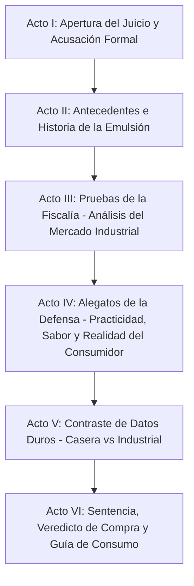

# Guion: "Mayonesa, ¿sabrosa embarrada o promueve infartos?"
**Canal de YouTube:** `@JuicioAlimentoApetecible`  
**Serie / Formato:** Juicio Alimento Apetecible / Juicio Alimento Barato  
**Género:** Drama judicial divulgativo / Ciencia de los alimentos / Debate gastronómico  
**Duración estimada:** 18:00 – 22:00 minutos  

---

## Ficha Técnica de Producción

* **Acusador (Voz / Pantalla):** 
BETO (Ingeniero bioquímico, especialista en nutrición y tecnología de alimentos. 
Tono científico, didáctico, objetivo, respetuoso y profesional).
* **Defensora (Bancada):** 
BETI (Madre de familia trabajadora, cocinera práctica y cotidiana. 
Tono empático, alegre, risueño, perspicaz y conectado con el consumidor).
* **La Acusada:** 
LA MAYONESA (Personificada / Frasco en el estrado de los testigos).
* **Ambientación:** 
Sala de tribunal judicial solemne combinada con elementos de laboratorio y cocina. 
Pantallas de evidencia, estrado de testigos, mazo judicial y mesa de debate.
* **Estilo Audiovisual:** 
Inspirado en dramas judiciales y series policiacas clásicas (estilo *Law & Order*), 
apoyado con gráficos explicativos, macros de alimentos, material de archivo libre de 
derechos y recreaciones dinámicas.
* **Banda Sonora y Efectos:** 
Golpes de mazo judicial, acordes dramáticos de cuerdas, ritmos tensos de sintetizador/bajo 
y transiciones de corte judicial (*doink-doink* / golpe seco de campana grave).

---

# I. Resumen Estructurado en los Principales Actos

### **Acto I: Apertura del Juicio y Acusación Formal (00:00 – 02:30)**
* **Planteamiento:** 
Presentación del caso en el tribunal. Se expone a la mayonesa como aderezo 
predilecto de millones de hogares pero señalada como causante silenciosa de 
sobrepeso, hipercolesterolemia y riesgo cardiovascular.
* **Declaración inicial:** 
Entrada en escena de la acusada en el estrado. Beto presenta los cargos de la 
fiscalía; Beti asume formalmente la defensa declarándola inocente de la 
difamación mediática.

### **Acto II: Antecedentes e Historia — La Química del Origen (02:30 – 05:45)**
* **Contexto histórico:** 
Origen de la salsa mayonesa (orígenes en Mahón / salsa emulsionada tradicional).
* **La fórmula pura:** 
Ingredientes básicos (yema de huevo, aceite vegetal, ácido como limón o vinagre,
mostaza y sal).
* **La ciencia de la emulsión:** 
Demostración bioquímica de cómo la lecitina del huevo suspende microscópicamente
millones de gotas de grasa en medio acuoso.

### **Acto III: Pruebas de la Fiscalía — La Radiografía de la Mayonesa Industrial (05:45 – 10:30)**
* **Inspección de marcas comerciales:** 
Análisis comparativo de las principales marcas del mercado (líderes comerciales,
versiones clásicas vs. light vs. con jugo de limón).
* **Lectura forense de etiquetas:** 
Desglose de aceites refinados empleados (soya, canola), azúcares ocultos, almidones
modificados como espesantes sustitutivos, exceso de sodio y conservadores químicos (EDTA disódico).
* **Impacto metabólico:** 
La densidad calórica por cucharada y el consumo acumulado desapercibido que eleva 
el riesgo de aterosclerosis e infartos.

### **Acto IV: Alegatos de la Defensa — Practicidad, Sabor y Realidad Cotidiana (10:30 – 14:15)**
* **El valor organoléptico:** 
Beti presenta la defensa basada en la cocina real: tortas, sándwiches, ensaladas 
de atún, elotes preparados y su rol como lubricante y vehículo de sabor indispensable.
* **Economía y accesibilidad:** 
Costo por porción frente a otros aderezos gourmet; estabilidad microbiológica 
frente a la mayonesa casera (vida de anaquel y prevención de salmonelosis doméstica).
* **Testimonios del consumidor:** 
El alimento como vehículo de placer y saciedad en jornadas laborales extenuantes.

### **Acto V: Careo y Contraste de Datos Duros (14:15 – 17:45)**
* **Tabla comparativa frontal:** 
Mayonesa Casera vs. Mayonesa Industrial Tradicional vs. Mayonesas Tipo Aderezo.
* **El debate de las grasas:** 
Tipos de lípidos (poliinsaturados, saturados, monoinsaturados) y el efecto real 
del tamaño de la porción.
* **Desmontando mitos:** 
¿Es el colesterol del huevo o la sobredosis de aceites oxidados y sodio lo que 
daña las arterias?

### **Acto VI: Sentencia, Veredicto de Compra y Veredicto Final (17:45 – 21:30)**
* **Veredicto judicial:** 
Sentencia dividida y condicional. No se condena a prohibir su venta, pero se 
establecen restricciones de consumo.

* **Resolución de compra para el consumidor:**
  * *La menos dañina / mejor formulada:* 
  La marca con mayor proporción de huevo auténtico y grasas insaturadas de mejor
  calidad sin exceso de almidones.
  * *La opción "Buena, Bonita y Barata":* 
  La alternativa accesible que respeta el estándar de mayonesa sin caer en 
  aderezo de imitación.
* **Cierre y llamado a la acción:** 
  Reglas de oro para consumirla sin comprometer la salud cardiovascular.

---

# II. Guion Técnico Detallado por Escenas

---

### ACTO I: APERTURA DEL JUICIO Y ACUSACIÓN FORMAL (00:00 – 02:30)

#### Escena 1 (00:00 – 00:35) — Gancho Visual e Introducción
* **Plano / Visual:** 
Plano detalle (PD) cinematográfico con profundidad de campo reducida: 
una espátula unta una porción generosa y cremosa de mayonesa sobre un 
pan caliente de torta que cruje, seguido de cortes rápidos a un sándwich 
desbordante, papas fritas sumergiéndose en aderezo y un elote cubierto 
de mayonesa y queso.
* **Cámara / Movimiento:** 
Cámara lenta (60 fps) con movimiento circular deslizante (slider) 
alrededor de los alimentos; corte brusco con zoom-in digital rápido.
* **Iluminación / Filtro:** 
Luz cálida comercial gastronómica, alto contraste, saturación vibrante en 
los dorados y blancos cremosos.
* **Audio / SFX / Música:** 
Sonido hiperrealista (foley) de cuchillo untando la crema, crujido de 
pan tostado. De golpe, entra un acorde grave y tenso de violonchelo con 
un golpe sordo de tambor judicial (*boom*).
* **Texto en Pantalla / Gráfico:** 
Título animado: *"JUICIO AL ALIMENTO APETECIBLE: MAYONESA"*.

#### Escena 2 (00:35 – 01:15) — La Acusada en el Estrado
* **Plano / Visual:** 
Plano Americano (PA) de una sala de juicio con paneles de madera caoba. 
La cámara realiza un retroceso (zoom-out / travelling hacia atrás) 
revelando que en el banquillo de los acusados está sentado un frasco de 
mayonesa con expresión personificada / foco dramático bajo una luz cenital.
* **Cámara / Movimiento:** 
Travelling hacia atrás (Dolly-out) fluido, ángulo normal a contrapicado suave.
* **Iluminación / Filtro:** 
Tono cinematográfico azulado y sobrio tipo juzgado de drama procesal 
(estilo *Law & Order*), con un haz de luz cenital (spotlight) 
enfocado directamente sobre el frasco.
* **Audio / SFX / Música:** 
Clásico golpe musical de campana judicial / bajo percutivo (*doink-doink*). 
Murmullo de sala de audiencias que se silencia con tres golpes de 
mazo de madera (*clac-clac-clac*).
* **Texto en Pantalla / Gráfico:** 
Cartela inferior (Chyron): *"ACUSADA: Mayonesa Comercial | CARGOS: Promoción de Obesidad y Riesgo Cardiovascular"*.

#### Escena 3 (01:15 – 02:30) — Lectura de Cargos y Declaración de la Defensa
* **Plano / Visual:** 
Plano Medio (PM) de la pantalla principal del tribunal donde aparece Beto 
con bata de laboratorio y corbata elegante, sosteniendo una carpeta con el 
expediente. 
Paneo rápido hacia la bancada de la defensa donde esta Beti, con libreta en mano 
y con una expresión confiada y alegre, se pone de pie.
* **Cámara / Movimiento:** 
Paneo de látigo (whip pan) entre la pantalla de Beto y el estrado de Beti, 
finalizando en Plano General (PG) que abarca ambos extremos de la sala.
* **Iluminación / Filtro:** 
Contraste frío entre la pantalla digital de la fiscalía (tonos azules/blancos 
clínicos) y la calidez del área de defensa de Beti.
* **Audio / SFX / Música:** 
Cuerdas pulsadas en pizzicato y ritmo de sintetizador constante en tempo 
moderado (estilo suspenso procesal).
* **Texto en Pantalla / Gráfico:** 
Infografía lateral emergente: *"EXPEDIENTE 01-MAYONESA: 90 a 100 kcal por 
cucharada / 70-80% de contenido graso"*.

---

### ACTO II: ANTECEDENTES E HISTORIA — LA QUÍMICA DEL ORIGEN (02:30 – 05:45)

#### Escena 4 (02:30 – 03:50) — Origen y la Fórmula Clásica
* **Plano / Visual:** 
Plano General Corto (PGC) de una cocina de época recreada / ilustraciones 
históricas en movimiento (puerto de Mahón, 1756). Se disuelve a una toma cenital 
(Flat Lay) en superficie de mármol con los 5 ingredientes puros: yema de 
huevo fresco, botella de aceite vegetal puro, medio limón goteando, vinagre, 
sal y mostaza Dijon.
* **Cámara / Movimiento:** 
Plano cenital con rotación suave de 45 grados y descensos progresivos (Dolly-in) 
hacia cada ingrediente individual.
* **Iluminación / Filtro:** 
Luz natural suave matutina, tonos dorados y orgánicos.
* **Audio / SFX / Música:** 
Música de cámara clásica sutil con violín solista, combinada con sonidos nítidos 
de huevo rompiéndose y gotas de limón cayendo.
* **Texto en Pantalla / Gráfico:** 
Etiquetas animadas flotantes: *"Yema de Huevo (Emulsionante)", "Aceite 
(Fase Grasa 75%)", "Jugo de Limón / Ácido (Fase Acuosa)", "Sal y Especias"*.

#### Escena 5 (03:50 – 05:45) — La Ciencia de la Emulsión: ¿Magia o Bioquímica?
* **Plano / Visual:** 
Animación digital 3D / microscopía gráfica: se muestra cómo las moléculas 
de fosfolípidos (lecitina) del huevo poseen una cabeza afín al agua (hidrófila) 
y una cola afín a la grasa (lipófila), atrapando miles de microgotas de 
aceite suspendidas para formar una estructura espesa y untable.
* **Cámara / Movimiento:** 
Vuelo de cámara 3D inmersiva entre partículas microscópicas en slow motion.
* **Iluminación / Filtro:** 
Render 3D con colores vibrantes: esferas doradas luminosas (grasa), filamentos 
azules (agua) y conectores moleculares cian brillante.
* **Audio / SFX / Música:** 
Zumbido armónico de frecuencias electrónicas de laboratorio, con efectos acuosos 
suaves (*pop*, *shimmer*).
* **Texto en Pantalla / Gráfico:** 
Diagrama molecular: *"LECITINA: El puente entre el agua y el aceite"*.

---

### ACTO III: PRUEBAS DE LA FISCALÍA — LA RADIOGRAFÍA INDUSTRIAL (05:45 – 10:30)

#### Escena 6 (05:45 – 07:30) — Inspección de Marcas en el Laboratorio Forense
* **Plano / Visual:** 
Plano Medio Corto (PMC) con mesa de laboratorio: 4 frascos de marcas 
comerciales representativas con etiquetas analizadas. Beto en pantalla utiliza 
un puntero láser virtual para resaltar la lista de ingredientes en orden decreciente.
* **Cámara / Movimiento:** 
Travelling lateral continuo (Tracking shot) frente a los frascos, alternando 
con Primerísimos Primeros Planos (PPP) a las tablas nutricionales y sellos 
de advertencia.
* **Iluminación / Filtro:** 
Luz clínica blanca neutra (5600K), enfoque de alta definición con nitidez extrema 
en las letras pequeñas de los empaques.
* **Audio / SFX / Música:** 
Beat electrónico tenso con bajo procesado, sonidos digitales de escaneo 
(*beep*, *data scan*).
* **Texto en Pantalla / Gráfico:** 
Sellos oficiales destacados: *"EXCESO CALORÍAS"*, *"EXCESO GRASAS SATURADAS"*, 
*"EXCESO SODIO"*. Lista resaltada: *"Aceite de Soya / Canola Refinado", 
"Almidón Modificado de Maíz", "EDTA Disódico"*.

#### Escena 7 (07:30 – 10:30) — El Asalto a las Arterias y el Sobrecargo Calórico
* **Plano / Visual:** 
Recreación 3D del flujo sanguíneo en una arteria humana. Se visualiza cómo el 
exceso de triglicéridos y grasas saturadas consumidas en porciones 
desmedidas contribuye a la formación de placas de ateroma. Se alterna con 
un plano picado de una cuchara sopera colmada que cae pesadamente sobre un platillo.
* **Cámara / Movimiento:** 
Zoom digital continuo hacia el interior del vaso sanguíneo con pulsaciones 
rítmicas de cámara que emulan el latido cardíaco.
* **Iluminación / Filtro:** 
Tonos rojos intensos y sombras oscuras, generando tensión dramática y 
advertencia médica.
* **Audio / SFX / Música:** 
Latido cardíaco en crescendo (*pum-pum... pum-pum...*), sintetizador grave de 
alarma médica.
* **Texto en Pantalla / Gráfico:** 
Gráfico de barras comparativo: *"1 Cucharada = 15g = 94 kcal vs. 
Gasto físico para quemarla: 12 minutos de trote continuo"*.

---

### ACTO IV: ALEGATOS DE LA DEFENSA — PRACTICIDAD, SABOR Y REALIDAD COTIDIANA (10:30 – 14:15)

#### Escena 8 (10:30 – 12:15) — La Prueba del Sabor en la Comida Popular
* **Plano / Visual:** 
Plano Medio (PM) de Beti sosteniendo un plato con una torta de jamón con 
aguacate y tomate recién preparada, y una ensalada fresca de atún. 
Se intercalan tomas dinámicas de puestos de comida callejera limpios y mesas 
familiares compartiendo alimentos.
* **Cámara / Movimiento:** 
Handheld fluido y cálido tipo documental, con acercamientos rápidos a los 
detalles apetitosos de los platillos.
* **Iluminación / Filtro:** 
Luz cálida de cocina de hogar, sombras suaves, sensación acogedora y apetecible.
* **Audio / SFX / Música:** 
Melodía alegre y rítmica de guitarra acústica y bajo ligero, acompañada de 
risas de fondo y sonido ambiental de tenedores y vajilla.
* **Texto en Pantalla / Gráfico:** 
Cuadro comparativo de beneficios: *"Palatabilidad y Saciedad", 
"Transporte de Vitaminas Liposolubles (A, D, E, K)", "Costo por porción: 
Menos de $2.00 MXN"*.

#### Escena 9 (12:15 – 14:15) — La Realidad de la Conservación: ¿Riesgo Casero vs. Seguridad Industrial?
* **Plano / Visual:** 
Pantalla dividida (Split Screen):
  * Lado Izquierdo: Frasco casero con huevo crudo después de 48 horas 
    (reacción bacteriana potencial / proliferación microbiana).
  * Lado Derecho: Frasco industrial pasteurizado con pH ácido estable y sello 
    hermético que garantiza inocuidad por meses.
* **Cámara / Movimiento:** 
Estática en split screen con zooms lentos simétricos en ambos lados.
* **Iluminación / Filtro:** 
Luz neutra con comparador cromático.
* **Audio / SFX / Música:** 
Efecto de balanza oscilando, campanas suaves de precisión.
* **Texto en Pantalla / Gráfico:** 
Letreros en pantalla: *"CASERA: Vida útil 48 hrs / Riesgo de Salmonella" | 
"INDUSTRIAL: Pasteurizada / Vida útil 6-12 meses"*.

---

### ACTO V: CONTRASTE DE DATOS DUROS — CASERA VS. INDUSTRIAL (14:15 – 17:45)

#### Escena 10 (14:15 – 16:00) — El Careo Bioquímico en el Estrado
* **Plano / Visual:** 
Plano General (PG) de la sala donde Beto y Beti se colocan frente a una 
pizarra holográfica transparente en medio del tribunal. Ambos interactúan 
con los datos mientras debaten de pie.
* **Cámara / Movimiento:** 
Paneo semicircular (Arc shot de 180°) alrededor de ambos interlocutores y 
la mesa de pruebas.
* **Iluminación / Filtro:** 
Iluminación balanceada de debate televisivo, luces de recorte azules y 
ámbar en los personajes.
* **Audio / SFX / Música:** Percusión de thriller procesal con ritmo rápido 
de reloj (*tic-tac* metálico).
* **Texto en Pantalla / Gráfico:** 
Tabla técnica interactiva:
  * *Calorías por 100g:* Casera (720 kcal) vs. Industrial Clásica (680 kcal) vs.
    Industrial Light (280-350 kcal).
  * *Contenido de Sodio por porción:* Casera (40-60 mg) vs. Industrial (90-130 mg).
  * *Espesantes:* Casera (0%) vs. Industrial (Almidón modificado hasta 15-20% 
  en versiones económicas).

#### Escena 11 (16:00 – 17:45) — El Mito de las Grasas y las Versiones "Light"
* **Plano / Visual:** 
Plano Detalle (PD) a dos frascos: una Mayonesa Regular frente a una Mayonesa "Light /
Reducida en Grasa". Beto abre ambos frascos y muestra la textura; la versión light
sustituye grasa por agua y almidones azucarados.
* **Cámara / Movimiento:** 
Zoom-in progresivo a las texturas en cucharas comparativas.
* **Iluminación / Filtro:** 
Contraste nítido con reflejos en las superficies cremosas.
* **Audio / SFX / Música:** 
Sonido de espátula deslizándose; acorde menor que denota revelación importante.
* **Texto en Pantalla / Gráfico:** 
Advertencia nutricional: *"¡CUIDADO CON EL EFECTO LIGHT! Menos grasa, pero 
el doble de carbohidratos y almidones espesantes"*.

---

### ACTO VI: SENTENCIA, VEREDICTO DE COMPRA Y GUÍA DE CONSUMO (17:45 – 21:30)

#### Escena 12 (17:45 – 19:30) — La Sentencia del Tribunal
* **Plano / Visual:** 
Plano Medio (PM) de Beto en el estrado del juez con el mazo en la mano, 
con Beti escuchando atentamente en primer plano desenfocado (Over-the-shoulder /
escorzo). Beto sostiene el documento final de sentencia.
* **Cámara / Movimiento:** 
Plano frontal con elevación ligera (ligero contrapicado que transmite autoridad),
seguido de corte a Beti asintiendo con sonrisa de complicidad.
* **Iluminación / Filtro:** 
Luz dorada cenital sobre el estrado, generando un ambiente solemne y concluyente.
* **Audio / SFX / Música:** 
Fanfarria orquestal suave de resolución de conflicto, golpe final de mazo de 
madera con eco reververante (*¡CLAC!*).
* **Texto en Pantalla / Gráfico:** 
Rótulo en pantalla: *"VEREDICTO: CULPABLE POR EXCESO DE USO / INOCENTE SI SE 
DOSIFICA CON INTELIGENCIA"*.

#### Escena 13 (19:30 – 21:30) — Guía de Compra Inteligente y Despedida
* **Plano / Visual:** 
Plano General (PG) de la mesa final con un podio de tres lugares:
  1. *Puesto 1 (La menos dañina):* Frasco con aceite de canola/oliva de alto 
  contenido oleico, sin almidones añadidos y con bajo sodio.
  2. *Puesto 2 (La opción BBB - Buena, Bonita y Barata):* Marca tradicional 
  balanceada con relación costo/pureza óptima.
  3. *Puesto 3 (La que debes evitar):* Aderezos tipo mayonesa que son puro 
  almidón con jarabe de maíz y saborizantes artificiales.
* **Cámara / Movimiento:** 
Barrido horizontal (pan) revelando los productos premiados, cerrando con 
zoom-out hacia Beto y Beti despidiéndose juntos a cuadro con el frasco en el centro.
* **Iluminación / Filtro:** 
Luz cálida y luminosa de estudio de televisión de alta gama.
* **Audio / SFX / Música:** 
Tema musical de cierre alegre, dinámico y contagioso con guitarra y percusión brillante.
* **Texto en Pantalla / Gráfico:** 
Tarjetas finales con recomendaciones de porción: *"Porción máxima sugerida: 
1 cucharada cafetera (10-15g) al día. 
¡Suscríbete y activa la campana para el próximo juicio!"*.

---

# III. Guion Literario

---

### **ACTO I: APERTURA DEL JUICIO Y ACUSACIÓN FORMAL**

**[ESCENA 1 — INT. SALA DE AUDIENCIA / COCINA — DÍA]**

*(El vídeo inicia con un close-up glorioso de una cuchara esparciendo 
una nube blanca, densa y cremosa de mayonesa sobre un bolillo tostado que cruje 
al contacto. Se añaden rebanadas de aguacate, jitomate y jamón. Corte rápido a 
un elote hervido cubierto con una capa brillante de mayonesa, queso 
espolvoreado y chile piquín en polvo).*

**BETO (V.O.)**  
*(Tono intrigante, voz profunda y cautivadora)*  
Quizas esta en tu refrigerador. Quizas es el secreto cotidiano que transforma 
tu sándwich seco, en una delicia jugosa. Y quizas, ya te terminas  el frasco 
en esos elotes cocidos. Te aseguro que es parte del desayuno para llevar al 
trabajo, es practico y economico. 

*(Corte seco. Pantalla a negros por un segundo. Suena el icónico golpe de 
mazo judicial: ¡CLAC, CLAC, CLAC!).*

**BETO (V.O.)**  
Pero detrás de esa tersa y apetitosa blancura... se oculta una bomba silenciosa 
de triglicéridos, aceites ultra-refinados y un aporte calórico capaz de endurecer 
tus arterias.

*(Aparece en pantalla el estrado de un juzgado solemne. En el banquillo de los 
acusados, reposa solitario y bajo un reflector un frasco de mayonesa comercial 
con mirada altanera).*

**LA MAYONESA (ACUSADA)**  
*(Voz chillona, desfachatada y pícara)*  
¡Ay, por favor!, ¡Para chismes, me como dos de lengua... con mucha mayonesa!

*(Música de fondo: Tensión policiaca estilo "La ley y el orden" con cuerdas 
tensas y pulso bajo rítmico).*

**BETO (A Cuadro en Pantalla de TV del Tribunal)**  
*(Vistiendo bata blanca impecable, corbata sobria; tono formal, pausado y científico)*  
Silencio en la sala. Bienvenidos al tribunal de *Juicio al Alimento Apetecible*. 
Hoy se sienta en el banquillo una de los alimentos más consumidos en el planeta: 
la mayonesa. Se le imputan cargos graves: incitar al consumo desmedido de grasas 
invisibles, favorecer el sobrepeso poblacional y promover el riesgo de infartos y 
enfermedades cardiovasculares en consumidores que solo buscan comer sabroso. 
¿Mayonesa, cómo se declara?

**BETI**  
*(Entrando decidida a cuadro desde la bancada de la defensa, acomodándose los papeles 
con una sonrisa franca y energética)*  
¡Objeción, fiscal! Mi clienta, la sabrosa Mayonesa, se declara totalmente **inocente** 
de la calumnia de provocar enfermedades por sí sola. Aquí lo que hay es una campaña 
de desprestigio y mala publicidad. La mayonesa no salta del frasco a taparle las 
arterias a nadie; es la aliada del trabajador que necesita comida rendidora y deliciosa. 
¡Y hoy vamos a demostrar que la comida de verdad no tiene por qué ser desabrida!

---

### **ACTO II: ANTECEDENTES E HISTORIA — LA QUÍMICA DEL ORIGEN**

**[ESCENA 2 — INT. SALA DE AUDIENCIA / MESA DE LABORATORIO — DÍA]**

**BETO**  
*(Sonriendo con cortesía profesional ante el entusiasmo de Beti)*  
Estimada defensora Beti, el tribunal aprecia su pasión. Pero antes de discutir 
culpas actuales, debemos mensionar los hechos históricos. ¿Qué es en realidad 
la mayonesa?

*(La pantalla muestra una mesa de madera con cinco ingredientes frescos filmados 
en plano cenital con iluminación impecable).*

**BETO (V.O.)**  
La mayonesa es una auténtica maravilla de la fisicoquímica culinaria. 
Se elabora con tan solo cinco elementos básicos: una yema de huevo fresco, aceite 
puro vertido gota a gota, unas gotas de jugo de limón o vinagre para aportar acidez, 
un toque de mostaza y una pizca de sal. Se mezclan consistentemen hasta lograr la
consitencia cremosa. 

**BETI**  
*(Interviniendo con tono alegre y casero)*  
¡Exactamente, Beto! ¡La mayonesa contiene ingredientes que las familias tenemos 
en la cocina! ¿Dónde está el delito en un poco de huevo y aceite?. 

**BETO**  
*(Ajustando sus lentes y proyectando una gráfica molecular en 3D)*  
El punto, Beti, es que la mayonesa no es una preparación convencional; 
es una **emulsión de grasa en agua**, o sea, logramos la suspención de pequeñitas
gotas de aceite en agua, logrando un consitencia cremosa, suave y sedosa.  
La proteina del huevo (lecitita) permite enlazar las moleculas de aceite con
el agua. 

**BETI**  
*(Riendo con picardía)*  
¡Pues bendito amarrre de huevos!, ingeniero! (risas) Porque gracias a esa 
textura suave y sedosa, podemos comer tortas y sandwich más sabrosos. 

**BETO**  
*(Tono admonitorio pero amable)*  
Cierto... pero ese mismo amarre oculta una tramposa sensación: al emulsionarse, 
la grasa pierde la persepción aceitosa en el paladar. Te puedes comer 
cien calorías de grasa concentrada en una sola cucharada casi sin darte cuenta. 
Y eso en la versión casera tradicional. Lo que nos lleva al verdadero motivo 
por el que estamos hoy aquí: la versión industrial que compramos en el supermercado.

---

### **ACTO III: PRUEBAS DE LA FISCALÍA — LA RADIOGRAFÍA INDUSTRIAL**

**[ESCENA 3 — INT. SALA DE AUDIENCIA / PANTALLA DE EVIDENCIAS — DÍA]**

*(A señal de Beto se proyectan en pantalla cinco de los frascos comerciales 
de mayonesa más vendidos en el país, acompañados del sonido de escáner digital).*

**BETO**  
Presento ante el tribunal la prueba pericial A: el análisis de composición de 
las marcas dominantes del mercado. ¿Qué es lo que verdaderamente compra el 
ciudadano cuando adquiere un frasco de mayonesa comercial?

*(Gráfico en pantalla haciendo zoom a las letras minúsculas de la lista 
de ingredientes).*

**BETO**  
Primer hallazgo: el tipo de aceite. En la industria no se utiliza aceite de oliva 
ni aceites prensados en frío. La base principal es aceite de soya o de 
canola altamente refinado y sometido a procesos térmicos. 
Segundo hallazgo: el huevo entero o deshidratado representa apenas un porcentaje
mínimo. Y para abaratar costos y mantener la consistencia firme en anaquel 
durante más de un año, muchas marcas introducen **almidón modificado de maíz**, 
jarabes de azúcar para compensar la acidez, y conservadores como el 
**EDTA disódico**.

**BETI**  
*(Cruzando los brazos, desafiante pero sonriente)*  
A ver, a ver, señor perito bioquímico. ¿Me está diciendo que el almidón y 
el EDTA son veneno? Porque hasta donde yo sé, todas esas marcas cuentan con 
los permisos sanitarios de ley y las compramos en cualquier tiendita de la 
esquina por un precio que no nos vacía la cartera.

**BETO**  
No son veneno agudo, Beti; son sustitutos tecnológicos diseñados para abaratar 
costos y prolongar la vida útil del producto. Pero examinemos las consecuencias
metabólicas. 

*(Aparece una animación médica 3D de una arteria coronaria donde se ilustra 
la acumulación de lípidos y colesterol LDL).*

**BETO (V.O.)**  
Una sola porción estandarizada de mayonesa industrial equivale a quince gramos: 
una cucharada sopera. En esa modesta cucharada hay aproximadamente 
**noventa a cien kilocalorías**, de las cuales más del noventa por ciento es 
grasa pura y contiene cerca de cien miligramos de sodio. El problema real no es 
una cucharada; el problema es que el consumidor promedio no usa una cuchara 
medidora: unta una o dos cucharadas en la torta, y si se come dos tortas
estaria ingeriendo más de 300 calorías provenientes de aceite vegetales refinados.

**BETO**  
Si una persona es sedentaria o no acostumbra ejercitarse, pero tiene el hábito 
cotidiano de consumir tortas, sandwich, burritos, durante años, el exceso de 
energía acomulada en el cuerpo y los lípidos oxidados en sangre eleva los 
indices de triglicéridos, fomenta el hígado graso y acelera la formación de 
ateromas en las arterias. Por lo cual, la acusación se sostiene: 
la mayonesa comercial es un promotor directo del sobrepeso y de los accidentes 
cardiovasculares.

---

### **ACTO IV: ALEGATOS DE LA DEFENSA — PRACTICIDAD, SABOR Y REALIDAD COTIDIANA**

**[ESCENA 4 — INT. SALA DE AUDIENCIA / BANCO DE LA DEFENSA — DÍA]**

**BETI**  
*(Se pone de pie, toma un frasco de mayonesa y lo coloca frente a la cámara 
con calidez maternal y seguridad)*  
Señor fiscal, sus números se ven muy bonitos en una pantalla de laboratorio, 
pero usted no está pensando en la vida real de quienes salimos a trabajar 
desde las seis de la mañana.

*(Beti muestra una lonchera con sándwiches bien preparados y una ensalada de 
verduras mixtas).*

**BETI**  
Primero: **el factor saciedad y rendimiento**. Una madre o un padre de familia 
que prepara las tortas o sandwich para sus hijos o para su jornada en la fábrica 
o en la oficina, no tiene presupuesto para comprar el costoso aguacate, todos los 
días. Una cucharada de mayonesa cuesta pocos pesos y le da sabor agradable a 
cualquier verdura hervida y aporta esa grasa que da energía y mantiene satisfecho 
al trabajador para que no caiga en la tentación de comer galletas o pan dulce.
(Se mustran imagenes de personas trabajadoras comiendo tortas y sandwich en el 
lugar que laboran)

**BETO**  
*(Asintiendo con respeto)*  
Es un punto económico válido, Beti, pero el riesgo vascular sigue presente...

**BETI**  
*(Interrumpiendo en voz alta y con elocuencia)*  
¡Momento, que no he terminado con mis pruebas!. ups!, me emocione, disculpen.
Hablemos de **seguridad alimentaria**, usted nos presumió la mayonesa casera 
hecha con huevo crudo. Pero si una persona se lleva una torta con mayonesa 
casera en el transporte público bajo el calor de treinta grados durante dos 
horas, ese huevo crudo se convierte en un nido de bacterias como la *Salmonella* 
que te manda directo a urgencias con una deshidratación severa. En cambio, 
la mayonesa comercial está pasteurizada, tiene su acidez controlada y garantiza 
que la comida no se eche a perder. ¡Mi clienta salva estómagos de infecciones 
a diario!

**LA MAYONESA (ACUSADA)**  
*(Gritando desde el estrado)*  
¡Bien dicho, licenciada! ¡Yo cuido la tripa y alegro el paladar!

---

### **ACTO V: CONTRASTE DE DATOS DUROS — CASERA VS. INDUSTRIAL**

**[ESCENA 5 — INT. SALA DE AUDIENCIA / PESAJE Y COMPARACIÓN — DÍA]**

*(Beto y Beti se reúnen en la mesa central del tribunal. Sobre la mesa hay 
básculas de precisión, recipientes medidores y tablas comparativas transparentes
iluminadas).*

**BETO**  
La defensa ha colocado sobre la mesa dos argumentos sumamente inteligentes: 
la practicidad microbiológica y el costo accesible. Pongamos entonces los datos 
duros frente a frente para que el jurado —nuestra audiencia— juzgue con 
claridad absoluta.

*(Se despliega la tabla comparativa en pantalla).*

| Parámetro (Porción 15g / 1 Cucharada) | Mayonesa Casera (Aceite Girasol/Oliva) | Mayonesa Industrial Clásica | Mayonesa Reducida en Grasa ("Light") | Aderezo Tipo Mayonesa (Económica) |
| :--- | :--- | :--- | :--- | :--- |
| **Calorías** | 100 - 108 kcal | 90 - 95 kcal | 35 - 45 kcal | 50 - 65 kcal |
| **Grasas Totales** | 11 - 12 g | 10 g | 3 - 4 g | 4 - 6 g |
| **Grasas Saturadas** | 1.5 g | 1.5 g | 0.5 g | 1.0 g |
| **Carbohidratos / Azúcares** | 0.1 g | 0.5 g | 2.5 - 3.5 g | 4.0 - 6.0 g |
| **Sodio** | 20 - 40 mg | 95 - 130 mg | 120 - 160 mg | 150 - 200 mg |
| **Ingrediente Principal** | Aceite vegetal puro + Yema | Aceite vegetal + Agua + Huevo | Agua + Aceite + Almidón de Maíz | Agua + Almidón modificado + Azúcar |
| **Vida Útil en Refrigeración** | 48 a 72 horas máximo | 6 a 12 meses | 6 a 9 meses | 9 a 12 meses |

**BETO**
La tabla muestra que la Mayonesa light y los aderezos tiene menos calorias provenientes
de las grasas, pero, tienen mayor contenido de carbohidratos y sal. 

**BETI**  
*(Mirando la tabla con asombro)*  
¿O sea que la gente que compra la versión "Light" creyendo que cuida 
su corazón en realidad está comiendo almidón y azúcar espesada?

**BETO**  
*(Con tono firme y pedagógico)*  
¡Exactamente, Beti! Ese es el gran engaño de la mercadotecnia. Para quitarle grasa 
a una mayonesa cuya esencia es el aceite, la industria tiene que incluirle agua; y 
para que el agua no quede líquida, le añaden almidón modificado, gomas vegetales y
azúcar para dar consistencia y sabor. Al final, el consumidor se confía porque dice
"Light", se sirve mayor porción y termina provocando un pico de glucosa e insulina en 
su sangre, además de sobrecargar sus riñones con sodio.

**BETI**  
O sea que el dicho popular tiene razón: resulta peor el remedio que la enfermedad 
si no sabemos leer la etiqueta.

---

### **ACTO VI: SENTENCIA, VEREDICTO DE COMPRA Y GUÍA DE CONSUMO**

**[ESCENA 6 — INT. SALA DE AUDIENCIA / ESTRADO DEL JUEZ — DÍA]**

*(Beto regresa al estrado principal. Suena una percusión solemne. Beti se acomoda 
en su lugar para escuchar la resolución final).*

**BETO**  
Tras haber examinado las pruebas científicas de la fiscalía y los atenuantes 
prácticos y económicos presentados por la defensa, este tribunal emite su 
veredicto formal.

*(Beto golpea el mazo una sola vez: ¡CLAC!).*

**BETO**  
Declaramos a la Mayonesa: **CULPABLE** de engaño nutricional cuando se disfraza 
de aderezo inofensivo o versión light milagrosa, y promotora de riesgo de infartos
**únicamente cuando se consume en exceso sistemático y descontrolado**. 
Pero la declaramos **ABSUELTA** de ser un alimento tóxico o prohibido en la mesa 
del hogar cuando se utiliza con prudencia culinaria.

**BETI**  
*(Sonriendo satisfecha)*  
¡Justicia pura! Entonces, Beto, para toda la gente trabajadora que nos está viendo 
y va a ir al mercado esta semana: ¿cuál es la guía de compra definitiva? ¿Cuál es 
la mayonesa "menos peor" y cuál es la que de verdad conviene comprar?

**BETO**  
*(Tomando los productos en mano para orientar al espectador)*  
Aquí tienen el dictamen de compra inteligente de *Juicio al Alimento Apetecible*:

*(Aparecen en pantalla gráficos claros y destacados con cada recomendación).*

**BETO**  
1. **La "Menos Peor" / De Mayor Calidad Nutricional:**  
Aquella cuya etiqueta indique como primer ingrediente aceite de canola, 
girasol alto oleico o soya sin mezclas hidrogenadas, que tenga huevo 
pasteurizado en sus tres primeros ingredientes y **cero almidones o 
jarabes añadidos**. 
Suele ser la versión clásica tradicional de marcas consolidadas.

2. **La Mejor Opción Calidad - Precio (Buena, Bonita y Barata):**  
Las mayonesas tradicionales con jugo de limón de marcas reconocidas de 
autoservicio que cumplen con la norma oficial de al menos 65% de grasa 
emulsionada auténtica. Rinden bastante, conservan la estabilidad microbiológica 
y su precio por gramo es altamente competitivo.

3. **La que DEBES EVITAR en tu carrito:**  
Huyan de los frascos que se autodenominan *"Aderezo a base de mayonesa"* o 
*"Aderezo para ensaladas"* ultra económicos. Si el primer ingrediente es agua 
y el segundo es almidón de maíz modificado con saborizantes artificiales, 
están pagando por gelatina de carbohidratos con conservadores.

**BETI**  
*(Haciendo el gesto con la mano de untar moderadamente)*  
Y la regla de oro en la cocina: la mayonesa no es sopa, ¡es aderezo! 
Con una sola cucharadita cafetera bien distribuida en el pan es más que 
suficiente para que tu comida quede suave y deliciosa sin poner a sufrir 
a tu corazón ni a tu bolsillo.

**BETO**  
*(Mirando a la cámara con una sonrisa empática)*  
Comer bien no significa privarse del sabor ni gastar una fortuna; significa 
tomar decisiones informadas con criterio y ciencia en mano. 
Si este juicio te ayudó a despejar dudas sobre lo que compras para tu familia, 
déjanos tu me gusta, suscríbete al canal `@JuicioAlimentoApetecible` y 
cuéntanos en los comentarios: ¿qué alimento quieres que sentemos en el 
banquillo en el próximo episodio?

**BETI**  
¡Nos vemos en el próximo juicio! ¡Y no le tengan miedo a la comida, ténganle 
respeto a la porción!

*(Corte a pantalla final con música de cierre dinámica, enlaces a 
vídeos anteriores del canal y tarjetas interactivas de suscripción).*

---
