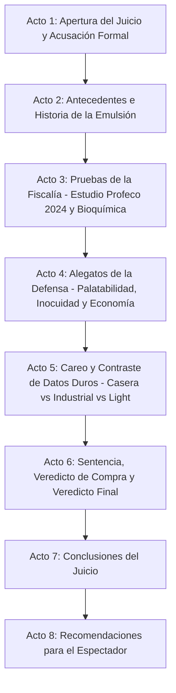

# Guion: "Mayonesa: ¿Sabrosa embarrada o promotora de infartos?"

**Canal de YouTube:** `@JuicioAlimentoApetecible`  
**Serie / Formato:** Juicio Alimento Apetecible  
**Género:** Drama judicial divulgativo / Ciencia de los alimentos / Debate nutricional  
**Duración estimada:** 19:00 – 23:00 minutos  

---

## 1. Resumen del Video

En este episodio de "Juicio Alimento Apetecible", Beto y Beti sientan en el banquillo de los acusados a uno de los condimentos más irresistibles, calóricos y omnipresentes en tortas, sándwiches, ensaladas de atún, elotes y mariscos: **La Mayonesa**.

Beto, en su papel de fiscal e ingeniero bioquímico, fundamenta su acusación técnica en el riguroso **Estudio de Calidad de la Procuraduría Federal del Consumidor (Profeco) publicado en la Revista del Consumidor de enero de 2024 (Edición 563)**, donde se analizaron 24 productos (mayonesas regulares, reducidas en grasa, aderezos y versiones veganas). Beto expone con datos duros la descomunal densidad energética del producto (más del 80% de grasa pura en marcas líderes como *Member's Mark* con 84 g/100 g, *La Costeña* con 81.9 g/100 g y *McCormick con limón* con 81.3 g/100 g), el exceso de sodio oculto (hasta 780-800 mg/100 g), la trampa mercadológica de los falsos "aderezos saludables con aceite de aguacate o almendra" que contienen menos del 2% de dicho aceite, y las faltas normativas de productos inmovilizados por la autoridad como *Heinz* (por deficiencia proteica) y *Best Foods Real* (por dar 45 ml menos de contenido neto). Además, advierte sobre la carga proinflamatoria de los aceites vegetales refinados ultraprocesados ricos en omega-6 oxidados y el conservador quelante EDTA disódico cálcico.

Por su parte, Beti encabeza una elocuente y realista defensa del consumidor: reivindica el papel de la mayonesa como un vehículo organoléptico fundamental que rescata alimentos secos e insípidos, facilitando la ingesta de vegetales amargos y proteínas magras en la vida diaria de millones de personas con poco tiempo y presupuesto ajustado. Crucialmente, Beti demuestra el triunfo de la **seguridad alimentaria e inocuidad industrial**: mientras que la mayonesa casera tradicional elaborada con huevo crudo representa un riesgo mortal de intoxicación por *Salmonella enteritidis* y se descompone en 24 horas, la versión industrial utiliza huevo pasteurizado y una acidificación estricta (pH < 4.1 con ácido acético/cítrico) que la hace microbiológicamente segura y estable durante meses.

El juicio se resuelve mediante un careo frontal con tablas comparativas, desmitificación de mitos populares (como el colesterol del huevo y las trampas de los productos *light* cargados de almidón y azúcar), un veredicto de compra fundamentado y una guía práctica de consumo para disfrutar de este manjar gastronómico sin arriesgar las arterias ni el bolsillo.

---

## 2. Esquema del Resumen Estructurado en Actos

* **Acto 1: Apertura del Juicio y Acusación Formal (00:00 – 02:20)**  
  Planteamiento del caso judicial. Beto presenta los cargos: bomba calórica, engaño comercial en formulaciones "balanceadas", sodio desmedido y riesgo aterogénico por exceso lipídico. Beti asume la defensa del sabor, la accesibilidad y la practicidad culinaria.
* **Acto 2: Antecedentes e Historia (02:20 – 05:10)**  
  Origen histórico: la salsa de Mahón (1756) tras la victoria naval del Duque de Richelieu en Menorca. La física y química de la emulsión coloidal: yema de huevo como surfactante natural (lecitina), gotas de aceite microscópicas suspendidas en agua y la revolución de la producción industrial en serie a inicios del siglo XX (Richard Hellmann).
* **Acto 3: Pruebas de la Fiscalía (05:10 – 09:45)**  
  Presentación del estudio de Profeco (Enero 2024). Radiografía de marcas: niveles astronómicos de grasa (81% a 84%), el truco de la "porción de 15 gramos" frente a la porción real de 45 gramos del consumidor, el fraude de los aderezos señuelo (*McCormick Balance* con apenas 2.2% de aguacate), las marcas sancionadas e inmovilizadas (*Heinz*, *Best Foods Real*, *Hellmann's*) y el impacto vascular de los aceites poliinsaturados omega-6 refinados.
* **Acto 4: Alegatos de la Defensa (09:45 – 14:10)**  
  Defensa de la palatabilidad: cómo la grasa vehicula aromas y solubiliza vitaminas liposolubles (A, D, E, K). El argumento de oro de la inocuidad industrial: pasteurización térmica vs. el peligro bacteriológico de la salmonelosis en mayonesa casera cruda. Accesibilidad, vida de anaquel y el emotivo testimonio del frasco de Mayonesa en el estrado.
* **Acto 5: Careo y Contraste de Datos Duros (14:10 – 17:50)**  
  Tablas comparativas directas: Mayonesa tradicional vs. Mayonesa con limón vs. Mayonesa Light vs. Aderezo de Mayonesa vs. Mayonesa Casera. Desmitificación de los productos *light* (menos grasa pero el doble de almidón modificado, sodio y azúcar). Análisis del conservador EDTA disódico cálcico.
* **Acto 6: Sentencia, Veredicto de Compra y Veredicto Final (17:50 – 20:00)**  
  Veredicto judicial: Absuelta de ser un "veneno tóxico", pero condenada por ser un detonador calórico encubierto y por simulación de ingredientes premium. Dictamen de compra: marcas transparentes aprobadas por Profeco vs. marcas reprobadas y engañosas.
* **Acto 7: Conclusiones del Juicio (20:00 – 21:15)**  
  Resumen ejecutivo de los hechos demostrados. Gráficos de balance nutricional y sentencia visual.
* **Acto 8: Recomendaciones para el Espectador (21:15 – 22:30)**  
  Las 4 reglas de oro para comprar y dosificar la mayonesa sin comprometer la salud cardiovascular.

---

## 3. Escaleta, Mediante una Tabla Estructurada en Actos / Escenas

| Acto | Escena | Nombre / Descripción | Duración Estimada |
| :--- | :--- | :--- | :--- |
| **Acto 1** | Escena 1 | Gancho Visual e Introducción: La cuchara cremosa, la báscula y el mazo judicial | 00:00 – 00:45 |
| | Escena 2 | Declaración inicial y lectura de cargos de la Fiscalía (Beto) | 00:45 – 01:35 |
| | Escena 3 | Intervención inicial de la Defensa (Beti) y entrada de la Mayonesa al estrado | 01:35 – 02:20 |
| **Acto 2** | Escena 4 | Origen histórico: De Mahón (1756) a la cocina global de Richard Hellmann | 02:20 – 03:40 |
| | Escena 5 | La ciencia de la emulsión coloidal: Lecitina, micelas y tensión interfacial | 03:40 – 05:10 |
| **Acto 3** | Escena 6 | Radiografía del Estudio Profeco 2024: 24 marcas bajo la lupa oficial | 05:10 – 06:50 |
| | Escena 7 | Lectura forense de etiquetas: El engaño del aguacate al 2% y marcas sancionadas | 06:50 – 08:20 |
| | Escena 8 | La bomba metabólica: 84% de grasa, porciones irreales y perfil omega-6 | 08:20 – 09:45 |
| **Acto 4** | Escena 9 | Valor organoléptico, vehículo vitamínico y la realidad económica del hogar | 09:45 – 11:30 |
| | Escena 10 | Seguridad alimentaria: Pasteurización y acidificación vs. Riesgo mortal de *Salmonella* | 11:30 – 12:50 |
| | Escena 11 | Testimonio del alimento acusado (Frasco de Mayonesa) en el banquillo | 12:50 – 14:10 |
| **Acto 5** | Escena 12 | Tabla comparativa frontal: Regular vs. Con Limón vs. Light vs. Aderezo vs. Casera | 14:10 – 16:00 |
| | Escena 13 | El debate de los aditivos: EDTA disódico, almidones modificados y sodio oculto | 16:00 – 17:50 |
| **Acto 6** | Escena 14 | Sentencia judicial y veredicto de compra (Marcas aprobadas vs. reprobadas) | 17:50 – 20:00 |
| **Acto 7** | Escena 15 | Resumen de los hechos probados y gráficos de la sentencia | 20:00 – 21:15 |
| **Acto 8** | Escena 16 | Alertas de salud, beneficios y las 4 reglas de oro del consumidor inteligente | 21:15 – 22:30 |

---

## 4. Ficha Técnica de Producción

* **Acusador (Fiscalía):**  
  **BETO** (Ingeniero bioquímico, especialista en nutrición y tecnología de alimentos. Tono científico, didáctico, objetivo, elocuente y respetuoso. Viste traje formal azul marino con corbata sobria y accesorios de laboratorio químico).
* **Defensora (Bancada de la Defensa):**  
  **BETI** (Joven profesionista trabajadora, experta en compras del hogar y gastronomía cotidiana. Tono empático, vivaz, risueño, pragmático y agudo. Viste atuendo sastre casual moderno en tonos terracota y blanco).
* **El Acusado en el Estrado:**  
  **LA MAYONESA** (Personificado / Frasco de mayonesa tradicional de vidrio con etiqueta clásica, corbata diminuta y espátula en mano, ubicado sobre el banquillo de los testigos con foco cenital).
* **Ambientación:**  
  Sala de juzgado judicial moderna y sofisticada con acabados en madera de roble, pantallas táctiles de microscopía y espectrometría de masas, estrado de testigos y una mesa forense de alimentos con recipientes volumétricos de aceite vegetal y huevos frescos.
* **Estilo Audiovisual:**  
  Híbrido entre drama judicial procesal (*Law & Order* / *Better Call Saul*) y divulgación científica hiperestilizada (*Explained* de Netflix / *Vox Borders*), con planos macro gastronómicos en cámara lenta (60 fps), cinemáticas con slider y gráficos de datos limpios.
* **Banda Sonora y Efectos:**  
  Golpes secos de mazo de roble con eco de reverberación, acordes de bajo acústico y sintetizador tenso para la fiscalía, notas de guitarra y marimba rítmica para las intervenciones de Beti, y efectos de sonido foley hiperrealistas (sonido cremoso de espátula untando pan, burbujeo de aceite, chasquido de cáscara de huevo).
* **Indicaciones de Edición:**  
  Ritmo dinámico sin tiempos muertos. Transiciones tipo "whip-pan" o cortes en mazo. Uso de lower-thirds sobrios para títulos y sellos de advertencia oficiales estilo NOM-051 animados cuando se mencionen excesos nutrimentales.

---

## 5. Convención del Guion Técnico

* **[PLANO / VISUAL]:**  
  * `PG`: Plano General (visión amplia de la sala judicial, fiscalía y defensa).
  * `PM`: Plano Medio (personaje de cintura hacia arriba).
  * `PP`: Primer Plano (rostro del personaje, enfatizando convicción o reacción gestual).
  * `PD`: Primer Detalle (macro sobre la emulsión, gota de aceite, lectura de letras minúsculas en etiqueta, golpe de mazo).
* **[CÁMARA / MOVIMIENTO DE CÁMARA]:** Slider lateral, Dolly frontal (travelling in/out), Paneo (pan), Tilt up/down, Grúa cenital.
* **[ILUMINACIÓN / FILTROS]:** Luz fría judicial (5600K) en momentos de acusación técnica, Luz cálida gourmet (3200K) en planos culinarios, Foco cenital directo sobre el acusado.
* **[AUDIO / SFX / MÚSICA]:** Sonido foley, música procesal dramática, golpes de mazo (*BOOM*), campana de tribunal (*doink-doink*), suspenso con chelos y pulsos electrónicos.
* **[TEXTO EN PANTALLA / GRÁFICOS / ANIMACIONES]:** Infografías 2D/3D con composición química, tablas de datos Profeco, comparadores de sellos negros, citas de normas mexicanas (NMX-F-021-NORMEX-2006, NOM-051-SCFI/SSA1-2010).

---

## 6. Guion Técnico Profesional Muy Detallado

### ACTO 1: APERTURA DEL JUICIO Y ACUSACIÓN FORMAL (00:00 – 02:20)

#### Escena 1 (00:00 – 00:45) — Gancho Visual e Introducción
* **Plano / Visual:** [PD] a 60 fps: Una cuchara sopera se hunde en un frasco de mayonesa espesa y brillante; la emulsión se levanta formando un pico sedoso. Corte rápido a un cuchillo untando generosamente dos cucharadas colmadas sobre un pan caliente tostado. Corte abrupto a una balanza digital donde se vierte esa misma cantidad: el marcador digital sube a 45 gramos y marca "315 kcal".
* **Cámara / Movimiento de cámara:** Slider frontal con lente macro; corte rápido con zoom digital hacia el mazo judicial de madera apoyado en el estrado.
* **Iluminación / Filtros:** Iluminación culinaria cálida (3200K) que cambia de golpe a luz fría y contrastada de juzgado forense (5600K).
* **Audio / SFX / Música:** Sonido untuoso y espeso de la crema al untarse (*shhhk-creamy*). Inmediatamente, golpe seco de mazo judicial con eco en sala (*¡CLACK-BOOM!*). Entra tema musical de tensión judicial con bajo pulsante y cuerdas graves.
* **Texto en Pantalla / Gráficos / Animaciones:** Título animado en tipografía blanca y amarilla sobre fondo negro: *"CASO Nº 58: MAYONESA: ¿SABROSA EMBARRADA O PROMOTORA DE INFARTOS?"*.

#### Escena 2 (00:45 – 01:35) — Declaración Inicial de la Fiscalía (Beto)
* **Plano / Visual:** [PM] de Beto de pie con postura erguida junto a la mesa de la Fiscalía, sosteniendo el expediente oficial de Profeco. Pasa a [PP] de Beto mirando fijamente a cámara con expresión seria y analítica.
* **Cámara / Movimiento de cámara:** Dolly-in lento cerrando progresivamente hacia el rostro de Beto para denotar autoridad y rigor científico.
* **Iluminación / Filtros:** Luz blanca neutra de alta definición con reflector lateral plateado; aspecto sobrio y clínico.
* **Audio / SFX / Música:** Sonido de expediente abriéndose con fuerza. Música de fondo con pulso de reloj sintético (*tick-tock* de investigación forense).
* **Texto en Pantalla / Gráficos / Animaciones:** Lower third: *"BETO — Ingeniero Bioquímico / Fiscalía de Alimentos"*. Gráfica animada a la derecha: *"CARGOS: Densidad Calórica Extrema (84% Grasa), Publicidad Engañosa en Aceites Premium, Omisión de Información Comercial"*.

#### Escena 3 (01:35 – 02:20) — Intervención de la Defensa y el Acusado en el Estrado
* **Plano / Visual:** [PG] de la sala judicial mostrando en un extremo a Beti sonriendo con serenidad en su mesa, y en el banco de los testigos, bajo un foco cenital, un frasco de mayonesa clásica con corbata negra. Corte a [PM] de Beti acomodando sus notas.
* **Cámara / Movimiento de cámara:** Paneo dinámico (Whip pan) desde la mesa de Beto hacia la mesa de Beti, terminando en un plano medio corto de Beti.
* **Iluminación / Filtros:** Iluminación ambiental cálida y difusa sobre Beti; foco cenital puntual de 4000K sobre el frasco de mayonesa.
* **Audio / SFX / Música:** Golpe de campana judicial procesal (*Doink-Doink*). La música incorpora una línea de guitarra acústica y bajo melódico más cercano y optimista.
* **Texto en Pantalla / Gráficos / Animaciones:** Lower third: *"BETI — Defensora del Consumidor Cotidiano"*. Placa metálica animada frente al banquillo: *"ACUSADO: Mayonesa Industrial / Regular y Reducida en Grasa"*.

---

### ACTO 2: ANTECEDENTES E HISTORIA (02:20 – 05:10)

#### Escena 4 (02:20 – 03:40) — Contexto Histórico y la Salsa de Mahón
* **Plano / Visual:** [PM] de Beto caminando hacia una mesa lateral de cocina antigua con cuencos de cerámica, aceite de oliva, vinagre de manzana y huevos criollos. B-roll de grabados históricos del siglo XVIII.
* **Cámara / Movimiento de cámara:** Travelling lateral fluido en semicírculo siguiendo el desplazamiento de Beto.
* **Iluminación / Filtros:** Filtro sepia cálido suave con viñeta cinematográfica clásica.
* **Audio / SFX / Música:** Transición a música de cámara barroca suave con clavecín y violín. Sonido foley de batidor de alambre batiendo intensamente en cuenco de loza.
* **Texto en Pantalla / Gráficos / Animaciones:** Mapa histórico animado: *"Isla de Menorca, Puerto de Mahón (1756). Creación atribuida al cocinero del Duque de Richelieu tras la victoria militar francesa"*. Fórmula básica: *"Yema de Huevo + Aceite + Vinagre / Jugo de Limón + Sal"*.

#### Escena 5 (03:40 – 05:10) — La Ciencia de la Emulsión Coloidal
* **Plano / Visual:** [PP] de Beto sosteniendo una probeta con agua y aceite separados en dos fases transparentes, y luego un frasco de emulsión homogénea blanca opaca. Corte a animación 3D del interior de una micela lipídica rodeada de moléculas de lecitina.
* **Cámara / Movimiento de cámara:** Zoom óptico continuo hacia la probeta y transición mediante corte por barrido a la animación molecular 3D.
* **Iluminación / Filtros:** Luz fría azulada de laboratorio bioquímico (5600K).
* **Audio / SFX / Música:** Efectos de sonido de microscopio electrónico y burbujas coloidales interactuando (*pop-swish*). Retorno del tema musical de misterio científico.
* **Texto en Pantalla / Gráficos / Animaciones:** Animación 3D explicativa: *"EMULSIÓN DE ACEITE EN AGUA (O/W). Agente emulsificante: LECITINA (Fosfatidilcolina de la yema). Cabeza hidrofílica (ama el agua) + Cola lipofílica (atrapa el aceite). Tensión interfacial reducida: Estabilidad coloidal"*.

---

### ACTO 3: PRUEBAS DE LA FISCALÍA (05:10 – 09:45)

#### Escena 6 (05:10 – 06:50) — Radiografía del Estudio Profeco Enero 2024
* **Plano / Visual:** [PM] de Beto proyectando en una pantalla gigante interactiva el informe de la *Revista del Consumidor de Enero 2024 (Edición 563)*. En la mesa forense se despliegan frascos reales de *McCormick con limón*, *La Costeña*, *Member's Mark*, *Heinz*, *Kraft* y *Best Foods Real*.
* **Cámara / Movimiento de cámara:** Travelling frontal hacia la pantalla con cortes rápidos en [PD] a las marcas analizadas.
* **Iluminación / Filtros:** Luz de alta intensidad sobre los frascos; brillo de pantalla táctil azul y rojo.
* **Audio / SFX / Música:** Sonido digital de interfaz de datos (*glitch/beep*). Cuerdas graves en crescendo dramático.
* **Texto en Pantalla / Gráficos / Animaciones:** Infografía animada: *"ESTUDIO PROFECO ENERO 2024: 24 Productos Evaluados (9 Mayonesas, 5 Reducidas en Grasa, 9 Aderezos, 1 Aderezo de Mayonesa). 15 de 24 productos con irregularidades normativas"*.

#### Escena 7 (06:50 – 08:20) — Lectura Forense de Etiquetas y Marcas Sancionadas
* **Plano / Visual:** [PD] de la lupa forense sobre la lista de ingredientes de *McCormick Balance con Aceite de Aguacate* y *Heinz*. Corte a [PP] de Beto señalando las leyendas engañosas.
* **Cámara / Movimiento de cámara:** Macroenfoque deslizante de izquierda a derecha sobre el texto diminuto de los frascos.
* **Iluminación / Filtros:** Luz de lupa de aumento con círculo LED blanco neutro.
* **Audio / SFX / Música:** Sonido de zumbido de alarma de advertencia suave (*warning beep*).
* **Texto en Pantalla / Gráficos / Animaciones:** Gráfico comparativo de Profeco:
  * *"McCormick Balance: Destaca aguacate... ¡pero solo tiene 2.2% de aceite de aguacate!"*
  * *"Best Foods Real (473 ml): Contiene solo 428 ml (45 ml menos del contenido neto declarado)"*
  * *"Heinz Mayonesa con Limón: Inmovilizada por incumplir el contenido mínimo de proteína"*
  * *"Hellmann's Aderezo Ligero: Inmovilizado por etiquetado irregular y tipografía fuera de norma"*.

#### Escena 8 (08:20 – 09:45) — La Bomba Metabólica: Grasa Pura y Sodio Oculto
* **Plano / Visual:** [PP] de Beto vertiendo un vaso entero de aceite vegetal refinado en una copa graduada mientras muestra que una sola taza de mayonesa equivale a casi 1,500 kilocalorías. Corte a [PD] de arterias obstruidas en infografía 3D.
* **Cámara / Movimiento de cámara:** Plano en contrapicado leve para magnificar el impacto visual del aceite vertiéndose.
* **Iluminación / Filtros:** Tono rojizo tenue de alerta médica en la pantalla de fondo.
* **Audio / SFX / Música:** Sonido de latido cardíaco acelerado (*lub-dub, lub-dub*) mezclado con cuerdas orquestales de tensión.
* **Texto en Pantalla / Gráficos / Animaciones:** Tabla de Contenido Graso por 100 g (Profeco 2024):
  * *"Member's Mark: 84.0 g de grasa | 534 mg sodio"*
  * *"La Costeña con Limón: 81.9 g de grasa | 580 mg sodio"*
  * *"McCormick con Limón: 81.3 g de grasa | 600 mg sodio"*
  * *"Kraft Reducida en Grasa: 33.1 g de grasa | ¡775 mg de sodio!"*.
  * Sello flotante animado: *"EXCESO CALORÍAS | EXCESO GRASAS SATURADAS | EXCESO SODIO"*.

---

### ACTO 4: ALEGATOS DE LA DEFENSA (09:45 – 14:10)

#### Escena 9 (09:45 – 11:30) — Valor Organoléptico, Vitaminas y Realidad Social
* **Plano / Visual:** [PM] de Beti poniéndose de pie con energía, mostrando un plato de ensalada de atún seca e inapetente y luego transformándolo con una cucharada de mayonesa en un platillo apetitoso y brillante.
* **Cámara / Movimiento de cámara:** Travelling lateral dinámico siguiendo a Beti mientras camina hacia el centro del estrado.
* **Iluminación / Filtros:** Luz cálida, agradable y llena de vida (3800K).
* **Audio / SFX / Música:** Tema de jazz suave o piano acústico con percusión rítmica que transmite calidez y sentido común.
* **Texto en Pantalla / Gráficos / Animaciones:** Gráfico flotante: *"MECANISMO DE PALATABILIDAD: La grasa disuelve compuestos volátiles de sabor. Solubiliza vitaminas liposolubles: A, D, E, K. Facilita la adherencia de vegetales crudos y proteínas magras"*.

#### Escena 10 (11:30 – 12:50) — Seguridad Alimentaria: Inocuidad vs. Salmonelosis
* **Plano / Visual:** [PP] de Beti mostrando dos placas de Petri: una casera con colonias bacterianas amarillentas y una industrial completamente estéril. Corte a [PD] de un termómetro industrial marcando pasteurización a 65°C y medidor de pH marcando 3.8.
* **Cámara / Movimiento de cámara:** Plano alternado rápido entre la expresión firme de Beti y los instrumentos de inocuidad.
* **Iluminación / Filtros:** Luz blanca cristalina de laboratorio de bioseguridad.
* **Audio / SFX / Música:** Efecto de confirmación positiva (*chime*) y música de resolución técnica impecable.
* **Texto en Pantalla / Gráficos / Animaciones:** Cuadro comparativo de Inocuidad:
  * *"MAYONESA CASERA: Huevo crudo -> Riesgo inminente de Salmonella enteritidis. Caducidad: 24-48 horas en refrigeración"*.
  * *"MAYONESA INDUSTRIAL: Huevo pasteurizado + pH ácido estricto (< 4.1 con ácido acético/cítrico) -> Barrera antimicrobiana letal para bacterias patógenas. Caducidad: 6 a 12 meses"*.

#### Escena 11 (12:50 – 14:10) — Testimonio del Alimento Acusado en el Banquillo
* **Plano / Visual:** [PP] del frasco de mayonesa en el banquillo de testigos. Plano subjetivo de Beti interrogando al frasco con afecto y respeto profesional.
* **Cámara / Movimiento de cámara:** Zoom lento hacia el frasco mientras una voz en off (o Beti interpretando su rol) habla en primera persona con tono modesto y sincero.
* **Iluminación / Filtros:** Cenital directo con halo dorado sutil.
* **Audio / SFX / Música:** Cello solista nostálgico y sincero. Sonido sutil de cristal al acomodarse.
* **Texto en Pantalla / Gráficos / Animaciones:** Placa en pantalla: *"DECLARACIÓN DEL ACUSADO: 'Yo nunca me vendí como agua mineral ni ensalada verde; soy un condimento, una salsa madre para disfrutarse por cucharaditas, no por vasos enteros'"*.

---

### ACTO 2 A 5 CONTINUACIÓN: CAREO Y CONTRASTE DE DATOS DUROS (14:10 – 17:50)

#### Escena 12 (14:10 – 16:00) — Tabla Comparativa Frontal de Variedades
* **Plano / Visual:** [PG] de la sala con Beto y Beti frente a frente ante la mesa central interactiva, donde se despliega una gran matriz comparativa con probetas de grasa, saleros con miligramos de sodio y terrones de azúcar.
* **Cámara / Movimiento de cámara:** Paneos cruzados rápidos (Over-the-shoulder) entre Beto y Beti durante el careo.
* **Iluminación / Filtros:** Alto contraste equilibrado (azul para datos de riesgo de Beto, naranja para argumentos de equilibrio de Beti).
* **Audio / SFX / Música:** Duelo musical con percusión rítmica y cuerdas staccato de confrontación dialéctica.
* **Texto en Pantalla / Gráficos / Animaciones:** Tabla comparativa oficial (por porción de 15 g / 1 cucharada sopera):
  * *"Mayonesa Regular: 105-115 kcal | 11.5 g grasa | 90 mg sodio | 0.2 g carbohidratos"*
  * *"Mayonesa Reducida en Grasa (Light): 45-55 kcal | 4.5 g grasa | 115 mg sodio | 2.5 g almidón/azúcar"*
  * *"Aderezo de Mayonesa: 35-45 kcal | 3.5 g grasa | 120 mg sodio | 3.0 g almidón y gomas espesantes"*
  * *"Mayonesa Casera: 110 kcal | 12.0 g grasa | 40 mg sodio | 0 aditivos | Riesgo biológico"*.

#### Escena 13 (16:00 – 17:50) — El Debate de los Aditivos: EDTA y Almidones Modificados
* **Plano / Visual:** [PP] de Beto sosteniendo una molécula en 3D de EDTA Cálcico Disódico, confrontando a Beti sobre los aditivos conservadores y espesantes en las versiones bajas en grasa.
* **Cámara / Movimiento de cámara:** Travelling circular envolvente a 360 grados alrededor de la mesa de debate.
* **Iluminación / Filtros:** Iluminación focalizada de estudio forense.
* **Audio / SFX / Música:** Pausas dramáticas sincronizadas con las intervenciones argumentativas de ambos personajes.
* **Texto en Pantalla / Gráficos / Animaciones:** Desglose Químico:
  * *"EDTA Cálcico Disódico (INS 385): Antioxidante quelante que atrapa iones metálicos (hierro/cobre) para evitar la rancidez oxidativa del aceite"*.
  * *"Almidones modificados y Goma Xantana: Usados en mayonesas light para dar consistencia cremosa al retirar el aceite... pero aumentando la carga de carbohidratos"*.

---

### ACTO 6: SENTENCIA, VEREDICTO DE COMPRA Y VEREDICTO FINAL (17:50 – 20:00)

#### Escena 14 (17:50 – 20:00) — Sentencia Judicial y Guía de Compra
* **Plano / Visual:** [PG] del tribunal en silencio solemne. Beto y Beti se colocan frente al estrado del juez. Aparece el mazo sobre la pantalla principal con el sello de veredicto.
* **Cámara / Movimiento de cámara:** Dolly-in majestuoso desde plano general hasta plano conjunto de Beto y Beti asintiendo con respeto mutuo.
* **Iluminación / Filtros:** Luz dorada cenital de resolución y conclusión formal.
* **Audio / SFX / Música:** Tres golpes de mazo secos e imponentes (*¡CLACK! ¡CLACK! ¡CLACK!*). Música triunfal y reflexiva de cierre de juicio.
* **Texto en Pantalla / Gráficos / Animaciones:** Cuadro de Veredicto de Compra Profeco:
  * *"VEREDICTO: ABSUELTA de ser veneno; CONDENADA por consumo abusivo y publicidad de aceites señuelo"*.
  * *"GUÍA DE COMPRA INTELIGENTE:*
    * *1. Revisa la lista de ingredientes: si el primer ingrediente es aceite de soya/canola y buscas aguacate, no pagues sobreprecio por un 2%.*
    * *2. Si buscas controlar calorías estrictas: opta por Mayonesa Reducida en Grasa verificando que no triplique el sodio.*
    * *3. Tamaño de porción real: 1 cucharadita cafetera (5 g = 35 kcal) o máximo 1 cucharada sopera rasa (15 g = 100 kcal) al día.*
    * *4. Evita productos con leyendas no demostradas o contenido neto incompleto (atención a sanciones Profeco)"*.

---

### ACTO 7: CONCLUSIONES DEL JUICIO (20:00 – 21:15)

#### Escena 15 (20:00 – 21:15) — Resumen Ejecutivo y Gráficos de Sentencia
* **Plano / Visual:** [PM] de Beto y Beti compartiendo el mismo encuadre en plano medio, alternando sus conclusiones de forma armónica y didáctica.
* **Cámara / Movimiento de cámara:** Cámara estática sobre tripié con balance simétrico perfecto.
* **Iluminación / Filtros:** Luz suave de estudio de televisión de alta gama (4500K).
* **Audio / SFX / Música:** Base rítmica moderna y sofisticada en decrescendo hacia el cierre.
* **Texto en Pantalla / Gráficos / Animaciones:** Gráfico infográfico animado de 3 pilares: *"1. QUÍMICA: La mayonesa es pura grasa emulsionada (80%+). 2. INOCUIDAD: La versión industrial pasteurizada es segura; la casera es riesgosa. 3. CONTROL: La dosis define el veneno (15 g es sabor; 50 g es sobrecarga arterial)"*.

---

### ACTO 8: RECOMENDACIONES PARA EL ESPECTADOR (21:15 – 22:30)

#### Escena 16 (21:15 – 22:30) — Alertas de Salud y Las 4 Reglas de Oro
* **Plano / Visual:** [PP] de Beto y Beti despidiéndose del público, con gráficos dinámicos que van apareciendo en cuadrantes laterales mientras señalan a la cámara.
* **Cámara / Movimiento de cámara:** Zoom lento hacia adelante terminando en una toma limpia de ambos personajes.
* **Iluminación / Filtros:** Tono cálido, amigable y profesional.
* **Audio / SFX / Música:** Cierre musical con acorde brillante y notas de salida del canal.
* **Texto en Pantalla / Gráficos / Animaciones:** Cuadrantes de advertencia y recomendación:
  * *"1. Mide siempre con cuchara (jamás viertas directo del frasco o exprimidor)"*
  * *"2. Úsala como vehículo de alimentos densos en fibra (ensaladas, atún, verduras hervidas)"*
  * *"3. Pacientes con hipertensión o esteatosis hepática (hígado graso): moderación estricta por densidad lipídica y sodio"*
  * *"4. Botón de Suscripción animado: @JuicioAlimentoApetecible - Dale Like y comenta tu marca favorita"*.

---

## 7. Guion Literario Profesional Detallado

### ACTO 1: APERTURA DEL JUICIO Y ACUSACIÓN FORMAL (00:00 – 02:20)

#### Escena 1 (00:00 – 00:45) — Gancho Visual e Introducción
**Acción:**  
En un primer plano de alta definición, una espátula de cocina extrae una porción cremosa, brillante y densa de mayonesa. Se unta con lentitud sobre una rebanada de pan tostado que cruje bajo la presión. De pronto, un golpe de mazo judicial interrumpe el deleite visual. Beto aparece en el estrado con mirada penetrante.

**BETO**  
*(Al público, tono firme, mirando fijamente a la cámara)*  
Densa, untuosa, irresistible. Una sola cucharada transforma un sándwich ordinario o una ensalada insípida en un manjar reconfortante. Pero detrás de esa apariencia cremosa se esconde una realidad bioquímica contundente: más del ochenta por ciento de su peso es grasa pura concentrada. Bienvenidos al tribunal de los alimentos cotidianos. Hoy en *Juicio Alimento Apetecible*: La Mayonesa al banquillo.

---

#### Escena 2 (00:45 – 01:35) — Declaración Inicial de la Fiscalía (Beto)
**Acción:**  
Beto camina hacia el centro de la sala judicial con un expediente oficial encuadernado. Abre la carpeta y extrae el reporte oficial de la Procuraduría Federal del Consumidor (Profeco).

**BETO**  
*(Beto, acusador y solemne, señalando el frasco en el banquillo)*  
Señores del jurado y respetable audiencia: la Fiscalía acusa formalmente a la Mayonesa industrial de ser uno de los mayores caballos de Troya calóricos en la dieta latinoamericana. No venimos a juzgar su sabor, venimos a juzgar la verdad biológica y comercial. Respaldados por el Estudio de Calidad de la Profeco de enero de 2024, demostraremos que este producto entrega más de setecientas calorías por cada cien gramos; que la industria utiliza trucos de etiquetado vendiendo supuestos aderezos de aguacate que apenas contienen dos por ciento de ese fruto; y que su consumo cotidiano desmedido satura las arterias con aceites vegetales refinados altamente inflamatorios.

---

#### Escena 3 (01:35 – 02:20) — Intervención Inicial de la Defensa (Beti)
**Acción:**  
Beti se levanta de la mesa de la defensa con una sonrisa elocuente y empática. Se coloca a un costado del frasco de mayonesa y mira al jurado con serenidad.

**BETI**  
*(Beti, empática y segura, cruzando los brazos con una ligera sonrisa)*  
¡Un momento, señor Fiscal! Nadie se sienta a comerse un frasco de mayonesa a cucharadas como si fuera gelatina. La mayonesa no es un alimento base; es un condimento, una herramienta culinaria insustituible que permite a millones de trabajadores y familias comer verduras, pescado y pechugas secas con deleite sin gastar horas en la cocina. Además, Beto, olvidas mencionar que la mayonesa industrial es un milagro de inocuidad microbiológica: gracias a la pasteurización y al control de acidez, protege a la población de intoxicaciones severas por salmonelosis que la versión casera cruda sí provoca. ¡Esta defensa demostrará que la acusada es una aliada gastronómica inocente!

---

### ACTO 2: ANTECEDENTES E HISTORIA (02:20 – 05:10)

#### Escena 4 (02:20 – 03:40) — Contexto Histórico y la Salsa de Mahón
**Acción:**  
Beto se aproxima a una mesa antigua donde reposan un mortero de piedra, aceite de oliva virgen y huevos frescos. En pantalla aparecen grabados del siglo XVIII.

**BETO**  
*(Beto, didáctico y reflexivo, gesticulando con las manos abiertas)*  
Para entender a la acusada, debemos viajar al año 1756. En la isla española de Menorca, en el puerto de Mahón, las tropas francesas comandadas por el Duque de Richelieu derrotaron a los británicos. Cuenta la historia que el cocinero del duque, al no encontrar crema ni mantequilla para el banquete de victoria, mezcló los únicos ingredientes disponibles en la isla: aceite de oliva y yema de huevo batidos vigorosamente con sal y limón. Bautizaron a esa salsa como *Mahonnaise* o salsa mahonesa. 

**BETI**  
*(Beti, curiosa y alegre, interviniendo desde su bancada)*  
Y de un banquete militar del siglo dieciocho pasó a los restaurantes franceses de alta cocina, hasta que en 1912, un inmigrante alemán en Nueva York llamado Richard Hellmann comenzó a venderla en frascos de vidrio listos para consumir con un lazo azul. ¡Eso es democratizar la gastronomía, Beto!

---

#### Escena 5 (03:40 – 05:10) — La Ciencia de la Emulsión Coloidal
**Acción:**  
Beto toma una probeta con agua y aceite claramente separados en dos capas. Luego muestra un frasco de mayonesa y activa una pantalla holográfica con moléculas 3D.

**BETO**  
*(Beto, analítico y riguroso, levantando la probeta hacia la luz)*  
Pero la física y la química no mienten. El agua y el aceite se repelen por naturaleza termodinámica. ¿Cómo logras unirlos en una pasta estable? Gracias a una maravilla bioquímica llamada *emulsión*. La yema de huevo contiene **lecitina**, un fosfolípido anfipático. Tiene una cabeza hidrofílica que se aferra al agua y una cola lipofílica que atrapa las gotas de aceite microscópicas, impidiendo que se separen.

**BETI**  
*(Beti, asintiendo con picardía, complementando la explicación)*  
En términos sencillos: la lecitina del huevo actúa como un pacificador diplomático que abraza al aceite y al vinagre para que vivan en perfecta armonía cremosa. ¡Pura ciencia aplicada en tu cocina!

**BETO**  
*(Beto, con tono admonitorio, señalando el monitor)*  
Una armonía maravillosa, Beti... siempre y cuando recuerdes que para lograr esa textura densa, necesitas suspender entre un 70 y un 80 por ciento de aceite puro en apenas un 20 por ciento de agua y huevo.

---

### ACTO 3: PRUEBAS DE LA FISCALÍA (05:10 – 09:45)

#### Escena 6 (05:10 – 06:50) — Radiografía del Estudio Profeco Enero 2024
**Acción:**  
Beto pulsa un botón en su mesa. Una pantalla gigante muestra la portada de la *Revista del Consumidor de Enero 2024 (Edición 563)* y un cuadro analítico de 24 productos comerciales.

**BETO**  
*(Beto, severo y contundente, apoyando ambas manos en la mesa de pruebas)*  
Entremos al terreno de las pruebas periciales. El Laboratorio Nacional de Protección al Consumidor de la Profeco sometió a prueba 24 marcas de mayonesas y aderezos en México. ¿El resultado? ¡Quince de los veinticuatro productos analizados presentaron alguna infracción o irregularidad normativa!

**BETI**  
*(Beti, sorprendida, acomodándose los anteojos)*  
¿Quince de veinticuatro? A ver, Beto, sé específico: ¿infracciones graves a la salud o tecnicismos de etiquetas?

**BETO**  
*(Beto, enfático, desplegando los expedientes de marcas)*  
Ambas cosas, Beti. Hubo marcas que no cumplieron con el contenido neto que prometían. El caso más descarado fue **Best Foods Real en presentación de 473 mililitros**, que en el laboratorio contenía únicamente 428 mililitros. ¡Le cobraban al consumidor 45 mililitros de aire! Y otras marcas como **Heinz Mayonesa con Jugo de Limón** tuvieron que ser inmovilizadas por la autoridad porque no cumplían ni con el porcentaje mínimo de proteína exigido por la norma mexicana.

---

#### Escena 7 (06:50 – 08:20) — Lectura Forense de Etiquetas: El Engaño de los Aceites Premium
**Acción:**  
Beto proyecta una ampliación macro de la etiqueta de un aderezo comercial estilo *Balance*. Pasa un puntero láser sobre la lista de ingredientes.

**BETO**  
*(Beto, indignado pero sereno, apuntando al texto en letra diminuta)*  
Hablemos de la simulación comercial. En los últimos años, la industria ha lanzado líneas que presumen ser "saludables", con envases verdes que destacan en letras gigantes: *"Con Aceite de Aguacate"* o *"Con Aceite de Almendras"*. Pero al realizar la lectura forense de ingredientes, descubres que el 98% del aceite sigue siendo aceite vegetal común de soya o canola, y el aceite de aguacate apenas representa el 2.2% en marcas como **McCormick Balance**, o el 4% en aceite de almendras. Te cobran el producto como si fuera oro líquido prensado en frío cuando es prácticamente la misma fórmula regular.

**BETI**  
*(Beti, seria, concediendo el punto con honestidad)*  
Ahí tienes toda la razón, Beto. Eso es mercadotecnia engañosa y el consumidor tiene derecho a saber qué está pagando. Si compras algo con etiqueta de aguacate, esperas aguacate, no una pizca simbólica para justificar el precio en el anaquel.

---

#### Escena 8 (08:20 – 09:45) — La Bomba Metabólica: Grasa Pura y Sodio Oculto
**Acción:**  
Beto coloca en la mesa tres probetas graduadas con grasa líquida y sal pura, representando el análisis de laboratorio de las marcas más vendidas en México.

**BETO**  
*(Beto, implacable, vertiendo sal y aceite en la balanza)*  
Miremos los números fríos por cada 100 gramos de producto según Profeco:
* **Member's Mark**: 84 gramos de pura grasa y 534 miligramos de sodio.
* **La Costeña con Limón**: 81.9 gramos de grasa y 580 miligramos de sodio.
* **McCormick con Limón**: 81.3 gramos de grasa y 600 miligramos de sodio.
Y lo peor: cuando la gente compra versiones *light* o reducidas en grasa creyendo que son saludables, como **Kraft**, se topan con 775 miligramos de sodio por cada 100 gramos. ¡Para compensar la falta de grasa le añaden sodio y almidón! Una cucharada sopera colmada que la gente unta en su torta fácilmente alcanza 30 gramos, es decir, ¡más de 200 calorías y una descarga de sodio en un abrir y cerrar de ojos!

---

### ACTO 4: ALEGATOS DE LA DEFENSA (09:45 – 14:10)

#### Escena 9 (09:45 – 11:30) — Valor Organoléptico, Vitaminas y Realidad Social
**Acción:**  
Beti toma la palabra con energía. Se acerca a la mesa donde reposa un plato con atún enlatado al agua, lechuga y zanahoria rallada. Con una cuchara añade una porción moderada de mayonesa y la mezcla.

**BETI**  
*(Beti, apasionada y elocuente, sosteniendo el plato)*  
Beto, tus gráficas de laboratorio olvidan un factor humano esencial: la realidad de las personas reales. Un estudiante o un obrero que trabaja doce horas diarias no siempre tiene tiempo ni dinero para cocinar platillos gourmet. Una lata de atún con verduras puede ser seca y difícil de comer; pero con una sola cucharada de mayonesa se vuelve una comida deliciosa, digna y nutritiva. Además, desde el punto de vista bioquímico que tanto te gusta: las vitaminas A, D, E y K son **liposolubles**. Necesitan un medio graso para absorberse en el intestino delgado. La mayonesa no solo aporta sabor, ¡ayuda a biodisponibilizar los micronutrientes de los vegetales crudos!

---

#### Escena 10 (11:30 – 12:50) — Seguridad Alimentaria: Inocuidad vs. Salmonelosis
**Acción:**  
Beti coloca frente a Beto un frasco de mayonesa casera batida con huevo crudo y un frasco comercial sellado al vacío.

**BETI**  
*(Beti, con tono contundente y mirada desafiante)*  
Y hablemos de vidas humanas, señor Fiscal. Muchas personas románticas dicen: *"la mayonesa casera es mejor porque no tiene conservadores"*. ¡Grave error! La mayonesa casera se elabora con huevo crudo que puede contener la bacteria **Salmonella enteritidis**. Si la dejas a temperatura ambiente un par de horas en un día caluroso, tienes un cultivo bacteriano capaz de provocar una gastroenteritis severa o deshidratación hospitalaria. En cambio, la mayonesa industrial utiliza huevo pasteurizado y mantiene un pH estrictamente ácido menor a 4.1 con ácido acético y cítrico. Es un medio donde las bacterias patógenas simplemente no pueden proliferar. ¡Es seguridad alimentaria garantizada en tu alacena!

---

#### Escena 11 (12:50 – 14:10) — Testimonio del Alimento Acusado en el Banquillo
**Acción:**  
La cámara hace un primer plano al frasco de mayonesa sobre el banquillo de los acusados. Beti se coloca a su lado como abogada defensora.

**BETI**  
*(Beti, con dramatismo teatral y afecto hacia el acusado)*  
Diga su nombre y función al tribunal, señora Mayonesa.

**VOZ EN OFF / BETI (INTERPRETANDO AL FRASCO)**  
*(Voz sobria, modesta y sincera)*  
"Soy la Mayonesa tradicional. Mi fórmula es simple: aceite vegetal, agua, yema de huevo pasteurizada, vinagre, sal y un toque de limón. Nunca le mentí a nadie: jamás prometí ser un batido détox ni un suplemento de gimnasio. Nací para ser un condimento, una caricia de sabor en pequeñas porciones. Si el ser humano decide vaciar medio frasco sobre una hamburguesa triple con tocino y papas fritas, ¿por qué me culpan a mí de sus arterias tapadas?"

**BETI**  
*(Beti, mirando a Beto)*  
No más preguntas, señor juez. La acusada lo ha dejado muy claro: el problema no es el frasco, ¡es el exceso del consumidor!

---

### ACTO 5: CAREO Y CONTRASTE DE DATOS DUROS (14:10 – 17:50)

#### Escena 12 (14:10 – 16:00) — Tabla Comparativa Frontal de Variedades
**Acción:**  
Beto y Beti se colocan frente a la pantalla central dividida en dos columnas: Datos de Riesgo vs. Datos de Utilidad Práctica.

**BETO**  
*(Beto, reconociendo el argumento con madurez técnica)*  
Admito la validez de tu argumento sobre la inocuidad industrial, Beti. La pasteurización del huevo y el control de pH salvan vidas frente a la salmonelosis casera. Pero pongamos las cartas sobre la mesa con una tabla comparativa frontal por porción estándar de 15 gramos (una cucharada sopera rasa):

| Tipo de Producto | Calorías por porción (15 g) | Grasa total (g) | Sodio promedio (mg) | Carbohidratos (g) | Comentario Técnico |
| :--- | :--- | :--- | :--- | :--- | :--- |
| **Mayonesa Regular** | 100 – 115 kcal | 11.5 – 12.5 g | 80 – 95 mg | < 0.3 g | Densidad calórica altísima; casi cero carbohidratos. |
| **Mayonesa con Limón** | 105 – 115 kcal | 12.0 – 12.3 g | 85 – 100 mg | < 0.5 g | Idéntica a la regular con saborizante/jugo cítrico. |
| **Mayonesa Reducida / Light** | 45 – 55 kcal | 4.5 – 5.0 g | 110 – 125 mg | 2.0 – 3.0 g | 50% menos calorías; añade almidón de maíz y más sodio. |
| **Aderezo de Mayonesa** | 35 – 45 kcal | 3.0 – 4.0 g | 115 – 130 mg | 3.0 – 4.5 g | Menor contenido de huevo y aceite; textura por gomas. |
| **Mayonesa Casera** | 100 – 110 kcal | 11.8 – 12.2 g | 30 – 50 mg | 0.1 g | Sin aditivos; riesgo biológico de descomposición rápida. |

---

#### Escena 13 (16:00 – 17:50) — El Debate sobre Aditivos y Desmitificación
**Acción:**  
Beto señala en la pantalla el aditivo EDTA Disódico Cálcico. Beti responde con la evidencia toxicológica de seguridad.

**BETO**  
*(Beto, analítico, explicando el aditivo)*  
Otro punto crítico que el consumidor debe conocer es el **EDTA disódico cálcico (aditivo INS 385)** presente en prácticamente todas las mayonesas comerciales. Es un agente quelante que atrapa iones de metales pesados para evitar que los aceites vegetales se oxiden y se pongan rancios en el anaquel. Aunque está aprobado por la FDA y la Cofepris en dosis controladas, es un recordatorio de que estamos consumiendo una matriz química ultraestabilizada.

**BETI**  
*(Beti, aclarando con serenidad)*  
Pero sin ese antioxidante, el aceite poliinsaturado generaría peróxidos y radicales libres rancios en cuestión de semanas al contacto con el oxígeno. El EDTA protege la integridad del aceite. Y respecto a las versiones *light*: no son veneno, pero el espectador debe entender el intercambio: si compras *light*, reduces calorías de grasa pero aumentas carbohidratos derivados de almidones modificados. ¡El secreto siempre ha sido leer la tabla nutrimental!

---

### ACTO 6: SENTENCIA, VEREDICTO DE COMPRA Y VEREDICTO FINAL (17:50 – 20:00)

#### Escena 14 (17:50 – 20:00) — Sentencia Judicial y Veredicto de Compra
**Acción:**  
Beto y Beti se colocan lado a lado frente al mazo judicial. La sala adquiere una atmósfera de resolución solemne.

**BETO**  
*(Beto, en tono de juez imparcial)*  
Ha llegado el momento de emitir el veredicto final. Habiendo analizado la evidencia científica y el estudio oficial de Profeco:

**BETI**  
*(Beti, con tono resolutivo y alegre)*  
Declaramos a la Mayonesa: **ABSUELTA** del cargo de ser un veneno nocivo o un peligro inherente a la salud pública, reconociendo su valor gastronómico y su sólida inocuidad industrial.

**BETO**  
*(Beto, con firmeza y autoridad)*  
Pero la declaramos **CULPABLE** de publicidad engañosa en versiones que simulan aceites premium inexistentes y de ser un detonador silencioso de obesidad y riesgo cardiovascular cuando se consume sin control volumétrico. 

**BETI**  
*(Beti, mostrando la infografía de compra)*  
Por tanto, emitimos el siguiente **Veredicto de Compra para el Consumidor**:
1. **Para control calórico o pérdida de peso:** Elige *Mayonesa Reducida en Grasa* o *Aderezo de Mayonesa*, pero mide estrictamente la porción a máximo una cucharada sopera al día (15 g) y verifica que el sodio no exceda tus límites diarios.
2. **Para sabor tradicional y cocina familiar:** Compra mayonesa regular de marcas consolidadas que cumplan con la norma oficial de proteína y contenido neto según Profeco (evitando marcas sancionadas como *Best Foods Real* o versiones con etiquetado irregular).
3. **No caigas en la trampa del falso aguacate:** No pagues 30% más de sobreprecio por aderezos que dicen "con aceite de aguacate o almendra" si en la lista de ingredientes el fruto prometido está por debajo del 3%.

---

### ACTO 7: CONCLUSIONES DEL JUICIO (20:00 – 21:15)

#### Escena 15 (20:00 – 21:15) — Resumen Ejecutivo y Gráficos de la Sentencia
**Acción:**  
Beto y Beti miran directamente a la cámara para brindar el cierre del caso judicial.

**BETO**  
*(Beto, didáctico y reflexivo)*  
En conclusión: la mayonesa es una de las emulsiones coloidales más perfectas creadas por la gastronomía y la ciencia de alimentos. Sin embargo, su virtud —esa textura sedosa lograda con más del 80% de lípidos— es también su mayor peligro si olvidas que cada cucharada colmada equivale a correr quince minutos en la caminadora para quemar su energía.

**BETI**  
*(Beti, empática y sonriente)*  
No la satanices ni la elimines de tu vida si la disfrutas: úsala como lo que es, un acento de sabor para elevar tus comidas saludables. La dosis hace al veneno o al manjar.

---

### ACTO 8: RECOMENDACIONES PARA EL ESPECTADOR (21:15 – 22:30)

#### Escena 16 (21:15 – 22:30) — Alertas de Salud y Las 4 Reglas de Oro
**Acción:**  
Aparecen en pantalla los iconos gráficos animados con las cuatro reglas prácticas de consumo mientras Beto y Beti se despiden cordialmente.

**BETO**  
*(Beto, recomendando con seriedad)*  
Aquí están las **4 Reglas de Oro de Juicio Alimento Apetecible**:
* **Regla 1: Mide siempre con cuchara.** Jamás aprietes la botella flexible directamente sobre el pan o el plato; es la forma más fácil de triplicar la porción sin darte cuenta.
* **Regla 2: Cuidado con la mayonesa casera sin pasteurizar.** Si preparas mayonesa en casa, consúmela el mismo día, mantenla en estricta refrigeración y jamás la sirvas a niños pequeños, mujeres embarazadas o adultos mayores por riesgo de salmonelosis.

**BETI**  
*(Beti, complementando con entusiasmo)*  
* **Regla 3: Alerta en hipertensión y diabetes.** Si tienes presión alta o resistencia a la insulina, revisa el sodio y los almidones ocultos en las versiones *light*.
* **Regla 4: Combínala con fibra real.** Úsala para hacer apetecibles el brócoli al vapor, ensaladas crujientes o pechuga a la plancha.

**BETO**  
*(Beto, despidiendo el programa)*  
Si este juicio te abrió los ojos sobre lo que compras en el supermercado, suscríbete al canal, dale pulgar arriba y déjanos en los comentarios: ¿cuál es tu marca de mayonesa favorita y qué alimento quieres que juzguemos en el próximo episodio?

**BETI**  
*(Beti, saludando a la cámara)*  
¡Nos vemos en el próximo juicio! ¡Buen provecho y compras inteligentes!

---

## 8. Guion Profesional con la Mezcla de Guion Técnico y Guion Literario

### ACTO 1: APERTURA DEL JUICIO Y ACUSACIÓN FORMAL (00:00 – 02:20)

#### Escena 1 (00:00 – 00:45) — Gancho Visual e Introducción
* **[PLANO / VISUAL]:** [PD] a 60 fps: Una cuchara sopera se hunde en un frasco de mayonesa espesa y brillante; la emulsión se levanta formando un pico sedoso. Corte rápido a un cuchillo untando generosamente dos cucharadas colmadas sobre un pan caliente tostado. Corte abrupto a una balanza digital donde se vierte esa misma cantidad: el marcador digital sube a 45 gramos y marca "315 kcal".
* **[CÁMARA / MOVIMIENTO DE CÁMARA]:** Slider frontal con lente macro; corte rápido con zoom digital hacia el mazo judicial de madera apoyado en el estrado.
* **[ILUMINACIÓN / FILTROS]:** Iluminación culinaria cálida (3200K) que cambia de golpe a luz fría y contrastada de juzgado forense (5600K).
* **[AUDIO / SFX / MÚSICA]:** Sonido untuoso y espeso de la crema al untarse (*shhhk-creamy*). Inmediatamente, golpe seco de mazo judicial con eco en sala (*¡CLACK-BOOM!*). Entra tema musical de tensión judicial con bajo pulsante y cuerdas graves.
* **[TEXTO EN PANTALLA / GRÁFICOS / ANIMACIONES]:** Título animado en tipografía blanca y amarilla sobre fondo negro: *"CASO Nº 58: MAYONESA: ¿SABROSA EMBARRADA O PROMOTORA DE INFARTOS?"*.
* **ACCIÓN:**  
  En un primer plano de alta definición, una espátula de cocina extrae una porción cremosa, brillante y densa de mayonesa. Se unta con lentitud sobre una rebanada de pan tostado que cruje bajo la presión. De pronto, un golpe de mazo judicial interrumpe el deleite visual. Beto aparece en el estrado con mirada penetrante.
* **DIÁLOGOS:**  
  **BETO**  
  *(Al público, tono firme, mirando fijamente a la cámara)*  
  Densa, untuosa, irresistible. Una sola cucharada transforma un sándwich ordinario o una ensalada insípida en un manjar reconfortante. Pero detrás de esa apariencia cremosa se esconde una realidad bioquímica contundente: más del ochenta por ciento de su peso es grasa pura concentrada. Bienvenidos al tribunal de los alimentos cotidianos. Hoy en *Juicio Alimento Apetecible*: La Mayonesa al banquillo.

---

#### Escena 2 (00:45 – 01:35) — Declaración Inicial de la Fiscalía
* **[PLANO / VISUAL]:** [PM] de Beto de pie con postura erguida junto a la mesa de la Fiscalía, sosteniendo el expediente oficial de Profeco. Pasa a [PP] de Beto mirando fijamente a cámara con expresión seria y analítica.
* **[CÁMARA / MOVIMIENTO DE CÁMARA]:** Dolly-in lento cerrando progresivamente hacia el rostro de Beto para denotar autoridad y rigor científico.
* **[ILUMINACIÓN / FILTROS]:** Luz blanca neutra de alta definición con reflector lateral plateado; aspecto sobrio y clínico.
* **[AUDIO / SFX / MÚSICA]:** Sonido de expediente abriéndose con fuerza. Música de fondo con pulso de reloj sintético (*tick-tock* de investigación forense).
* **[TEXTO EN PANTALLA / GRÁFICOS / ANIMACIONES]:** Lower third: *"BETO — Ingeniero Bioquímico / Fiscalía de Alimentos"*. Gráfica animada a la derecha: *"CARGOS: Densidad Calórica Extrema (84% Grasa), Publicidad Engañosa en Aceites Premium, Omisión de Información Comercial"*.
* **ACCIÓN:**  
  Beto camina hacia el centro de la sala judicial con un expediente oficial encuadernado. Abre la carpeta y extrae el reporte oficial de la Procuraduría Federal del Consumidor (Profeco).
* **DIÁLOGOS:**  
  **BETO**  
  *(Beto, acusador y solemne, señalando el frasco en el banquillo)*  
  Señores del jurado y respetable audiencia: la Fiscalía acusa formalmente a la Mayonesa industrial de ser uno de los mayores caballos de Troya calóricos en la dieta latinoamericana. No venimos a juzgar su sabor, venimos a juzgar la verdad biológica y comercial. Respaldados por el Estudio de Calidad de la Profeco de enero de 2024, demostraremos que este producto entrega más de setecientas calorías por cada cien gramos; que la industria utiliza trucos de etiquetado vendiendo supuestos aderezos de aguacate que apenas contienen dos por ciento de ese fruto; y que su consumo cotidiano desmedido satura las arterias con aceites vegetales refinados altamente inflamatorios.

---

#### Escena 3 (01:35 – 02:20) — Intervención Inicial de la Defensa y el Acusado en el Estrado
* **[PLANO / VISUAL]:** [PG] de la sala judicial mostrando en un extremo a Beti sonriendo con serenidad en su mesa, y en el banco de los testigos, bajo un foco cenital, un frasco de mayonesa clásica con corbata negra. Corte a [PM] de Beti acomodando sus notas.
* **[CÁMARA / MOVIMIENTO DE CÁMARA]:** Paneo dinámico (Whip pan) desde la mesa de Beto hacia la mesa de Beti, terminando en un plano medio corto de Beti.
* **[ILUMINACIÓN / FILTROS]:** Iluminación ambiental cálida y difusa sobre Beti; foco cenital puntual de 4000K sobre el frasco de mayonesa.
* **[AUDIO / SFX / MÚSICA]:** Golpe de campana judicial procesal (*Doink-Doink*). La música incorpora una línea de guitarra acústica y bajo melódico más cercano y optimista.
* **[TEXTO EN PANTALLA / GRÁFICOS / ANIMACIONES]:** Lower third: *"BETI — Defensora del Consumidor Cotidiano"*. Placa metálica animada frente al banquillo: *"ACUSADO: Mayonesa Industrial / Regular y Reducida en Grasa"*.
* **ACCIÓN:**  
  Beti se levanta de la mesa de la defensa con una sonrisa elocuente y empática. Se coloca a un costado del frasco de mayonesa y mira al jurado con serenidad.
* **DIÁLOGOS:**  
  **BETI**  
  *(Beti, empática y segura, cruzando los brazos con una ligera sonrisa)*  
  ¡Un momento, señor Fiscal! Nadie se sienta a comerse un frasco de mayonesa a cucharadas como si fuera gelatina. La mayonesa no es un alimento base; es un condimento, una herramienta culinaria insustituible que permite a millones de trabajadores y familias comer verduras, pescado y pechugas secas con deleite sin gastar horas en la cocina. Además, Beto, olvidas mencionar que la mayonesa industrial es un milagro de inocuidad microbiológica: gracias a la pasteurización y al control de acidez, protege a la población de intoxicaciones severas por salmonelosis que la versión casera cruda sí provoca. ¡Esta defensa demostrará que la acusada es una aliada gastronómica inocente!

---

### ACTO 2: ANTECEDENTES E HISTORIA (02:20 – 05:10)

#### Escena 4 (02:20 – 03:40) — Contexto Histórico y la Salsa de Mahón
* **[PLANO / VISUAL]:** [PM] de Beto caminando hacia una mesa lateral de cocina antigua con cuencos de cerámica, aceite de oliva, vinagre de manzana y huevos criollos. B-roll de grabados históricos del siglo XVIII.
* **[CÁMARA / MOVIMIENTO DE CÁMARA]:** Travelling lateral fluido en semicírculo siguiendo el desplazamiento de Beto.
* **[ILUMINACIÓN / FILTROS]:** Filtro sepia cálido suave con viñeta cinematográfica clásica.
* **[AUDIO / SFX / MÚSICA]:** Transición a música de cámara barroca suave con clavecín y violín. Sonido foley de batidor de alambre batiendo intensamente en cuenco de loza.
* **[TEXTO EN PANTALLA / GRÁFICOS / ANIMACIONES]:** Mapa histórico animado: *"Isla de Menorca, Puerto de Mahón (1756). Creación atribuida al cocinero del Duque de Richelieu tras la victoria militar francesa"*. Fórmula básica: *"Yema de Huevo + Aceite + Vinagre / Jugo de Limón + Sal"*.
* **ACCIÓN:**  
  Beto se aproxima a una mesa antigua donde reposan un mortero de piedra, aceite de oliva virgen y huevos frescos. En pantalla aparecen grabados del siglo XVIII.
* **DIÁLOGOS:**  
  **BETO**  
  *(Beto, didáctico y reflexivo, gesticulando con las manos abiertas)*  
  Para entender a la acusada, debemos viajar al año 1756. En la isla española de Menorca, en el puerto de Mahón, las tropas francesas comandadas por el Duque de Richelieu derrotaron a los británicos. Cuenta la historia que el cocinero del duque, al no encontrar crema ni mantequilla para el banquete de victoria, mezcló los únicos ingredientes disponibles en la isla: aceite de oliva y yema de huevo batidos vigorosamente con sal y limón. Bautizaron a esa salsa como *Mahonnaise* o salsa mahonesa.  
  **BETI**  
  *(Beti, curiosa y alegre, interviniendo desde su bancada)*  
  Y de un banquete militar del siglo dieciocho pasó a los restaurantes franceses de alta cocina, hasta que en 1912, un inmigrante alemán en Nueva York llamado Richard Hellmann comenzó a venderla en frascos de vidrio listos para consumir con un lazo azul. ¡Eso es democratizar la gastronomía, Beto!

---

#### Escena 5 (03:40 – 05:10) — La Ciencia de la Emulsión Coloidal
* **[PLANO / VISUAL]:** [PP] de Beto sosteniendo una probeta con agua y aceite separados en dos fases transparentes, y luego un frasco de emulsión homogénea blanca opaca. Corte a animación 3D del interior de una micela lipídica rodeada de moléculas de lecitina.
* **[CÁMARA / MOVIMIENTO DE CÁMARA]:** Zoom óptico continuo hacia la probeta y transición mediante corte por barrido a la animación molecular 3D.
* **[ILUMINACIÓN / FILTROS]:** Luz fría azulada de laboratorio bioquímico (5600K).
* **[AUDIO / SFX / MÚSICA]:** Efectos de sonido de microscopio electrónico y burbujas coloidales interactuando (*pop-swish*). Retorno del tema musical de misterio científico.
* **[TEXTO EN PANTALLA / GRÁFICOS / ANIMACIONES]:** Animación 3D explicativa: *"EMULSIÓN DE ACEITE EN AGUA (O/W). Agente emulsificante: LECITINA (Fosfatidilcolina de la yema). Cabeza hidrofílica (ama el agua) + Cola lipofílica (atrapa el aceite). Tensión interfacial reducida: Estabilidad coloidal"*.
* **ACCIÓN:**  
  Beto toma una probeta con agua y aceite claramente separados en dos capas. Luego muestra un frasco de mayonesa y activa una pantalla holográfica con moléculas 3D.
* **DIÁLOGOS:**  
  **BETO**  
  *(Beto, analítico y riguroso, levantando la probeta hacia la luz)*  
  Pero la física y la química no mienten. El agua y el aceite se repelen por naturaleza termodinámica. ¿Cómo logras unirlos en una pasta estable? Gracias a una maravilla bioquímica llamada *emulsión*. La yema de huevo contiene **lecitina**, un fosfolípido anfipático. Tiene una cabeza hidrofílica que se aferra al agua y una cola lipofílica que atrapa las gotas de aceite microscópicas, impidiendo que se separen.  
  **BETI**  
  *(Beti, asintiendo con picardía, complementando la explicación)*  
  En términos sencillos: la lecitina del huevo actúa como un pacificador diplomático que abraza al aceite y al vinagre para que vivan en perfecta armonía cremosa. ¡Pura ciencia aplicada en tu cocina!  
  **BETO**  
  *(Beto, con tono admonitorio, señalando el monitor)*  
  Una armonía maravillosa, Beti... siempre y cuando recuerdes que para lograr esa textura densa, necesitas suspender entre un 70 y un 80 por ciento de aceite puro en apenas un 20 por ciento de agua y huevo.

---

### ACTO 3: PRUEBAS DE LA FISCALÍA (05:10 – 09:45)

#### Escena 6 (05:10 – 06:50) — Radiografía del Estudio Profeco Enero 2024
* **[PLANO / VISUAL]:** [PM] de Beto proyectando en una pantalla gigante interactiva el informe de la *Revista del Consumidor de Enero 2024 (Edición 563)*. En la mesa forense se despliegan frascos reales de *McCormick con limón*, *La Costeña*, *Member's Mark*, *Heinz*, *Kraft* y *Best Foods Real*.
* **[CÁMARA / MOVIMIENTO DE CÁMARA]:** Travelling frontal hacia la pantalla con cortes rápidos en [PD] a las marcas analizadas.
* **[ILUMINACIÓN / FILTROS]:** Luz de alta intensidad sobre los frascos; brillo de pantalla táctil azul y rojo.
* **[AUDIO / SFX / MÚSICA]:** Sonido digital de interfaz de datos (*glitch/beep*). Cuerdas graves en crescendo dramático.
* **[TEXTO EN PANTALLA / GRÁFICOS / ANIMACIONES]:** Infografía animada: *"ESTUDIO PROFECO ENERO 2024: 24 Productos Evaluados (9 Mayonesas, 5 Reducidas en Grasa, 9 Aderezos, 1 Aderezo de Mayonesa). 15 de 24 productos con irregularidades normativas"*.
* **ACCIÓN:**  
  Beto pulsa un botón en su mesa. Una pantalla gigante muestra la portada de la *Revista del Consumidor de Enero 2024 (Edición 563)* y un cuadro analítico de 24 productos comerciales.
* **DIÁLOGOS:**  
  **BETO**  
  *(Beto, severo y contundente, apoyando ambas manos en la mesa de pruebas)*  
  Entremos al terreno de las pruebas periciales. El Laboratorio Nacional de Protección al Consumidor de la Profeco sometió a prueba 24 marcas de mayonesas y aderezos en México. ¿El resultado? ¡Quince de los veinticuatro productos analizados presentaron alguna infracción o irregularidad normativa!  
  **BETI**  
  *(Beti, sorprendida, acomodándose los anteojos)*  
  ¿Quince de veinticuatro? A ver, Beto, sé específico: ¿infracciones graves a la salud o tecnicismos de etiquetas?  
  **BETO**  
  *(Beto, enfático, desplegando los expedientes de marcas)*  
  Ambas cosas, Beti. Hubo marcas que no cumplieron con el contenido neto que prometían. El caso más descarado fue **Best Foods Real en presentación de 473 mililitros**, que en el laboratorio contenía únicamente 428 mililitros. ¡Le cobraban al consumidor 45 mililitros de aire! Y otras marcas como **Heinz Mayonesa con Jugo de Limón** tuvieron que ser inmovilizadas por la autoridad porque no cumplían ni con el porcentaje mínimo de proteína exigido por la norma mexicana.

---

#### Escena 7 (06:50 – 08:20) — Lectura Forense de Etiquetas: El Engaño de los Aceites Premium
* **[PLANO / VISUAL]:** [PD] de la lupa forense sobre la lista de ingredientes de *McCormick Balance con Aceite de Aguacate* y *Heinz*. Corte a [PP] de Beto señalando las leyendas engañosas.
* **[CÁMARA / MOVIMIENTO DE CÁMARA]:** Macroenfoque deslizante de izquierda a derecha sobre el texto diminuto de los frascos.
* **[ILUMINACIÓN / FILTROS]:** Luz de lupa de aumento con círculo LED blanco neutro.
* **[AUDIO / SFX / MÚSICA]:** Sonido de zumbido de alarma de advertencia suave (*warning beep*).
* **[TEXTO EN PANTALLA / GRÁFICOS / ANIMACIONES]:** Gráfico comparativo de Profeco:
  * *"McCormick Balance: Destaca aguacate... ¡pero solo tiene 2.2% de aceite de aguacate!"*
  * *"Best Foods Real (473 ml): Contiene solo 428 ml (45 ml menos del contenido neto declarado)"*
  * *"Heinz Mayonesa con Limón: Inmovilizada por incumplir el contenido mínimo de proteína"*
  * *"Hellmann's Aderezo Ligero: Inmovilizado por etiquetado irregular y tipografía fuera de norma"*.
* **ACCIÓN:**  
  Beto proyecta una ampliación macro de la etiqueta de un aderezo comercial estilo *Balance*. Pasa un puntero láser sobre la lista de ingredientes.
* **DIÁLOGOS:**  
  **BETO**  
  *(Beto, indignado pero sereno, apuntando al texto en letra diminuta)*  
  Hablemos de la simulación comercial. En los últimos años, la industria ha lanzado líneas que presumen ser "saludables", con envases verdes que destacan en letras gigantes: *"Con Aceite de Aguacate"* o *"Con Aceite de Almendras"*. Pero al realizar la lectura forense de ingredientes, descubres que el 98% del aceite sigue siendo aceite vegetal común de soya o canola, y el aceite de aguacate apenas representa el 2.2% en marcas como **McCormick Balance**, o el 4% en aceite de almendras. Te cobran el producto como si fuera oro líquido prensado en frío cuando es prácticamente la misma fórmula regular.  
  **BETI**  
  *(Beti, seria, concediendo el punto con honestidad)*  
  Ahí tienes toda la razón, Beto. Eso es mercadotecnia engañosa y el consumidor tiene derecho a saber qué está pagando. Si compras algo con etiqueta de aguacate, esperas aguacate, no una pizca simbólica para justificar el precio en el anaquel.

---

#### Escena 8 (08:20 – 09:45) — La Bomba Metabólica: Grasa Pura y Sodio Oculto
* **[PLANO / VISUAL]:** [PP] de Beto vertiendo un vaso entero de aceite vegetal refinado en una copa graduada mientras muestra que una sola taza de mayonesa equivale a casi 1,500 kilocalorías. Corte a [PD] de arterias obstruidas en infografía 3D.
* **[CÁMARA / MOVIMIENTO DE CÁMARA]:** Plano en contrapicado leve para magnificar el impacto visual del aceite vertiéndose.
* **[ILUMINACIÓN / FILTROS]:** Tono rojizo tenue de alerta médica en la pantalla de fondo.
* **[AUDIO / SFX / MÚSICA]:** Sonido de latido cardíaco acelerado (*lub-dub, lub-dub*) mezclado con cuerdas orquestales de tensión.
* **[TEXTO EN PANTALLA / GRÁFICOS / ANIMACIONES]:** Tabla de Contenido Graso por 100 g (Profeco 2024):
  * *"Member's Mark: 84.0 g de grasa | 534 mg sodio"*
  * *"La Costeña con Limón: 81.9 g de grasa | 580 mg sodio"*
  * *"McCormick con Limón: 81.3 g de grasa | 600 mg sodio"*
  * *"Kraft Reducida en Grasa: 33.1 g de grasa | ¡775 mg de sodio!"*.
  * Sello flotante animado: *"EXCESO CALORÍAS | EXCESO GRASAS SATURADAS | EXCESO SODIO"*.
* **ACCIÓN:**  
  Beto coloca en la mesa tres probetas graduadas con grasa líquida y sal pura, representando el análisis de laboratorio de las marcas más vendidas en México.
* **DIÁLOGOS:**  
  **BETO**  
  *(Beto, implacable, vertiendo sal y aceite en la balanza)*  
  Miremos los números fríos por cada 100 gramos de producto según Profeco:
  * **Member's Mark**: 84 gramos de pura grasa y 534 miligramos de sodio.
  * **La Costeña con Limón**: 81.9 gramos de grasa y 580 miligramos de sodio.
  * **McCormick con Limón**: 81.3 gramos de grasa y 600 miligramos de sodio.
  Y lo peor: cuando la gente compra versiones *light* o reducidas en grasa creyendo que son saludables, como **Kraft**, se topan con 775 miligramos de sodio por cada 100 gramos. ¡Para compensar la falta de grasa le añaden sodio y almidón! Una cucharada sopera colmada que la gente unta en su torta fácilmente alcanza 30 gramos, es decir, ¡más de 200 calorías y una descarga de sodio en un abrir y cerrar de ojos!

---

### ACTO 4: ALEGATOS DE LA DEFENSA (09:45 – 14:10)

#### Escena 9 (09:45 – 11:30) — Valor Organoléptico, Vitaminas y Realidad Social
* **[PLANO / VISUAL]:** [PM] de Beti poniéndose de pie con energía, mostrando un plato de ensalada de atún seca e inapetente y luego transformándolo con una cucharada de mayonesa en un platillo apetitoso y brillante.
* **[CÁMARA / MOVIMIENTO DE CÁMARA]:** Travelling lateral dinámico siguiendo a Beti mientras camina hacia el centro del estrado.
* **[ILUMINACIÓN / FILTROS]:** Luz cálida, agradable y llena de vida (3800K).
* **[AUDIO / SFX / MÚSICA]:** Tema de jazz suave o piano acústico con percusión rítmica que transmite calidez y sentido común.
* **[TEXTO EN PANTALLA / GRÁFICOS / ANIMACIONES]:** Gráfico flotante: *"MECANISMO DE PALATABILIDAD: La grasa disuelve compuestos volátiles de sabor. Solubiliza vitaminas liposolubles: A, D, E, K. Facilita la adherencia de vegetales crudos y proteínas magras"*.
* **ACCIÓN:**  
  Beti toma la palabra con energía. Se acerca a la mesa donde reposa un plato con atún enlatado al agua, lechuga y zanahoria rallada. Con una cuchara añade una porción moderada de mayonesa y la mezcla.
* **DIÁLOGOS:**  
  **BETI**  
  *(Beti, apasionada y elocuente, sosteniendo el plato)*  
  Beto, tus gráficas de laboratorio olvidan un factor humano esencial: la realidad de las personas reales. Un estudiante o un obrero que trabaja doce horas diarias no siempre tiene tiempo ni dinero para cocinar platillos gourmet. Una lata de atún con verduras puede ser seca y difícil de comer; pero con una sola cucharada de mayonesa se vuelve una comida deliciosa, digna y nutritiva. Además, desde el punto de vista bioquímico que tanto te gusta: las vitaminas A, D, E y K son **liposolubles**. Necesitan un medio graso para absorberse en el intestino delgado. La mayonesa no solo aporta sabor, ¡ayuda a biodisponibilizar los micronutrientes de los vegetales crudos!

---

#### Escena 10 (11:30 – 12:50) — Seguridad Alimentaria: Inocuidad vs. Salmonelosis
* **[PLANO / VISUAL]:** [PP] de Beti mostrando dos placas de Petri: una casera con colonias bacterianas amarillentas y una industrial completamente estéril. Corte a [PD] de un termómetro industrial marcando pasteurización a 65°C y medidor de pH marcando 3.8.
* **[CÁMARA / MOVIMIENTO DE CÁMARA]:** Plano alternado rápido entre la expresión firme de Beti y los instrumentos de inocuidad.
* **[ILUMINACIÓN / FILTROS]:** Luz blanca cristalina de laboratorio de bioseguridad.
* **[AUDIO / SFX / MÚSICA]:** Efecto de confirmación positiva (*chime*) y música de resolución técnica impecable.
* **[TEXTO EN PANTALLA / GRÁFICOS / ANIMACIONES]:** Cuadro comparativo de Inocuidad:
  * *"MAYONESA CASERA: Huevo crudo -> Riesgo inminente de Salmonella enteritidis. Caducidad: 24-48 horas en refrigeración"*.
  * *"MAYONESA INDUSTRIAL: Huevo pasteurizado + pH ácido estricto (< 4.1 con ácido acético/cítrico) -> Barrera antimicrobiana letal para bacterias patógenas. Caducidad: 6 a 12 meses"*.
* **ACCIÓN:**  
  Beti coloca frente a Beto un frasco de mayonesa casera batida con huevo crudo y un frasco comercial sellado al vacío.
* **DIÁLOGOS:**  
  **BETI**  
  *(Beti, con tono contundente y mirada desafiante)*  
  Y hablemos de vidas humanas, señor Fiscal. Muchas personas románticas dicen: *"la mayonesa casera es mejor porque no tiene conservadores"*. ¡Grave error! La mayonesa casera se elabora con huevo crudo que puede contener la bacteria **Salmonella enteritidis**. Si la dejas a temperatura ambiente un par de horas en un día caluroso, tienes un cultivo bacteriano capaz de provocar una gastroenteritis severa o deshidratación hospitalaria. En cambio, la mayonesa industrial utiliza huevo pasteurizado y mantiene un pH estrictamente ácido menor a 4.1 con ácido acético y cítrico. Es un medio donde las bacterias patógenas simplemente no pueden proliferar. ¡Es seguridad alimentaria garantizada en tu alacena!

---

#### Escena 11 (12:50 – 14:10) — Testimonio del Alimento Acusado en el Banquillo
* **[PLANO / VISUAL]:** [PP] del frasco de mayonesa en el banquillo de testigos. Plano subjetivo de Beti interrogando al frasco con afecto y respeto profesional.
* **[CÁMARA / MOVIMIENTO DE CÁMARA]:** Zoom lento hacia el frasco mientras una voz en off (o Beti interpretando su rol) habla en primera persona con tono modesto y sincero.
* **[ILUMINACIÓN / FILTROS]:** Cenital directo con halo dorado sutil.
* **[AUDIO / SFX / MÚSICA]:** Cello solista nostálgico y sincero. Sonido sutil de cristal al acomodarse.
* **[TEXTO EN PANTALLA / GRÁFICOS / ANIMACIONES]:** Placa en pantalla: *"DECLARACIÓN DEL ACUSADO: 'Yo nunca me vendí como agua mineral ni ensalada verde; soy un condimento, una salsa madre para disfrutarse por cucharaditas, no por vasos enteros'"*.
* **ACCIÓN:**  
  La cámara hace un primer plano al frasco de mayonesa sobre el banquillo de los acusados. Beti se coloca a su lado como abogada defensora.
* **DIÁLOGOS:**  
  **BETI**  
  *(Beti, con dramatismo teatral y afecto hacia el acusado)*  
  Diga su nombre y función al tribunal, señora Mayonesa.  
  **VOZ EN OFF / BETI (INTERPRETANDO AL FRASCO)**  
  *(Voz sobria, modesta y sincera)*  
  "Soy la Mayonesa tradicional. Mi fórmula es simple: aceite vegetal, agua, yema de huevo pasteurizada, vinagre, sal y un toque de limón. Nunca le mentí a nadie: jamás prometí ser un batido détox ni un suplemento de gimnasio. Nací para ser un condimento, una caricia de sabor en pequeñas porciones. Si el ser humano decide vaciar medio frasco sobre una hamburguesa triple con tocino y papas fritas, ¿por qué me culpan a mí de sus arterias tapadas?"  
  **BETI**  
  *(Beti, mirando a Beto)*  
  No más preguntas, señor juez. La acusada lo ha dejado muy claro: el problema no es el frasco, ¡es el exceso del consumidor!

---

### ACTO 5: CAREO Y CONTRASTE DE DATOS DUROS (14:10 – 17:50)

#### Escena 12 (14:10 – 16:00) — Tabla Comparativa Frontal de Variedades
* **[PLANO / VISUAL]:** [PG] de la sala con Beto y Beti frente a frente ante la mesa central interactiva, donde se despliega una gran matriz comparativa con probetas de grasa, saleros con miligramos de sodio y terrones de azúcar.
* **[CÁMARA / MOVIMIENTO DE CÁMARA]:** Paneos cruzados rápidos (Over-the-shoulder) entre Beto y Beti durante el careo.
* **[ILUMINACIÓN / FILTROS]:** Alto contraste equilibrado (azul para datos de riesgo de Beto, naranja para argumentos de equilibrio de Beti).
* **[AUDIO / SFX / MÚSICA]:** Duelo musical con percusión rítmica y cuerdas staccato de confrontación dialéctica.
* **[TEXTO EN PANTALLA / GRÁFICOS / ANIMACIONES]:** Tabla comparativa oficial (por porción de 15 g / 1 cucharada sopera):
  * *"Mayonesa Regular: 105-115 kcal | 11.5 g grasa | 90 mg sodio | 0.2 g carbohidratos"*
  * *"Mayonesa Reducida en Grasa (Light): 45-55 kcal | 4.5 g grasa | 115 mg sodio | 2.5 g almidón/azúcar"*
  * *"Aderezo de Mayonesa: 35-45 kcal | 3.5 g grasa | 120 mg sodio | 3.0 g almidón y gomas espesantes"*
  * *"Mayonesa Casera: 110 kcal | 12.0 g grasa | 40 mg sodio | 0 aditivos | Riesgo biológico"*.
* **ACCIÓN:**  
  Beto y Beti se colocan frente a la pantalla central dividida en dos columnas: Datos de Riesgo vs. Datos de Utilidad Práctica.
* **DIÁLOGOS:**  
  **BETO**  
  *(Beto, reconociendo el argumento con madurez técnica)*  
  Admito la validez de tu argumento sobre la inocuidad industrial, Beti. La pasteurización del huevo y el control de pH salvan vidas frente a la salmonelosis casera. Pero pongamos las cartas sobre la mesa con una tabla comparativa frontal por porción estándar de 15 gramos (una cucharada sopera rasa):  
  * Una mayonesa regular te da 105 a 115 calorías y casi 12 gramos de grasa pura.  
  * Una reducida o *light* baja a 50 calorías, pero eleva los carbohidratos a casi 3 gramos y sube el sodio.  
  * Un aderezo baja la grasa al 30%, pero depende totalmente de gomas y almidones modificados.  
  * Y la casera tiene la misma grasa que la industrial pero con riesgo microbiológico si no se consume al momento.

---

#### Escena 13 (16:00 – 17:50) — El Debate sobre Aditivos y Desmitificación
* **[PLANO / VISUAL]:** [PP] de Beto sosteniendo una molécula en 3D de EDTA Cálcico Disódico, confrontando a Beti sobre los aditivos conservadores y espesantes en las versiones bajas en grasa.
* **[CÁMARA / MOVIMIENTO DE CÁMARA]:** Travelling circular envolvente a 360 grados alrededor de la mesa de debate.
* **[ILUMINACIÓN / FILTROS]:** Iluminación focalizada de estudio forense.
* **[AUDIO / SFX / MÚSICA]:** Pausas dramáticas sincronizadas con las intervenciones argumentativas de ambos personajes.
* **[TEXTO EN PANTALLA / GRÁFICOS / ANIMACIONES]:** Desglose Químico:
  * *"EDTA Cálcico Disódico (INS 385): Antioxidante quelante que atrapa iones metálicos (hierro/cobre) para evitar la rancidez oxidativa del aceite"*.
  * *"Almidones modificados y Goma Xantana: Usados en mayonesas light para dar consistencia cremosa al retirar el aceite... pero aumentando la carga de carbohidratos"*.
* **ACCIÓN:**  
  Beto señala en la pantalla el aditivo EDTA Disódico Cálcico. Beti responde con la evidencia toxicológica de seguridad.
* **DIÁLOGOS:**  
  **BETO**  
  *(Beto, analítico, explicando el aditivo)*  
  Otro punto crítico que el consumidor debe conocer es el **EDTA disódico cálcico (aditivo INS 385)** presente en prácticamente todas las mayonesas comerciales. Es un agente quelante que atrapa iones de metales pesados para evitar que los aceites vegetales se oxiden y se pongan rancios en el anaquel. Aunque está aprobado por la FDA y la Cofepris en dosis controladas, es un recordatorio de que estamos consumiendo una matriz química ultraestabilizada.  
  **BETI**  
  *(Beti, aclarando con serenidad)*  
  Pero sin ese antioxidante, el aceite poliinsaturado generaría peróxidos y radicales libres rancios en cuestión de semanas al contacto con el oxígeno. El EDTA protege la integridad del aceite. Y respecto a las versiones *light*: no son veneno, pero el espectador debe entender el intercambio: si compras *light*, reduces calorías de grasa pero aumentas carbohidratos derivados de almidones modificados. ¡El secreto siempre ha sido leer la tabla nutrimental!

---

### ACTO 6: SENTENCIA, VEREDICTO DE COMPRA Y VEREDICTO FINAL (17:50 – 20:00)

#### Escena 14 (17:50 – 20:00) — Sentencia Judicial y Guía de Compra
* **[PLANO / VISUAL]:** [PG] del tribunal en silencio solemne. Beto y Beti se colocan frente al estrado del juez. Aparece el mazo sobre la pantalla principal con el sello de veredicto.
* **[CÁMARA / MOVIMIENTO DE CÁMARA]:** Dolly-in majestuoso desde plano general hasta plano conjunto de Beto y Beti asintiendo con respeto mutuo.
* **[ILUMINACIÓN / FILTROS]:** Luz dorada cenital de resolución y conclusión formal.
* **[AUDIO / SFX / MÚSICA]:** Tres golpes de mazo secos e imponentes (*¡CLACK! ¡CLACK! ¡CLACK!*). Música triunfal y reflexiva de cierre de juicio.
* **[TEXTO EN PANTALLA / GRÁFICOS / ANIMACIONES]:** Cuadro de Veredicto de Compra Profeco:
  * *"VEREDICTO: ABSUELTA de ser veneno; CONDENADA por consumo abusivo y publicidad de aceites señuelo"*.
  * *"GUÍA DE COMPRA INTELIGENTE:*
    * *1. Revisa la lista de ingredientes: si el primer ingrediente es aceite de soya/canola y buscas aguacate, no pagues sobreprecio por un 2%.*
    * *2. Si buscas controlar calorías estrictas: opta por Mayonesa Reducida en Grasa verificando que no triplique el sodio.*
    * *3. Tamaño de porción real: 1 cucharadita cafetera (5 g = 35 kcal) o máximo 1 cucharada sopera rasa (15 g = 100 kcal) al día.*
    * *4. Evita productos con leyendas no demostradas o contenido neto incompleto (atención a sanciones Profeco)"*.
* **ACCIÓN:**  
  Beto y Beti se colocan lado a lado frente al mazo judicial. La sala adquiere una atmósfera de resolución solemne.
* **DIÁLOGOS:**  
  **BETO**  
  *(Beto, en tono de juez imparcial)*  
  Ha llegado el momento de emitir el veredicto final. Habiendo analizado la evidencia científica y el estudio oficial de Profeco:  
  **BETI**  
  *(Beti, con tono resolutivo y alegre)*  
  Declaramos a la Mayonesa: **ABSUELTA** del cargo de ser un veneno nocivo o un peligro inherente a la salud pública, reconociendo su valor gastronómico y su sólida inocuidad industrial.  
  **BETO**  
  *(Beto, con firmeza y autoridad)*  
  Pero la declaramos **CULPABLE** de publicidad engañosa en versiones que simulan aceites premium inexistentes y de ser un detonador silencioso de obesidad y riesgo cardiovascular cuando se consume sin control volumétrico.  
  **BETI**  
  *(Beti, mostrando la infografía de compra)*  
  Por tanto, emitimos el siguiente **Veredicto de Compra para el Consumidor**:
  1. **Para control calórico o pérdida de peso:** Elige *Mayonesa Reducida en Grasa* o *Aderezo de Mayonesa*, pero mide estrictamente la porción a máximo una cucharada sopera al día (15 g) y verifica que el sodio no exceda tus límites diarios.
  2. **Para sabor tradicional y cocina familiar:** Compra mayonesa regular de marcas consolidadas que cumplan con la norma oficial de proteína y contenido neto según Profeco (evitando marcas sancionadas como *Best Foods Real* o versiones con etiquetado irregular).
  3. **No caigas en la trampa del falso aguacate:** No pagues 30% más de sobreprecio por aderezos que dicen "con aceite de aguacate o almendra" si en la lista de ingredientes el fruto prometido está por debajo del 3%.

---

### ACTO 7: CONCLUSIONES DEL JUICIO (20:00 – 21:15)

#### Escena 15 (20:00 – 21:15) — Resumen Ejecutivo y Gráficos de la Sentencia
* **[PLANO / VISUAL]:** [PM] de Beto y Beti compartiendo el mismo encuadre en plano medio, alternando sus conclusiones de forma armónica y didáctica.
* **[CÁMARA / MOVIMIENTO DE CÁMARA]:** Cámara estática sobre tripié con balance simétrico perfecto.
* **[ILUMINACIÓN / FILTROS]:** Luz suave de estudio de televisión de alta gama (4500K).
* **[AUDIO / SFX / MÚSICA]:** Base rítmica moderna y sofisticada en decrescendo hacia el cierre.
* **[TEXTO EN PANTALLA / GRÁFICOS / ANIMACIONES]:** Gráfico infográfico animado de 3 pilares: *"1. QUÍMICA: La mayonesa es pura grasa emulsionada (80%+). 2. INOCUIDAD: La versión industrial pasteurizada es segura; la casera es riesgosa. 3. CONTROL: La dosis define el veneno (15 g es sabor; 50 g es sobrecarga arterial)"*.
* **ACCIÓN:**  
  Beto y Beti miran directamente a la cámara para brindar el cierre del caso judicial.
* **DIÁLOGOS:**  
  **BETO**  
  *(Beto, didáctico y reflexivo)*  
  En conclusión: la mayonesa es una de las emulsiones coloidales más perfectas creadas por la gastronomía y la ciencia de alimentos. Sin embargo, su virtud —esa textura sedosa lograda con más del 80% de lípidos— es también su mayor peligro si olvidas que cada cucharada colmada equivale a correr quince minutos en la caminadora para quemar su energía.  
  **BETI**  
  *(Beti, empática y sonriente)*  
  No la satanices ni la elimines de tu vida si la disfrutas: úsala como lo que es, un acento de sabor para elevar tus comidas saludables. La dosis hace al veneno o al manjar.

---

### ACTO 8: RECOMENDACIONES PARA EL ESPECTADOR (21:15 – 22:30)

#### Escena 16 (21:15 – 22:30) — Alertas de Salud y Las 4 Reglas de Oro
* **[PLANO / VISUAL]:** [PP] de Beto y Beti despidiéndose del público, con gráficos dinámicos que van apareciendo en cuadrantes laterales mientras señalan a la cámara.
* **[CÁMARA / MOVIMIENTO DE CÁMARA]:** Zoom lento hacia adelante terminando en una toma limpia de ambos personajes.
* **[ILUMINACIÓN / FILTROS]:** Tono cálido, amigable y profesional.
* **[AUDIO / SFX / MÚSICA]:** Cierre musical con acorde brillante y notas de salida del canal.
* **[TEXTO EN PANTALLA / GRÁFICOS / ANIMACIONES]:** Cuadrantes de advertencia y recomendación:
  * *"1. Mide siempre con cuchara (jamás viertas directo del frasco o exprimidor)"*
  * *"2. Úsala como vehículo de alimentos densos en fibra (ensaladas, atún, verduras hervidas)"*
  * *"3. Pacientes con hipertensión o esteatosis hepática (hígado graso): moderación estricta por densidad lipídica y sodio"*
  * *"4. Botón de Suscripción animado: @JuicioAlimentoApetecible - Dale Like y comenta tu marca favorita"*.
* **ACCIÓN:**  
  Aparecen en pantalla los iconos gráficos animados con las cuatro reglas prácticas de consumo mientras Beto y Beti se despiden cordialmente.
* **DIÁLOGOS:**  
  **BETO**  
  *(Beto, recomendando con seriedad)*  
  Aquí están las **4 Reglas de Oro de Juicio Alimento Apetecible**:
  * **Regla 1: Mide siempre con cuchara.** Jamás aprietes la botella flexible directamente sobre el pan o el plato; es la forma más fácil de triplicar la porción sin darte cuenta.
  * **Regla 2: Cuidado con la mayonesa casera sin pasteurizar.** Si preparas mayonesa en casa, consúmela el mismo día, mantenla en estricta refrigeración y jamás la sirvas a niños pequeños, mujeres embarazadas o adultos mayores por riesgo de salmonelosis.  
  **BETI**  
  *(Beti, complementando con entusiasmo)*  
  * **Regla 3: Alerta en hipertensión y diabetes.** Si tienes presión alta o resistencia a la insulina, revisa el sodio y los almidones ocultos en las versiones *light*.
  * **Regla 4: Combínala con fibra real.** Úsala para hacer apetecibles el brócoli al vapor, ensaladas crujientes o pechuga a la plancha.  
  **BETO**  
  *(Beto, despidiendo el programa)*  
  Si este juicio te abrió los ojos sobre lo que compras en el supermercado, suscríbete al canal, dale pulgar arriba y déjanos en los comentarios: ¿cuál es tu marca de mayonesa favorita y qué alimento quieres que juzguemos en el próximo episodio?  
  **BETI**  
  *(Beti, saludando a la cámara)*  
  ¡Nos vemos en el próximo juicio! ¡Buen provecho y compras inteligentes!

---

## 9. Conclusiones del Video

1. **Naturaleza Bioquímica:** La mayonesa es una emulsión de aceite en agua estabilizada por la lecitina de la yema de huevo. Su composición promedio supera el 80% de lípidos en versiones tradicionales, lo que la convierte en uno de los condimentos con mayor densidad calórica existente (aprox. 100-115 kcal por cucharada de 15 g).
2. **Inocuidad Industrial Superior:** A diferencia de la mayonesa casera tradicional elaborada con huevo crudo (que conlleva un riesgo real de intoxicación por *Salmonella enteritidis* y caduca en 24 horas), la versión industrial utiliza huevo pasteurizado y una acidificación estricta con vinagre/jugo de limón (pH < 4.1) que inhibe el crecimiento de microorganismos patógenos, garantizando una alta estabilidad sanitaria.
3. **Irregularidades Comerciales Detectadas:** El Estudio de Calidad de Profeco (Enero 2024) demostró que 15 de 24 productos incurrieron en incumplimientos de etiquetado, contenido neto deficiente (como *Best Foods Real* con 45 ml menos) o publicidad engañosa al destacar aceites gourmet (aguacate, almendra) que solo están presentes en un 2% a 4%.
4. **La Trampa de los Productos Light:** Las versiones reducidas en grasa o aderezos bajan las calorías entre un 40% y 60%, pero compensan la pérdida de textura y palatabilidad incrementando el contenido de almidones modificados, azúcares y sodio (hasta 775 mg/100 g).

---

## 10. Recomendaciones para el Espectador

1. **Control Cuantitativo Riguroso:** La porción recomendada para una persona adulta sana no debe exceder de 1 cucharada sopera rasa (15 g = aprox. 100 kcal) al día, o preferentemente 1 cucharadita cafetera (5 g = 35 kcal). Jamás apliques el producto directo del frasco o botella exprimible sin medirlo.
2. **Uso Estratégico en la Dieta:** Utiliza la mayonesa como un vehículo facilitador para consumir vegetales crudos ricos en fibra (zanahoria, apio, lechuga, brócoli) y fuentes proteicas magras (atún en agua, pechuga de pollo cocida). Esto ayuda a la absorción de vitaminas liposolubles (A, D, E, K).
3. **Poblaciones con Alerta Médica:** Personas con esteatosis hepática (hígado graso), hipertrigliceridemia o antecedentes cardiovasculares deben restringir fuertemente el consumo de mayonesas tradicionales por su elevado aporte de ácidos grasos saturados y poliinsaturados omega-6. Personas con hipertensión deben vigilar el sodio en las versiones *light*.
4. **Almacenamiento Seguro:** Una vez abierto el frasco comercial, debe mantenerse siempre en refrigeración (entre 2°C y 6°C), bien tapado y consumirse dentro de los plazos recomendados por el fabricante, utilizando utensilios limpios para evitar contaminación cruzada.

---

## Referencias Consultadas

* **Procuraduría Federal del Consumidor (PROFECO):** *Estudio de Calidad: Mayonesas y Aderezos*. Revista del Consumidor, Edición Nº 563, Enero 2024. [https://revistadelconsumidor.profeco.gob.mx](https://revistadelconsumidor.profeco.gob.mx) / [PDF Oficial Profeco](https://www.gob.mx/cms/uploads/attachment/file/880524/ESTUDIO_DE_CALIDAD_MAYONESAS_Y_ADEREZOS.pdf).
* **Norma Mexicana NMX-F-021-NORMEX-2006:** *Alimentos - Mayonesa - Denominación, Especificaciones y Métodos de Prueba*. Dirección General de Normas (DGN), Secretaría de Economía, México.
* **Norma Oficial Mexicana NOM-051-SCFI/SSA1-2010:** *Especificaciones generales de etiquetado para alimentos y bebidas no alcohólicas preenvasados - Información comercial y sanitaria*. Diario Oficial de la Federación (DOF), México.
* **Food and Drug Administration (FDA):** *Code of Federal Regulations Title 21 - Sec. 169.140 Mayonnaise*. U.S. Department of Health and Human Services. [https://www.accessdata.fda.gov](https://www.accessdata.fda.gov).
* **United States Department of Agriculture (USDA):** *FoodData Central: Salad dressing, mayonnaise, regular*. [https://fdc.nal.usda.gov](https://fdc.nal.usda.gov).
* **World Health Organization (WHO) & FAO:** *Risk assessment of Salmonella in eggs and broiler chickens*. Microbiological Risk Assessment Series, No. 2.
