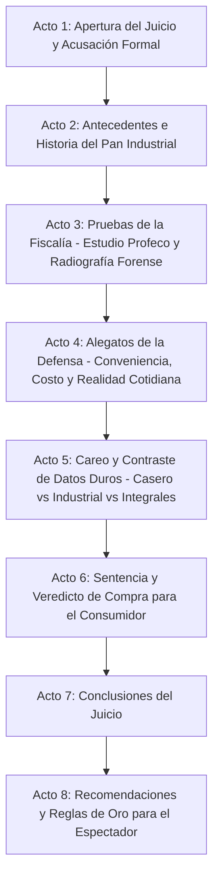
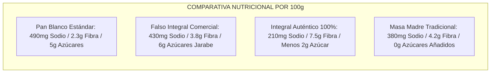

# Guion: "Pan de Caja: ¿Comida práctica o comida con aditivos sintéticos?"

**Canal de YouTube:** `@JuicioAlimentoApetecible`  
**Serie / Formato:** Juicio Alimento Apetecible / Juicio Alimento Barato  
**Género:** Drama judicial divulgativo / Ciencia de los alimentos / Debate nutricional  
**Duración estimada:** 18:00 – 22:00 minutos  

---

## Ficha Técnica de Producción

* **Acusador (Fiscalía):**  
**BETO**  
(Ingeniero bioquímico, especialista en nutrición y tecnología de alimentos.  
Viste formal con bata blanca de laboratorio).   
**BETI**  
(Joven trabajadora, madre de familia y cocinera cotidiana. Tono empático, alegre,   
perspicaz, defensora de la economía y la practicidad del hogar. Viste ropa ejecutiva  
casual moderna y amigable).
* **Ambientación:**  
Sala de tribunal judicial moderna que fusiona la solemnidad de un juzgado de madera y   
mármol con pantallas de análisis bioquímico, microscopios, tablas de mercado y una mesa  
de cocina de pruebas.
* **Estilo Audiovisual:**  
Estilo *Law & Order* / drama procesal combinado con infografía animada estilo  
*Vox/Explained*, tomas macro gastronómicas hiperrealistas y cortes dinámicos con  
humor inteligente.
* **Banda Sonora y Efectos:**  
Golpes de mazo con reverberación dramática, acordes de violonchelo tenso, transiciones  
con campana judicial baja (*gong / doink-doink*), y temas rítmicos de investigación forense.

---

# I. Resumen del Video

En este juicio culinario y científico, Beto y Beti llevan al banquillo de los acusados al  
rey indispensable de los desayunos escolares, oficinas y alacenas mexicanas: **El Pan de Caja**. 

Beto, armado con el riguroso **Estudio de Calidad de la Revista del Consumidor de la  
Profeco (abril 2024)**, normas oficiales mexicanas y bibliografía de ingeniería en  
alimentos, expone los fraudes comerciales del empaque: productos que simulan ser  
integrales o de linaza conteniendo cantidades insignificantes de semillas, marcas  
que omiten sellos obligatorios de advertencia de sodio (como Fiiller y Lecaroz),  
aditivos ultraprocesados, azúcares añadidos y harinas refinadas de rápida absorción  
que disparan picos de glucosa e insulina. 

Por su parte, Beti encabeza una defensa pragmática y empática: reivindica la  
inigualable practicidad y economía del pan de caja para quien no dispone de 14  
horas para amasar masa madre, resalta su inocuidad microbiológica industrial  
(ausencia de hongos y bacterias que arruinarían el alimento en días) y rescata  
la obligatoriedad regulatoria de fortificación con hierro, ácido fólico, zinc y  
vitaminas del complejo B. 

A través de un careo técnico y un análisis forense de marcas, el jurado  
dictamina un veredicto de compra con marcas transparentes y reglas de consumo  
para disfrutar de un sándwich sin deteriorar la salud metabólica.

---

# II. Resumen Estructurado en Actos

* **Acto 1: Apertura del juicio y acusación formal (00:00 – 02:15)**  
  Presentación del caso. Planteamiento del pan de caja como el alimento universal de la  
  rutina diaria. Acusación formal por engaño publicitario, exceso de sodio y deterioro metabólico.
* **Acto 2: Antecedentes e historia (02:15 – 05:00)**  
  El contraste entre el pan tradicional de fermentación lenta (harina, agua, levadura, sal)  
  y la revolución del Proceso de Panificación Chorleywood (1961) que dio origen al pan  
  ultraprocesado de anaquel.
* **Acto 3: Pruebas de la Fiscalía (05:00 – 09:30)**  
  Desglose del Estudio de Calidad de Profeco (abril 2024, 46 marcas analizadas).  
  Lectura de etiquetas: ingredientes fantasma (linaza al 0.5%), marcas que burlaron el sello  
  de exceso de sodio (Fiiller, Lecaroz) e impacto glucémico.
* **Acto 4: Alegatos de la Defensa (09:30 – 13:45)**  
  Beti defiende el valor organoléptico, la estabilidad higiénica contra el moho doméstico,  
  la rapidez en la vida del estudiante y trabajador, y la fortificación legal de harinas  
  con micronutrientes esenciales. Testimonio del Pan de Caja.
* **Acto 5: Careo y contraste de datos duros (13:45 – 17:30)**  
  Tablas comparativas: Masa madre artesanal vs. Pan blanco de caja vs. Pan integral comercial  
  Desmitificación de falsos integrales y análisis de sodio por rebanada.
* **Acto 6: Sentencia, veredicto de compra y veredicto final (17:30 – 19:45)**
  Dictamen no prohibitivo pero regulatorio. Clasificación de marcas del mercado: La mejor  
  integral, la más accesible y balanceada, la baja en azúcares y las que reprueban por engaño.
* **Acto 7: Conclusiones del juicio (19:45 – 20:50)**  
  Resumen de los hechos comprobados y gráficos de la sentencia en pantalla.
* **Acto 8: Recomendaciones para el espectador (20:50 – 22:00)**  
  Guía práctica en 4 pasos para seleccionar el pan ideal en el supermercado y combinarlo  
  para amortiguar el pico de glucosa.

---

# III. Escaleta Estructurada en Actos / Escenas

| Acto | Escena | Nombre / Descripción | Duración Estimada |
| :--- | :--- | :--- | :--- |
| **Acto 1** | Escena 1 | Gancho visual: El sándwich perfecto y el golpe de mazo | 00:00 – 00:45 |
| | Escena 2 | Lectura formal de la acusación de la Fiscalía (Beto) | 00:45 – 01:35 |
| | Escena 3 | Intervención inicial de la Defensa (Beti) y entrada del Pan de Caja | 01:35 – 02:15 |
| **Acto 2** | Escena 4 | La fórmula ancestral de la panadería artesanal | 02:15 – 03:30 |
| | Escena 5 | El método Chorleywood y la química del pan que nunca envejece | 03:30 – 05:00 |
| **Acto 3** | Escena 6 | Radiografía Profeco 2024: 46 marcas bajo la lupa | 05:00 – 06:45 |
| | Escena 7 | Las trampas del etiquetado: El falso integral y la linaza invisible | 06:45 – 08:15 |
| | Escena 8 | El sodio oculto y las marcas sin sellos obligatorios | 08:15 – 09:30 |
| **Acto 4** | Escena 9 | La realidad del consumidor: Tiempo, dinero y desayunos escolares | 09:30 – 11:15 |
| | Escena 10 | Inocuidad industrial vs. La descomposición del pan rústico | 11:15 – 12:30 |
| | Escena 11 | El testimonio del Pan de Caja en el estrado | 12:30 – 13:45 |
| **Acto 5** | Escena 12 | Tabla frontal: Artesanal vs. Blanco vs. Integral vs. Multigrano | 13:45 – 15:30 |
| | Escena 13 | Desmitificando el pan: El índice glucémico y la fortificación oficial | 15:30 – 17:30 |
| **Acto 6** | Escena 14 | Veredicto de compra: Las marcas recomendadas y las reprobadas | 17:30 – 19:45 |
| **Acto 7** | Escena 15 | Conclusiones del juicio y gráfico de sentencia | 19:45 – 20:50 |
| **Acto 8** | Escena 16 | Alertas de salud, tips de supermercado y despedida | 20:50 – 22:00 |

---

# IV. Convención del Guion Técnico

* **[PLANO]:** 
  * `PG`: Plano General (contexto del tribunal y bancadas).
  * `PM`: Plano Medio (personaje de cintura para arriba).
  * `PP`: Primer Plano (rostro y expresión emocional/enfática).
  * `PD`: Primer Detalle (etiqueta, textura del pan, mazo, ingrediente microscópico).
* **[CÁMARA]:** Movimiento de cámara (Paneo, Travelling, Tilt up/down, Zoom in/out, Slider frontal).
* **[ILUMINACIÓN]:** Esquema lumínico (Cálida cocina, Cenital dramático, Luz fría forense, Alto contraste).
* **[AUDIO / SFX / MÚSICA]:** Efectos de sala (foley), música incidental, pausas dramáticas y silencios técnicos.
* **[GRÁFICOS]:** Elementos en pantalla (Lower-thirds, infografías animadas, B-Roll, citas de leyes/estudios).

---

# V. Guion Técnico Profesional Muy Detallado

### ACTO 1: APERTURA DEL JUICIO Y ACUSACIÓN FORMAL (00:00 – 02:15)

#### Escena 1 (00:00 – 00:45) — Gancho Visual e Introducción
* **Plano / Visual:** [PD] a 60 fps en cámara lenta: Una tostadora dispara dos rebanadas de pan de caja doradas. Un cuchillo corta en diagonal un sándwich con jamón, queso derretido y aguacate; la miga esponjosa se comprime suavemente y vuelve a inflarse. Corte rápido a una rebanada de pan aplastada en una balanza de precisión.
* **Cámara / Movimiento:** Slider lateral fluido con macroenfoque; corte de montaje rápido con zoom-in digital agresivo hacia el mazo judicial sobre el estrado.
* **Iluminación / Filtros:** Luz cálida de apetito gastronómico (3200K) que cambia bruscamente a luz fría judicial de alta tensión (5600K) con sombras marcadas.
* **Audio / SFX / Música:** Sonido crujiente del pan al tostarse y cortarse (*crunch*). De inmediato, un seco y potente golpe de mazo judicial con eco en el tribunal (*BOOM*). Entra tema musical de tensión dramática en cuerdas graves y sintetizador procesal.
* **Texto en Pantalla / Gráficos / Animaciones:** Título animado en tipografía metálica: *"CASO Nº 46: JUICIO AL PAN DE CAJA: ¿HERRAMIENTA NUTRICIONAL O ENGAÑO DE HARINA BLANCA?"*.

#### Escena 2 (00:45 – 01:35) — La Acusación de la Fiscalía
* **Plano / Visual:** [PM] de Beto de pie junto al estrado de la fiscalía. Trae carpetas oficiales y una tableta de laboratorio. Pasa a [PP] de Beto mirando fijamente a la cámara con expresión firme y ceño serio.
* **Cámara / Movimiento:** Travelling lento frontal (Dolly-in) cerrando el plano sobre el rostro de Beto para enfatizar la autoridad del argumento.
* **Iluminación / Filtros:** Tono sobrio, luz lateral suave con reflector plateado; aspecto formal y pulcro.
* **Audio / SFX / Música:** Sonido de hojas de expediente abriéndose. La música de fondo mantiene un pulso rítmico de reloj (*tick-tock* electrónico de investigación).
* **Texto en Pantalla / Gráficos / Animaciones:** Lower third: *"BETO — Ingeniero Bioquímico / Fiscalía de Alimentos"*. Gráfico lateral flotante: Icono de advertencia *"CARGOS: Publicidad Engañosa, Sodio Oculto, Desbalance Glucémico"*.

#### Escena 3 (01:35 – 02:15) — La Defensa y el Acusado en el Estrado
* **Plano / Visual:** [PG] del tribunal mostrando la mesa de la defensa donde Beti sonríe con seguridad, y en el banco de testigos, bajo un foco cenital, una bolsa de pan de caja blanco con corbatín rojo.
* **Cámara / Movimiento:** Paneo rápido de izquierda a derecha (Whip pan) desde la mesa de Beto hacia la mesa de Beti, terminando en [PP] del empaque de pan.
* **Iluminación / Filtros:** Luz cenital dirigida sobre la bolsa de pan; luz ambiental cálida sobre Beti para proyectar empatía y cercanía.
* **Audio / SFX / Música:** Golpe seco de campana grave judicial (*Doink-Doink*). Música transiciona a un tono más vivaz y cotidiano con guitarra acústica ligera debajo de la base de cuerdas.
* **Texto en Pantalla / Gráficos / Animaciones:** Lower third: *"BETI — Defensora del Consumidor Cotidiano"*. Placa de identificación sobre el banquillo: *"ACUSADO: Pan Blanco / Integral de Caja"*.

---

### ACTO 2: ANTECEDENTES E HISTORIA (02:15 – 05:00)

#### Escena 4 (02:15 – 03:30) — La Fórmula Ancestral vs. La Necesidad Moderna
* **Plano / Visual:** [PM] de Beto caminando hacia una mesa auxiliar con un cuenco rústico de barro que contiene masa madre burbujeante y hogazas de pan de corteza dura y crujiente.
* **Cámara / Movimiento:** Travelling circular (orbit) de 180 grados alrededor de la mesa de ingredientes naturales.
* **Iluminación / Filtros:** Filtro sepia cálido / estética artesanal europea tradicional.
* **Audio / SFX / Música:** Música ambiental de violín clásico suave. Sonido foley de crujido de corteza de pan rústico al romperse con las manos.
* **Texto en Pantalla / Gráficos / Animaciones:** Animación en pizarra gráfica: *"PAN TRADICIONAL = Harina de trigo + Agua + Levadura / Masa Madre + Sal. Fermentación: 12 a 24 horas"*.

#### Escena 5 (03:30 – 05:00) — El Proceso Chorleywood y la Química del Anaquel
* **Plano / Visual:** [PP] de Beto sosteniendo una rebanada de pan de caja industrial y estrujándola en su puño para mostrar cómo recupera su forma sin desmoronarse. Corte a [PD] de un laboratorio mostrando probetas con emulsificantes y conservadores.
* **Cámara / Movimiento:** Zoom-in digital progresivo a la estructura microscópica simulada de la miga.
* **Iluminación / Filtros:** Luz fría azulada de laboratorio (estética química analítica).
* **Audio / SFX / Música:** Sonido de maquinaria industrial pesada y pitido de advertencia. La música sube en intensidad dramática con sintetizadores oscuros.
* **Texto en Pantalla / Gráficos / Animaciones:** Infografía 2D interactiva: *"1961: Proceso Chorleywood (CBP). Fermentación acelerada por batido mecánico ultrarrápido + Aditivos (DATEM, Mono y diglicéridos, Propionato de calcio, Enzimas amilasas)"*.

---

### ACTO 3: PRUEBAS DE LA FISCALÍA (05:00 – 09:30)

#### Escena 6 (05:00 – 06:45) — El Expediente Profeco 2024
* **Plano / Visual:** [PM] de Beto arrojando con fuerza un tomo sobre el escritorio del tribunal: La portada oficial de la *Revista del Consumidor de Profeco (Edición Abril 2024)*.
* **Cámara / Movimiento:** Plano cenital (Top-down view) de la mesa con los documentos, seguido de un corte a [PP] de Beto señalando las tablas comparativas.
* **Iluminación / Filtros:** Luz blanca neutra de alta fidelidad, simulando una mesa de peritaje criminalístico.
* **Audio / SFX / Música:** Sonido estruendoso de libro golpeando la mesa (*thud*). Efecto de sonido digital de escáner (*beep-beep*).
* **Texto en Pantalla / Gráficos / Animaciones:** Gráfico animado que despliega: *"ESTUDIO PROFECO ABRIL 2024 — 46 MARCAS ANALIZADAS: Pan blanco, integral, multigrano, linaza, masa madre y cero azúcar"*.

#### Escena 7 (06:45 – 08:15) — El Fraude del "Falso Integral" y la Linaza Fantasma
* **Plano / Visual:** [PD] de dos empaques comerciales con lupa de aumento: Se lee "Pan con Linaza" al frente, pero en la lista de ingredientes trasera se resalta "Linaza: 0.8%".
* **Cámara / Movimiento:** Paneo milimétrico sobre la lista de ingredientes con efecto de desenfoque en el resto del texto.
* **Iluminación / Filtros:** Spotlight rojo de alerta sobre el porcentaje engañoso de ingredientes.
* **Audio / SFX / Música:** Alarma sonora de error (*buzzer* de reprobación). Música de tensión con bajo pulsante.
* **Texto en Pantalla / Gráficos / Animaciones:** Sello animado en rojo con tipografía de caucho: *"PUBLICIDAD ENGAÑOSA / INGREDIENTE MINORITARIO"*.

#### Escena 8 (08:15 – 09:30) — El Sodio Oculto y las Marcas sin Sellos Obligatorios
* **Plano / Visual:** [PM] de Beto mostrando en la pantalla principal del juzgado las marcas señaladas en el estudio por omitir sellos de advertencia obligatorios de la NOM-051.
* **Cámara / Movimiento:** Paneo lateral de seguimiento mientras Beto camina frente a la pantalla interactiva.
* **Iluminación / Filtros:** Contraste elevado, iluminación de pantalla que baña a Beto en luz blanca.
* **Audio / SFX / Música:** Sonido de alerta médica de monitor cardíaco (*beep... beep... beep...* acelerándose).
* **Texto en Pantalla / Gráficos / Animaciones:** Tarjetas rojas con los nombres de marcas observadas: *"MARCAS CON SELLOS OMITIDOS DE EXCESO DE SODIO: Fiiller, Lecaroz, Panes de masa madre industrializados sin advertencia"*.

---

### ACTO 4: ALEGATOS DE LA DEFENSA (09:30 – 13:45)

#### Escena 9 (09:30 – 11:15) — La Realidad del Consumidor y la Practicidad
* **Plano / Visual:** [PM] de Beti levantándose de su bancada con una sonrisa serena y un cronómetro en la mano.
* **Cámara / Movimiento:** Travelling lateral acompañando el paso decidido de Beti hacia el centro de la sala.
* **Iluminación / Filtros:** Tono cálido, amigable, iluminación de hogar con luz dorada lateral.
* **Audio / SFX / Música:** La música cambia a un ritmo fresco de funk ligero o comedia dramática con bajo melódico.
* **Texto en Pantalla / Gráficos / Animaciones:** Cronómetro gigante en pantalla que corre de 00:00 a 02:00: *"PREPARAR UN SÁNDWICH = 120 SEGUNDOS. HORNEAR PAN CASERO = 14 HORAS"*.

#### Escena 10 (11:15 – 12:30) — Inocuidad Industrial y la Ley de Fortificación
* **Plano / Visual:** [PP] de Beti sosteniendo una bolsa de pan de caja sellada y mostrando la tabla de vitaminas y minerales; corte a [PD] de pan artesanal con colonias verdes de moho tras 4 días a temperatura ambiente.
* **Cámara / Movimiento:** Plano dividido (Split-screen) con zoom simultáneo a ambos panes.
* **Iluminación / Filtros:** Luz neutra con resalte en la etiqueta de nutrientes.
* **Audio / SFX / Música:** Acorde alegre de piano que transmite tranquilidad y seguridad alimentaria.
* **Texto en Pantalla / Gráficos / Animaciones:** Tabla de micronutrientes: *"FORTIFICACIÓN OBLIGATORIA EN MÉXICO (NOM-247-SSA1): Hierro biodisponible, Ácido fólico (previene defectos del tubo neural), Tiamina (B1), Riboflavina (B2), Niacina (B3) y Zinc"*.

#### Escena 11 (12:30 – 13:45) — El Testimonio del Pan de Caja
* **Plano / Visual:** [PP] cerrado del Pan de Caja en el estrado de testigos. Se aplica una sutil animación facial tipo *talking-head* o iluminación teatral directa.
* **Cámara / Movimiento:** Contrapicado dramático simulando que el pan habla directamente al jurado.
* **Iluminación / Filtros:** Haz de luz cenital con partículas de polvo flotando en ambiente teatral.
* **Audio / SFX / Música:** Voz en off con filtro acústico ligeramente amortiguado (voz simpática, hogareña y un poco angustiada).
* **Texto en Pantalla / Gráficos / Animaciones:** Subtítulos estilizados en la parte inferior: *"DECLARACIÓN DEL ACUSADO: Yo alimento a millones de mochilas todos los días"*.

---

### ACTO 5: CAREO Y CONTRASTE DE DATOS DUROS (13:45 – 17:30)

#### Escena 12 (13:45 – 15:30) — Tabla Frontal: El Análisis Químico Comparativo
* **Plano / Visual:** [PG] de Beto y Beti de pie frente a frente ante la gran pantalla central interactiva del tribunal.
* **Cámara / Movimiento:** Cámara lenta con paneos alternados y cortes rápidos al ritmo de las réplicas verbales.
* **Iluminación / Filtros:** Tono de debate televisivo, iluminación frontal intensa y fondo oscuro.
* **Audio / SFX / Música:** Duelo musical de violines staccato y percusión electrónica tensa.
* **Texto en Pantalla / Gráficos / Animaciones:** Tabla comparativa interactiva que se llena dinámicamente con datos por 100g de producto (Sodio, Fibra, Azúcar, Calorías, Vida de anaquel).

#### Escena 13 (15:30 – 17:30) — Desmitificación del Índice Glucémico y la Porción Real
* **Plano / Visual:** [PM] de Beto mostrando un gráfico de curva glucémica en sangre, seguido de [PM] de Beti colocando aguacate, jitomate y huevo cocido sobre la rebanada de pan.
* **Cámara / Movimiento:** Plano detalle cenital de la preparación del sándwich balanceado que amortigua la absorción de glucosa.
* **Iluminación / Filtros:** Luz de cocina moderna, alta saturación de los colores vivos de los vegetales.
* **Audio / SFX / Música:** SFX de chasquido de dedos al derribar mitos. Música de descubrimiento científico optimista.
* **Texto en Pantalla / Gráficos / Animaciones:** Gráfico animado de respuesta insulínica: *"Pan blanco solo (Pico de glucosa rápido) vs. Pan con grasa saludable + proteína + fibra (Curva glucémica aplanada y saciedad prolongada)"*.

---

### ACTO 6: SENTENCIA Y VEREDICTO DE COMPRA (17:30 – 19:45)

#### Escena 14 (17:30 – 19:45) — El Veredicto de Compra para el Consumidor
* **Plano / Visual:** [PG] del tribunal donde Beto y Beti se colocan juntos en el estrado del juez para dictar sentencia conjunta.
* **Cámara / Movimiento:** Travelling frontal lento que se abre a plano general majestuoso con el mazo en primer término.
* **Iluminación / Filtros:** Iluminación solemne dorada y azul cobalto de fallo judicial definitivo.
* **Audio / SFX / Música:** Golpes dobles de mazo judicial (*BOOM - BOOM*). Fanfarria solemne y conclusiva de cuerdas y metales.
* **Texto en Pantalla / Gráficos / Animaciones:** Galería interactiva con fotos de empaques clasificados en semáforo de compra: *"VEREDICTO PROFECO Y GUÍA DE COMPRA 2024"*.

---

### ACTO 7: CONCLUSIONES DEL JUICIO (19:45 – 20:50)

#### Escena 15 (19:45 – 20:50) — Resumen de los Hechos Comprobados
* **Plano / Visual:** [PM] de Beto y Beti alternando líneas mirando a cámara, con una pizarra gráfica de fondo donde se sellan los puntos clave del juicio.
* **Cámara / Movimiento:** Movimiento de cámara en paneo continuo deslizante (slider) de izquierda a derecha.
* **Iluminación / Filtros:** Luz brillante de programa educativo estelar.
* **Audio / SFX / Música:** Música alegre, ritmos electrónicos ligeros y dinámicos de divulgación científica.
* **Texto en Pantalla / Gráficos / Animaciones:** Tarjetas animadas con sellos de verificación: *"1. El pan blanco no es veneno, pero es energía rápida", "2. Lee que el primer ingrediente sea Harina Integral", "3. Cuidado con el sodio acumulativo"*.

---

### ACTO 8: RECOMENDACIONES PARA EL ESPECTADOR (20:50 – 22:00)

#### Escena 16 (20:50 – 22:00) — Alertas de Salud, Reglas de Oro y Cierre
* **Plano / Visual:** [PP] de Beto con bata señalando los 4 mandamientos del supermercado, seguido de [PP] de Beti despidiendo al público con un sándwich nutritivo en la mano.
* **Cámara / Movimiento:** Zoom-out suave hacia plano general de despedida, con los créditos y llamadas a la acción flotando alrededor de los presentadores.
* **Iluminación / Filtros:** Luz cálida y acogedora de cierre.
* **Audio / SFX / Música:** Tema principal del canal `@JuicioAlimentoApetecible` a volumen pleno. Sonido de campana para invitar a suscribirse (*ding*).
* **Texto en Pantalla / Gráficos / Animaciones:** Botones animados de *"SUSCRÍBETE"*, *"DEJA TU COMENTARIO: ¿Qué marca usas tú?"* y recuadro con el próximo episodio: *"Próximo Juicio: El Cereal de Caja"*.

---

# VI. Guion Literario Profesional Detallado

### ACTO 1: APERTURA DEL JUICIO Y ACUSACIÓN FORMAL (00:00 – 02:15)

**BETO:**
*(De pie, acomodándose los lentes, mirando con severidad a la cámara. Tono formal, firme y científico)*
En este tribunal hemos visto desfilar a delincuentes gastronómicos de toda clase. Pero el acusado que tenemos hoy en el banquillo no se esconde en un callejón oscuro ni en un puesto callejero sospechoso: está en el centro de tu cocina. Vive dentro de una bolsa de plástico con alambre de torsión, acompaña el desayuno de tus hijos, el almuerzo de la oficina y la cena apresurada de medianoche. 

*(Beto se acerca lentamente al banquillo de los acusados, donde descansa la bolsa de pan de caja)*
Señoras y señores del jurado, hoy llamamos a juicio al **Pan de Caja**. La fiscalía formula una acusación formal por tres cargos graves: **Primero**, publicidad engañosa al vender panes que se autoproclaman "integrales", "multigrano" o "de linaza", cuando en realidad están compuestos en más de un 80% por harina refinada y jarabes. **Segundo**, ocultamiento deliberado de sodio, burlándose de las normas de etiquetado. Y **tercero**, provocar una montaña rusa metabólica de glucosa e insulina en millones de personas que creen estar desayunando saludablemente.

**BETI:**
*(Interrumpe poniéndose de pie con energía, sonriendo con calidez y seguridad)*
¡Objeción categórica, señoría! La fiscalía inicia este juicio como siempre: con dramatismo de laboratorio. Beto nos habla como si todos tuviéramos un molino de piedra y diez horas libres al día para amasar trigo orgánico. El pan de caja no es ningún criminal; es el salvavidas de la familia trabajadora, el comodín económico de los estudiantes y el único alimento que sobrevive en la alacena sin llenarse de hongos al tercer día. ¡Declaro la total inocencia de nuestro invitado!

---

### ACTO 2: ANTECEDENTES E HISTORIA (02:15 – 05:00)

**BETO:**
*(Caminando hacia la mesa de demostración histórica)*
Para entender el crimen del presente, debemos honrar la nobleza del pasado. Durante más de diez mil años, el pan de la humanidad se componía únicamente de cuatro ingredientes elementales: harina de trigo, agua, sal y un ecosistema vivo de levaduras y bacterias lácticas conocido como masa madre. La fermentación era un proceso lento, de doce a veinticuatro horas. Los microorganismos predigerían el gluten, degradaban los fitatos y permitían que los minerales del grano fueran asimilables para el intestino humano.

**BETI:**
*(Cruzándose de brazos, con ironía divertida)*
Sí, muy poético, Beto. Pero ese pan ancestral tenía un pequeño defecto para la vida moderna: a las veinticuatro horas parecía un ladrillo de construcción y a los tres días ya era un cultivo biológico de moho verde. ¿Cómo resolvía eso una madre que necesita empacar cinco almuerzos escolares a las seis de la mañana?

**BETO:**
*(Asiente reconociendo el punto histórico)*
La industria británica se hizo exactamente la misma pregunta en 1961. Y ahí nació el llamado **Proceso de Panificación Chorleywood**. La industria descubrió que si sometían la masa a un batido mecánico ultra violento a alta presión, podían reducir el tiempo de fermentación de doce horas a escasos tres minutos. Pero como una masa forzada no tiene estructura ni sabor natural, tuvieron que añadir una batería química: emulsionantes como el DATEM, agentes oxidantes, enzimas recombinantes, propionato de calcio para evitar el moho y una sobredosis de azúcares y grasas vegetales para mantener la miga eternamente blanda. El pan dejó de ser un alimento fermentado y se convirtió en una esponja química industrial.

---

### ACTO 3: PRUEBAS DE LA FISCALÍA (05:00 – 09:30)

**BETO:**
*(Coloca la Revista del Consumidor con firmeza sobre el estrado)*
Pasemos a las pruebas periciales irrefutables. La Procuraduría Federal del Consumidor, Profeco, publicó en abril de 2024 un exhaustivo estudio donde analizó **46 productos de pan de caja comercializados en México**: blancos, integrales, multigrano, con linaza, masa madre y opciones sin azúcar. Y los hallazgos son un escándalo de transparencia comercial.

*(Beto despliega los gráficos forenses en la pantalla gigante)*
**Prueba Número Uno: El engaño del ingrediente milagro.** El estudio descubrió que marcas que colocan en letras gigantes la leyenda *"Pan con Linaza"* o *"Pan Multigrano"*, relegan esas semillas milagrosas a los últimos lugares de la lista de ingredientes. Encontramos productos donde la linaza representaba apenas el 0.8% del contenido total. ¡Te cobran un sobreprecio gourmet por una cucharadita de semillas espolvoreada sobre una masa de harina blanca común!

**BETI:**
*(Moviendo la cabeza, atenta pero escéptica)*
Bueno, pero la lista de ingredientes está atrás. El que sabe leer, lo ve.

**BETO:**
*(Elevando el tono con seriedad)*
El problema, Beti, es cuando violan la ley para que no lo veas. **Prueba Número Dos: La evasión de sellos.** Profeco detectó que marcas comerciales como *Fiiller* y ciertas líneas de panadería empacada como *Lecaroz* **rebasaron los límites permitidos de sodio y omitieron colocar el sello negro de advertencia "EXCESO DE SODIO"**. Una sola porción de dos rebanadas de ciertos panes de caja puede aportarle al consumidor hasta 450 miligramos de sodio, es decir, ¡casi la cuarta parte del límite máximo diario recomendado por la Organización Mundial de la Salud para un adulto! Y todo esto en un producto que el consumidor percibe como dulce o neutro.

*(Beto señala un gráfico de impacto metabólico)*
**Prueba Número Tres: El colapso del índice glucémico.** La harina de trigo refinada del pan blanco de caja tiene un índice glucémico superior a 70, equiparable al del azúcar de mesa. Al no tener la fibra del salvado, el almidón se descompone en glucosa pura en minutos, provocando un pico brutal de insulina en sangre, seguido de una hipoglucemia reactiva que a las dos horas te deja con hambre voraz, letargo y fatiga.

---

### ACTO 4: ALEGATOS DE LA DEFENSA (09:30 – 13:45)

**BETI:**
*(Avanza al estrado, mirando de frente al jurado con convicción y calidez)*
Escucharon a la fiscalía hablar de picos de insulina y procesos británicos de 1961. Ahora escuchemos la voz de la realidad. Beto, tú analizas el pan como si la gente se comiera dos rebanadas de pan seco solas en una cápsula aislada en el espacio. ¡Nadie come pan de caja solo! El pan de caja es una estructura, un vehículo culinario. En ese pan colocamos aguacate con grasas monoinsaturadas, jitomate con licopeno, huevo con colina y proteína de alto valor biológico, o una lata de atún accesible. Cuando combinas el pan con proteína, fibra y grasa, la velocidad de absorción se frena por completo y el famoso pico glucémico se neutraliza.

*(Beti toma una bolsa sellada de pan)*
Además, hablemos de salud pública elemental. ¿Saben qué enferma a más personas en países en desarrollo? Las intoxicaciones por alimentos contaminados. El pan de caja industrial ofrece una garantía absoluta de **inocuidad microbiológica**. Viene empacado, sellado y pasteurizado. Una persona de escasos recursos o un joven que vive solo puede comprar un paquete por 35 o 40 pesos y asegurar diez días de desayunos limpios y seguros.

*(Beti señala la norma oficial)*
Y un dato que la fiscalía "olvidó" mencionar: Por disposición de la **Norma Oficial Mexicana NOM-247-SSA1**, toda la harina de trigo utilizada en el pan de caja en México está obligatoriamente **fortificada con hierro biodisponible, zinc, tiamina, riboflavina, niacina y ácido fólico**. Gracias a este pan fortificado, se han reducido históricamente en nuestro país miles de casos de anemia ferropénica y defectos del tubo neural en recién nacidos. ¡El pan de caja también ha sido una herramienta de nutrición comunitaria!

**EL PAN DE CAJA (ACUSADO):**
*(Con voz tímida pero sentida desde el banquillo de los acusados)*
Yo solo quiero decir una cosa... Cuando no hay tiempo de cocinar, cuando el refrigerador está casi vacío antes de la quincena, ahí estoy yo. Aguanto en la alacena, no exijo refrigeración y nunca le niego un sándwich a nadie. ¿De verdad merezco ser condenado?

---

### ACTO 5: CAREO Y CONTRASTE DE DATOS DUROS (13:45 – 17:30)

**BETO:**
*(Se acerca al centro de la sala, colocándose frente a Beti)*
Nadie niega tu nobleza histórica ni la utilidad de la fortificación, amigo Pan. Pero no podemos permitir que la industria abuse de esa confianza vendiendo gato por liebre. Pongamos los datos duros sobre la mesa.

*(Beto y Beti interactúan directamente)*
**BETO:** Beti, mira la tabla del estudio. Muchos panes etiquetados como "Integrales" tienen más azúcar añadida que el propio pan blanco para enmascarar el sabor amargo del salvado. ¿Eso te parece justo para un consumidor diabético o hipertenso que compra el empaque café creyendo que se cuida?
**BETI:** En eso te doy toda la razón, Beto: la trampa del falso integral es indignante. Pero no metas a todas las marcas en el mismo costal. El mismo estudio de Profeco demostró que sí existen opciones limpias y accesibles.
**BETO:** Correcto. Por ejemplo, el análisis reconoció que productos como **Bimbo Cero Cero Integral** tuvieron de los niveles más bajos de sodio y cero azúcares añadidos. Y en la categoría de pan blanco accesible, marcas de tienda como **Member's Mark** o **Great Value** demostraron un balance de sodio mucho más controlado y transparente que marcas de supuesta alta gama.
**BETI:** ¡Exacto! Y para quien busca opciones con menor carga de azúcares simples, productos como **Canadian Bagels** salieron con calificaciones sobresalientes en el laboratorio de Profeco. Entonces el problema no es el pan de caja, sino la falta de educación para elegir el empaque correcto.

---

### ACTO 6: SENTENCIA Y VEREDICTO DE COMPRA (17:30 – 19:45)

**BETO:**
*(Toma el mazo judicial y mira a la cámara con tono conciliador pero enérgico)*
Habiendo escuchado a la fiscalía y a la defensa, este tribunal emite su **Sentencia y Veredicto Final**.

El Pan de Caja queda **ABSUELTO del cargo de veneno culinario**, reconociendo su valor insustituible en accesibilidad, fortificación e inocuidad. Sin embargo, queda **CONDENADO por engaño al consumidor en sus versiones ultraprocesadas y omisión de advertencias sanitarias**.

**BETI:**
*(Presenta las tablas del veredicto de compra)*
Por lo tanto, dictamos la siguiente **Guía Oficial de Compra para el Consumidor**:

* **LA OPCIÓN INTEGRAL DESTACADA:** Panes que acrediten harina de grano entero como primer ingrediente y bajo sodio (ejemplo: *Bimbo Cero Cero Integral*).
* **LA OPCIÓN BUENA, BONITA Y BARATA EN PAN BLANCO:** Marcas de autoservicio que respetan límites de sodio sin sobreprecios artificiales (ejemplo: *Great Value* o *Member's Mark*).
* **LA OPCIÓN CONTROL DE AZÚCAR:** Panes que prescindan de jarabe de maíz de alta fructosa (ejemplo: *Canadian Bagels*).
* **LAS MARCAS EN CAPILLA Y REPROBADAS:** Aquellas señaladas por Profeco con sellos omitidos o linaza insignificante (*Fiiller*, *Lecaroz* con omisión de advertencias). ¡Revisa siempre la parte posterior antes de meterlo al carrito!

---

### ACTO 7: CONCLUSIONES DEL JUICIO (19:45 – 20:50)

**BETO:**
*(Concluyendo frente a la pizarra digital)*
En resumen: El pan blanco industrial es una fuente de carbohidratos refinados de rápida asimilación. Consumirlo solo o en exceso favorece la ganancia de grasa visceral y el descontrol de la glucosa.

**BETI:**
*(Sonriendo)*
Pero consumido con criterio, dentro de un sándwich con proteína y vegetales, es una herramienta práctica, segura y económica que te permite resolver una comida completa en menos de tres minutos.

---

### ACTO 8: RECOMENDACIONES PARA EL ESPECTADOR (20:50 – 22:00)

**BETO:**
*(Mirando a cámara, tono cercano)*
Aquí tienes las **4 Reglas de Oro** para tu próxima visita al supermercado:
1. **La Regla del Primer Ingrediente:** Voltea el empaque. Si el primer ingrediente dice *"Harina de trigo reconstituida"* o *"Harina de trigo fortificada"*, es pan blanco pintado. Debe decir explícitamente: *"Harina de trigo integral"* o *"Grano entero"*.
2. **Revisa los gramos de fibra:** Un pan verdaderamente integral debe aportar al menos **3 gramos de fibra dietética por rebanada**. Si aporta 1 gramo o menos, es una simulación.
3. **Controla el Sodio:** Busca que dos rebanadas no superen los **250 mg de sodio** combinados.
4. **Vístelo Siempre:** Nunca comas la rebanada sola. Agrega huevo, frijoles refritos caseros, aguacate, queso panela o verduras para ralentizar la absorción de glucosa.

**BETI:**
*(Sosteniendo un sándwich apetitoso)*
¡El conocimiento es poder en tu mesa! Cuéntanos en los comentarios: ¿Cuál es tu marca favorita de pan de caja y cómo preparas tu sándwich ideal? ¡No olvides suscribirte, activar la campanita y nos vemos en el próximo Juicio Alimento Apetecible!

---

# VII. Guion Fusionado Profesional (Técnico + Literario)

*(Integración secuencial escena por escena con códigos de cámara, audio, visual y diálogos de los actores)*

### ESCENA 1 (00:00 – 00:45)
* **[PLANO]:** [PD] Cámara lenta a 60 fps: Tostadora expulsando dos rebanadas de pan crujientes; cuchillo rebanando un sándwich desbordante de aguacate y queso.
* **[ILUMINACIÓN]:** Luz cálida gastronómica (3200K) que cambia de golpe a luz fría judicial (5600K).
* **[AUDIO]:** *Crunch* crujiente de pan, seguido de un golpe seco de mazo judicial (*BOOM*) y acorde de violonchelos tensos.
* **[GRÁFICOS]:** Título animado: *"CASO Nº 46: JUICIO AL PAN DE CAJA"*.
* **BETO (VOZ EN OFF):** En este tribunal hemos visto desfilar a delincuentes de toda clase. Pero el acusado de hoy vive en el centro de tu cocina...

### ESCENA 2 (00:45 – 01:35)
* **[PLANO]:** [PM] a [PP] de Beto caminando con paso firme en la sala del tribunal.
* **[CÁMARA]:** Dolly-in frontal lento cerrando el plano.
* **[AUDIO]:** Pulso de reloj rítmico (*tick-tock* de investigación).
* **[GRÁFICOS]:** Lower third: *"BETO — Fiscalía de Alimentos"*.
* **BETO:** Señoras y señores del jurado, hoy llamamos a juicio al Pan de Caja por tres cargos graves: publicidad engañosa con falsos integrales, ocultamiento deliberado de sodio y provocar una montaña rusa metabólica en millones de personas.

### ESCENA 3 (01:35 – 02:15)
* **[PLANO]:** [PG] del tribunal mostrando a Beti sonriente y la bolsa de pan en el banquillo bajo luz cenital.
* **[CÁMARA]:** Whip pan dinámico hacia la bancada de la defensa.
* **[AUDIO]:** Sonido judicial (*Doink-Doink*). Base rítmica ligera con guitarra acústica.
* **[GRÁFICOS]:** Lower third: *"BETI — Defensora del Consumidor Cotidiano"*.
* **BETI:** ¡Objeción categórica! El pan de caja no es ningún criminal; es el salvavidas de la familia trabajadora, el comodín económico de los estudiantes y el rey de la alacena. ¡Declaro la total inocencia de nuestro invitado!

### ESCENA 4 (02:15 – 03:30)
* **[PLANO]:** [PM] de Beto mostrando masa madre burbujeante en cuenco de barro.
* **[ILUMINACIÓN]:** Tono sepia y cálido artesanal.
* **[AUDIO]:** Violín clásico y sonido foley de corteza rústica crujiendo.
* **[GRÁFICOS]:** Diagrama: *"PAN ANCESTRAL = Harina + Agua + Masa Madre + Sal (12 a 24 hrs fermentación)"*.
* **BETO:** Durante miles de años, el pan requería solo cuatro ingredientes elementales y fermentación lenta que predigería el gluten y liberaba nutrientes.
* **BETI:** Sí, Beto, ¡pero a los tres días ya parecía piedra y se llenaba de hongos verdes!

### ESCENA 5 (03:30 – 05:00)
* **[PLANO]:** [PP] de Beto estrujando la rebanada elástica de pan de caja; corte a [PD] de aditivos industriales.
* **[CÁMARA]:** Zoom digital al interior microscópico de la miga.
* **[AUDIO]:** Zumbido de maquinaria industrial y sintetizador oscuro.
* **[GRÁFICOS]:** Infografía: *"Proceso Chorleywood (1961) — Fermentación en 3 minutos + Emulsionantes + Conservadores"*.
* **BETO:** En 1961 crearon el Proceso Chorleywood: batido violento a presión y aditivos químicos para sustituir el tiempo de fermentación. El pan dejó de ser un alimento vivo y se convirtió en una esponja química industrial.

### ESCENA 6 (05:00 – 06:45)
* **[PLANO]:** [PM] de Beto azotando la Revista del Consumidor de Profeco de abril 2024.
* **[ILUMINACIÓN]:** Luz fría de peritaje criminalístico.
* **[AUDIO]:** Golpe sordo sobre la mesa (*thud*) y escáner digital.
* **[GRÁFICOS]:** *"ESTUDIO PROFECO ABRIL 2024: 46 MARCAS ANALIZADAS"*.
* **BETO:** ¡Las pruebas periciales de Profeco son contundentes! Analizaron 46 marcas comerciales y los fraudes al consumidor quedaron al descubierto.

### ESCENA 7 (06:45 – 08:15)
* **[PLANO]:** [PD] de etiqueta comercial con lupa: "Linaza 0.8%".
* **[AUDIO]:** *Buzzer* de reprobación y alarma de error.
* **[GRÁFICOS]:** Sello rojo animado: *"PUBLICIDAD ENGAÑOSA / INGREDIENTE MINORITARIO"*.
* **BETO:** Te venden un empaque que dice "Pan con Linaza" o "Multigrano", ¡y al ver los ingredientes la linaza no llega ni al 1%! Es un sobreprecio descarado.

### ESCENA 8 (08:15 – 09:30)
* **[PLANO]:** [PM] de Beto señalando las marcas infractoras en la pantalla central.
* **[AUDIO]:** Monitor cardíaco acelerándose (*beep... beep...*).
* **[GRÁFICOS]:** Alerta: *"Fiiller, Lecaroz — Exceso de sodio no declarado en el empaque"*.
* **BETO:** Marcas como Fiiller y Lecaroz rebasaron límites de sodio y omitieron los sellos negros obligatorios. Dos rebanadas pueden meterte hasta 450 miligramos de sodio sin que te des cuenta.

### ESCENA 9 (09:30 – 11:15)
* **[PLANO]:** [PM] de Beti avanzando con un cronómetro digital en la mano.
* **[ILUMINACIÓN]:** Luz dorada de hogar.
* **[AUDIO]:** Funk dinámico y alegre.
* **[GRÁFICOS]:** Cronómetro: *"Preparar Sándwich = 2 min vs. Hornear Pan = 14 horas"*.
* **BETI:** ¡Nadie se come dos rebanadas de pan seco en el espacio, Beto! En ese pan colocamos aguacate, jitomate y huevo o atún. La grasa y la proteína frenan por completo la absorción de glucosa.

### ESCENA 10 (11:15 – 12:30)
* **[PLANO]:** [Split-screen]: Pan de caja impecable vs. Pan rústico con colonias de moho verde.
* **[AUDIO]:** Piano melódico sereno.
* **[GRÁFICOS]:** *"NOM-247-SSA1: Fortificación obligatoria con Hierro, Ácido Fólico, Zinc y Complejo B"*.
* **BETI:** El pan de caja garantiza inocuidad microbiológica y, por ley mexicana, sus harinas están fortificadas con ácido fólico y hierro, previniendo anemias y problemas de salud pública.

### ESCENA 11 (12:30 – 13:45)
* **[PLANO]:** [PP] del Pan de Caja personificado en el banquillo bajo foco cenital.
* **[AUDIO]:** Voz en off cálida y simpática con ligera reverberación de tribunal.
* **PAN DE CAJA:** Cuando no hay tiempo de cocinar y el refrigerador está vacío antes de la quincena, ahí estoy yo para salvarte con un sándwich. ¿De verdad merezco ser condenado?

### ESCENA 12 (13:45 – 15:30)
* **[PLANO]:** [PG] de Beto y Beti frente a la pantalla comparativa.
* **[AUDIO]:** Duelo musical de violines staccato.
* **[GRÁFICOS]:** Tabla comparativa de nutrientes por 100g.
* **BETO:** Mira los datos, Beti. Muchos panes integrales tienen más azúcar que el pan blanco para tapar el sabor amargo del salvado.
* **BETI:** Tienes razón en denunciar el falso integral, pero Profeco demostró que marcas como *Bimbo Cero Cero Integral* o marcas accesibles como *Great Value* y *Member's Mark* tienen formulaciones limpias y bajo sodio.

### ESCENA 13 (15:30 – 17:30)
* **[PLANO]:** [PM] de Beti armando un sándwich equilibrado en vivo.
* **[GRÁFICOS]:** Gráfico de glucosa aplanada: *"Carbohidrato + Fibra + Proteína = Saciedad Prolongada"*.
* **BETO:** Cuando el consumidor aprende a combinar el alimento y a exigir grano entero real, el riesgo metabólico disminuye notablemente.

### ESCENA 14 (17:30 – 19:45)
* **[PLANO]:** [PG] solemne del tribunal con Beto y Beti dictando sentencia.
* **[AUDIO]:** Doble golpe de mazo judicial (*BOOM - BOOM*) y acordes triunfales.
* **[GRÁFICOS]:** Semáforo de marcas clasificadas según Profeco 2024.
* **BETO:** El Pan de Caja queda absuelto de ser veneno, pero condenado en sus versiones engañosas sin sellos.
* **BETI:** Veredicto de compra: Busca panes con grano entero al frente, revisa que aporten más de 3g de fibra por rebanada y aléjate de marcas que oculten sodio.

### ESCENA 15 (19:45 – 20:50)
* **[PLANO]:** [PM] de ambos conductores mirando a cámara con pizarra animada de fondo.
* **[AUDIO]:** Música electrónica fresca de divulgación.
* **[GRÁFICOS]:** Sellos de resumen del juicio.
* **BETO:** No le temas al pan, pero no te tragues los engaños publicitarios.

### ESCENA 16 (20:50 – 22:00)
* **[PLANO]:** [PP] de Beto y Beti despidiéndose con un sándwich balanceado en mano.
* **[AUDIO]:** Tema principal del canal a volumen pleno y campana de suscripción (*ding*).
* **[GRÁFICOS]:** Botones interactivos de *"SUSCRÍBETE"* y recuadro del próximo juicio.
* **BETI:** ¡Déjanos tu comentario con tu marca favorita y nos vemos en el próximo Juicio Alimento Apetecible!

---

# VIII. Conclusiones del Juicio

* **1. Diferenciación Bioquímica:** El pan de caja moderno no es un producto fermentado tradicionalmente, sino una estructura gasificada y conservada químicamente para maximizar su vida de anaquel.
* **2. Engaño en el Segmento Saludable:** La categoría de panes "integrales", "multigrano" y "de linaza" presenta graves asimetrías de información, conteniendo frecuentemente harinas refinadas teñidas con caramelo o porcentajes insignificantes de granos enteros.
* **3. Falta Administrativa de Sellos:** El estudio de Profeco (abril 2024) evidenció que marcas en el mercado eludieron el etiquetado frontal de advertencia de "EXCESO DE SODIO", poniendo en riesgo a consumidores hipertensos.
* **4. Utilidad Social y Nutricional:** Gracias a la adición obligatoria de ácido fólico, hierro y vitaminas del complejo B, sumado a su esterilidad higiénica y bajo costo, el pan de caja continúa siendo un pilar accesible para la seguridad alimentaria familiar si se consume de manera informada.

---

# IX. Recomendaciones para el Espectador

### Beneficios del Consumo Inteligente:
* **Aporte de Micronutrientes:** Aprovechamiento del hierro y ácido fólico presentes en harinas fortificadas por norma.
* **Ahorro de Tiempo y Dinero:** Preparación de comidas completas y nutritivas en menos de tres minutos con costo por porción menor a $15 pesos mexicanos.
* **Inocuidad en Temporadas de Calor:** Mayor resistencia a la descomposición bacteriana frente a panes artesanales sin conservadores en climas cálidos.

### Alertas de Salud y Reglas de Supermercado:
* **Lectura Obligatoria de Ingredientes:** El primer ingrediente DEBE ser *"Harina de trigo integral"* o *"Harina de grano entero"*. Si dice simplemente *"Harina de trigo fortificada"*, es harina blanca refinada.
* **Umbral de Fibra:** Elige marcas que contengan al menos **3 gramos de fibra dietética por cada dos rebanadas**.
* **Umbral de Sodio:** Verifica que la porción de dos rebanadas contenga menos de **250 mg de sodio**.
* **La Estrategia del Acompañamiento:** Nunca comas pan de caja solo. Acompáñalo siempre con fuentes de grasa saludable (aguacate, aceite de oliva) y proteína (huevo, pollo, atún, queso fresco) para estabilizar la curva de glucosa en sangre.

---

# X. Referencias Consultadas

* **Procuraduría Federal del Consumidor (PROFECO):** *Estudio de Calidad: Pan de Caja (Blancos, Integrales, Multigrano, Linaza y Masa Madre)*. Revista del Consumidor, Edición 566, Abril 2024. [https://revistadelconsumidor.profeco.gob.mx](https://revistadelconsumidor.profeco.gob.mx)
* **Secretaría de Salud (México):** *NORMA Oficial Mexicana NOM-247-SSA1-2008, Productos y servicios. Cereales y sus productos. Harinas de cereales, sémolas o semolinas. Alimentos a base de cereales, de semillas comestibles, de harinas, sémolas o semolinas o de sus mezclas. Productos de panificación. Disposiciones y especificaciones sanitarias y nutrimentales*. Diario Oficial de la Federación. [https://www.dof.gob.mx](https://www.dof.gob.mx)
* **Secretaría de Economía / SSA:** *Modificación a la Norma Oficial Mexicana NOM-051-SCFI/SSA1-2010, Especificaciones generales de etiquetado para alimentos y bebidas no alcohólicas preenvasados - Información comercial y sanitaria*. [https://www.gob.mx/salud](https://www.gob.mx/salud)
* **Chorleywood Bread Process (CBP):** Cauvain, S. P., & Young, L. S. (2006). *Technology of Breadmaking*. Springer Science & Business Media.
* **Harvard T.H. Chan School of Public Health:** *The Nutrition Source: Carbohydrates and Blood Sugar (Glycemic Index and Bread)*. [https://www.hsph.harvard.edu/nutritionsource](https://www.hsph.harvard.edu/nutritionsource)
