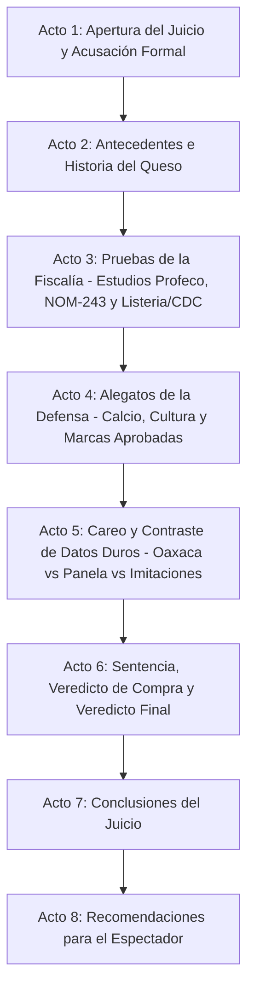

# Guion: "Quesos: ¿Tesoro de Calcio y Sabor o Fraude Lácteo de Alto Riesgo?"

**Canal de YouTube:** `@JuicioAlimentoApetecible`  
**Serie / Formato:** Juicio Alimento Apetecible  
**Género:** Drama judicial divulgativo / Ciencia de los alimentos / Debate nutricional  
**Duración estimada:** 19:00 – 23:00 minutos  

---

## 1. Resumen del Video

En este episodio de "Juicio Alimento Apetecible", Beto y Beti sientan en el banquillo de los acusados a dos de los quesos más queridos e icónicos de la mesa mexicana: **el Queso Oaxaca (quesillo)** y **el Queso Panela**, representantes de todo el universo de quesos frescos y semiduros que dominan refrigeradores y antojitos en el país.

Beto, en su papel de fiscal e ingeniero bioquímico, fundamenta su acusación técnica en el **Estudio de Calidad de Queso Oaxaca de la Procuraduría Federal del Consumidor (Profeco)**, publicado en la Revista del Consumidor (agosto de 2022), que analizó 41 productos —30 quesos Oaxaca genuinos, 3 reducidos en grasa y 8 imitaciones—; en el **Estudio de Calidad de Queso Panela** (2021), que evaluó 30 marcas; en la **NOM-243-SSA1-2010** y la **NOM-223-SCFI-SAGARPA-2018**; y en los datos oficiales del **CDC** y la **FDA** sobre brotes de *Listeria monocytogenes*. Beto destapa que marcas como **El Rey, Vaca Blanca y Jilotepec** venden imitaciones de queso Oaxaca (con grasa vegetal sustituyendo la grasa de leche) sin declararlo con claridad en el empaque; que **Don Lucas R.S.** y **Productos Lácteos HP** comercializaron imitación de queso Oaxaca a granel con microorganismos patógenos; que marcas populares de queso panela como **Alpura, Bové, Esmeralda y La Villita** rebasaron los límites de sodio, y que **Great Value** excedió grasas saturadas, grasas trans y sodio. Y expone el caso más grave: el brote de *Listeria monocytogenes* de 2024 ligado a la empresa **Rizo-López Foods**, que enfermó a 26 personas en 11 estados de EE. UU., hospitalizó a 23 y provocó 2 muertes, tras una década circulando sin ser detectado (2014-2023) en queso fresco y cotija — con las mujeres embarazadas hasta 10 veces más propensas a contraer listeriosis, según el CDC.

Por su parte, Beti encabeza una defensa contundente desde la ciencia nutricional y la cultura gastronómica: el queso es una de las mejores fuentes alimentarias de **calcio, fósforo, proteína de alta calidad y vitaminas A, B2 y B12**; forma parte de la identidad culinaria mexicana desde el nacimiento accidental del quesillo en 1885 en Reyes Etla, Oaxaca; y —lo más importante— **numerosas marcas sí aprobaron limpiamente los estudios de Profeco** (Lala, Bafar, FUD, Los Volcanes, NocheBuena, Bionda, Covadonga), demostrando que el fraude es un problema de marcas específicas y no una condena generalizada al queso como alimento.

El juicio culmina con un careo frontal de datos duros de ambos estudios de Profeco, el testimonio personificado del Queso en el estrado, un veredicto equilibrado y una guía práctica de compra para que el consumidor aprenda a distinguir queso genuino de imitaciones con grasa vegetal, y a protegerse del riesgo de *Listeria* — en especial durante el embarazo.

---

## 2. Esquema del Resumen Estructurado en Actos

* **Acto 1: Apertura del Juicio y Acusación Formal (00:00 – 02:20)**  
  Planteamiento del caso judicial. Beto presenta los cargos: imitaciones con grasa vegetal no declaradas, riesgo microbiológico y brotes de *Listeria*. Beti declara la inocencia del queso por su valor nutricional y cultural.
* **Acto 2: Antecedentes e Historia (02:20 – 05:10)**  
  Origen milenario del queso en Mesopotamia (~7,500 a.C.) y nacimiento accidental del quesillo oaxaqueño en 1885 en Reyes Etla.
* **Acto 3: Pruebas de la Fiscalía (05:10 – 09:45)**  
  Presentación de los estudios de Profeco sobre Queso Oaxaca y Queso Panela. Radiografía de marcas imitación no declaradas, marcas con riesgo sanitario, y el brote de *Listeria monocytogenes* de Rizo-López Foods.
* **Acto 4: Alegatos de la Defensa (09:45 – 14:10)**  
  Defensa del valor nutricional (calcio, proteína), la identidad cultural mexicana, la practicidad y las marcas que sí aprobaron los estudios oficiales. Testimonio del Queso en el estrado.
* **Acto 5: Careo y Contraste de Datos Duros (14:10 – 17:50)**  
  Tablas comparativas: Queso Oaxaca genuino vs. imitaciones declaradas vs. imitaciones riesgosas; Queso Panela aprobado vs. imitaciones. Análisis de sodio, grasa saturada y medidas contra *Listeria*.
* **Acto 6: Sentencia, Veredicto de Compra y Veredicto Final (17:50 – 20:00)**  
  Absolución del cargo de "alimento dañino" y condena a marcas específicas por fraude de denominación y riesgo sanitario. Guía de compra.
* **Acto 7: Conclusiones del Juicio (20:00 – 21:15)**  
  Resumen de los hechos probados. Infografía de balance de riesgos y beneficios.
* **Acto 8: Recomendaciones para el Espectador (21:15 – 22:30)**  
  Las 4 reglas de oro para comprar, conservar y consumir queso con seguridad.

---

## 3. Escaleta, Mediante una Tabla Estructurada en Actos / Escenas

| Acto | Escena | Nombre / Descripción | Duración Estimada |
| :--- | :--- | :--- | :--- |
| **Acto 1** | Escena 1 | Gancho Visual e Introducción: El hilo derretido de una quesadilla y el bisturí forense sobre un bloque de imitación | 00:00 – 00:45 |
| | Escena 2 | Declaración inicial y lectura de cargos de la Fiscalía (Beto) | 00:45 – 01:35 |
| | Escena 3 | Intervención inicial de la Defensa (Beti) y entrada del Queso al estrado | 01:35 – 02:20 |
| **Acto 2** | Escena 4 | Contexto histórico: De Mesopotamia y el odre de cuajo accidental a la civilización | 02:20 – 03:40 |
| | Escena 5 | La fórmula casera y la ciencia del cuajado: nacimiento del quesillo en Reyes Etla (1885) | 03:40 – 05:10 |
| **Acto 3** | Escena 6 | Radiografía de los Estudios Profeco: 41 quesos Oaxaca y 30 quesos panela analizados | 05:10 – 06:50 |
| | Escena 7 | Lectura forense: "Queso" vs. "imitación", grasa vegetal oculta y marcas engañosas | 06:50 – 08:20 |
| | Escena 8 | El veredicto microbiológico: riesgo sanitario y el brote de *Listeria* de Rizo-López Foods | 08:20 – 09:45 |
| **Acto 4** | Escena 9 | Valor nutricional: calcio, proteína, vitaminas y las marcas que sí aprobaron | 09:45 – 11:30 |
| | Escena 10 | Cultura, practicidad y la garantía de la pasteurización industrial | 11:30 – 12:50 |
| | Escena 11 | Testimonio del alimento acusado (el Queso) en el banquillo de los testigos | 12:50 – 14:10 |
| **Acto 5** | Escena 12 | Tabla comparativa frontal: Oaxaca genuino vs. imitaciones vs. Panela aprobado vs. imitaciones | 14:10 – 16:00 |
| | Escena 13 | El debate sobre grasa vegetal, sodio y las medidas de seguridad contra *Listeria* | 16:00 – 17:50 |
| **Acto 6** | Escena 14 | Sentencia judicial y veredicto de compra (marcas aprobadas vs. marcas sancionadas) | 17:50 – 20:00 |
| **Acto 7** | Escena 15 | Resumen de los hechos probados y gráficos de la sentencia | 20:00 – 21:15 |
| **Acto 8** | Escena 16 | Alertas de salud, beneficios y las 4 reglas de oro del consumidor inteligente | 21:15 – 22:30 |

---

## 4. Ficha Técnica de Producción

* **Acusador (Fiscalía):**  
  **BETO** (Ingeniero bioquímico, especialista en nutrición y tecnología de alimentos. Tono científico, didáctico, objetivo, elocuente y respetuoso. Viste traje formal gris carbón con camisa blanca y porta carpetas con estudios de laboratorio microbiológico).
* **Defensora (Bancada de la Defensa):**  
  **BETI** (Joven profesionista trabajadora, madre de familia y cocinera cotidiana. Tono empático, alegre, pragmático, defensora de la cultura gastronómica y la practicidad del hogar. Viste conjunto casual formal moderno en tono azul zafiro).
* **El Acusado en el Estrado:**  
  **EL QUESO** (Personificado / Una trenza dorada de queso Oaxaca junto a un disco blanco de queso panela, ambos sobre una tabla de madera bajo foco cenital dramático).
* **Ambientación:**  
  Sala de tribunal judicial moderna con páneles de madera y pantallas LED de análisis bromatológico, microscopía de cuajos lácteos, tablas de laboratorio de Profeco y una mesa de pruebas con bisturí, probetas, placas Petri y un refractómetro de grasa butírica.
* **Estilo Audiovisual:**  
  Drama procesal judicial (*Law & Order*) fusionado con microdocumental de divulgación científica (*Explained* de Netflix), planos macro gastronómicos en cámara lenta (60 fps) del hilo de queso derritiéndose, y cortes dinámicos con humor inteligente.
* **Banda Sonora y Efectos:**  
  Golpes de mazo judicial con eco seco de madera (*¡CLACK!*), acordes de sintetizador tenso y chelos orquestales para la fiscalía, percusión ligera y guitarra acústica para las defensas de Beti, y sonido foley hiperrealista (el crujido elástico de un quesillo al deshebrarse, el corte suave del panela, el burbujeo de la leche cuajando).
* **Indicaciones de Edición:**  
  Ritmo cinematográfico ágil. Animaciones dinámicas de sellos negros oficiales (NOM-243 / NOM-051) e infografías flotantes con porcentajes de grasa butírica, grasa vegetal, proteína y humedad.

---

## 5. Convención del Guion Técnico

* **[PLANO / VISUAL]:**  
  * `PG`: Plano General (vista panorámica de la sala judicial).
  * `PM`: Plano Medio (personaje de cintura para arriba).
  * `PP`: Primer Plano (rostro del personaje, enfatizando convicción o emoción).
  * `PD`: Primer Detalle (macro sobre el hilo de un quesillo derritiéndose, lectura de etiquetas, golpe de mazo, refractómetro de grasa butírica).
* **[CÁMARA / MOVIMIENTO DE CÁMARA]:** Slider lateral, Dolly frontal in/out, Paneo (pan), Tilt up/down, Barrido dinámico (whip pan).
* **[ILUMINACIÓN / FILTROS]:** Luz fría judicial (5600K) en momentos de acusación técnica, Luz cálida gourmet (3200K) en tomas culinarias, Foco cenital directo sobre el acusado.
* **[AUDIO / SFX / MÚSICA]:** Sonido foley, música incidental dramática, golpes de mazo (*¡BOOM!*), campana de tribunal (*doink-doink*), suspenso de bajo electrónico.
* **[TEXTO EN PANTALLA / GRÁFICOS / ANIMACIONES]:** Infografías 2D/3D con desglose de composición láctea, tablas oficiales Profeco, sellos de advertencia NOM-051 y citas de normas (NOM-243-SSA1-2010, NOM-223-SCFI-SAGARPA-2018, CDC/FDA).

---

## 6. Guion Técnico Profesional Muy Detallado

### ACTO 1: APERTURA DEL JUICIO Y ACUSACIÓN FORMAL (00:00 – 02:20)

#### Escena 1 (00:00 – 00:45) — Gancho Visual e Introducción
* **Plano / Visual:** [PD] a 60 fps: Una quesadilla se abre lentamente liberando un hilo dorado y elástico de queso Oaxaca derretido. Corte rápido a una mesa de laboratorio donde un bisturí corta un bloque de "imitación" barata, revelando una textura gomosa y aceitosa que no se deshebra.
* **Cámara / Movimiento de cámara:** Slider frontal en macro; corte abrupto con zoom digital hacia el mazo judicial sobre el estrado.
* **Iluminación / Filtros:** Luz cálida gastronómica (3200K) que cambia de golpe a luz fría judicial de alta tensión (5600K).
* **Audio / SFX / Música:** Sonido de hilo de queso estirándose (*stretch-squeak*) e inmediatamente golpe seco de mazo judicial con eco en sala (*¡CLACK-BOOM!*). Entra tema musical de tensión judicial con bajo pulsante y cuerdas graves.
* **Texto en Pantalla / Gráficos / Animaciones:** Título animado en tipografía metálica roja y blanca: *"CASO Nº 60: QUESOS: ¿TESORO DE CALCIO Y SABOR O FRAUDE LÁCTEO DE ALTO RIESGO?"*.

#### Escena 2 (00:45 – 01:35) — Declaración Inicial de la Fiscalía (Beto)
* **Plano / Visual:** [PM] de Beto de pie junto a la mesa de la Fiscalía, abriendo un expediente con sellos oficiales de Profeco y el CDC. Pasa a [PP] de Beto mirando fijamente a cámara con expresión severa e inquisitiva.
* **Cámara / Movimiento de cámara:** Dolly-in lento cerrando el plano sobre el rostro de Beto para enfatizar la autoridad del argumento.
* **Iluminación / Filtros:** Tono sobrio, luz lateral blanca neutra con reflector plateado.
* **Audio / SFX / Música:** Sonido de hojas de expediente al abrirse. Música de fondo con pulso rítmico de reloj (*tick-tock* electrónico de investigación).
* **Texto en Pantalla / Gráficos / Animaciones:** Lower third: *"BETO — Ingeniero Bioquímico / Fiscalía de Alimentos"*. Gráfico animado a la derecha: *"CARGOS: Imitación con Grasa Vegetal No Declarada, Riesgo Microbiológico, Brote de Listeria Monocytogenes"*.

#### Escena 3 (01:35 – 02:20) — Intervención Inicial de la Defensa y el Acusado en el Estrado
* **Plano / Visual:** [PG] del tribunal mostrando la mesa de la defensa donde Beti sonríe con serenidad, y en el banco de testigos, bajo un foco cenital, una trenza de queso Oaxaca junto a un disco blanco de queso panela sobre tabla de madera.
* **Cámara / Movimiento de cámara:** Paneo rápido (Whip pan) desde la mesa de Beto hacia la mesa de Beti, terminando en [PP] de los quesos.
* **Iluminación / Filtros:** Luz cenital dirigida sobre los quesos; luz ambiental cálida sobre Beti para proyectar empatía y cercanía.
* **Audio / SFX / Música:** Golpe seco de campana judicial (*Doink-Doink*). Música transiciona a un tono más vivaz con guitarra acústica ligera.
* **Texto en Pantalla / Gráficos / Animaciones:** Lower third: *"BETI — Defensora de la Cultura Gastronómica"*. Placa de identificación sobre el banquillo: *"ACUSADO: El Queso (Oaxaca y Panela)"*.

---

### ACTO 2: ANTECEDENTES E HISTORIA (02:20 – 05:10)

#### Escena 4 (02:20 – 03:40) — Contexto Histórico: De Mesopotamia al Mundo
* **Plano / Visual:** [PM] de Beto caminando hacia una mesa lateral con un odre de piel y un cuenco de leche cuajada. B-roll de reconstrucciones del Creciente Fértil y el friso sumerio de Ur.
* **Cámara / Movimiento de cámara:** Travelling lateral fluido en semicírculo siguiendo el desplazamiento de Beto.
* **Iluminación / Filtros:** Filtro sepia cálido suave con textura artesanal ancestral.
* **Audio / SFX / Música:** Música instrumental clásica ligera de cuerda y viento. Sonido foley de líquido agitándose en un odre de piel.
* **Texto en Pantalla / Gráficos / Animaciones:** Mapa histórico animado: *"Mesopotamia, Creciente Fértil (~7,500 a.C.). Leyenda del comerciante que transportó leche en un odre de estómago de cordero: las enzimas naturales (cuajo) la transformaron en el primer queso de la historia"*.

#### Escena 5 (03:40 – 05:10) — La Fórmula Casera y el Nacimiento del Quesillo Oaxaqueño
* **Plano / Visual:** [PP] de Beto mostrando un recipiente con leche cuajándose y separándose en cuajada y suero. Corte a animación 3D del proceso de acidificación láctea e ilustración de una joven estirando pasta de queso en Reyes Etla, Oaxaca, 1885.
* **Cámara / Movimiento de cámara:** Zoom óptico continuo hacia el recipiente de cuajada y corte por barrido a la animación histórica.
* **Iluminación / Filtros:** Luz cálida ambarina evocando una cocina tradicional oaxaqueña.
* **Audio / SFX / Música:** Sonido de leche cuajándose (*burbujeo suave*) y de masa de queso estirándose. Música folclórica mexicana ligera.
* **Texto en Pantalla / Gráficos / Animaciones:** Animación histórica: *"1885, Reyes Etla, Oaxaca: Leobarda Castellanos García, de 14 años, corrige accidentalmente un error de cuajado agregando agua caliente, creando la técnica de pasta hilada (pasta filata) que da origen al quesillo, hoy conocido como Queso Oaxaca"*.

---

### ACTO 3: PRUEBAS DE LA FISCALÍA (05:10 – 09:45)

#### Escena 6 (05:10 – 06:50) — Radiografía de los Estudios Profeco
* **Plano / Visual:** [PM] de Beto proyectando en una pantalla gigante táctil los informes de calidad de la *Revista del Consumidor* sobre queso Oaxaca (41 productos) y queso panela (30 marcas). En la mesa forense se despliegan paquetes reales de *Lala, Alpura, El Rey, Vaca Blanca y Great Value*.
* **Cámara / Movimiento de cámara:** Travelling frontal hacia la pantalla con cortes rápidos en [PD] a las marcas analizadas.
* **Iluminación / Filtros:** Luz focalizada de alta intensidad sobre los paquetes de queso; gráficos digitales en rojo de advertencia.
* **Audio / SFX / Música:** Sonido digital de interfaz de datos (*glitch/beep*). Cuerdas graves en crescendo dramático.
* **Texto en Pantalla / Gráficos / Animaciones:** Infografía animada Profeco:
  * *"ESTUDIO PROFECO QUESO OAXACA (Ago. 2022): 41 productos — 30 genuinos, 3 reducidos en grasa, 8 imitaciones"*
  * *"ESTUDIO PROFECO QUESO PANELA (2021): 30 marcas analizadas (etiquetado, humedad, proteína, sodio, grasa, contenido neto)"*.

#### Escena 7 (06:50 – 08:20) — Lectura Forense: "Queso" vs. "Imitación" y la Grasa Vegetal Oculta
* **Plano / Visual:** [PD] de la lupa forense sobre la lista de ingredientes diminuta de un queso imitación. Corte a [PP] de Beto vertiendo aceite vegetal junto a un vaso de grasa de leche, comparando su origen.
* **Cámara / Movimiento de cámara:** Macroenfoque deslizante sobre el orden de los ingredientes en el paquete.
* **Iluminación / Filtros:** Luz de lupa de aumento con anillo LED blanco neutro.
* **Audio / SFX / Música:** Zumbido sutil de alarma de advertencia (*warning beep*).
* **Texto en Pantalla / Gráficos / Animaciones:** Gráfico comparativo de Profeco:
  * *"DEFINICIÓN NOM-223 / NOM-243: 'QUESO' debe elaborarse únicamente con grasa de leche. La 'IMITACIÓN' sustituye o agrega grasa vegetal y debe declararlo claramente."*
  * *"REQUISITOS QUESO OAXACA: Mínimo 21.5% proteína, mínimo 20% grasa butírica, máximo 51% humedad."*
  * *"IMITACIONES QUE NO DECLARAN CORRECTAMENTE: El Rey, Vaca Blanca, Jilotepec."*
  * *"IMITACIONES QUE SÍ DECLARAN (no adulteradas, pero no son queso): Alpura, Carranco, Covadonga (presentación 400 g)."*

#### Escena 8 (08:20 – 09:45) — El Veredicto Microbiológico: Riesgo Sanitario y el Brote de *Listeria*
* **Plano / Visual:** [PP] de Beto sosteniendo una placa Petri con cultivo bacteriano bajo advertencia biológica. En la pantalla lateral aparece el informe del CDC/FDA sobre el brote de *Listeria monocytogenes* de Rizo-López Foods.
* **Cámara / Movimiento de cámara:** Plano en contrapicado leve para magnificar la advertencia médica.
* **Iluminación / Filtros:** Tono rojizo tenue de alerta médica en el fondo de la sala.
* **Audio / SFX / Música:** Sonido de latido cardíaco acelerado (*lub-dub*) combinado con notas de bajo orquestal siniestro.
* **Texto en Pantalla / Gráficos / Animaciones:** Alerta Sanitaria en Pantalla:
  * *"RIESGO SANITARIO PROFECO: Don Lucas R.S. (queso tipo Oaxaca a granel) y Productos Lácteos HP (imitación Oaxaca a granel) — microorganismos patógenos detectados."*
  * *"BROTE LISTERIA MONOCYTOGENES — Rizo-López Foods (2024): 26 enfermos en 11 estados de EE. UU., 23 hospitalizados, 2 muertes. Circuló sin detectarse de 2014 a 2023 en queso fresco y cotija."*
  * *"CDC: Mujeres embarazadas, hasta 10 veces más riesgo de listeriosis que la población general."*

---

### ACTO 4: ALEGATOS DE LA DEFENSA (09:45 – 14:10)

#### Escena 9 (09:45 – 11:30) — Valor Nutricional y las Marcas que Sí Aprobaron
* **Plano / Visual:** [PM] de Beti poniéndose de pie con energía. En su mesa arma un plato con cubos de queso, un vaso de leche y una infografía ósea señalando huesos y dientes fortalecidos.
* **Cámara / Movimiento de cámara:** Travelling lateral dinámico siguiendo a Beti mientras camina hacia el centro de la sala.
* **Iluminación / Filtros:** Luz cálida, reconfortante y familiar (3800K).
* **Audio / SFX / Música:** Tema de jazz suave o piano acústico con percusión rítmica que transmite calidez y sensatez.
* **Texto en Pantalla / Gráficos / Animaciones:** Gráfico Nutricional:
  * *"POR PORCIÓN DE 30 g DE QUESO: 6 a 7 g de proteína completa, ~140 mg de calcio, vitaminas A, B2 y B12."*
  * *"MARCAS QUE APROBARON LIMPIAMENTE LOS ESTUDIOS PROFECO: Lala, Bafar, FUD, Los Volcanes, NocheBuena, Bionda, Covadonga."*

#### Escena 10 (11:30 – 12:50) — Cultura, Practicidad y la Garantía de la Pasteurización Industrial
* **Plano / Visual:** [PP] de Beti preparando una quesadilla humeante en segundos, mostrando el hilo de queso deshebrándose. Corte a infografía sobre el proceso de pasteurización industrial que elimina patógenos.
* **Cámara / Movimiento de cámara:** Plano alternado rápido entre la expresión firme de Beti y los gráficos de proceso industrial.
* **Iluminación / Filtros:** Luz blanca cristalina de cocina profesional.
* **Audio / SFX / Música:** Efecto de confirmación positiva (*chime*) y música de resolución técnica impecable.
* **Texto en Pantalla / Gráficos / Animaciones:** Cuadro de Identidad y Seguridad:
  * *"El queso es pilar de la gastronomía mexicana: quesadillas, antojitos, tlayudas y desayunos cotidianos."*
  * *"LA PASTEURIZACIÓN INDUSTRIAL (72°C / 15 seg.) elimina Listeria y otros patógenos cuando el proceso se realiza y certifica correctamente."*

#### Escena 11 (12:50 – 14:10) — Testimonio del Alimento Acusado en el Banquillo
* **Plano / Visual:** [PP] del queso en el banquillo de los acusados. Plano subjetivo de Beti interrogando al lácteo con respeto profesional y empatía.
* **Cámara / Movimiento de cámara:** Zoom lento hacia la trenza de Oaxaca y el disco de panela mientras una voz en off habla en primera persona con tono modesto y sincero.
* **Iluminación / Filtros:** Foco cenital puntual con halo tenue.
* **Audio / SFX / Música:** Cello solista nostálgico y sincero. Sonido sutil de papel encerado al acomodarse.
* **Texto en Pantalla / Gráficos / Animaciones:** Placa en pantalla: *"DECLARACIÓN DEL ACUSADO: 'Nací hace miles de años del ingenio humano por conservar la leche; no soy responsable de quien me imita con aceite vegetal ni de quien descuida la cadena de frío'"*.

---

### ACTO 5: CAREO Y CONTRASTE DE DATOS DUROS (14:10 – 17:50)

#### Escena 12 (14:10 – 16:00) — Tabla Comparativa Frontal de Genuinos e Imitaciones
* **Plano / Visual:** [PG] de la sala con Beto y Beti frente a frente ante la gran mesa interactiva de datos, donde se proyectan probetas con gramos de grasa butírica, grasa vegetal, saleros con sodio y placas Petri.
* **Cámara / Movimiento de cámara:** Paneos cruzados rápidos (Over-the-shoulder) entre Beto y Beti durante el debate.
* **Iluminación / Filtros:** Alto contraste equilibrado (azul analítico para Beto, naranja cálido para Beti).
* **Audio / SFX / Música:** Duelo musical con percusión rítmica y cuerdas staccato de confrontación dialéctica.
* **Texto en Pantalla / Gráficos / Animaciones:** Tabla comparativa oficial (por porción de 30 g):
  * *"Queso Oaxaca Lala (genuino, mejor calificado): cumple 21.5% proteína / 20% grasa butírica / 51% humedad máx."*
  * *"Imitación no declarada (El Rey, Vaca Blanca, Jilotepec): grasa vegetal sin aclarar en el empaque."*
  * *"Imitación declarada (Alpura, Carranco, Covadonga 400 g): no es queso, pero etiquetado correcto."*
  * *"Riesgo sanitario (Don Lucas R.S., Productos Lácteos HP): microorganismos patógenos detectados."*
  * *"Queso Panela aprobado con exceso de sodio: Alpura, Bové, Esmeralda, La Villita."*
  * *"Queso Panela imitación: Alpino, Los Pioneros de la V del Mu, Franja (a granel)."*

#### Escena 13 (16:00 – 17:50) — El Debate sobre Grasa Vegetal, Sodio y Medidas Anti-*Listeria*
* **Plano / Visual:** [PP] de Beto mostrando un refrigerador correctamente calibrado a 4°C junto a uno sin control de temperatura donde se acumula condensación.
* **Cámara / Movimiento de cámara:** Travelling circular envolvente a 360 grados alrededor de los refrigeradores de prueba.
* **Iluminación / Filtros:** Iluminación focalizada de estudio forense gastronómico.
* **Audio / SFX / Música:** Pausas dramáticas sincronizadas con las intervenciones argumentativas de ambos personajes.
* **Texto en Pantalla / Gráficos / Animaciones:** Guía Técnica de Seguridad:
  * *"REFRIGERACIÓN CONSTANTE A 4°C O MENOS: Frena la proliferación de Listeria monocytogenes, bacteria que sobrevive incluso en frío."*
  * *"VERIFICAR PASTEURIZACIÓN EN LA ETIQUETA: Evitar quesos frescos/blandos de origen incierto o venta a granel sin refrigeración."*
  * *"GRUPOS DE ALTO RIESGO (CDC): Embarazadas, adultos mayores de 65 años, personas inmunocomprometidas."*

---

### ACTO 6: SENTENCIA, VEREDICTO DE COMPRA Y VEREDICTO FINAL (17:50 – 20:00)

#### Escena 14 (17:50 – 20:00) — Sentencia Judicial y Veredicto de Compra
* **Plano / Visual:** [PG] del tribunal en silencio solemne. Beto y Beti se colocan frente al estrado del juez. Aparece el mazo sobre la pantalla principal con el sello de veredicto.
* **Cámara / Movimiento de cámara:** Dolly-in majestuoso desde plano general hasta plano conjunto de Beto y Beti asintiendo con respeto mutuo.
* **Iluminación / Filtros:** Luz dorada cenital de resolución y conclusión formal.
* **Audio / SFX / Música:** Tres golpes de mazo secos e imponentes (*¡CLACK! ¡CLACK! ¡CLACK!*). Música triunfal y reflexiva de cierre de juicio.
* **Texto en Pantalla / Gráficos / Animaciones:** Cuadro de Veredicto de Compra Profeco:
  * *"VEREDICTO: ABSUELTO de ser un alimento dañino; CONDENADAS marcas específicas por fraude de denominación y riesgo sanitario."*
  * *"GUÍA DE COMPRA INTELIGENTE:*
    * *1. Lee la etiqueta: busca la palabra 'QUESO', no 'imitación' ni 'producto lácteo' si buscas queso genuino.*
    * *2. Prefiere marcas que aprobaron los estudios Profeco: Lala, Bafar, FUD, Los Volcanes, NocheBuena, Bionda.*
    * *3. Evita productos a granel sin refrigeración visible ni información sanitaria (Don Lucas R.S., Productos Lácteos HP).*
    * *4. Embarazadas y grupos de riesgo: verifica siempre que el queso esté hecho con leche pasteurizada"*.

---

### ACTO 7: CONCLUSIONES DEL JUICIO (20:00 – 21:15)

#### Escena 15 (20:00 – 21:15) — Resumen Ejecutivo y Gráficos de Sentencia
* **Plano / Visual:** [PM] de Beto y Beti compartiendo el mismo encuadre en plano medio, alternando sus conclusiones de forma armónica y didáctica.
* **Cámara / Movimiento de cámara:** Cámara estática sobre tripié con balance simétrico perfecto.
* **Iluminación / Filtros:** Luz suave de estudio de televisión de alta gama (4500K).
* **Audio / SFX / Música:** Base rítmica moderna y sofisticada en decrescendo hacia el cierre.
* **Texto en Pantalla / Gráficos / Animaciones:** Gráfico infográfico animado de 3 pilares: *"1. IDENTIDAD: Hay un abismo entre un queso genuino certificado y una imitación con grasa vegetal sin declarar. 2. SEGURIDAD: La refrigeración y la pasteurización son innegociables, sobre todo en embarazo. 3. ELECCIÓN INFORMADA: Las marcas aprobadas por Profeco demuestran que sí existe queso de calidad accesible"*.

---

### ACTO 8: RECOMENDACIONES PARA EL ESPECTADOR (21:15 – 22:30)

#### Escena 16 (21:15 – 22:30) — Alertas de Salud y Las 4 Reglas de Oro
* **Plano / Visual:** [PP] de Beto y Beti despidiéndose del público, con gráficos dinámicos que van apareciendo en cuadrantes laterales mientras señalan a la cámara.
* **Cámara / Movimiento de cámara:** Zoom lento hacia adelante terminando en una toma limpia de ambos personajes.
* **Iluminación / Filtros:** Tono cálido, amigable y profesional.
* **Audio / SFX / Música:** Cierre musical con acorde brillante y notas de salida del canal.
* **Texto en Pantalla / Gráficos / Animaciones:** Cuadrantes de advertencia y recomendación:
  * *"1. Verifica que diga 'QUESO' y no 'imitación' o 'producto lácteo combinado'"*
  * *"2. Prefiere marcas que aprobaron los estudios de Profeco"*
  * *"3. Mantén la cadena de frío: refrigera a 4°C o menos y respeta la caducidad"*
  * *"4. Botón de Suscripción animado: @JuicioAlimentoApetecible - Dale Like y comenta tu queso favorito"*.

---

## 7. Guion Literario Profesional Detallado

### ACTO 1: APERTURA DEL JUICIO Y ACUSACIÓN FORMAL (00:00 – 02:20)

#### Escena 1 (00:00 – 00:45) — Gancho Visual e Introducción
**Acción:**  
En un primer plano cinematográfico, una quesadilla se abre liberando un hilo dorado y elástico de queso derretido. Corte rápido a una mesa de laboratorio donde un bisturí corta un bloque de "imitación" barata, exponiendo una textura gomosa y aceitosa que se resiste a deshebrarse. De pronto, un golpe de mazo judicial sacude el tribunal.

**BETO**  
*(Al público, tono firme, mirando fijamente a la cámara)*  
Cremoso, versátil, protagonista de quesadillas, tlayudas y desayunos de toda una vida. Pero bajo ese hilo dorado y apetecible se esconde una de las mayores incógnitas del refrigerador mexicano: ¿estás comiendo leche cuajada de verdad, o una mezcla de aceite vegetal y caseína disfrazada de queso? Bienvenidos a *Juicio Alimento Apetecible*. Hoy sentamos en el banquillo a: El Queso.

---

#### Escena 2 (00:45 – 01:35) — Declaración Inicial de la Fiscalía (Beto)
**Acción:**  
Beto camina con paso firme hacia el estrado sosteniendo el expediente con los estudios de Profeco y el reporte del CDC.

**BETO**  
*(Beto, acusador y solemne, señalando al acusado)*  
Señores del jurado: la Fiscalía acusa formalmente al queso comercial de fraude de denominación y riesgo microbiológico. Demostraremos, con base en los Estudios de Calidad de la Profeco sobre queso Oaxaca y queso panela, que existen marcas que venden imitaciones con grasa vegetal sin declararlo con claridad; que productos vendidos a granel han sido encontrados con microorganismos patógenos; y que, según el CDC y la FDA, un brote de *Listeria monocytogenes* ligado a queso fresco y cotija enfermó a decenas de personas y causó muertes en Estados Unidos, circulando sin ser detectado durante una década.

---

#### Escena 3 (01:35 – 02:20) — Intervención Inicial de la Defensa (Beti)
**Acción:**  
Beti se pone de pie con elegancia y seguridad. Coloca una mano sobre la trenza de queso Oaxaca en el banquillo y mira al jurado con empatía y calidez.

**BETI**  
*(Beti, empática y enérgica, con tono conciliador)*  
¡Un momento, Beto! No podemos juzgar a todo el queso mexicano por las fechorías de unas cuantas marcas fraudulentas. El queso es calcio para los huesos, proteína completa para el cuerpo y, sobre todo, es identidad: desde Reyes Etla, Oaxaca, hasta la mesa de cualquier familia mexicana, el queso ha alimentado generaciones enteras. Además, señor Fiscal, olvidas que decenas de marcas SÍ cumplieron limpiamente los estudios oficiales de Profeco. ¡El queso no es el criminal, son los impostores que se disfrazan de queso!

---

### ACTO 2: ANTECEDENTES E HISTORIA (02:20 – 05:10)

#### Escena 4 (02:20 – 03:40) — Contexto Histórico: De Mesopotamia al Mundo
**Acción:**  
Beto se aproxima a una mesa antigua con un odre de piel y un cuenco de leche cuajada. En pantalla se muestran reconstrucciones del Creciente Fértil y el friso sumerio de Ur.

**BETO**  
*(Beto, didáctico y reflexivo, mostrando el odre)*  
Para entender al acusado, debemos regresar casi 7,500 años atrás, a Mesopotamia, en la región conocida como el Creciente Fértil. Cuenta la leyenda que un comerciante transportó leche en un odre hecho con el estómago de un cordero; las enzimas naturales de ese estómago —el cuajo— transformaron la leche en cuajada y suero durante el viaje, dando accidentalmente origen al primer queso de la historia.

**BETI**  
*(Beti, interviniendo con una sonrisa)*  
Y desde entonces, prácticamente cada cultura del planeta desarrolló su propia versión: los sumerios lo representaron en frisos de piedra, los romanos lo perfeccionaron, ¡y en México lo convertimos en el alma de la quesadilla!

---

#### Escena 5 (03:40 – 05:10) — La Fórmula Casera y el Nacimiento del Quesillo Oaxaqueño
**Acción:**  
Beto sostiene un recipiente donde la leche se separa en cuajada y suero, y en una pantalla táctil muestra una animación del proceso de acidificación láctea junto a una ilustración de una joven estirando pasta de queso en 1885.

**BETO**  
*(Beto, analítico y riguroso, activando la animación)*  
La ciencia del queso es sencilla y elegante, Beti: se acidifica la leche con cultivos lácticos o cuajo, las proteínas —principalmente la caseína— se coagulan formando una red que atrapa la grasa, y el resultado es la cuajada, que se separa del suero. Aquí en México, esa técnica dio un giro particular en 1885, en Reyes Etla, Oaxaca, cuando Leobarda Castellanos García, de apenas catorce años, cometió un error de cuajado y trató de corregirlo agregando agua caliente a la pasta. El resultado fue una masa elástica que se podía estirar en hebras: había nacido el quesillo, hoy conocido en el resto del país como queso Oaxaca.

**BETI**  
*(Beti, complementando con orgullo)*  
Esa técnica se llama pasta hilada o *pasta filata*, y coincide con métodos italianos que probablemente llegaron a Oaxaca con frailes dominicos. ¡Un accidente feliz que hoy es patrimonio gastronómico!

---

### ACTO 3: PRUEBAS DE LA FISCALÍA (05:10 – 09:45)

#### Escena 6 (05:10 – 06:50) — Radiografía de los Estudios Profeco
**Acción:**  
Beto pulsa la pantalla central. Se despliegan los cuadros comparativos de los Estudios de Calidad de la Profeco sobre queso Oaxaca y queso panela.

**BETO**  
*(Beto, severo e implacable, señalando las marcas en la pantalla)*  
Vayamos a las pruebas del Laboratorio Nacional de Protección al Consumidor de Profeco. En agosto de 2022, la Revista del Consumidor publicó el análisis de 41 productos vendidos como queso Oaxaca: 30 eran queso genuino, 3 eran versiones reducidas en grasa, y 8 resultaron ser imitaciones. Un año antes, en 2021, se había hecho lo propio con 30 marcas de queso panela, evaluando etiquetado, humedad, proteína, sodio, grasa y contenido neto.

**BETI**  
*(Beti, seria, tomando nota)*  
Es exactamente el tipo de vigilancia que necesitamos para que el consumidor sepa qué está comprando, Beto. La fiscalización de Profeco es vital.

---

#### Escena 7 (06:50 – 08:20) — Lectura Forense: "Queso" vs. "Imitación" y la Grasa Vegetal Oculta
**Acción:**  
Beto coloca dos muestras frente a la cámara: un vaso con grasa de leche y otro con aceite vegetal, comparando su origen.

**BETO**  
*(Beto, didáctico y contundente)*  
Atención aquí, consumidores: la norma es clara. Para llamarse legalmente "queso", el producto debe elaborarse únicamente con grasa de leche —la llamada grasa butírica—. Si se sustituye total o parcialmente por grasa vegetal, ya no es queso: es una **imitación**, y debe decirlo en el empaque. El estudio de Profeco encontró marcas como **El Rey, Vaca Blanca y Jilotepec** que son imitaciones y no lo aclaran adecuadamente en su etiquetado. En contraste, marcas como **Alpura, Carranco y Covadonga**, en su presentación de 400 gramos, también son imitación, pero al menos lo declaran correctamente.

**BETI**  
*(Beti, asintiendo con convicción)*  
¡Excelente distinción para el comprador! No toda imitación es un engaño: el engaño está en no decírtelo. Y para el queso Oaxaca genuino, la norma exige un mínimo de 21.5% de proteína, 20% de grasa butírica y un máximo de 51% de humedad.

---

#### Escena 8 (08:20 – 09:45) — El Veredicto Microbiológico: Riesgo Sanitario y el Brote de *Listeria*
**Acción:**  
Beto muestra una placa Petri con cultivo bacteriano y en pantalla aparece el informe conjunto del CDC y la FDA sobre el brote de *Listeria monocytogenes*.

**BETO**  
*(Beto, en tono de máxima advertencia médica)*  
Y lo más delicado: el riesgo microbiológico. El mismo estudio de Profeco detectó microorganismos patógenos en productos vendidos a granel como **Don Lucas R.S.** (queso tipo Oaxaca) y **Productos Lácteos HP** (imitación Oaxaca a granel). Pero el caso más grave ocurrió en Estados Unidos: en 2024, el CDC y la FDA confirmaron un brote de ***Listeria monocytogenes*** ligado a la empresa **Rizo-López Foods**, presente en queso fresco y cotija, que circuló sin ser detectado desde 2014 hasta 2023. El resultado: 26 personas enfermas en 11 estados, 23 hospitalizadas y 2 muertes. Y el dato más alarmante: las mujeres embarazadas tienen hasta 10 veces más riesgo de contraer listeriosis que la población general, con consecuencias que incluyen aborto espontáneo o muerte fetal.

**BETI**  
*(Beti, visiblemente conmovida)*  
Eso no es un tecnicismo, Beto, eso es una alerta de salud pública real. Toda embarazada debe saberlo.

---

### ACTO 4: ALEGATOS DE LA DEFENSA (09:45 – 14:10)

#### Escena 9 (09:45 – 11:30) — Valor Nutricional y las Marcas que Sí Aprobaron
**Acción:**  
Beti arma un plato con cubos de queso y un vaso de leche, señalando una infografía ósea con huesos y dientes fortalecidos.

**BETI**  
*(Beti, apasionada y realista)*  
Beto, hablemos también de lo bueno, porque lo hay y es mucho. Una porción de apenas 30 gramos de queso aporta entre 6 y 7 gramos de proteína completa, alrededor de 140 miligramos de calcio, y vitaminas A, B2 y B12 esenciales para el sistema nervioso y la vista. Y no hablamos solo de un puñado de marcas de lujo: **Lala, Bafar, FUD, Los Volcanes, NocheBuena, Bionda y Covadonga** aprobaron limpiamente los estudios de Profeco en calidad, etiquetado y contenido nutricional. La mayoría del mercado sí está haciendo las cosas bien.

---

#### Escena 10 (11:30 – 12:50) — Cultura, Practicidad y la Garantía de la Pasteurización Industrial
**Acción:**  
Beti prepara una quesadilla humeante en segundos, mostrando el hilo de queso deshebrándose ante la cámara.

**BETI**  
*(Beti, contundente y orgullosa)*  
Y no olvidemos lo cultural: el queso es columna vertebral de la gastronomía mexicana, desde la quesadilla más sencilla hasta la tlayuda oaxaqueña más elaborada. Sobre la seguridad: la pasteurización industrial —calentar la leche a 72°C durante 15 segundos— elimina *Listeria* y otros patógenos cuando el proceso se hace y se certifica correctamente. El riesgo no está en el queso pasteurizado de marca reconocida, sino en la informalidad: producción casera sin control sanitario o venta a granel sin refrigeración.

---

#### Escena 11 (12:50 – 14:10) — Testimonio del Alimento Acusado en el Banquillo
**Acción:**  
La cámara enfoca en primer plano la trenza de queso Oaxaca y el disco de panela sobre el estrado de testigos.

**BETI**  
*(Beti, con solemnidad teatral)*  
Tiene la palabra el acusado.

**VOZ EN OFF / BETI (INTERPRETANDO AL QUESO)**  
*(Voz modesta, digna y directa)*  
"Soy el Queso. Nací hace miles de años del ingenio humano por conservar la leche, y en México me convertí en abrazo de quesadilla y en orgullo de Oaxaca. No soy responsable de quien me copia con aceite vegetal y me vende bajo mi nombre, ni de quien me deja fuera del refrigerador por ahorrarse unos pesos. ¡Júzguenme por lo que soy: alimento noble que exige respeto en su fabricación y cuidado en su conservación!"

---

### ACTO 5: CAREO Y CONTRASTE DE DATOS DUROS (14:10 – 17:50)

#### Escena 12 (14:10 – 16:00) — Tabla Comparativa Frontal de Genuinos e Imitaciones
**Acción:**  
Beto y Beti se colocan frente a la gran pantalla de datos para desglosar la tabla comparativa por porción de 30 gramos.

**BETO**  
*(Beto, analítico y conciliador)*  
Pongamos los datos duros frente al público:

| Producto | Clasificación | Hallazgo Profeco / CDC | Comentario |
| :--- | :--- | :--- | :--- |
| **Queso Oaxaca Lala** | Genuino | Cumple 21.5% proteína / 20% grasa butírica / 51% humedad máx. | La mejor calificación de calidad y regulación. |
| **El Rey / Vaca Blanca / Jilotepec** | Imitación | Grasa vegetal sin declarar claramente | Fraude de denominación al consumidor. |
| **Alpura / Carranco / Covadonga (400 g)** | Imitación declarada | No es queso, pero etiqueta correcta | No adulterado, aunque no cumple como "queso". |
| **Don Lucas R.S. / Productos Lácteos HP** | Riesgo sanitario | Microorganismos patógenos (venta a granel) | Riesgo directo a la salud del consumidor. |
| **Alpura / Bové / Esmeralda / La Villita (panela)** | Aprobado con observación | Exceso de sodio | Cumplen como queso, pero vigilar el sodio. |
| **Great Value (panela)** | Aprobado con observación | Exceso de grasas saturadas, trans y sodio | Revisar consumo frecuente. |
| **Alpino / Los Pioneros de la V del Mu / Franja** | Imitación (panela) | Sustituyen grasa láctea por vegetal | Declarados como imitación en estudio 2024-2025. |

---

#### Escena 13 (16:00 – 17:50) — El Debate sobre Grasa Vegetal, Sodio y Medidas Anti-*Listeria*
**Acción:**  
Beto y Beti muestran un refrigerador correctamente calibrado a 4°C junto a uno sin control de temperatura.

**BETO**  
*(Beto, explicando con demostración visual)*  
La ciencia nos da una regla de oro: **la cadena de frío es innegociable**. *Listeria monocytogenes* es una de las pocas bacterias capaces de sobrevivir e incluso multiplicarse en refrigeración; por eso, mantener el queso a 4°C o menos, respetar su fecha de caducidad y evitar productos a granel sin origen claro reduce drásticamente el riesgo.

**BETI**  
*(Beti, añadiendo un tip práctico)*  
Y un consejo para toda la familia: revisa siempre que la etiqueta diga "leche pasteurizada". El CDC recomienda que embarazadas, adultos mayores de 65 años y personas inmunocomprometidas extremen precauciones con quesos frescos y blandos de origen incierto.

---

### ACTO 6: SENTENCIA, VEREDICTO DE COMPRA Y VEREDICTO FINAL (17:50 – 20:00)

#### Escena 14 (17:50 – 20:00) — Sentencia Judicial y Veredicto de Compra
**Acción:**  
Beto y Beti se colocan frente al mazo judicial para emitir la sentencia unificada.

**BETO**  
*(Beto, con solemnidad y autoridad)*  
Llegó el momento del veredicto. Habiendo evaluado la evidencia científica y los análisis de Profeco:

**BETI**  
*(Beti, resolutiva y alegre)*  
Declaramos al Queso: **ABSUELTO** de la acusación de ser un alimento dañino, reconociendo su valor nutricional en calcio y proteína, y su profundo arraigo cultural en México.

**BETO**  
*(Beto, firme e imparcial)*  
Pero declaramos **CULPABLES** a las marcas específicas que venden imitaciones sin declararlo con claridad, y a los productos a granel donde se detectaron microorganismos patógenos, así como a la falta de control sanitario que permitió el brote de *Listeria* de Rizo-López Foods.

**BETI**  
*(Beti, presentando la infografía de compra)*  
Por tanto, emitimos el siguiente **Veredicto de Compra para el Consumidor**:
1. **Regla de oro de la etiqueta:** Busca la palabra **"QUESO"**; si dice "imitación" o "producto lácteo combinado", sabrás que no es queso genuino.
2. **Prefiere marcas evaluadas y aprobadas por Profeco:** Lala, Bafar, FUD, Los Volcanes, NocheBuena, Bionda.
3. **Evita productos a granel sin refrigeración ni información sanitaria clara** (como los casos de Don Lucas R.S. o Productos Lácteos HP).
4. **Verifica pasteurización:** Indispensable para embarazadas, adultos mayores y personas inmunocomprometidas.

---

### ACTO 7: CONCLUSIONES DEL JUICIO (20:00 – 21:15)

#### Escena 15 (20:00 – 21:15) — Resumen Ejecutivo y Gráficos de Sentencia
**Acción:**  
Beto y Beti se dirigen al público en plano medio con tono pedagógico y cercano.

**BETO**  
*(Beto, reflexivo y claro)*  
En conclusión: el queso es un alimento noble, milenario y nutritivo, pero no todo lo que se vende como queso lo es realmente. Hay un abismo entre un producto certificado con grasa de leche real y una imitación con aceite vegetal que se disfraza bajo el mismo nombre.

**BETI**  
*(Beti, sonriente)*  
Aprende a leer la etiqueta, respeta la cadena de frío, y disfruta con confianza este tesoro de la mesa mexicana.

---

### ACTO 8: RECOMENDACIONES PARA EL ESPECTADOR (21:15 – 22:30)

#### Escena 16 (21:15 – 22:30) — Alertas de Salud y Las 4 Reglas de Oro
**Acción:**  
Aparecen en pantalla los gráficos animados con las cuatro recomendaciones finales.

**BETO**  
*(Beto, despidiendo el programa)*  
Aquí están las **4 Reglas de Oro de Juicio Alimento Apetecible para el Queso**:
* **1. Verifica que la etiqueta diga "QUESO" y no "imitación" o "producto lácteo combinado".**
* **2. Prefiere marcas que aprobaron los estudios oficiales de Profeco.**

**BETI**  
*(Beti, complementando)*  
* **3. Mantén siempre la cadena de frío:** refrigera a 4°C o menos y respeta la fecha de caducidad.
* **4. Embarazadas y grupos de riesgo:** confirma siempre que el queso esté elaborado con leche pasteurizada.

**BETO**  
*(Beto, sonriendo a la cámara)*  
Si este juicio te sirvió para comprar mejor en el supermercado, dale me gusta, suscríbete a *@JuicioAlimentoApetecible* y cuéntanos en los comentarios: ¿qué queso no puede faltar en tu refrigerador y qué alimento quieres en el próximo juicio?

**BETI**  
*(Beti, saludando)*  
¡Nos vemos en el próximo juicio de alimentos! ¡Buen provecho y compras inteligentes!

---

## 8. Guion Profesional con la Mezcla de Guion Técnico y Guion Literario

### ACTO 1: APERTURA DEL JUICIO Y ACUSACIÓN FORMAL (00:00 – 02:20)

#### Escena 1 (00:00 – 00:45) — Gancho Visual e Introducción
* **[PLANO / VISUAL]:** [PD] a 60 fps: Una quesadilla se abre lentamente liberando un hilo dorado y elástico de queso Oaxaca derretido. Corte rápido a una mesa de laboratorio donde un bisturí corta un bloque de "imitación" barata, revelando una textura gomosa y aceitosa que no se deshebra.
* **[CÁMARA / MOVIMIENTO DE CÁMARA]:** Slider frontal en macro; corte abrupto con zoom digital hacia el mazo judicial sobre el estrado.
* **[ILUMINACIÓN / FILTROS]:** Luz cálida gastronómica (3200K) que cambia de golpe a luz fría judicial de alta tensión (5600K).
* **[AUDIO / SFX / MÚSICA]:** Sonido de hilo de queso estirándose (*stretch-squeak*) e inmediatamente golpe seco de mazo judicial con eco en sala (*¡CLACK-BOOM!*). Entra tema musical de tensión judicial con bajo pulsante y cuerdas graves.
* **[TEXTO EN PANTALLA / GRÁFICOS / ANIMACIONES]:** Título animado en tipografía metálica roja y blanca: *"CASO Nº 60: QUESOS: ¿TESORO DE CALCIO Y SABOR O FRAUDE LÁCTEO DE ALTO RIESGO?"*.
* **ACCIÓN:**  
  En un primer plano cinematográfico, una quesadilla se abre liberando un hilo dorado y elástico de queso derretido. Corte rápido a una mesa de laboratorio donde un bisturí corta un bloque de "imitación" barata, exponiendo una textura gomosa y aceitosa que se resiste a deshebrarse. De pronto, un golpe de mazo judicial sacude el tribunal.
* **DIÁLOGOS:**  
  **BETO**  
  *(Al público, tono firme, mirando fijamente a la cámara)*  
  Cremoso, versátil, protagonista de quesadillas, tlayudas y desayunos de toda una vida. Pero bajo ese hilo dorado y apetecible se esconde una de las mayores incógnitas del refrigerador mexicano: ¿estás comiendo leche cuajada de verdad, o una mezcla de aceite vegetal y caseína disfrazada de queso? Bienvenidos a *Juicio Alimento Apetecible*. Hoy sentamos en el banquillo a: El Queso.

---

#### Escena 2 (00:45 – 01:35) — Declaración Inicial de la Fiscalía
* **[PLANO / VISUAL]:** [PM] de Beto de pie junto a la mesa de la Fiscalía, abriendo un expediente con sellos oficiales de Profeco y el CDC. Pasa a [PP] de Beto mirando fijamente a cámara con expresión severa e inquisitiva.
* **[CÁMARA / MOVIMIENTO DE CÁMARA]:** Dolly-in lento cerrando el plano sobre el rostro de Beto para enfatizar la autoridad del argumento.
* **[ILUMINACIÓN / FILTROS]:** Tono sobrio, luz lateral blanca neutra con reflector plateado.
* **[AUDIO / SFX / MÚSICA]:** Sonido de hojas de expediente al abrirse. Música de fondo con pulso rítmico de reloj (*tick-tock* electrónico de investigación).
* **[TEXTO EN PANTALLA / GRÁFICOS / ANIMACIONES]:** Lower third: *"BETO — Ingeniero Bioquímico / Fiscalía de Alimentos"*. Gráfico animado a la derecha: *"CARGOS: Imitación con Grasa Vegetal No Declarada, Riesgo Microbiológico, Brote de Listeria Monocytogenes"*.
* **ACCIÓN:**  
  Beto camina con paso firme hacia el estrado sosteniendo el expediente con los estudios de Profeco y el reporte del CDC.
* **DIÁLOGOS:**  
  **BETO**  
  *(Beto, acusador y solemne, señalando al acusado)*  
  Señores del jurado: la Fiscalía acusa formalmente al queso comercial de fraude de denominación y riesgo microbiológico. Demostraremos, con base en los Estudios de Calidad de la Profeco sobre queso Oaxaca y queso panela, que existen marcas que venden imitaciones con grasa vegetal sin declararlo con claridad; que productos vendidos a granel han sido encontrados con microorganismos patógenos; y que, según el CDC y la FDA, un brote de *Listeria monocytogenes* ligado a queso fresco y cotija enfermó a decenas de personas y causó muertes en Estados Unidos, circulando sin ser detectado durante una década.

---

#### Escena 3 (01:35 – 02:20) — Intervención Inicial de la Defensa y el Acusado en el Estrado
* **[PLANO / VISUAL]:** [PG] del tribunal mostrando la mesa de la defensa donde Beti sonríe con serenidad, y en el banco de testigos, bajo un foco cenital, una trenza de queso Oaxaca junto a un disco blanco de queso panela sobre tabla de madera.
* **[CÁMARA / MOVIMIENTO DE CÁMARA]:** Paneo rápido (Whip pan) desde la mesa de Beto hacia la mesa de Beti, terminando en [PP] de los quesos.
* **[ILUMINACIÓN / FILTROS]:** Luz cenital dirigida sobre los quesos; luz ambiental cálida sobre Beti para proyectar empatía y cercanía.
* **[AUDIO / SFX / MÚSICA]:** Golpe seco de campana judicial (*Doink-Doink*). Música transiciona a un tono más vivaz con guitarra acústica ligera.
* **[TEXTO EN PANTALLA / GRÁFICOS / ANIMACIONES]:** Lower third: *"BETI — Defensora de la Cultura Gastronómica"*. Placa de identificación sobre el banquillo: *"ACUSADO: El Queso (Oaxaca y Panela)"*.
* **ACCIÓN:**  
  Beti se pone de pie con elegancia y seguridad. Coloca una mano sobre la trenza de queso Oaxaca en el banquillo y mira al jurado con empatía y calidez.
* **DIÁLOGOS:**  
  **BETI**  
  *(Beti, empática y enérgica, con tono conciliador)*  
  ¡Un momento, Beto! No podemos juzgar a todo el queso mexicano por las fechorías de unas cuantas marcas fraudulentas. El queso es calcio para los huesos, proteína completa para el cuerpo y, sobre todo, es identidad: desde Reyes Etla, Oaxaca, hasta la mesa de cualquier familia mexicana, el queso ha alimentado generaciones enteras. Además, señor Fiscal, olvidas que decenas de marcas SÍ cumplieron limpiamente los estudios oficiales de Profeco. ¡El queso no es el criminal, son los impostores que se disfrazan de queso!

---

### ACTO 2: ANTECEDENTES E HISTORIA (02:20 – 05:10)

#### Escena 4 (02:20 – 03:40) — Contexto Histórico: De Mesopotamia al Mundo
* **[PLANO / VISUAL]:** [PM] de Beto caminando hacia una mesa lateral con un odre de piel y un cuenco de leche cuajada. B-roll de reconstrucciones del Creciente Fértil y el friso sumerio de Ur.
* **[CÁMARA / MOVIMIENTO DE CÁMARA]:** Travelling lateral fluido en semicírculo siguiendo el desplazamiento de Beto.
* **[ILUMINACIÓN / FILTROS]:** Filtro sepia cálido suave con textura artesanal ancestral.
* **[AUDIO / SFX / MÚSICA]:** Música instrumental clásica ligera de cuerda y viento. Sonido foley de líquido agitándose en un odre de piel.
* **[TEXTO EN PANTALLA / GRÁFICOS / ANIMACIONES]:** Mapa histórico animado: *"Mesopotamia, Creciente Fértil (~7,500 a.C.). Leyenda del comerciante que transportó leche en un odre de estómago de cordero: las enzimas naturales (cuajo) la transformaron en el primer queso de la historia"*.
* **ACCIÓN:**  
  Beto se aproxima a una mesa antigua con un odre de piel y un cuenco de leche cuajada. En pantalla se muestran reconstrucciones del Creciente Fértil y el friso sumerio de Ur.
* **DIÁLOGOS:**  
  **BETO**  
  *(Beto, didáctico y reflexivo, mostrando el odre)*  
  Para entender al acusado, debemos regresar casi 7,500 años atrás, a Mesopotamia, en la región conocida como el Creciente Fértil. Cuenta la leyenda que un comerciante transportó leche en un odre hecho con el estómago de un cordero; las enzimas naturales de ese estómago —el cuajo— transformaron la leche en cuajada y suero durante el viaje, dando accidentalmente origen al primer queso de la historia.  
  **BETI**  
  *(Beti, interviniendo con una sonrisa)*  
  Y desde entonces, prácticamente cada cultura del planeta desarrolló su propia versión: los sumerios lo representaron en frisos de piedra, los romanos lo perfeccionaron, ¡y en México lo convertimos en el alma de la quesadilla!

---

#### Escena 5 (03:40 – 05:10) — La Fórmula Casera y el Nacimiento del Quesillo Oaxaqueño
* **[PLANO / VISUAL]:** [PP] de Beto mostrando un recipiente con leche cuajándose y separándose en cuajada y suero. Corte a animación 3D del proceso de acidificación láctea e ilustración de una joven estirando pasta de queso en Reyes Etla, Oaxaca, 1885.
* **[CÁMARA / MOVIMIENTO DE CÁMARA]:** Zoom óptico continuo hacia el recipiente de cuajada y corte por barrido a la animación histórica.
* **[ILUMINACIÓN / FILTROS]:** Luz cálida ambarina evocando una cocina tradicional oaxaqueña.
* **[AUDIO / SFX / MÚSICA]:** Sonido de leche cuajándose (*burbujeo suave*) y de masa de queso estirándose. Música folclórica mexicana ligera.
* **[TEXTO EN PANTALLA / GRÁFICOS / ANIMACIONES]:** Animación histórica: *"1885, Reyes Etla, Oaxaca: Leobarda Castellanos García, de 14 años, corrige accidentalmente un error de cuajado agregando agua caliente, creando la técnica de pasta hilada (pasta filata) que da origen al quesillo, hoy conocido como Queso Oaxaca"*.
* **ACCIÓN:**  
  Beto sostiene un recipiente donde la leche se separa en cuajada y suero, y en una pantalla táctil muestra una animación del proceso de acidificación láctea junto a una ilustración de una joven estirando pasta de queso en 1885.
* **DIÁLOGOS:**  
  **BETO**  
  *(Beto, analítico y riguroso, activando la animación)*  
  La ciencia del queso es sencilla y elegante, Beti: se acidifica la leche con cultivos lácticos o cuajo, las proteínas —principalmente la caseína— se coagulan formando una red que atrapa la grasa, y el resultado es la cuajada, que se separa del suero. Aquí en México, esa técnica dio un giro particular en 1885, en Reyes Etla, Oaxaca, cuando Leobarda Castellanos García, de apenas catorce años, cometió un error de cuajado y trató de corregirlo agregando agua caliente a la pasta. El resultado fue una masa elástica que se podía estirar en hebras: había nacido el quesillo, hoy conocido en el resto del país como queso Oaxaca.  
  **BETI**  
  *(Beti, complementando con orgullo)*  
  Esa técnica se llama pasta hilada o *pasta filata*, y coincide con métodos italianos que probablemente llegaron a Oaxaca con frailes dominicos. ¡Un accidente feliz que hoy es patrimonio gastronómico!

---

### ACTO 3: PRUEBAS DE LA FISCALÍA (05:10 – 09:45)

#### Escena 6 (05:10 – 06:50) — Radiografía de los Estudios Profeco
* **[PLANO / VISUAL]:** [PM] de Beto proyectando en una pantalla gigante táctil los informes de calidad de la *Revista del Consumidor* sobre queso Oaxaca (41 productos) y queso panela (30 marcas). En la mesa forense se despliegan paquetes reales de *Lala, Alpura, El Rey, Vaca Blanca y Great Value*.
* **[CÁMARA / MOVIMIENTO DE CÁMARA]:** Travelling frontal hacia la pantalla con cortes rápidos en [PD] a las marcas analizadas.
* **[ILUMINACIÓN / FILTROS]:** Luz focalizada de alta intensidad sobre los paquetes de queso; gráficos digitales en rojo de advertencia.
* **[AUDIO / SFX / MÚSICA]:** Sonido digital de interfaz de datos (*glitch/beep*). Cuerdas graves en crescendo dramático.
* **[TEXTO EN PANTALLA / GRÁFICOS / ANIMACIONES]:** Infografía animada Profeco:
  * *"ESTUDIO PROFECO QUESO OAXACA (Ago. 2022): 41 productos — 30 genuinos, 3 reducidos en grasa, 8 imitaciones"*
  * *"ESTUDIO PROFECO QUESO PANELA (2021): 30 marcas analizadas (etiquetado, humedad, proteína, sodio, grasa, contenido neto)"*.
* **ACCIÓN:**  
  Beto pulsa la pantalla central. Se despliegan los cuadros comparativos de los Estudios de Calidad de la Profeco sobre queso Oaxaca y queso panela.
* **DIÁLOGOS:**  
  **BETO**  
  *(Beto, severo e implacable, señalando las marcas en la pantalla)*  
  Vayamos a las pruebas del Laboratorio Nacional de Protección al Consumidor de Profeco. En agosto de 2022, la Revista del Consumidor publicó el análisis de 41 productos vendidos como queso Oaxaca: 30 eran queso genuino, 3 eran versiones reducidas en grasa, y 8 resultaron ser imitaciones. Un año antes, en 2021, se había hecho lo propio con 30 marcas de queso panela, evaluando etiquetado, humedad, proteína, sodio, grasa y contenido neto.  
  **BETI**  
  *(Beti, seria, tomando nota)*  
  Es exactamente el tipo de vigilancia que necesitamos para que el consumidor sepa qué está comprando, Beto. La fiscalización de Profeco es vital.

---

#### Escena 7 (06:50 – 08:20) — Lectura Forense: "Queso" vs. "Imitación" y la Grasa Vegetal Oculta
* **[PLANO / VISUAL]:** [PD] de la lupa forense sobre la lista de ingredientes diminuta de un queso imitación. Corte a [PP] de Beto vertiendo aceite vegetal junto a un vaso de grasa de leche, comparando su origen.
* **[CÁMARA / MOVIMIENTO DE CÁMARA]:** Macroenfoque deslizante sobre el orden de los ingredientes en el paquete.
* **[ILUMINACIÓN / FILTROS]:** Luz de lupa de aumento con anillo LED blanco neutro.
* **[AUDIO / SFX / MÚSICA]:** Zumbido sutil de alarma de advertencia (*warning beep*).
* **[TEXTO EN PANTALLA / GRÁFICOS / ANIMACIONES]:** Gráfico comparativo de Profeco:
  * *"DEFINICIÓN NOM-223 / NOM-243: 'QUESO' debe elaborarse únicamente con grasa de leche. La 'IMITACIÓN' sustituye o agrega grasa vegetal y debe declararlo claramente."*
  * *"REQUISITOS QUESO OAXACA: Mínimo 21.5% proteína, mínimo 20% grasa butírica, máximo 51% humedad."*
  * *"IMITACIONES QUE NO DECLARAN CORRECTAMENTE: El Rey, Vaca Blanca, Jilotepec."*
  * *"IMITACIONES QUE SÍ DECLARAN (no adulteradas, pero no son queso): Alpura, Carranco, Covadonga (presentación 400 g)."*
* **ACCIÓN:**  
  Beto coloca dos muestras frente a la cámara: un vaso con grasa de leche y otro con aceite vegetal, comparando su origen.
* **DIÁLOGOS:**  
  **BETO**  
  *(Beto, didáctico y contundente)*  
  Atención aquí, consumidores: la norma es clara. Para llamarse legalmente "queso", el producto debe elaborarse únicamente con grasa de leche —la llamada grasa butírica—. Si se sustituye total o parcialmente por grasa vegetal, ya no es queso: es una **imitación**, y debe decirlo en el empaque. El estudio de Profeco encontró marcas como **El Rey, Vaca Blanca y Jilotepec** que son imitaciones y no lo aclaran adecuadamente en su etiquetado. En contraste, marcas como **Alpura, Carranco y Covadonga**, en su presentación de 400 gramos, también son imitación, pero al menos lo declaran correctamente.  
  **BETI**  
  *(Beti, asintiendo con convicción)*  
  ¡Excelente distinción para el comprador! No toda imitación es un engaño: el engaño está en no decírtelo. Y para el queso Oaxaca genuino, la norma exige un mínimo de 21.5% de proteína, 20% de grasa butírica y un máximo de 51% de humedad.

---

#### Escena 8 (08:20 – 09:45) — El Veredicto Microbiológico: Riesgo Sanitario y el Brote de *Listeria*
* **[PLANO / VISUAL]:** [PP] de Beto sosteniendo una placa Petri con cultivo bacteriano bajo advertencia biológica. En la pantalla lateral aparece el informe del CDC/FDA sobre el brote de *Listeria monocytogenes* de Rizo-López Foods.
* **[CÁMARA / MOVIMIENTO DE CÁMARA]:** Plano en contrapicado leve para magnificar la advertencia médica.
* **[ILUMINACIÓN / FILTROS]:** Tono rojizo tenue de alerta médica en el fondo de la sala.
* **[AUDIO / SFX / MÚSICA]:** Sonido de latido cardíaco acelerado (*lub-dub*) combinado con notas de bajo orquestal siniestro.
* **[TEXTO EN PANTALLA / GRÁFICOS / ANIMACIONES]:** Alerta Sanitaria en Pantalla:
  * *"RIESGO SANITARIO PROFECO: Don Lucas R.S. (queso tipo Oaxaca a granel) y Productos Lácteos HP (imitación Oaxaca a granel) — microorganismos patógenos detectados."*
  * *"BROTE LISTERIA MONOCYTOGENES — Rizo-López Foods (2024): 26 enfermos en 11 estados de EE. UU., 23 hospitalizados, 2 muertes. Circuló sin detectarse de 2014 a 2023 en queso fresco y cotija."*
  * *"CDC: Mujeres embarazadas, hasta 10 veces más riesgo de listeriosis que la población general."*
* **ACCIÓN:**  
  Beto muestra una placa Petri con cultivo bacteriano y en pantalla aparece el informe conjunto del CDC y la FDA sobre el brote de *Listeria monocytogenes*.
* **DIÁLOGOS:**  
  **BETO**  
  *(Beto, en tono de máxima advertencia médica)*  
  Y lo más delicado: el riesgo microbiológico. El mismo estudio de Profeco detectó microorganismos patógenos en productos vendidos a granel como **Don Lucas R.S.** (queso tipo Oaxaca) y **Productos Lácteos HP** (imitación Oaxaca a granel). Pero el caso más grave ocurrió en Estados Unidos: en 2024, el CDC y la FDA confirmaron un brote de ***Listeria monocytogenes*** ligado a la empresa **Rizo-López Foods**, presente en queso fresco y cotija, que circuló sin ser detectado desde 2014 hasta 2023. El resultado: 26 personas enfermas en 11 estados, 23 hospitalizadas y 2 muertes. Y el dato más alarmante: las mujeres embarazadas tienen hasta 10 veces más riesgo de contraer listeriosis que la población general, con consecuencias que incluyen aborto espontáneo o muerte fetal.  
  **BETI**  
  *(Beti, visiblemente conmovida)*  
  Eso no es un tecnicismo, Beto, eso es una alerta de salud pública real. Toda embarazada debe saberlo.

---

### ACTO 4: ALEGATOS DE LA DEFENSA (09:45 – 14:10)

#### Escena 9 (09:45 – 11:30) — Valor Nutricional y las Marcas que Sí Aprobaron
* **[PLANO / VISUAL]:** [PM] de Beti poniéndose de pie con energía. En su mesa arma un plato con cubos de queso, un vaso de leche y una infografía ósea señalando huesos y dientes fortalecidos.
* **[CÁMARA / MOVIMIENTO DE CÁMARA]:** Travelling lateral dinámico siguiendo a Beti mientras camina hacia el centro de la sala.
* **[ILUMINACIÓN / FILTROS]:** Luz cálida, reconfortante y familiar (3800K).
* **[AUDIO / SFX / MÚSICA]:** Tema de jazz suave o piano acústico con percusión rítmica que transmite calidez y sensatez.
* **[TEXTO EN PANTALLA / GRÁFICOS / ANIMACIONES]:** Gráfico Nutricional:
  * *"POR PORCIÓN DE 30 g DE QUESO: 6 a 7 g de proteína completa, ~140 mg de calcio, vitaminas A, B2 y B12."*
  * *"MARCAS QUE APROBARON LIMPIAMENTE LOS ESTUDIOS PROFECO: Lala, Bafar, FUD, Los Volcanes, NocheBuena, Bionda, Covadonga."*
* **ACCIÓN:**  
  Beti arma un plato con cubos de queso y un vaso de leche, señalando una infografía ósea con huesos y dientes fortalecidos.
* **DIÁLOGOS:**  
  **BETI**  
  *(Beti, apasionada y realista)*  
  Beto, hablemos también de lo bueno, porque lo hay y es mucho. Una porción de apenas 30 gramos de queso aporta entre 6 y 7 gramos de proteína completa, alrededor de 140 miligramos de calcio, y vitaminas A, B2 y B12 esenciales para el sistema nervioso y la vista. Y no hablamos solo de un puñado de marcas de lujo: **Lala, Bafar, FUD, Los Volcanes, NocheBuena, Bionda y Covadonga** aprobaron limpiamente los estudios de Profeco en calidad, etiquetado y contenido nutricional. La mayoría del mercado sí está haciendo las cosas bien.

---

#### Escena 10 (11:30 – 12:50) — Cultura, Practicidad y la Garantía de la Pasteurización Industrial
* **[PLANO / VISUAL]:** [PP] de Beti preparando una quesadilla humeante en segundos, mostrando el hilo de queso deshebrándose. Corte a infografía sobre el proceso de pasteurización industrial que elimina patógenos.
* **[CÁMARA / MOVIMIENTO DE CÁMARA]:** Plano alternado rápido entre la expresión firme de Beti y los gráficos de proceso industrial.
* **[ILUMINACIÓN / FILTROS]:** Luz blanca cristalina de cocina profesional.
* **[AUDIO / SFX / MÚSICA]:** Efecto de confirmación positiva (*chime*) y música de resolución técnica impecable.
* **[TEXTO EN PANTALLA / GRÁFICOS / ANIMACIONES]:** Cuadro de Identidad y Seguridad:
  * *"El queso es pilar de la gastronomía mexicana: quesadillas, antojitos, tlayudas y desayunos cotidianos."*
  * *"LA PASTEURIZACIÓN INDUSTRIAL (72°C / 15 seg.) elimina Listeria y otros patógenos cuando el proceso se realiza y certifica correctamente."*
* **ACCIÓN:**  
  Beti prepara una quesadilla humeante en segundos, mostrando el hilo de queso deshebrándose ante la cámara.
* **DIÁLOGOS:**  
  **BETI**  
  *(Beti, contundente y orgullosa)*  
  Y no olvidemos lo cultural: el queso es columna vertebral de la gastronomía mexicana, desde la quesadilla más sencilla hasta la tlayuda oaxaqueña más elaborada. Sobre la seguridad: la pasteurización industrial —calentar la leche a 72°C durante 15 segundos— elimina *Listeria* y otros patógenos cuando el proceso se hace y se certifica correctamente. El riesgo no está en el queso pasteurizado de marca reconocida, sino en la informalidad: producción casera sin control sanitario o venta a granel sin refrigeración.

---

#### Escena 11 (12:50 – 14:10) — Testimonio del Alimento Acusado en el Banquillo
* **[PLANO / VISUAL]:** [PP] del queso en el banquillo de los acusados. Plano subjetivo de Beti interrogando al lácteo con respeto profesional y empatía.
* **[CÁMARA / MOVIMIENTO DE CÁMARA]:** Zoom lento hacia la trenza de Oaxaca y el disco de panela mientras una voz en off habla en primera persona con tono modesto y sincero.
* **[ILUMINACIÓN / FILTROS]:** Foco cenital puntual con halo tenue.
* **[AUDIO / SFX / MÚSICA]:** Cello solista nostálgico y sincero. Sonido sutil de papel encerado al acomodarse.
* **[TEXTO EN PANTALLA / GRÁFICOS / ANIMACIONES]:** Placa en pantalla: *"DECLARACIÓN DEL ACUSADO: 'Nací hace miles de años del ingenio humano por conservar la leche; no soy responsable de quien me imita con aceite vegetal ni de quien descuida la cadena de frío'"*.
* **ACCIÓN:**  
  La cámara enfoca en primer plano la trenza de queso Oaxaca y el disco de panela sobre el estrado de testigos.
* **DIÁLOGOS:**  
  **BETI**  
  *(Beti, con solemnidad teatral)*  
  Tiene la palabra el acusado.  
  **VOZ EN OFF / BETI (INTERPRETANDO AL QUESO)**  
  *(Voz modesta, digna y directa)*  
  "Soy el Queso. Nací hace miles de años del ingenio humano por conservar la leche, y en México me convertí en abrazo de quesadilla y en orgullo de Oaxaca. No soy responsable de quien me copia con aceite vegetal y me vende bajo mi nombre, ni de quien me deja fuera del refrigerador por ahorrarse unos pesos. ¡Júzguenme por lo que soy: alimento noble que exige respeto en su fabricación y cuidado en su conservación!"

---

### ACTO 5: CAREO Y CONTRASTE DE DATOS DUROS (14:10 – 17:50)

#### Escena 12 (14:10 – 16:00) — Tabla Comparativa Frontal de Genuinos e Imitaciones
* **[PLANO / VISUAL]:** [PG] de la sala con Beto y Beti frente a frente ante la gran mesa interactiva de datos, donde se proyectan probetas con gramos de grasa butírica, grasa vegetal, saleros con sodio y placas Petri.
* **[CÁMARA / MOVIMIENTO DE CÁMARA]:** Paneos cruzados rápidos (Over-the-shoulder) entre Beto y Beti durante el debate.
* **[ILUMINACIÓN / FILTROS]:** Alto contraste equilibrado (azul analítico para Beto, naranja cálido para Beti).
* **[AUDIO / SFX / MÚSICA]:** Duelo musical con percusión rítmica y cuerdas staccato de confrontación dialéctica.
* **[TEXTO EN PANTALLA / GRÁFICOS / ANIMACIONES]:** Tabla comparativa oficial (por porción de 30 g):
  * *"Queso Oaxaca Lala (genuino, mejor calificado): cumple 21.5% proteína / 20% grasa butírica / 51% humedad máx."*
  * *"Imitación no declarada (El Rey, Vaca Blanca, Jilotepec): grasa vegetal sin aclarar en el empaque."*
  * *"Imitación declarada (Alpura, Carranco, Covadonga 400 g): no es queso, pero etiquetado correcto."*
  * *"Riesgo sanitario (Don Lucas R.S., Productos Lácteos HP): microorganismos patógenos detectados."*
  * *"Queso Panela aprobado con exceso de sodio: Alpura, Bové, Esmeralda, La Villita."*
  * *"Queso Panela imitación: Alpino, Los Pioneros de la V del Mu, Franja (a granel)."*
* **ACCIÓN:**  
  Beto y Beti se colocan frente a la gran pantalla de datos para desglosar la tabla comparativa por porción de 30 gramos.
* **DIÁLOGOS:**  
  **BETO**  
  *(Beto, analítico y conciliador)*  
  Pongamos los datos duros frente al público:

  | Producto | Clasificación | Hallazgo Profeco / CDC | Comentario |
  | :--- | :--- | :--- | :--- |
  | **Queso Oaxaca Lala** | Genuino | Cumple 21.5% proteína / 20% grasa butírica / 51% humedad máx. | La mejor calificación de calidad y regulación. |
  | **El Rey / Vaca Blanca / Jilotepec** | Imitación | Grasa vegetal sin declarar claramente | Fraude de denominación al consumidor. |
  | **Alpura / Carranco / Covadonga (400 g)** | Imitación declarada | No es queso, pero etiqueta correcta | No adulterado, aunque no cumple como "queso". |
  | **Don Lucas R.S. / Productos Lácteos HP** | Riesgo sanitario | Microorganismos patógenos (venta a granel) | Riesgo directo a la salud del consumidor. |
  | **Alpura / Bové / Esmeralda / La Villita (panela)** | Aprobado con observación | Exceso de sodio | Cumplen como queso, pero vigilar el sodio. |
  | **Great Value (panela)** | Aprobado con observación | Exceso de grasas saturadas, trans y sodio | Revisar consumo frecuente. |
  | **Alpino / Los Pioneros de la V del Mu / Franja** | Imitación (panela) | Sustituyen grasa láctea por vegetal | Declarados como imitación en estudio 2024-2025. |

---

#### Escena 13 (16:00 – 17:50) — El Debate sobre Grasa Vegetal, Sodio y Medidas Anti-*Listeria*
* **[PLANO / VISUAL]:** [PP] de Beto mostrando un refrigerador correctamente calibrado a 4°C junto a uno sin control de temperatura donde se acumula condensación.
* **[CÁMARA / MOVIMIENTO DE CÁMARA]:** Travelling circular envolvente a 360 grados alrededor de los refrigeradores de prueba.
* **[ILUMINACIÓN / FILTROS]:** Iluminación focalizada de estudio forense gastronómico.
* **[AUDIO / SFX / MÚSICA]:** Pausas dramáticas sincronizadas con las intervenciones argumentativas de ambos personajes.
* **[TEXTO EN PANTALLA / GRÁFICOS / ANIMACIONES]:** Guía Técnica de Seguridad:
  * *"REFRIGERACIÓN CONSTANTE A 4°C O MENOS: Frena la proliferación de Listeria monocytogenes, bacteria que sobrevive incluso en frío."*
  * *"VERIFICAR PASTEURIZACIÓN EN LA ETIQUETA: Evitar quesos frescos/blandos de origen incierto o venta a granel sin refrigeración."*
  * *"GRUPOS DE ALTO RIESGO (CDC): Embarazadas, adultos mayores de 65 años, personas inmunocomprometidas."*
* **ACCIÓN:**  
  Beto y Beti muestran un refrigerador correctamente calibrado a 4°C junto a uno sin control de temperatura.
* **DIÁLOGOS:**  
  **BETO**  
  *(Beto, explicando con demostración visual)*  
  La ciencia nos da una regla de oro: **la cadena de frío es innegociable**. *Listeria monocytogenes* es una de las pocas bacterias capaces de sobrevivir e incluso multiplicarse en refrigeración; por eso, mantener el queso a 4°C o menos, respetar su fecha de caducidad y evitar productos a granel sin origen claro reduce drásticamente el riesgo.  
  **BETI**  
  *(Beti, añadiendo un tip práctico)*  
  Y un consejo para toda la familia: revisa siempre que la etiqueta diga "leche pasteurizada". El CDC recomienda que embarazadas, adultos mayores de 65 años y personas inmunocomprometidas extremen precauciones con quesos frescos y blandos de origen incierto.

---

### ACTO 6: SENTENCIA, VEREDICTO DE COMPRA Y VEREDICTO FINAL (17:50 – 20:00)

#### Escena 14 (17:50 – 20:00) — Sentencia Judicial y Veredicto de Compra
* **[PLANO / VISUAL]:** [PG] del tribunal en silencio solemne. Beto y Beti se colocan frente al estrado del juez. Aparece el mazo sobre la pantalla principal con el sello de veredicto.
* **[CÁMARA / MOVIMIENTO DE CÁMARA]:** Dolly-in majestuoso desde plano general hasta plano conjunto de Beto y Beti asintiendo con respeto mutuo.
* **[ILUMINACIÓN / FILTROS]:** Luz dorada cenital de resolución y conclusión formal.
* **[AUDIO / SFX / MÚSICA]:** Tres golpes de mazo secos e imponentes (*¡CLACK! ¡CLACK! ¡CLACK!*). Música triunfal y reflexiva de cierre de juicio.
* **[TEXTO EN PANTALLA / GRÁFICOS / ANIMACIONES]:** Cuadro de Veredicto de Compra Profeco:
  * *"VEREDICTO: ABSUELTO de ser un alimento dañino; CONDENADAS marcas específicas por fraude de denominación y riesgo sanitario."*
  * *"GUÍA DE COMPRA INTELIGENTE:*
    * *1. Lee la etiqueta: busca la palabra 'QUESO', no 'imitación' ni 'producto lácteo' si buscas queso genuino.*
    * *2. Prefiere marcas que aprobaron los estudios Profeco: Lala, Bafar, FUD, Los Volcanes, NocheBuena, Bionda.*
    * *3. Evita productos a granel sin refrigeración visible ni información sanitaria (Don Lucas R.S., Productos Lácteos HP).*
    * *4. Embarazadas y grupos de riesgo: verifica siempre que el queso esté hecho con leche pasteurizada"*.
* **ACCIÓN:**  
  Beto y Beti se colocan frente al mazo judicial para emitir la sentencia unificada.
* **DIÁLOGOS:**  
  **BETO**  
  *(Beto, con solemnidad y autoridad)*  
  Llegó el momento del veredicto. Habiendo evaluado la evidencia científica y los análisis de Profeco:  
  **BETI**  
  *(Beti, resolutiva y alegre)*  
  Declaramos al Queso: **ABSUELTO** de la acusación de ser un alimento dañino, reconociendo su valor nutricional en calcio y proteína, y su profundo arraigo cultural en México.  
  **BETO**  
  *(Beto, firme e imparcial)*  
  Pero declaramos **CULPABLES** a las marcas específicas que venden imitaciones sin declararlo con claridad, y a los productos a granel donde se detectaron microorganismos patógenos, así como a la falta de control sanitario que permitió el brote de *Listeria* de Rizo-López Foods.  
  **BETI**  
  *(Beti, presentando la infografía de compra)*  
  Por tanto, emitimos el siguiente **Veredicto de Compra para el Consumidor**:
  1. **Regla de oro de la etiqueta:** Busca la palabra **"QUESO"**; si dice "imitación" o "producto lácteo combinado", sabrás que no es queso genuino.
  2. **Prefiere marcas evaluadas y aprobadas por Profeco:** Lala, Bafar, FUD, Los Volcanes, NocheBuena, Bionda.
  3. **Evita productos a granel sin refrigeración ni información sanitaria clara** (como los casos de Don Lucas R.S. o Productos Lácteos HP).
  4. **Verifica pasteurización:** Indispensable para embarazadas, adultos mayores y personas inmunocomprometidas.

---

### ACTO 7: CONCLUSIONES DEL JUICIO (20:00 – 21:15)

#### Escena 15 (20:00 – 21:15) — Resumen Ejecutivo y Gráficos de Sentencia
* **[PLANO / VISUAL]:** [PM] de Beto y Beti compartiendo el mismo encuadre en plano medio, alternando sus conclusiones de forma armónica y didáctica.
* **[CÁMARA / MOVIMIENTO DE CÁMARA]:** Cámara estática sobre tripié con balance simétrico perfecto.
* **[ILUMINACIÓN / FILTROS]:** Luz suave de estudio de televisión de alta gama (4500K).
* **[AUDIO / SFX / MÚSICA]:** Base rítmica moderna y sofisticada en decrescendo hacia el cierre.
* **[TEXTO EN PANTALLA / GRÁFICOS / ANIMACIONES]:** Gráfico infográfico animado de 3 pilares: *"1. IDENTIDAD: Hay un abismo entre un queso genuino certificado y una imitación con grasa vegetal sin declarar. 2. SEGURIDAD: La refrigeración y la pasteurización son innegociables, sobre todo en embarazo. 3. ELECCIÓN INFORMADA: Las marcas aprobadas por Profeco demuestran que sí existe queso de calidad accesible"*.
* **ACCIÓN:**  
  Beto y Beti se dirigen al público en plano medio con tono pedagógico y cercano.
* **DIÁLOGOS:**  
  **BETO**  
  *(Beto, reflexivo y claro)*  
  En conclusión: el queso es un alimento noble, milenario y nutritivo, pero no todo lo que se vende como queso lo es realmente. Hay un abismo entre un producto certificado con grasa de leche real y una imitación con aceite vegetal que se disfraza bajo el mismo nombre.  
  **BETI**  
  *(Beti, sonriente)*  
  Aprende a leer la etiqueta, respeta la cadena de frío, y disfruta con confianza este tesoro de la mesa mexicana.

---

### ACTO 8: RECOMENDACIONES PARA EL ESPECTADOR (21:15 – 22:30)

#### Escena 16 (21:15 – 22:30) — Alertas de Salud y Las 4 Reglas de Oro
* **[PLANO / VISUAL]:** [PP] de Beto y Beti despidiéndose del público, con gráficos dinámicos que van apareciendo en cuadrantes laterales mientras señalan a la cámara.
* **[CÁMARA / MOVIMIENTO DE CÁMARA]:** Zoom lento hacia adelante terminando en una toma limpia de ambos personajes.
* **[ILUMINACIÓN / FILTROS]:** Tono cálido, amigable y profesional.
* **[AUDIO / SFX / MÚSICA]:** Cierre musical con acorde brillante y notas de salida del canal.
* **[TEXTO EN PANTALLA / GRÁFICOS / ANIMACIONES]:** Cuadrantes de advertencia y recomendación:
  * *"1. Verifica que diga 'QUESO' y no 'imitación' o 'producto lácteo combinado'"*
  * *"2. Prefiere marcas que aprobaron los estudios de Profeco"*
  * *"3. Mantén la cadena de frío: refrigera a 4°C o menos y respeta la caducidad"*
  * *"4. Botón de Suscripción animado: @JuicioAlimentoApetecible - Dale Like y comenta tu queso favorito"*.
* **ACCIÓN:**  
  Aparecen en pantalla los gráficos animados con las cuatro recomendaciones finales.
* **DIÁLOGOS:**  
  **BETO**  
  *(Beto, despidiendo el programa)*  
  Aquí están las **4 Reglas de Oro de Juicio Alimento Apetecible para el Queso**:
  * **1. Verifica que la etiqueta diga "QUESO" y no "imitación" o "producto lácteo combinado".**
  * **2. Prefiere marcas que aprobaron los estudios oficiales de Profeco.**  
  **BETI**  
  *(Beti, complementando)*  
  * **3. Mantén siempre la cadena de frío:** refrigera a 4°C o menos y respeta la fecha de caducidad.
  * **4. Embarazadas y grupos de riesgo:** confirma siempre que el queso esté elaborado con leche pasteurizada.  
  **BETO**  
  *(Beto, sonriendo a la cámara)*  
  Si este juicio te sirvió para comprar mejor en el supermercado, dale me gusta, suscríbete a *@JuicioAlimentoApetecible* y cuéntanos en los comentarios: ¿qué queso no puede faltar en tu refrigerador y qué alimento quieres en el próximo juicio?  
  **BETI**  
  *(Beti, saludando)*  
  ¡Nos vemos en el próximo juicio de alimentos! ¡Buen provecho y compras inteligentes!

---

## 9. Conclusiones del Video

1. **Naturaleza del Queso:** El queso es el resultado de la coagulación de las proteínas de la leche (principalmente caseína) mediante cuajo o acidificación láctea, un proceso milenario documentado desde Mesopotamia (~7,500 a.C.) y reinventado en México en 1885 con el nacimiento accidental del quesillo oaxaqueño.
2. **El Fraude de Denominación:** Los Estudios de Calidad de Profeco sobre queso Oaxaca (41 productos, 8 imitaciones) y queso panela (30 marcas) confirman que un porcentaje del mercado sustituye la grasa de leche por grasa vegetal sin declararlo con claridad (El Rey, Vaca Blanca, Jilotepec), mientras otras marcas de imitación sí lo declaran correctamente (Alpura, Carranco, Covadonga 400 g).
3. **Riesgo Microbiológico Real:** Se detectaron microorganismos patógenos en productos a granel (Don Lucas R.S., Productos Lácteos HP), y el brote de *Listeria monocytogenes* de Rizo-López Foods (2024) —26 enfermos, 23 hospitalizados, 2 muertes en 11 estados de EE. UU.— demuestra que el riesgo sanitario en quesos frescos no pasteurizados o mal controlados es real y grave, especialmente para mujeres embarazadas.
4. **Valor Nutricional Confirmado:** El queso aporta proteína completa, calcio, fósforo y vitaminas A, B2 y B12 en porciones pequeñas, y numerosas marcas reconocidas (Lala, Bafar, FUD, Los Volcanes, NocheBuena, Bionda) cumplieron limpiamente los estudios oficiales de calidad.

---

## 10. Recomendaciones para el Espectador

1. **Lectura Crítica de la Etiqueta:** Verifica que el empaque diga **"QUESO"** y no "imitación" o "producto lácteo combinado" si buscas el producto elaborado exclusivamente con grasa de leche. Si es imitación, confirma que esté claramente declarada.
2. **Prioriza Marcas Evaluadas por Profeco:** Prefiere marcas que aprobaron los estudios de calidad más recientes (Lala, Bafar, FUD, Los Volcanes, NocheBuena, Bionda, Covadonga) y evita productos a granel sin información sanitaria visible.
3. **Cadena de Frío Innegociable:** Refrigera el queso a 4°C o menos, respeta su fecha de caducidad y evita quesos frescos o blandos de origen incierto, ya que *Listeria monocytogenes* puede sobrevivir e incluso multiplicarse en refrigeración inadecuada.
4. **Grupos de Riesgo:** Mujeres embarazadas, adultos mayores de 65 años y personas inmunocomprometidas deben confirmar siempre que el queso esté hecho con leche pasteurizada y evitar quesos frescos artesanales de origen incierto, siguiendo las recomendaciones del CDC.

---

## Referencias Consultadas

* **Procuraduría Federal del Consumidor (PROFECO):** *Estudio de Calidad: Queso Oaxaca*. Revista del Consumidor, agosto 2022. [https://www.gob.mx/profeco](https://www.gob.mx/profeco).
* **Procuraduría Federal del Consumidor (PROFECO):** *Estudio de Calidad: Queso Panela e Imitaciones*. Revista del Consumidor, 2021. [https://revistadelconsumidor.profeco.gob.mx](https://revistadelconsumidor.profeco.gob.mx).
* **Norma Oficial Mexicana NOM-243-SSA1-2010:** *Productos y servicios. Leche, fórmula láctea, producto lácteo combinado y derivados lácteos. Disposiciones y especificaciones sanitarias. Métodos de prueba*. Diario Oficial de la Federación (DOF), México.
* **Norma Oficial Mexicana NOM-223-SCFI-SAGARPA-2018:** *Queso-Denominación, especificaciones fisicoquímicas, información comercial y métodos de prueba*. DOF, México.
* **Centers for Disease Control and Prevention (CDC):** *Outbreak Investigation of Listeria monocytogenes: Queso Fresco and Cotija Cheese, February 2024 (Rizo-López Foods)*. [https://www.cdc.gov](https://www.cdc.gov).
* **U.S. Food and Drug Administration (FDA):** *2024 Recalls: Food Products Associated with Dairy Products, Rizo-López Foods, Inc., Due to Potential Risk*. [https://www.fda.gov](https://www.fda.gov).
* **CDC en Español:** *Durante el embarazo tenga cuidado con el queso fresco / Listeria y Embarazo*. [https://www.cdc.gov/spanish/listeria](https://www.cdc.gov/spanish/listeria).
