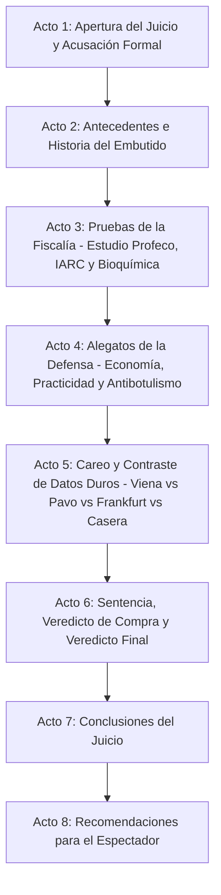

# Guion: "Salchichas: ¿Proteína económica o embutido ultraprocesado de riesgo?"

**Canal de YouTube:** `@JuicioAlimentoApetecible`  
**Serie / Formato:** Juicio Alimento Apetecible  
**Género:** Drama judicial divulgativo / Ciencia de los alimentos / Debate nutricional  
**Duración estimada:** 19:00 – 23:00 minutos  

---

## 1. Resumen del Video

En este episodio de "Juicio Alimento Apetecible", Beto y Beti sientan en el banquillo de los acusados a uno de los embutidos más populares, prácticos y controvertidos en los hogares latinoamericanos: **La Salchicha** (Viena, Frankfurt, de Pavo y para Hot Dog).

Beto, en su papel de fiscal e ingeniero bioquímico, fundamenta su acusación técnica en el riguroso **Estudio de Calidad de la Procuraduría Federal del Consumidor (Profeco) publicado en la Revista del Consumidor**, complementado con dictámenes de la **Agencia Internacional para la Investigación del Cáncer (IARC / OMS)** sobre carnes procesadas (Grupo 1 de carcinógenos). Beto destapa la realidad de su formulación industrial: productos que se comercializan como "de pavo" pero contienen apenas un 4% de ave y están rellenos de pasta de carne mecánicamente deshuesada (MDM), almidones, féculas, proteína de soya y hasta un 70% de agua retenida mediante polifosfatos. Asimismo, expone el peligro toxicológico de los **nitritos y nitratos de sodio** (aditivos de curado que forman nitrosaminas cancerígenas bajo calor intenso), marcas que rebasaron el límite legal de nitritos (como *Bafar Viena* y *Parma Sabori con pavo*), marcas que mintieron en su porcentaje proteico (*Capistrano*, *Bernina*) y el brutal exceso de sodio que satura el sistema cardiovascular.

Por su parte, Beti encabeza una elocuente defensa desde la perspectiva del consumidor cotidiano: demuestra que la salchicha es una de las fuentes de proteína más económicas, accesibles, rápidas de preparar y rendidoras para familias trabajadoras y estudiantes con presupuestos ajustados. Resalta la garantía de inocuidad microbiológica industrial: la adición controlada de nitrito de sodio previene el crecimiento letal de la bacteria *Clostridium botulinum* (causante del botulismo), permitiendo una conservación prolongada sin refrigeración extrema en cadenas de suministro populares.

El juicio culmina con un careo frontal de datos duros, el testimonio personificado de la Salchicha en el estrado, un veredicto equilibrado y una guía práctica de compra para que el consumidor aprenda a identificar salchichas de músculo genuino frente a formulaciones engañosas cargadas de agua, soya y almidón.

---

## 2. Esquema del Resumen Estructurado en Actos

* **Acto 1: Apertura del Juicio y Acusación Formal (00:00 – 02:20)**  
  Planteamiento del caso judicial. Beto presenta los cargos: publicidad engañosa ("con pavo" vs "de pavo"), carne mecánicamente deshuesada, adición de nitritos generadores de nitrosaminas y exceso de sodio. Beti declara la inocencia del embutido por su rol en la nutrición popular y la economía doméstica.
* **Acto 2: Antecedentes e Historia (02:20 – 05:10)**  
  Origen histórico: las salchichas artesanales de Frankfurt y Viena (siglos XV-XIX), concebidas para el aprovechamiento integral de cortes cárnicos. La transición a la mecanización del siglo XX: invención del deshuese mecánico (MDM), emulsiones cárnicas ultraprocesadas y uso de tripas artificiales de celulosa y colágeno.
* **Acto 3: Pruebas de la Fiscalía (05:10 – 09:45)**  
  Presentación del estudio de Profeco. Radiografía de marcas: productos con exceso de nitritos (*Bafar Viena*, *Parma Sabori*), falsedades en declaración de proteína (*Capistrano*, *Bernina*), salchichas donde el agua y el almidón superan el 60% del peso, y la clasificación de la OMS / IARC sobre carnes ultraprocesadas y cáncer colorrectal.
* **Acto 4: Alegatos de la Defensa (09:45 – 14:10)**  
  Defensa de la practicidad (hot dog o huevos con salchicha en 3 minutos), costo accesible por gramo de proteína frente al corte fresco, versatilidad culinaria y la función protectora del nitrito de sodio contra *Clostridium botulinum*. Testimonio de la Salchicha en el estrado.
* **Acto 5: Careo y Contraste de Datos Duros (14:10 – 17:50)**  
  Tablas comparativas directas: Salchicha de Pavo auténtica vs. Salchicha Viena estándar vs. Salchicha para Hot Dog económica vs. Salchicha Frankfurt de pierna de cerdo. Análisis de aditivos: fosfatos retentores de agua, eritorbato de sodio, proteína de soya y carmín de cochinilla.
* **Acto 6: Sentencia, Veredicto de Compra y Veredicto Final (17:50 – 20:00)**  
  Absolución del cargo de "comida chatarra sin valor" y condena por simulación de ingredientes cárnicos y excesos de conservadores. Guía de compra: marcas con alto porcentaje de carne vs. marcas reprobadas con exceso de fécula y soya.
* **Acto 7: Conclusiones del Juicio (20:00 – 21:15)**  
  Resumen de los hechos probados. Infografía de balance de riesgos y beneficios.
* **Acto 8: Recomendaciones para el Espectador (21:15 – 22:30)**  
  Las 4 reglas de oro para comprar, cocinar (evitar quemar o freír al carbón para no disparar nitrosaminas) y racionar el consumo familiar.

---

## 3. Escaleta, Mediante una Tabla Estructurada en Actos / Escenas

| Acto | Escena | Nombre / Descripción | Duración Estimada |
| :--- | :--- | :--- | :--- |
| **Acto 1** | Escena 1 | Gancho Visual e Introducción: El chisporroteo del comal, el corte transversal y el mazo judicial | 00:00 – 00:45 |
| | Escena 2 | Declaración inicial y lectura de cargos de la Fiscalía (Beto) | 00:45 – 01:35 |
| | Escena 3 | Intervención inicial de la Defensa (Beti) y entrada de la Salchicha al estrado | 01:35 – 02:20 |
| **Acto 2** | Escena 4 | Contexto histórico: De las carnicerías de Frankfurt y Viena a la industrialización global | 02:20 – 03:40 |
| | Escena 5 | La ciencia de la emulsión cárnica: Proteína miofibrilar, pasta MDM y retención de agua | 03:40 – 05:10 |
| **Acto 3** | Escena 6 | Radiografía del Estudio Profeco: 37 marcas analizadas, nitritos y proteínas falsas | 05:10 – 06:50 |
| | Escena 7 | Lectura forense: El truco "con pavo al 4%", la fécula añadida y la soya de relleno | 06:50 – 08:20 |
| | Escena 8 | El veredicto toxicológico: Nitritos, nitrosaminas a alta temperatura y reporte IARC / OMS | 08:20 – 09:45 |
| **Acto 4** | Escena 9 | Valor alimentario, accesibilidad popular y la realidad económica del consumidor | 09:45 – 11:30 |
| | Escena 10 | Seguridad alimentaria: La barrera química contra el botulismo (*Clostridium botulinum*) | 11:30 – 12:50 |
| | Escena 11 | Testimonio del alimento acusado (Salchicha) en el banquillo de los testigos | 12:50 – 14:10 |
| **Acto 5** | Escena 12 | Tabla comparativa frontal: Pavo Real vs. Con Pavo vs. Viena Tradicional vs. Hot Dog Barata | 14:10 – 16:00 |
| | Escena 13 | El debate sobre aditivos: Fosfatos, eritorbato, sodio oculto y técnicas de cocción segura | 16:00 – 17:50 |
| **Acto 6** | Escena 14 | Sentencia judicial y veredicto de compra (Marcas aprobadas vs. marcas sancionadas) | 17:50 – 20:00 |
| **Acto 7** | Escena 15 | Resumen de los hechos probados y gráficos de la sentencia | 20:00 – 21:15 |
| **Acto 8** | Escena 16 | Alertas de salud, beneficios y las 4 reglas de oro del consumidor inteligente | 21:15 – 22:30 |

---

## 4. Ficha Técnica de Producción

* **Acusador (Fiscalía):**  
  **BETO** (Ingeniero bioquímico, especialista en nutrición y tecnología de alimentos. Tono científico, didáctico, objetivo, elocuente y respetuoso. Viste traje formal gris carbón con camisa blanca y porta carpetas con estudios de laboratorio toxicológico).
* **Defensora (Bancada de la Defensa):**  
  **BETI** (Joven profesionista trabajadora, madre de familia y cocinera cotidiana. Tono empático, alegre, pragmático, defensor de la economía y la practicidad del hogar. Viste conjunto casual formal moderno en tono azul zafiro).
* **El Acusado en el Estrado:**  
  **LA SALCHICHA** (Personificada / Salchicha tipo Viena con pequeña corbata roja en su empaque al vacío, sentada en el banquillo bajo foco cenital dramático).
* **Ambientación:**  
  Sala de tribunal judicial moderna con páneles de madera y pantallas LED de análisis bromatológico, microscopía de emulsiones cárnicas, tablas de laboratorio de Profeco y una mesa de pruebas con bisturí, probetas y placas Petri.
* **Estilo Audiovisual:**  
  Drama procesal judicial (*Law & Order*) fusionado con microdocumental de divulgación científica (*Explained* de Netflix), planos macro gastronómicos en cámara lenta (60 fps) y cortes dinámicos con humor inteligente.
* **Banda Sonora y Efectos:**  
  Golpes de mazo judicial con eco seco de madera (*¡CLACK!*), acordes de sintetizador tenso y chelos orquestales para la fiscalía, percusión ligera y guitarra acústica para las defensas de Beti, y sonido foley hiperrealista (chisporroteo de sartén, corte elástico de embutido, hervor de agua).
* **Indicaciones de Edición:**  
  Ritmo cinematográfico ágil. Animaciones dinámicas de sellos negros oficiales (NOM-051) e infografías flotantes con porcentajes de agua, soya, almidón y carne real.

---

## 5. Convención del Guion Técnico

* **[PLANO / VISUAL]:**  
  * `PG`: Plano General (vista panorámica de la sala judicial).
  * `PM`: Plano Medio (personaje de cintura para arriba).
  * `PP`: Primer Plano (rostro del personaje, enfatizando convicción o emoción).
  * `PD`: Primer Detalle (macro sobre la textura de la salchicha, lectura de ingredientes en etiqueta, golpe de mazo, medidor de nitritos).
* **[CÁMARA / MOVIMIENTO DE CÁMARA]:** Slider lateral, Dolly frontal in/out, Paneo (pan), Tilt up/down, Barrido dinámico (whip pan).
* **[ILUMINACIÓN / FILTROS]:** Luz fría judicial (5600K) en momentos de acusación técnica, Luz cálida gourmet (3200K) en tomas culinarias, Foco cenital directo sobre el acusado.
* **[AUDIO / SFX / MÚSICA]:** Sonido foley, música incidental dramática, golpes de mazo (*¡BOOM!*), campana de tribunal (*doink-doink*), suspenso de bajo electrónico.
* **[TEXTO EN PANTALLA / GRÁFICOS / ANIMACIONES]:** Infografías 2D/3D con desglose de ingredientes cárnicos, tablas oficiales Profeco, sellos de advertencia NOM-051 y citas de normas (NOM-158-SCFI-2003, IARC / OMS Grupo 1).

---

## 6. Guion Técnico Profesional Muy Detallado

### ACTO 1: APERTURA DEL JUICIO Y ACUSACIÓN FORMAL (00:00 – 02:20)

#### Escena 1 (00:00 – 00:45) — Gancho Visual e Introducción
* **Plano / Visual:** [PD] a 60 fps: Una salchicha dorada chisporrotea sobre una plancha caliente con marcas de parrilla; al cortarse al sesgo, suelta vapor y jugo caliente. Corte rápido a una salchicha fría colocada sobre una tabla de laboratorio donde un bisturí la presiona, mostrando cómo el agua y la fécula rezuman de la pasta compactada.
* **Cámara / Movimiento de cámara:** Slider frontal en macro; corte abrupto con zoom digital hacia el mazo judicial sobre el estrado.
* **Iluminación / Filtros:** Luz cálida gastronómica (3200K) que cambia de golpe a luz fría judicial de alta tensión (5600K).
* **Audio / SFX / Música:** Sonido de fritura intensa (*tsss-sizzle*) y chasquido de piel elástica al romperse. Inmediatamente, golpe seco de mazo judicial con eco en sala (*¡CLACK-BOOM!*). Entra tema musical de tensión judicial con bajo pulsante y cuerdas graves.
* **Texto en Pantalla / Gráficos / Animaciones:** Título animado en tipografía metálica roja y blanca: *"CASO Nº 59: SALCHICHAS: ¿PROTEÍNA ECONÓMICA O EMBUTIDO ULTRAPROCESADO DE RIESGO?"*.

#### Escena 2 (00:45 – 01:35) — Declaración Inicial de la Fiscalía (Beto)
* **Plano / Visual:** [PM] de Beto de pie junto a la mesa de la Fiscalía, abriendo un expediente con sellos oficiales de Profeco y la OMS. Pasa a [PP] de Beto mirando fijamente a cámara con expresión severa e inquisitiva.
* **Cámara / Movimiento de cámara:** Dolly-in lento cerrando el plano sobre el rostro de Beto para enfatizar la autoridad del argumento.
* **Iluminación / Filtros:** Tono sobrio, luz lateral blanca neutra con reflector plateado.
* **Audio / SFX / Música:** Sonido de hojas de expediente al abrirse. Música de fondo con pulso rítmico de reloj (*tick-tock* electrónico de investigación).
* **Texto en Pantalla / Gráficos / Animaciones:** Lower third: *"BETO — Ingeniero Bioquímico / Fiscalía de Alimentos"*. Gráfico animado a la derecha: *"CARGOS: Simulación de Pavo (4% Real), Exceso de Nitritos Tóxicos, Relleno de Almidón/Soya, Clasificación IARC Grupo 1"*.

#### Escena 3 (01:35 – 02:20) — Intervención Inicial de la Defensa y el Acusado en el Estrado
* **Plano / Visual:** [PG] del tribunal mostrando la mesa de la defensa donde Beti sonríe con serenidad, y en el banco de testigos, bajo un foco cenital, un paquete de salchichas Viena con corbata roja miniatura.
* **Cámara / Movimiento de cámara:** Paneo rápido (Whip pan) desde la mesa de Beto hacia la mesa de Beti, terminando en [PP] del empaque de salchichas.
* **Iluminación / Filtros:** Luz cenital dirigida sobre las salchichas; luz ambiental cálida sobre Beti para proyectar empatía y cercanía.
* **Audio / SFX / Música:** Golpe seco de campana judicial (*Doink-Doink*). Música transiciona a un tono más vivaz con guitarra acústica ligera.
* **Texto en Pantalla / Gráficos / Animaciones:** Lower third: *"BETI — Defensora del Consumidor Cotidiano"*. Placa de identificación sobre el banquillo: *"ACUSADO: Salchicha Comercial (Viena, Pavo, Frankfurt)"*.

---

### ACTO 2: ANTECEDENTES E HISTORIA (02:20 – 05:10)

#### Escena 4 (02:20 – 03:40) — Contexto Histórico: De los Gremios Europeos a la Producción Masiva
* **Plano / Visual:** [PM] de Beto caminando hacia una mesa lateral con un mortero tradicional, tripas naturales de cerdo y cortes de carne magra. B-roll de litografías alemanas del siglo XIX.
* **Cámara / Movimiento de cámara:** Travelling lateral fluido en semicírculo siguiendo el desplazamiento de Beto.
* **Iluminación / Filtros:** Filtro sepia cálido suave con textura artesanal europea.
* **Audio / SFX / Música:** Música instrumental clásica ligera de cuerda y viento. Sonido foley de picado manual de carne con cuchillo de carnicero.
* **Texto en Pantalla / Gráficos / Animaciones:** Mapa histórico animado: *"Frankfurt (Alemania, s. XV) y Viena (Austria, s. XIX). Creación de la Wiener Würstchen: carne de cerdo y res embutida en tripa de oveja y ahumada al roble"*.

#### Escena 5 (03:40 – 05:10) — La Ciencia de la Emulsión Cárnica Industrial
* **Plano / Visual:** [PP] de Beto mostrando un bloque de carne mecánicamente deshuesada (MDM) y recipientes con polifosfatos, fécula de maíz y proteína vegetal texturizada de soya. Corte a animación 3D de una emulsión cárnica donde el agua y la grasa quedan atrapadas por las proteínas miofibrilares.
* **Cámara / Movimiento de cámara:** Zoom óptico continuo hacia las probetas de aditivos y corte por barrido a la animación molecular 3D.
* **Iluminación / Filtros:** Luz fría azulada de laboratorio bioquímico (5600K).
* **Audio / SFX / Música:** Sonido mecánico de cutter industrial de alta velocidad (*whirrr-blend*) y pitido de laboratorio. Música de misterio científico.
* **Texto en Pantalla / Gráficos / Animaciones:** Animación 3D interactiva: *"EMULSIÓN CÁRNICA INDUSTRIAL: Proteínas miofibrilares solubilizadas con sal + Grasa en suspensión + Polifosfatos (capturan hasta 70% de agua) + Almidones y Soya para dar firmeza mecánica"*.

---

### ACTO 3: PRUEBAS DE LA FISCALÍA (05:10 – 09:45)

#### Escena 6 (05:10 – 06:50) — Radiografía del Estudio Profeco
* **Plano / Visual:** [PM] de Beto proyectando en una pantalla gigante táctil el informe de calidad de la *Revista del Consumidor* sobre 37 marcas de salchichas. En la mesa forense se despliegan paquetes reales de *Bafar Viena*, *Parma Sabori*, *Capistrano*, *Bernina*, *Fud* y *San Rafael*.
* **Cámara / Movimiento de cámara:** Travelling frontal hacia la pantalla con cortes rápidos en [PD] a las marcas analizadas.
* **Iluminación / Filtros:** Luz focalizada de alta intensidad sobre los paquetes de embutidos; gráficos digitales en rojo de advertencia.
* **Audio / SFX / Música:** Sonido digital de interfaz de datos (*glitch/beep*). Cuerdas graves en crescendo dramático.
* **Texto en Pantalla / Gráficos / Animaciones:** Infografía animada Profeco:
  * *"ESTUDIO PROFECO: 37 Marcas Analizadas (Viena, Pavo, Con Pavo, Frankfurt, Hot Dog)"*
  * *"NITRITOS EXCEDIDOS (> 156 mg/kg): Bafar Viena, Bafar Frankfurt, Parma Sabori con pavo"*
  * *"PROTEÍNA FALSA: Bafar Viena, Capistrano, Bernina de pavo (declaran más proteína de la real)"*.

#### Escena 7 (06:50 – 08:20) — Lectura Forense: La Trampa del "Con Pavo al 4%" y la Soya
* **Plano / Visual:** [PD] de la lupa forense sobre la lista de ingredientes diminuta de salchichas económicas. Corte a [PP] de Beto mostrando un trozo diminuto de pechuga de pavo frente a un gran tazón de fécula y pasta de pollo.
* **Cámara / Movimiento de cámara:** Macroenfoque deslizante sobre el orden de los ingredientes en el paquete.
* **Iluminación / Filtros:** Luz de lupa de aumento con anillo LED blanco neutro.
* **Audio / SFX / Música:** Zumbido sutil de alarma de advertencia (*warning beep*).
* **Texto en Pantalla / Gráficos / Animaciones:** Gráfico comparativo de Profeco:
  * *"DENOMINACIÓN ENGAÑOSA:*
    * *'DE PAVO': Debe contener únicamente carne de pavo como ingrediente cárnico.*
    * *'CON PAVO': Contiene mezclas de pollo, cerdo o res... ¡y en algunos casos apenas 4% de pavo real!"*
  * *"RELLENOS DECLARADOS: Hasta 18% de fécula de maíz y proteína aislada de soya para abaratar costos"*.

#### Escena 8 (08:20 – 09:45) — El Veredicto Toxicológico: Nitritos, Nitrosaminas e IARC/OMS
* **Plano / Visual:** [PP] de Beto encendiendo un mechero y chamuscando una salchicha hasta quemar la costra exterior. En la pantalla lateral aparece el informe de la OMS / IARC clasificando a las carnes procesadas en el **Grupo 1 de Carcinógenos**.
* **Cámara / Movimiento de cámara:** Plano en contrapicado leve para magnificar la advertencia médica.
* **Iluminación / Filtros:** Tono rojizo tenue de alerta médica en el fondo de la sala.
* **Audio / SFX / Música:** Sonido de latido cardíaco acelerado (*lub-dub*) combinado con notas de bajo orquestal siniestro.
* **Texto en Pantalla / Gráficos / Animaciones:** Reacción Química en Pantalla:
  * *"Nitrito de Sodio (NaNO2) + Aminas de la Carne + Calor Intenso (> 130°C / Fritura / Asado) = NITROSAMINAS (Compuestos mutagénicos y carcinógenos)"*.
  * *"IARC / OMS (Monografía 114): Consumo continuo de 50 g diarios de carne procesada incrementa 18% el riesgo relativo de cáncer colorrectal"*.

---

### ACTO 4: ALEGATOS DE LA DEFENSA (09:45 – 14:10)

#### Escena 9 (09:45 – 11:30) — Valor Alimentario, Economía y la Realidad Popular
* **Plano / Visual:** [PM] de Beti poniéndose de pie con energía. En su mesa prepara rápidamente un platillo de huevos revueltos con salchicha y un plato de lentejas con salchicha picada, mostrando comida humeante y apetecible en menos de 5 minutos.
* **Cámara / Movimiento de cámara:** Travelling lateral dinámico siguiendo a Beti mientras camina hacia el centro de la sala.
* **Iluminación / Filtros:** Luz cálida, reconfortante y familiar (3800K).
* **Audio / SFX / Música:** Tema de jazz suave o piano acústico con percusión rítmica que transmite calidez y sensatez.
* **Texto en Pantalla / Gráficos / Animaciones:** Gráfico comparativo de Rendimiento Económico:
  * *"COSTO POR GRAMO DE PROTEÍNA: Salchicha económica = 3 a 4 veces más barata que cortes magros frescos de res o ternera.*
  * *TIEMPO DE PREPARACIÓN: 3 a 5 minutos.*
  * *RENDIMIENTO FAMILIAR: 1 paquete alimenta a 4 personas en preparaciones con legumbres y huevo"*.

#### Escena 10 (11:30 – 12:50) — Seguridad Alimentaria: La Barrera Antibotulínica
* **Plano / Visual:** [PP] de Beti sosteniendo una probeta sellada con una etiqueta de advertencia biológica que dice *Clostridium botulinum*. Corte a infografía histórica sobre intoxicaciones botulínicas medievales por embutidos sin curar.
* **Cámara / Movimiento de cámara:** Plano alternado rápido entre la expresión firme de Beti y los gráficos de bacteriología médica.
* **Iluminación / Filtros:** Luz blanca cristalina de laboratorio de microbiología.
* **Audio / SFX / Música:** Efecto de confirmación positiva (*chime*) y música de resolución técnica impecable.
* **Texto en Pantalla / Gráficos / Animaciones:** Cuadro de Seguridad Microbiológica:
  * *"EL NITRITO DE SODIO NO ES UN CAPRICHO COSMÉTICO:*
    * *Inhibe la germinación de esporas de Clostridium botulinum (productoras de la toxina botulínica, una de las neurotoxinas más letales del planeta).*
    * *Previene la rancidez de las grasas y fija el color rosado característico.*
    * *En dosis reguladas (NOM-158 / Codex), su beneficio protector supera el riesgo bacteriológico"*.

#### Escena 11 (12:50 – 14:10) — Testimonio del Alimento Acusado en el Banquillo
* **Plano / Visual:** [PP] de la salchicha en el banquillo de los acusados. Plano subjetivo de Beti interrogando al embutido con respeto profesional y empatía.
* **Cámara / Movimiento de cámara:** Zoom lento hacia el paquete de salchichas mientras una voz en off habla en primera persona con tono modesto y sincero.
* **Iluminación / Filtros:** Foco cenital puntual con halo tenue.
* **Audio / SFX / Música:** Cello solista nostálgico y sincero. Sonido sutil de plástico al acomodarse.
* **Texto en Pantalla / Gráficos / Animaciones:** Placa en pantalla: *"DECLARACIÓN DEL ACUSADO: 'Nací hace siglos para aprovechar cada gramo de alimento sin desperdiciar nada; no soy un filete de lujo, soy una solución práctica para la cena de quien llega exhausto a casa'"*.

---

### ACTO 5: CAREO Y CONTRASTE DE DATOS DUROS (14:10 – 17:50)

#### Escena 12 (14:10 – 16:00) — Tabla Comparativa Frontal de Variedades
* **Plano / Visual:** [PG] de la sala con Beto y Beti frente a frente ante la gran mesa interactiva de datos, donde se proyectan probetas con gramos de proteína real, grasa saturada, saleros con sodio y bandejas con almidón.
* **Cámara / Movimiento de cámara:** Paneos cruzados rápidos (Over-the-shoulder) entre Beto y Beti durante el debate.
* **Iluminación / Filtros:** Alto contraste equilibrado (azul analítico para Beto, naranja cálido para Beti).
* **Audio / SFX / Música:** Duelo musical con percusión rítmica y cuerdas staccato de confrontación dialéctica.
* **Texto en Pantalla / Gráficos / Animaciones:** Tabla comparativa oficial (por pieza promedio de 50 g / 1 salchicha):
  * *"Salchicha de Pavo 100% Genuina: 60-70 kcal | 7.5 g proteína | 3.5 g grasa | 400 mg sodio | 0.5 g almidón"*
  * *"Salchicha 'Con Pavo' Comercial: 90-110 kcal | 4.5 g proteína | 7.0 g grasa | 480 mg sodio | 4.0 g almidón/soya"*
  * *"Salchicha Viena Tradicional: 110-130 kcal | 5.0 g proteína | 9.5 g grasa | 520 mg sodio | 3.5 g almidón"*
  * *"Salchicha Frankfurt (Pierna Cerdo): 140-160 kcal | 7.0 g proteína | 12.0 g grasa | 550 mg sodio | Ahumada real"*
  * *"Salchicha Económica Hot Dog: 85-95 kcal | 3.5 g proteína | 5.5 g grasa | 580 mg sodio | 7.0 g almidón/agua"*.

#### Escena 13 (16:00 – 17:50) — El Debate sobre Aditivos y Métodos de Cocción Segura
* **Plano / Visual:** [PP] de Beto mostrando dos sartenes: una donde una salchicha se hierve en agua suavemente y otra donde se fríe al carbón hasta carbonizarse.
* **Cámara / Movimiento de cámara:** Travelling circular envolvente a 360 grados alrededor de las sartenes de prueba.
* **Iluminación / Filtros:** Iluminación focalizada de estudio forense gastronómico.
* **Audio / SFX / Música:** Pausas dramáticas sincronizadas con las intervenciones argumentativas de ambos personajes.
* **Texto en Pantalla / Gráficos / Animaciones:** Guía Técnica de Cocción Segura:
  * *"COCCIÓN AL VAPOR O HERVIDO: < 100°C -> No produce pirolisis ni acelera la formación de nitrosaminas."*
  * *"FRITURA EXTREMA / CARBÓN: > 150°C -> Dispara la formación de nitrosaminas y aminas heterocíclicas.*
  * *CONSEJO BIOQUÍMICO: Acompañar con alimentos ricos en Vitamina C (ácido ascórbico), que bloquea la formación de nitrosaminas en el estómago"*.

---

### ACTO 6: SENTENCIA, VEREDICTO DE COMPRA Y VEREDICTO FINAL (17:50 – 20:00)

#### Escena 14 (17:50 – 20:00) — Sentencia Judicial y Veredicto de Compra
* **Plano / Visual:** [PG] del tribunal en silencio solemne. Beto y Beti se colocan frente al estrado del juez. Aparece el mazo sobre la pantalla principal con el sello de veredicto.
* **Cámara / Movimiento de cámara:** Dolly-in majestuoso desde plano general hasta plano conjunto de Beto y Beti asintiendo con respeto mutuo.
* **Iluminación / Filtros:** Luz dorada cenital de resolución y conclusión formal.
* **Audio / SFX / Música:** Tres golpes de mazo secos e imponentes (*¡CLACK! ¡CLACK! ¡CLACK!*). Música triunfal y reflexiva de cierre de juicio.
* **Texto en Pantalla / Gráficos / Animaciones:** Cuadro de Veredicto de Compra Profeco:
  * *"VEREDICTO: ABSUELTA de ser veneno; CONDENADA por simulación comercial (falsos pavos) y exceso de conservadores en marcas reprobadas."*
  * *"GUÍA DE COMPRA INTELIGENTE:*
    * *1. Lee la denominación: busca 'Salchicha DE Pavo' o 'Salchicha DE Cerdo' (primer ingrediente = carne de músculo), evita productos donde el primer ingrediente sea agua o fécula.*
    * *2. Proteína real: elige marcas con al menos 6 g a 8 g de proteína por pieza de 50 g.*
    * *3. Evita marcas que rebasaron nitritos en laboratorio Profeco (como Bafar Viena o Parma Sabori con pavo).*
    * *4. Frecuencia de consumo: máximo 1 a 2 piezas, 1 a 2 veces por semana, jamás como fuente proteica diaria exclusiva"*.

---

### ACTO 7: CONCLUSIONES DEL JUICIO (20:00 – 21:15)

#### Escena 15 (20:00 – 21:15) — Resumen Ejecutivo y Gráficos de Sentencia
* **Plano / Visual:** [PM] de Beto y Beti compartiendo el mismo encuadre en plano medio, alternando sus conclusiones de forma armónica y didáctica.
* **Cámara / Movimiento de cámara:** Cámara estática sobre tripié con balance simétrico perfecto.
* **Iluminación / Filtros:** Luz suave de estudio de televisión de alta gama (4500K).
* **Audio / SFX / Música:** Base rítmica moderna y sofisticada en decrescendo hacia el cierre.
* **Texto en Pantalla / Gráficos / Animaciones:** Gráfico infográfico animado de 3 pilares: *"1. CALIDAD CÁRNICA: Hay un abismo entre una salchicha de pechuga de pavo/cerdo y una pasta de agua con fécula y soya. 2. SEGURIDAD: El nitrito protege del botulismo, pero exige cocción moderada (hervir/asar suave, nunca carbonizar). 3. FRECUENCIA: La salchicha es un recurso ocasional de practicidad, no la base de la alimentación"*.

---

### ACTO 8: RECOMENDACIONES PARA EL ESPECTADOR (21:15 – 22:30)

#### Escena 16 (21:15 – 22:30) — Alertas de Salud y Las 4 Reglas de Oro
* **Plano / Visual:** [PP] de Beto y Beti despidiéndose del público, con gráficos dinámicos que van apareciendo en cuadrantes laterales mientras señalan a la cámara.
* **Cámara / Movimiento de cámara:** Zoom lento hacia adelante terminando en una toma limpia de ambos personajes.
* **Iluminación / Filtros:** Tono cálido, amigable y profesional.
* **Audio / SFX / Música:** Cierre musical con acorde brillante y notas de salida del canal.
* **Texto en Pantalla / Gráficos / Animaciones:** Cuadrantes de advertencia y recomendación:
  * *"1. Prioriza 'DE pavo' sobre 'CON pavo'"*
  * *"2. Cocina al vapor o dorada a fuego medio (nunca frita al extremo ni quemada al carbón)"*
  * *"3. Acompáñala con alimentos ricos en Vitamina C y fibra (jitomate, limón, pimientos, ensalada)"*
  * *"4. Botón de Suscripción animado: @JuicioAlimentoApetecible - Dale Like y comenta tu marca favorita"*.

---

## 7. Guion Literario Profesional Detallado

### ACTO 1: APERTURA DEL JUICIO Y ACUSACIÓN FORMAL (00:00 – 02:20)

#### Escena 1 (00:00 – 00:45) — Gancho Visual e Introducción
**Acción:**  
En un primer plano cinematográfico, una salchicha dorada sobre una plancha caliente se parte con un crujido elástico, liberando vapor aromático. Corte rápido a una mesa de laboratorio donde un bisturí corta una salchicha industrial barata y expone una masa homogénea de fécula, agua y pasta rosada. De pronto, un golpe de mazo judicial sacude el tribunal.

**BETO**  
*(Al público, tono firme, mirando fijamente a la cámara)*  
Rápida, sabrosa, salvadora de desayunos y cenas cuando no hay tiempo de cocinar. Pero bajo esa piel uniforme y ese apetecible color rosado se esconde una de las mayores incógnitas de la industria alimentaria: ¿estás comiendo carne de verdad o una mezcla ultraprocesada de agua, fécula de maíz, soya y pasta de huesos? Bienvenidos a *Juicio Alimento Apetecible*. Hoy sentamos en el banquillo a: Las Salchichas.

---

#### Escena 2 (00:45 – 01:35) — Declaración Inicial de la Fiscalía (Beto)
**Acción:**  
Beto camina con paso firme hacia el estrado sosteniendo el expediente con los estudios de Profeco y la monografía de la Organización Mundial de la Salud.

**BETO**  
*(Beto, acusador y solemne, señalando al acusado)*  
Señores del jurado: la Fiscalía acusa formalmente a las salchichas comerciales de fraude nutricional y riesgo toxicológico acumulativo. Demostraremos, con base en el Estudio de Calidad de la Profeco, que múltiples marcas en el mercado engañan al consumidor vendiendo productos "con pavo" que apenas contienen un cuatro por ciento de ave; que agregan hasta un setenta por ciento de agua y almidones para inflar el peso; que marcas reconocidas han rebasado los límites máximos permitidos de nitrito de sodio; y que la OMS clasifica a los embutidos ultraprocesados en el Grupo 1 de carcinógenos cuando se consumen de manera cotidiana.

---

#### Escena 3 (01:35 – 02:20) — Intervención Inicial de la Defensa (Beti)
**Acción:**  
Beti se pone de pie con elegancia y seguridad. Coloca una mano sobre el paquete de salchichas en el banquillo y mira al jurado con empatía y calidez.

**BETI**  
*(Beti, empática y enérgica, con tono conciliador)*  
¡Un momento, Beto! No podemos juzgar a la salchicha desde la torre de marfil de quien puede comprar cortes finos de carne todos los días. Para millones de familias trabajadoras, estudiantes y madres que preparan el almuerzo en cinco minutos antes de salir a la escuela, la salchicha es una fuente de proteína accesible, práctica y deliciosa que no requiere horas de cocción. Además, señor Fiscal, olvidas el papel crucial de la tecnología de alimentos: la adición regulada de sales de curado previene el **botulismo**, una de las infecciones bacterianas más mortales de la historia humana. ¡La salchicha no es un veneno, es una solución gastronómica y popular!

---

### ACTO 2: ANTECEDENTES E HISTORIA (02:20 – 05:10)

#### Escena 4 (02:20 – 03:40) — Contexto Histórico: De los Gremios a la Producción Masiva
**Acción:**  
Beto se aproxima a una mesa antigua de carnicería tradicional con cortes de cerdo magro, pimienta en grano y tripas naturales. En pantalla se muestran grabados de Fráncfort del Meno y Viena del siglo XIX.

**BETO**  
*(Beto, didáctico y reflexivo, mostrando los cortes tradicionales)*  
Para entender a la acusada, debemos regresar a los gremios de carniceros de Frankfurt en el siglo quince y a Viena en 1805, cuando el carnicero Johann Georg Lahner combinó carne magra de cerdo y res picada finamente con especias y la embutió en tripa de cordero para ahumarla al roble. Era un método brillante de conservación y aprovechamiento integral de cortes cárnicos de alta calidad.

**BETI**  
*(Beti, interviniendo con una sonrisa)*  
Y esa tradición artesanal cruzó el océano con los inmigrantes alemanes a Estados Unidos a finales del siglo diecinueve, naciendo el clásico *hot dog* que alimentó a las masas obreras durante la revolución industrial. ¡Una comida económica que construyó ciudades!

---

#### Escena 5 (03:40 – 05:10) — La Ciencia de la Emulsión Cárnica Industrial
**Acción:**  
Beto sostiene una probeta con agua turbia y fécula, y en una pantalla táctil muestra la estructura microscópica de una pasta de carne mecánicamente deshuesada (MDM).

**BETO**  
*(Beto, analítico y riguroso, activando la animación 3D)*  
El problema, Beti, es lo que la industria moderna le hizo a esa receta noble. Hoy en día, muchas salchichas comerciales no se hacen con carne de pierna o lomo picada, sino mediante un proceso llamado **carne mecánicamente deshuesada** o pasta de pollo y pavo: carcasas y restos óseos prensados a alta presión. Para lograr que esa pasta retenga agua, añaden **polifosfatos**, que actúan como esponjas químicas capaces de atrapar hasta un 70% de agua añadida; y para darle firmeza, agregan fécula de maíz y proteína aislada de soya.

**BETI**  
*(Beti, complementando con sensatez)*  
Es una emulsión cárnica, Beto: la sal solubiliza las proteínas miofibrilares para atrapar la grasa y el agua. Si está bien elaborada y declarada con honestidad en la etiqueta, sigue siendo una matriz proteica funcional y digerible.

---

### ACTO 3: PRUEBAS DE LA FISCALÍA (05:10 – 09:45)

#### Escena 6 (05:10 – 06:50) — Radiografía del Estudio Profeco
**Acción:**  
Beto pulsa la pantalla central. Se despliega el cuadro comparativo del Estudio de Calidad de la Profeco con 37 marcas analizadas en laboratorio.

**BETO**  
*(Beto, severo e implacable, señalando las marcas en la pantalla)*  
Vayamos a las pruebas del Laboratorio Nacional de Protección al Consumidor de Profeco. Al analizar 37 marcas comerciales, la autoridad encontró irregularidades graves:
1. **Marcas que rebasaron el límite legal de nitritos** (máximo 156 mg/kg permitido por norma): productos como **Bafar Viena**, **Bafar Frankfurt** y **Parma Sabori con pavo**. ¡El exceso de nitritos es una falta sanitaria directa!
2. **Marcas que mintieron en su contenido de proteína**: productos como **Capistrano clásica**, **Bafar Viena** y **Bernina de pavo**, que declaraban más proteína en la etiqueta de la que realmente tenían en el laboratorio.

**BETI**  
*(Beti, seria, tomando nota)*  
Esas marcas específicas deben corregir su formulación de inmediato y cumplir la ley, Beto. La fiscalización de Profeco es vital para limpiar el mercado de malos competidores.

---

#### Escena 7 (06:50 – 08:20) — Lectura Forense: La Trampa del "Con Pavo al 4%" y la Soya
**Acción:**  
Beto coloca dos paquetes frente a la cámara: uno que dice "Salchicha DE pavo" y otro que dice "Salchicha CON pavo".

**BETO**  
*(Beto, didáctico y contundente)*  
Atención aquí, consumidores: una sola palabra cambia todo.
* Si el empaque dice **"Salchicha DE Pavo"**, por norma mexicana debe contener exclusivamente carne de pavo como ingrediente cárnico.
* Pero si dice **"Salchicha CON Pavo"**, la industria utiliza pasta de pollo o recortes de cerdo como base... ¡y el estudio de Profeco reveló que algunas marcas apenas contienen un **cuatro por ciento de pavo real**! Te cobran el prestigio saludable del pavo cuando estás comprando pasta de pollo y almidón.

**BETI**  
*(Beti, asintiendo con convicción)*  
¡Excelente tip para el comprador! La preposición "CON" suele ser un escudo para esconder formulaciones más baratas. Hay que buscar siempre la preposición "DE".

---

#### Escena 8 (08:20 – 09:45) — El Veredicto Toxicológico: Nitritos, Nitrosaminas e IARC/OMS
**Acción:**  
Beto muestra una gráfica con la estructura química de una nitrosamina y la monografía 114 de la Agencia Internacional para la Investigación del Cáncer (IARC / OMS).

**BETO**  
*(Beto, en tono de máxima advertencia médica)*  
Y lo más delicado: el **nitrito de sodio**. Cuando una salchicha con nitritos se cocina a temperaturas muy altas —como freírla intensamente en aceite o quemarla directamente al carbón—, los nitritos reaccionan con las aminas secundarias de la carne formando **nitrosaminas**, compuestos altamente mutagénicos y carcinógenos. Por esta razón, la OMS / IARC clasificó a las carnes procesadas en el **Grupo 1 de carcinógenos**, demostrando que el consumo constante de 50 gramos diarios incrementa en un 18% el riesgo relativo de cáncer colorrectal.

---

### ACTO 4: ALEGATOS DE LA DEFENSA (09:45 – 14:10)

#### Escena 9 (09:45 – 11:30) — Valor Alimentario, Economía y la Realidad Popular
**Acción:**  
Beti muestra una sartén donde ha cocinado un guisado de papas con salchicha y un plato de frijoles charros con salchicha rebanada.

**BETI**  
*(Beti, apasionada y realista)*  
Beto, el reporte de la OMS habla de consumo excesivo, crónico y diario sin vegetales. Pero en la vida real, una familia no come salchichas en el vacío. Las salchichas se pican en un caldo de frijoles, se mezclan con huevo, se acompañan con verduras o se preparan para un convivio familiar de fin de semana. Es una fuente proteica que rinde cuatro veces más que comprar bistec para una familia de escasos recursos. No podemos culpar al alimento por la desigualdad económica ni por la falta de tiempo.

---

#### Escena 10 (11:30 – 12:50) — Seguridad Alimentaria: La Barrera Antibotulínica
**Acción:**  
Beti muestra un diagrama bacteriológico del *Clostridium botulinum* y su potente neurotoxina.

**BETI**  
*(Beti, contundente y científica)*  
Y sobre los nitritos: no se inventaron por maldad, Beto. En la Edad Media, cientos de personas morían envenenadas por comer embutidos caseros infectados con la bacteria anaerobia *Clostridium botulinum*. La toxina botulínica es tan letal que un solo microgramo puede matar a un adulto. El nitrito de sodio es el único conservador conocido capaz de frenar en seco la germinación de esas esporas letales. En dosis controladas bajo la norma, ¡los nitritos salvan miles de vidas de una intoxicación fulminante!

---

#### Escena 11 (12:50 – 14:10) — Testimonio del Alimento Acusado en el Banquillo
**Acción:**  
La cámara enfoca en primer plano el paquete de salchichas con corbata sobre el estrado de testigos.

**BETI**  
*(Beti, con solemnidad teatral)*  
Tiene la palabra la acusada.

**VOZ EN OFF / BETI (INTERPRETANDO A LA SALCHICHA)**  
*(Voz modesta, digna y directa)*  
"Soy la Salchicha. No soy un filete de corte gourmet ni pretendo serlo. Nací para que nada se desperdicie en la cocina y para que una familia con diez pesos pueda llevar un bocado caliente a la mesa en tres minutos. Si me compran hecha de pura fécula por ahorrarse unos centavos, o si me queman en el asador hasta dejarme negra, no me culpen a mí. ¡Júzguenme por lo que soy: un alimento práctico que debe comerse con moderación e inteligencia!"

---

### ACTO 5: CAREO Y CONTRASTE DE DATOS DUROS (14:10 – 17:50)

#### Escena 12 (14:10 – 16:00) — Tabla Comparativa Frontal de Variedades
**Acción:**  
Beto y Beti se colocan frente a la gran pantalla de datos para desglosar la tabla comparativa por pieza individual de 50 gramos.

**BETO**  
*(Beto, analítico y conciliador)*  
Pongamos los datos duros frente al público por cada pieza estándar de 50 gramos:

| Variedad de Salchicha | Calorías (kcal) | Proteína Real (g) | Grasa Total (g) | Sodio Promedio (mg) | Comentario de Calidad |
| :--- | :--- | :--- | :--- | :--- | :--- |
| **Salchicha DE Pavo Genuina** | 60 – 70 kcal | 7.0 – 8.0 g | 3.0 – 4.0 g | 380 – 420 mg | La mejor opción: alta proteína y menor grasa saturada. |
| **Salchicha "CON Pavo"** | 90 – 110 kcal | 4.5 – 5.5 g | 6.5 – 8.0 g | 450 – 500 mg | Base de pollo y cerdo; apenas rastro de pavo. |
| **Salchicha Viena Tradicional** | 110 – 130 kcal | 5.0 – 6.0 g | 9.0 – 11.0 g | 480 – 550 mg | Mayor contenido de grasa de cerdo y sodio elevado. |
| **Salchicha Frankfurt (Pierna)** | 135 – 155 kcal | 6.5 – 7.5 g | 11.0 – 13.0 g | 520 – 580 mg | Muy sabrosa y cárnica, pero alta en calorías y grasa. |
| **Salchicha Económica Hot Dog** | 80 – 95 kcal | 3.0 – 4.0 g | 4.5 – 6.0 g | 520 – 600 mg | Muy baja proteína; inflada con almidón, soya y agua. |

---

#### Escena 13 (16:00 – 17:50) — El Debate sobre Aditivos y Cocción Segura
**Acción:**  
Beto y Beti muestran cómo cocinar salchichas de forma segura en la cocina del hogar.

**BETO**  
*(Beto, explicando con demostración visual)*  
La ciencia nos da un consejo de oro: **la temperatura de cocción es crítica**. Si hierves la salchicha o la calientas a fuego medio en sartén con un poco de agua (sin llegar a quemar la superficie), la formación de nitrosaminas es prácticamente nula. Pero si la fríes a temperaturas extremas o la quemas en la parrilla, aceleras la reacción química nociva.

**BETI**  
*(Beti, añadiendo un tip nutricional)*  
Y un secreto bioquímico fascinante: la **Vitamina C (ácido ascórbico)** bloquea la formación de nitrosaminas en el estómago. Si comes salchicha, acompáñala con una salsa de jitomate fresco, unas gotas de limón o una ensalada verde. ¡La naturaleza tiene los antídotos!

---

### ACTO 6: SENTENCIA, VEREDICTO DE COMPRA Y VEREDICTO FINAL (17:50 – 20:00)

#### Escena 14 (17:50 – 20:00) — Sentencia Judicial y Veredicto de Compra
**Acción:**  
Beto y Beti se colocan frente al mazo judicial para emitir la sentencia unificada.

**BETO**  
*(Beto, con solemnidad y autoridad)*  
Llegó el momento del veredicto. Habiendo evaluado la evidencia científica y los análisis de Profeco:

**BETI**  
*(Beti, resolutiva y alegre)*  
Declaramos a la Salchicha: **ABSUELTA** de la acusación de ser un alimento tóxico o inútil, reconociendo su practicidad culinaria, su aporte proteico económico y su sólida barrera antibotulínica.

**BETO**  
*(Beto, firme e imparcial)*  
Pero la declaramos **CULPABLE** por el engaño en etiquetados de marcas que simulan pavo inexistente, por marcas que exceden los nitritos permitidos y por ser un embutido de riesgo cardiovascular y metabólico cuando se abusa de su consumo diario.

**BETI**  
*(Beti, presentando la infografía de compra)*  
Por tanto, emitimos el siguiente **Veredicto de Compra para el Consumidor**:
1. **Regla de oro de la etiqueta:** Busca siempre la denominación **"Salchicha DE pavo"** o **"Salchicha DE pierna de cerdo"**, y verifica que la carne sea el primer ingrediente en la lista, no el agua ni la fécula.
2. **Exige proteína real:** Elige marcas que aporten al menos **6 a 8 gramos de proteína** por pieza de 50 gramos.
3. **Evita marcas reprobadas:** Descarta marcas sancionadas por Profeco por exceso de nitritos o proteína falsa (*Bafar Viena*, *Parma Sabori con pavo*).
4. **Modera la frecuencia:** Limita su consumo a **1 o 2 veces por semana**, máximo 2 piezas por porción.

---

### ACTO 7: CONCLUSIONES DEL JUICIO (20:00 – 21:15)

#### Escena 15 (20:00 – 21:15) — Resumen Ejecutivo y Gráficos de Sentencia
**Acción:**  
Beto y Beti se dirigen al público en plano medio con tono pedagógico y cercano.

**BETO**  
*(Beto, reflexivo y claro)*  
En conclusión: la salchicha moderna es un prodigio de la ingeniería de alimentos, pero no todas las salchichas son iguales. Hay un abismo nutricional entre una salchicha de pechuga de pavo de calidad y una barra ultraprocesada de fécula, soya y agua retenida con fosfatos.

**BETI**  
*(Beti, sonriente)*  
Aprende a leer la etiqueta, cuida la técnica de cocción al cocinarla y disfrútala con balance en tu mesa.

---

### ACTO 8: RECOMENDACIONES PARA EL ESPECTADOR (21:15 – 22:30)

#### Escena 16 (21:15 – 22:30) — Alertas de Salud y Las 4 Reglas de Oro
**Acción:**  
Aparecen en pantalla los gráficos animados con las cuatro recomendaciones finales.

**BETO**  
*(Beto, despidiendo el programa)*  
Aquí están las **4 Reglas de Oro de Juicio Alimento Apetecible para las Salchichas**:
* **1. Prioriza 'DE pavo' sobre 'CON pavo'.**
* **2. Cocina al vapor o a fuego medio suave; jamás quemada o frita al extremo.**

**BETI**  
*(Beti, complementando)*  
* **3. Acompáñala siempre con fibra y Vitamina C** (jitomate, limón, ensaladas).
* **4. Pacientes con hipertensión arterial:** Cuidado estricto con el sodio oculto en todos los embutidos.

**BETO**  
*(Beto, sonriendo a la cámara)*  
Si este juicio te sirvió para comprar mejor en el supermercado, dale me gusta, suscríbete a *@JuicioAlimentoApetecible* y cuéntanos en los comentarios: ¿qué marca de salchichas compras en casa y qué alimento quieres en el próximo juicio?

**BETI**  
*(Beti, saludando)*  
¡Nos vemos en el próximo juicio de alimentos! ¡Buen provecho y compras inteligentes!

---

## 8. Guion Profesional con la Mezcla de Guion Técnico y Guion Literario

### ACTO 1: APERTURA DEL JUICIO Y ACUSACIÓN FORMAL (00:00 – 02:20)

#### Escena 1 (00:00 – 00:45) — Gancho Visual e Introducción
* **[PLANO / VISUAL]:** [PD] a 60 fps: Una salchicha dorada chisporrotea sobre una plancha caliente con marcas de parrilla; al cortarse al sesgo, suelta vapor y jugo caliente. Corte rápido a una salchicha fría colocada sobre una tabla de laboratorio donde un bisturí la presiona, mostrando cómo el agua y la fécula rezuman de la pasta compactada.
* **[CÁMARA / MOVIMIENTO DE CÁMARA]:** Slider frontal en macro; corte abrupto con zoom digital hacia el mazo judicial sobre el estrado.
* **[ILUMINACIÓN / FILTROS]:** Luz cálida gastronómica (3200K) que cambia de golpe a luz fría judicial de alta tensión (5600K).
* **[AUDIO / SFX / MÚSICA]:** Sonido de fritura intensa (*tsss-sizzle*) y chasquido de piel elástica al romperse. Inmediatamente, golpe seco de mazo judicial con eco en sala (*¡CLACK-BOOM!*). Entra tema musical de tensión judicial con bajo pulsante y cuerdas graves.
* **[TEXTO EN PANTALLA / GRÁFICOS / ANIMACIONES]:** Título animado en tipografía metálica roja y blanca: *"CASO Nº 59: SALCHICHAS: ¿PROTEÍNA ECONÓMICA O EMBUTIDO ULTRAPROCESADO DE RIESGO?"*.
* **ACCIÓN:**  
  En un primer plano cinematográfico, una salchicha dorada sobre una plancha caliente se parte con un crujido elástico, liberando vapor aromático. Corte rápido a una mesa de laboratorio donde un bisturí corta una salchicha industrial barata y expone una masa homogénea de fécula, agua y pasta rosada. De pronto, un golpe de mazo judicial sacude el tribunal.
* **DIÁLOGOS:**  
  **BETO**  
  *(Al público, tono firme, mirando fijamente a la cámara)*  
  Rápida, sabrosa, salvadora de desayunos y cenas cuando no hay tiempo de cocinar. Pero bajo esa piel uniforme y ese apetecible color rosado se esconde una de las mayores incógnitas de la industria alimentaria: ¿estás comiendo carne de verdad o una mezcla ultraprocesada de agua, fécula de maíz, soya y pasta de huesos? Bienvenidos a *Juicio Alimento Apetecible*. Hoy sentamos en el banquillo a: Las Salchichas.

---

#### Escena 2 (00:45 – 01:35) — Declaración Inicial de la Fiscalía
* **[PLANO / VISUAL]:** [PM] de Beto de pie junto a la mesa de la Fiscalía, abriendo un expediente con sellos oficiales de Profeco y la OMS. Pasa a [PP] de Beto mirando fijamente a cámara con expresión severa e inquisitiva.
* **[CÁMARA / MOVIMIENTO DE CÁMARA]:** Dolly-in lento cerrando el plano sobre el rostro de Beto para enfatizar la autoridad del argumento.
* **[ILUMINACIÓN / FILTROS]:** Tono sobrio, luz lateral blanca neutra con reflector plateado.
* **[AUDIO / SFX / MÚSICA]:** Sonido de hojas de expediente al abrirse. Música de fondo con pulso rítmico de reloj (*tick-tock* electrónico de investigación).
* **[TEXTO EN PANTALLA / GRÁFICOS / ANIMACIONES]:** Lower third: *"BETO — Ingeniero Bioquímico / Fiscalía de Alimentos"*. Gráfico animado a la derecha: *"CARGOS: Simulación de Pavo (4% Real), Exceso de Nitritos Tóxicos, Relleno de Almidón/Soya, Clasificación IARC Grupo 1"*.
* **ACCIÓN:**  
  Beto camina con paso firme hacia el estrado sosteniendo el expediente con los estudios de Profeco y la monografía de la Organización Mundial de la Salud.
* **DIÁLOGOS:**  
  **BETO**  
  *(Beto, acusador y solemne, señalando al acusado)*  
  Señores del jurado: la Fiscalía acusa formalmente a las salchichas comerciales de fraude nutricional y riesgo toxicológico acumulativo. Demostraremos, con base en el Estudio de Calidad de la Profeco, que múltiples marcas en el mercado engañan al consumidor vendiendo productos "con pavo" que apenas contienen un cuatro por ciento de ave; que agregan hasta un setenta por ciento de agua y almidones para inflar el peso; que marcas reconocidas han rebasado los límites máximos permitidos de nitrito de sodio; y que la OMS clasifica a los embutidos ultraprocesados en el Grupo 1 de carcinógenos cuando se consumen de manera cotidiana.

---

#### Escena 3 (01:35 – 02:20) — Intervención Inicial de la Defensa y el Acusado en el Estrado
* **[PLANO / VISUAL]:** [PG] del tribunal mostrando la mesa de la defensa donde Beti sonríe con serenidad, y en el banco de testigos, bajo un foco cenital, un paquete de salchichas Viena con corbata roja miniatura.
* **[CÁMARA / MOVIMIENTO DE CÁMARA]:** Paneo rápido (Whip pan) desde la mesa de Beto hacia la mesa de Beti, terminando en [PP] del empaque de salchichas.
* **[ILUMINACIÓN / FILTROS]:** Luz cenital dirigida sobre las salchichas; luz ambiental cálida sobre Beti para proyectar empatía y cercanía.
* **[AUDIO / SFX / MÚSICA]:** Golpe seco de campana judicial (*Doink-Doink*). Música transiciona a un tono más vivaz con guitarra acústica ligera.
* **[TEXTO EN PANTALLA / GRÁFICOS / ANIMACIONES]:** Lower third: *"BETI — Defensora del Consumidor Cotidiano"*. Placa de identificación sobre el banquillo: *"ACUSADO: Salchicha Comercial (Viena, Pavo, Frankfurt)"*.
* **ACCIÓN:**  
  Beti se pone de pie con elegancia y seguridad. Coloca una mano sobre el paquete de salchichas en el banquillo y mira al jurado con empatía y calidez.
* **DIÁLOGOS:**  
  **BETI**  
  *(Beti, empática y enérgica, con tono conciliador)*  
  ¡Un momento, Beto! No podemos juzgar a la salchicha desde la torre de marfil de quien puede comprar cortes finos de carne todos los días. Para millones de familias trabajadoras, estudiantes y madres que preparan el almuerzo en cinco minutos antes de salir a la escuela, la salchicha es una fuente de proteína accesible, práctica y deliciosa que no requiere horas de cocción. Además, señor Fiscal, olvidas el papel crucial de la tecnología de alimentos: la adición regulada de sales de curado previene el **botulismo**, una de las infecciones bacterianas más mortales de la historia humana. ¡La salchicha no es un veneno, es una solución gastronómica y popular!

---

### ACTO 2: ANTECEDENTES E HISTORIA (02:20 – 05:10)

#### Escena 4 (02:20 – 03:40) — Contexto Histórico: De los Gremios a la Producción Masiva
* **[PLANO / VISUAL]:** [PM] de Beto caminando hacia una mesa lateral con un mortero tradicional, tripas naturales de cerdo y cortes de carne magra. B-roll de litografías alemanas del siglo XIX.
* **[CÁMARA / MOVIMIENTO DE CÁMARA]:** Travelling lateral fluido en semicírculo siguiendo el desplazamiento de Beto.
* **[ILUMINACIÓN / FILTROS]:** Filtro sepia cálido suave con textura artesanal europea.
* **[AUDIO / SFX / MÚSICA]:** Música instrumental clásica ligera de cuerda y viento. Sonido foley de picado manual de carne con cuchillo de carnicero.
* **[TEXTO EN PANTALLA / GRÁFICOS / ANIMACIONES]:** Mapa histórico animado: *"Frankfurt (Alemania, s. XV) y Viena (Austria, s. XIX). Creación de la Wiener Würstchen: carne de cerdo y res embutida en tripa de oveja y ahumada al roble"*.
* **ACCIÓN:**  
  Beto se aproxima a una mesa antigua de carnicería tradicional con cortes de cerdo magro, pimienta en grano y tripas naturales. En pantalla se muestran grabados de Fráncfort del Meno y Viena del siglo XIX.
* **DIÁLOGOS:**  
  **BETO**  
  *(Beto, didáctico y reflexivo, mostrando los cortes tradicionales)*  
  Para entender a la acusada, debemos regresar a los gremios de carniceros de Frankfurt en el siglo quince y a Viena en 1805, cuando el carnicero Johann Georg Lahner combinó carne magra de cerdo y res picada finamente con especias y la embutió en tripa de cordero para ahumarla al roble. Era un método brillante de conservación y aprovechamiento integral de cortes cárnicos de alta calidad.  
  **BETI**  
  *(Beti, interviniendo con una sonrisa)*  
  Y esa tradición artesanal cruzó el océano con los inmigrantes alemanes a Estados Unidos a finales del siglo diecinueve, naciendo el clásico *hot dog* que alimentó a las masas obreras durante la revolución industrial. ¡Una comida económica que construyó ciudades!

---

#### Escena 5 (03:40 – 05:10) — La Ciencia de la Emulsión Cárnica Industrial
* **[PLANO / VISUAL]:** [PP] de Beto mostrando un bloque de carne mecánicamente deshuesada (MDM) y recipientes con polifosfatos, fécula de maíz y proteína vegetal texturizada de soya. Corte a animación 3D de una emulsión cárnica donde el agua y la grasa quedan atrapadas por las proteínas miofibrilares.
* **[CÁMARA / MOVIMIENTO DE CÁMARA]:** Zoom óptico continuo hacia las probetas de aditivos y corte por barrido a la animación molecular 3D.
* **[ILUMINACIÓN / FILTROS]:** Luz fría azulada de laboratorio bioquímico (5600K).
* **[AUDIO / SFX / MÚSICA]:** Sonido mecánico de cutter industrial de alta velocidad (*whirrr-blend*) y pitido de laboratorio. Música de misterio científico.
* **[TEXTO EN PANTALLA / GRÁFICOS / ANIMACIONES]:** Animación 3D interactiva: *"EMULSIÓN CÁRNICA INDUSTRIAL: Proteínas miofibrilares solubilizadas con sal + Grasa en suspensión + Polifosfatos (capturan hasta 70% de agua) + Almidones y Soya para dar firmeza mecánica"*.
* **ACCIÓN:**  
  Beto sostiene una probeta con agua turbia y fécula, y en una pantalla táctil muestra la estructura microscópica de una pasta de carne mecánicamente deshuesada (MDM).
* **DIÁLOGOS:**  
  **BETO**  
  *(Beto, analítico y riguroso, activando la animación 3D)*  
  El problema, Beti, es lo que la industria moderna le hizo a esa receta noble. Hoy en día, muchas salchichas comerciales no se hacen con carne de pierna o lomo picada, sino mediante un proceso llamado **carne mecánicamente deshuesada** o pasta de pollo y pavo: carcasas y restos óseos prensados a alta presión. Para lograr que esa pasta retenga agua, añaden **polifosfatos**, que actúan como esponjas químicas capaces de atrapar hasta un 70% de agua añadida; y para darle firmeza, agregan fécula de maíz y proteína aislada de soya.  
  **BETI**  
  *(Beti, complementando con sensatez)*  
  Es una emulsión cárnica, Beto: la sal solubiliza las proteínas miofibrilares para atrapar la grasa y el agua. Si está bien elaborada y declarada con honestidad en la etiqueta, sigue siendo una matriz proteica funcional y digerible.

---

### ACTO 3: PRUEBAS DE LA FISCALÍA (05:10 – 09:45)

#### Escena 6 (05:10 – 06:50) — Radiografía del Estudio Profeco
* **[PLANO / VISUAL]:** [PM] de Beto proyectando en una pantalla gigante táctil el informe de calidad de la *Revista del Consumidor* sobre 37 marcas de salchichas. En la mesa forense se despliegan paquetes reales de *Bafar Viena*, *Parma Sabori*, *Capistrano*, *Bernina*, *Fud* y *San Rafael*.
* **[CÁMARA / MOVIMIENTO DE CÁMARA]:** Travelling frontal hacia la pantalla con cortes rápidos en [PD] a las marcas analizadas.
* **[ILUMINACIÓN / FILTROS]:** Luz focalizada de alta intensidad sobre los paquetes de embutidos; gráficos digitales en rojo de advertencia.
* **[AUDIO / SFX / MÚSICA]:** Sonido digital de interfaz de datos (*glitch/beep*). Cuerdas graves en crescendo dramático.
* **[TEXTO EN PANTALLA / GRÁFICOS / ANIMACIONES]:** Infografía animada Profeco:
  * *"ESTUDIO PROFECO: 37 Marcas Analizadas (Viena, Pavo, Con Pavo, Frankfurt, Hot Dog)"*
  * *"NITRITOS EXCEDIDOS (> 156 mg/kg): Bafar Viena, Bafar Frankfurt, Parma Sabori con pavo"*
  * *"PROTEÍNA FALSA: Bafar Viena, Capistrano, Bernina de pavo (declaran más proteína de la real)"*.
* **ACCIÓN:**  
  Beto pulsa la pantalla central. Se despliega el cuadro comparativo del Estudio de Calidad de la Profeco con 37 marcas analizadas en laboratorio.
* **DIÁLOGOS:**  
  **BETO**  
  *(Beto, severo e implacable, señalando las marcas en la pantalla)*  
  Vayamos a las pruebas del Laboratorio Nacional de Protección al Consumidor de Profeco. Al analizar 37 marcas comerciales, la autoridad encontró irregularidades graves:
  1. **Marcas que rebasaron el límite legal de nitritos** (máximo 156 mg/kg permitido por norma): productos como **Bafar Viena**, **Bafar Frankfurt** y **Parma Sabori con pavo**. ¡El exceso de nitritos es una falta sanitaria directa!
  2. **Marcas que mintieron en su contenido de proteína**: productos como **Capistrano clásica**, **Bafar Viena** y **Bernina de pavo**, que declaraban más proteína en la etiqueta de la que realmente tenían en el laboratorio.  
  **BETI**  
  *(Beti, seria, tomando nota)*  
  Esas marcas específicas deben corregir su formulación de inmediato y cumplir la ley, Beto. La fiscalización de Profeco es vital para limpiar el mercado de malos competidores.

---

#### Escena 7 (06:50 – 08:20) — Lectura Forense: La Trampa del "Con Pavo al 4%" y la Soya
* **[PLANO / VISUAL]:** [PD] de la lupa forense sobre la lista de ingredientes diminuta de salchichas económicas. Corte a [PP] de Beto mostrando un trozo diminuto de pechuga de pavo frente a un gran tazón de fécula y pasta de pollo.
* **[CÁMARA / MOVIMIENTO DE CÁMARA]:** Macroenfoque deslizante sobre el orden de los ingredientes en el paquete.
* **[ILUMINACIÓN / FILTROS]:** Luz de lupa de aumento con anillo LED blanco neutro.
* **[AUDIO / SFX / MÚSICA]:** Zumbido sutil de alarma de advertencia (*warning beep*).
* **[TEXTO EN PANTALLA / GRÁFICOS / ANIMACIONES]:** Gráfico comparativo de Profeco:
  * *"DENOMINACIÓN ENGAÑOSA:*
    * *'DE PAVO': Debe contener únicamente carne de pavo como ingrediente cárnico.*
    * *'CON PAVO': Contiene mezclas de pollo, cerdo o res... ¡y en algunos casos apenas 4% de pavo real!"*
  * *"RELLENOS DECLARADOS: Hasta 18% de fécula de maíz y proteína aislada de soya para abaratar costos"*.
* **ACCIÓN:**  
  Beto coloca dos paquetes frente a la cámara: uno que dice "Salchicha DE pavo" y otro que dice "Salchicha CON pavo".
* **DIÁLOGOS:**  
  **BETO**  
  *(Beto, didáctico y contundente)*  
  Atención aquí, consumidores: una sola palabra cambia todo.
  * Si el empaque dice **"Salchicha DE Pavo"**, por norma mexicana debe contener exclusivamente carne de pavo como ingrediente cárnico.
  * Pero si dice **"Salchicha CON Pavo"**, la industria utiliza pasta de pollo o recortes de cerdo como base... ¡y el estudio de Profeco reveló que algunas marcas apenas contienen un **cuatro por ciento de pavo real**! Te cobran el prestigio saludable del pavo cuando estás comprando pasta de pollo y almidón.  
  **BETI**  
  *(Beti, asintiendo con convicción)*  
  ¡Excelente tip para el comprador! La preposición "CON" suele ser un escudo para esconder formulaciones más baratas. Hay que buscar siempre la preposición "DE".

---

#### Escena 8 (08:20 – 09:45) — El Veredicto Toxicológico: Nitritos, Nitrosaminas e IARC/OMS
* **[PLANO / VISUAL]:** [PP] de Beto encendiendo un mechero y chamuscando una salchicha hasta quemar la costra exterior. En la pantalla lateral aparece el informe de la OMS / IARC clasificando a las carnes procesadas en el **Grupo 1 de Carcinógenos**.
* **[CÁMARA / MOVIMIENTO DE CÁMARA]:** Plano en contrapicado leve para magnificar la advertencia médica.
* **[ILUMINACIÓN / FILTROS]:** Tono rojizo tenue de alerta médica en el fondo de la sala.
* **[AUDIO / SFX / MÚSICA]:** Sonido de latido cardíaco acelerado (*lub-dub*) combinado con notas de bajo orquestal siniestro.
* **[TEXTO EN PANTALLA / GRÁFICOS / ANIMACIONES]:** Reacción Química en Pantalla:
  * *"Nitrito de Sodio (NaNO2) + Aminas de la Carne + Calor Intenso (> 130°C / Fritura / Asado) = NITROSAMINAS (Compuestos mutagénicos y carcinógenos)"*.
  * *"IARC / OMS (Monografía 114): Consumo continuo de 50 g diarios de carne procesada incrementa 18% el riesgo relativo de cáncer colorrectal"*.
* **ACCIÓN:**  
  Beto muestra una gráfica con la estructura química de una nitrosamina y la monografía 114 de la Agencia Internacional para la Investigación del Cáncer (IARC / OMS).
* **DIÁLOGOS:**  
  **BETO**  
  *(Beto, en tono de máxima advertencia médica)*  
  Y lo más delicado: el **nitrito de sodio**. Cuando una salchicha con nitritos se cocina a temperaturas muy altas —como freírla intensamente en aceite o quemarla directamente al carbón—, los nitritos reaccionan con las aminas secundarias de la carne formando **nitrosaminas**, compuestos altamente mutagénicos y carcinógenos. Por esta razón, la OMS / IARC clasificó a las carnes procesadas en el **Grupo 1 de carcinógenos**, demostrando que el consumo constante de 50 gramos diarios incrementa en un 18% el riesgo relativo de cáncer colorrectal.

---

### ACTO 4: ALEGATOS DE LA DEFENSA (09:45 – 14:10)

#### Escena 9 (09:45 – 11:30) — Valor Alimentario, Economía y la Realidad Popular
* **[PLANO / VISUAL]:** [PM] de Beti poniéndose de pie con energía. En su mesa prepara rápidamente un platillo de huevos revueltos con salchicha y un plato de lentejas con salchicha picada, mostrando comida humeante y apetecible en menos de 5 minutos.
* **[CÁMARA / MOVIMIENTO DE CÁMARA]:** Travelling lateral dinámico siguiendo a Beti mientras camina hacia el centro de la sala.
* **[ILUMINACIÓN / FILTROS]:** Luz cálida, reconfortante y familiar (3800K).
* **[AUDIO / SFX / MÚSICA]:** Tema de jazz suave o piano acústico con percusión rítmica que transmite calidez y sensatez.
* **[TEXTO EN PANTALLA / GRÁFICOS / ANIMACIONES]:** Gráfico comparativo de Rendimiento Económico:
  * *"COSTO POR GRAMO DE PROTEÍNA: Salchicha económica = 3 a 4 veces más barata que cortes magros frescos de res o ternera.*
  * *TIEMPO DE PREPARACIÓN: 3 a 5 minutos.*
  * *RENDIMIENTO FAMILIAR: 1 paquete alimenta a 4 personas en preparaciones con legumbres y huevo"*.
* **ACCIÓN:**  
  Beti muestra una sartén donde ha cocinado un guisado de papas con salchicha y un plato de frijoles charros con salchicha rebanada.
* **DIÁLOGOS:**  
  **BETI**  
  *(Beti, apasionada y realista)*  
  Beto, el reporte de la OMS habla de consumo excesivo, crónico y diario sin vegetales. Pero en la vida real, una familia no come salchichas en el vacío. Las salchichas se pican en un caldo de frijoles, se mezclan con huevo, se acompañan con verduras o se preparan para un convivio familiar de fin de semana. Es una fuente proteica que rinde cuatro veces más que comprar bistec para una familia de escasos recursos. No podemos culpar al alimento por la desigualdad económica ni por la falta de tiempo.

---

#### Escena 10 (11:30 – 12:50) — Seguridad Alimentaria: La Barrera Antibotulínica
* **[PLANO / VISUAL]:** [PP] de Beti sosteniendo una probeta sellada con una etiqueta de advertencia biológica que dice *Clostridium botulinum*. Corte a infografía histórica sobre intoxicaciones botulínicas medievales por embutidos sin curar.
* **[CÁMARA / MOVIMIENTO DE CÁMARA]:** Plano alternado rápido entre la expresión firme de Beti y los gráficos de bacteriología médica.
* **[ILUMINACIÓN / FILTROS]:** Luz blanca cristalina de laboratorio de microbiología.
* **[AUDIO / SFX / MÚSICA]:** Efecto de confirmación positiva (*chime*) y música de resolución técnica impecable.
* **[TEXTO EN PANTALLA / GRÁFICOS / ANIMACIONES]:** Cuadro de Seguridad Microbiológica:
  * *"EL NITRITO DE SODIO NO ES UN CAPRICHO COSMÉTICO:*
    * *Inhibe la germinación de esporas de Clostridium botulinum (productoras de la toxina botulínica, una de las neurotoxinas más letales del planeta).*
    * *Previene la rancidez de las grasas y fija el color rosado característico.*
    * *En dosis reguladas (NOM-158 / Codex), su beneficio protector supera el riesgo bacteriológico"*.
* **ACCIÓN:**  
  Beti muestra un diagrama bacteriológico del *Clostridium botulinum* y su potente neurotoxina.
* **DIÁLOGOS:**  
  **BETI**  
  *(Beti, contundente y científica)*  
  Y sobre los nitritos: no se inventaron por maldad, Beto. En la Edad Media, cientos de personas morían envenenadas por comer embutidos caseros infectados con la bacteria anaerobia *Clostridium botulinum*. La toxina botulínica es tan letal que un solo microgramo puede matar a un adulto. El nitrito de sodio es el único conservador conocido capaz de frenar en seco la germinación de esas esporas letales. En dosis controladas bajo la norma, ¡los nitritos salvan miles de vidas de una intoxicación fulminante!

---

#### Escena 11 (12:50 – 14:10) — Testimonio del Alimento Acusado en el Banquillo
* **[PLANO / VISUAL]:** [PP] de la salchicha en el banquillo de los acusados. Plano subjetivo de Beti interrogando al embutido con respeto profesional y empatía.
* **[CÁMARA / MOVIMIENTO DE CÁMARA]:** Zoom lento hacia el paquete de salchichas mientras una voz en off habla en primera persona con tono modesto y sincero.
* **[ILUMINACIÓN / FILTROS]:** Foco cenital puntual con halo tenue.
* **[AUDIO / SFX / MÚSICA]:** Cello solista nostálgico y sincero. Sonido sutil de plástico al acomodarse.
* **[TEXTO EN PANTALLA / GRÁFICOS / ANIMACIONES]:** Placa en pantalla: *"DECLARACIÓN DEL ACUSADO: 'Nací hace siglos para aprovechar cada gramo de alimento sin desperdiciar nada; no soy un filete de lujo, soy una solución práctica para la cena de quien llega exhausto a casa'"*.
* **ACCIÓN:**  
  La cámara enfoca en primer plano el paquete de salchichas con corbata sobre el estrado de testigos.
* **DIÁLOGOS:**  
  **BETI**  
  *(Beti, con solemnidad teatral)*  
  Tiene la palabra la acusada.  
  **VOZ EN OFF / BETI (INTERPRETANDO A LA SALCHICHA)**  
  *(Voz modesta, digna y directa)*  
  "Soy la Salchicha. No soy un filete de corte gourmet ni pretendo serlo. Nací para que nada se desperdicie en la cocina y para que una familia con diez pesos pueda llevar un bocado caliente a la mesa en tres minutos. Si me compran hecha de pura fécula por ahorrarse unos centavos, o si me queman en el asador hasta dejarme negra, no me culpen a mí. ¡Júzguenme por lo que soy: un alimento práctico que debe comerse con moderación e inteligencia!"

---

### ACTO 5: CAREO Y CONTRASTE DE DATOS DUROS (14:10 – 17:50)

#### Escena 12 (14:10 – 16:00) — Tabla Comparativa Frontal de Variedades
* **[PLANO / VISUAL]:** [PG] de la sala con Beto y Beti frente a frente ante la gran mesa interactiva de datos, donde se proyectan probetas con gramos de proteína real, grasa saturada, saleros con sodio y bandejas con almidón.
* **[CÁMARA / MOVIMIENTO DE CÁMARA]:** Paneos cruzados rápidos (Over-the-shoulder) entre Beto y Beti durante el debate.
* **[ILUMINACIÓN / FILTROS]:** Alto contraste equilibrado (azul analítico para Beto, naranja cálido para Beti).
* **[AUDIO / SFX / MÚSICA]:** Duelo musical con percusión rítmica y cuerdas staccato de confrontación dialéctica.
* **[TEXTO EN PANTALLA / GRÁFICOS / ANIMACIONES]:** Tabla comparativa oficial (por pieza promedio de 50 g / 1 salchicha):
  * *"Salchicha de Pavo 100% Genuina: 60-70 kcal | 7.5 g proteína | 3.5 g grasa | 400 mg sodio | 0.5 g almidón"*
  * *"Salchicha 'Con Pavo' Comercial: 90-110 kcal | 4.5 g proteína | 7.0 g grasa | 480 mg sodio | 4.0 g almidón/soya"*
  * *"Salchicha Viena Tradicional: 110-130 kcal | 5.0 g proteína | 9.5 g grasa | 520 mg sodio | 3.5 g almidón"*
  * *"Salchicha Frankfurt (Pierna Cerdo): 140-160 kcal | 7.0 g proteína | 12.0 g grasa | 550 mg sodio | Ahumada real"*
  * *"Salchicha Económica Hot Dog: 85-95 kcal | 3.5 g proteína | 5.5 g grasa | 580 mg sodio | 7.0 g almidón/agua"*.
* **ACCIÓN:**  
  Beto y Beti se colocan frente a la gran pantalla de datos para desglosar la tabla comparativa por pieza individual de 50 gramos.
* **DIÁLOGOS:**  
  **BETO**  
  *(Beto, analítico y conciliador)*  
  Pongamos los datos duros frente al público por cada pieza estándar de 50 gramos:
  * Una salchicha **DE pavo** genuina te da entre 7 y 8 gramos de proteína con apenas 3.5 gramos de grasa.
  * Una **CON pavo** baja la proteína a 4.5 gramos y duplica la grasa y el almidón.
  * La **Viena tradicional** sube a 120 calorías por pieza por la grasa de cerdo.
  * La **Frankfurt de pierna** tiene excelente proteína pero mayor densidad calórica.
  * Y la **económica de Hot Dog** tiene apenas 3 gramos de proteína y el resto es agua, almidón y soya.

---

#### Escena 13 (16:00 – 17:50) — El Debate sobre Aditivos y Cocción Segura
* **[PLANO / VISUAL]:** [PP] de Beto mostrando dos sartenes: una donde una salchicha se hierve en agua suavemente y otra donde se fríe al carbón hasta carbonizarse.
* **[CÁMARA / MOVIMIENTO DE CÁMARA]:** Travelling circular envolvente a 360 grados alrededor de las sartenes de prueba.
* **[ILUMINACIÓN / FILTROS]:** Iluminación focalizada de estudio forense gastronómico.
* **[AUDIO / SFX / MÚSICA]:** Pausas dramáticas sincronizadas con las intervenciones argumentativas de ambos personajes.
* **[TEXTO EN PANTALLA / GRÁFICOS / ANIMACIONES]:** Guía Técnica de Cocción Segura:
  * *"COCCIÓN AL VAPOR O HERVIDO: < 100°C -> No produce pirolisis ni acelera la formación de nitrosaminas."*
  * *"FRITURA EXTREMA / CARBÓN: > 150°C -> Dispara la formación de nitrosaminas y aminas heterocíclicas.*
  * *CONSEJO BIOQUÍMICO: Acompañar con alimentos ricos en Vitamina C (ácido ascórbico), que bloquea la formación de nitrosaminas en el estómago"*.
* **ACCIÓN:**  
  Beto y Beti muestran cómo cocinar salchichas de forma segura en la cocina del hogar.
* **DIÁLOGOS:**  
  **BETO**  
  *(Beto, explicando con demostración visual)*  
  La ciencia nos da un consejo de oro: **la temperatura de cocción es crítica**. Si hierves la salchicha o la calientas a fuego medio en sartén con un poco de agua (sin llegar a quemar la superficie), la formación de nitrosaminas es prácticamente nula. Pero si la fríes a temperaturas extremas o la quemas en la parrilla, aceleras la reacción química nociva.  
  **BETI**  
  *(Beti, añadiendo un tip nutricional)*  
  Y un secreto bioquímico fascinante: la **Vitamina C (ácido ascórbico)** bloquea la formación de nitrosaminas en el estómago. Si comes salchicha, acompáñala con una salsa de jitomate fresco, unas gotas de limón o una ensalada verde. ¡La naturaleza tiene los antídotos!

---

### ACTO 6: SENTENCIA, VEREDICTO DE COMPRA Y VEREDICTO FINAL (17:50 – 20:00)

#### Escena 14 (17:50 – 20:00) — Sentencia Judicial y Veredicto de Compra
* **[PLANO / VISUAL]:** [PG] del tribunal en silencio solemne. Beto y Beti se colocan frente al estrado del juez. Aparece el mazo sobre la pantalla principal con el sello de veredicto.
* **[CÁMARA / MOVIMIENTO DE CÁMARA]:** Dolly-in majestuoso desde plano general hasta plano conjunto de Beto y Beti asintiendo con respeto mutuo.
* **[ILUMINACIÓN / FILTROS]:** Luz dorada cenital de resolución y conclusión formal.
* **[AUDIO / SFX / MÚSICA]:** Tres golpes de mazo secos e imponentes (*¡CLACK! ¡CLACK! ¡CLACK!*). Música triunfal y reflexiva de cierre de juicio.
* **[TEXTO EN PANTALLA / GRÁFICOS / ANIMACIONES]:** Cuadro de Veredicto de Compra Profeco:
  * *"VEREDICTO: ABSUELTA de ser veneno; CONDENADA por simulación comercial (falsos pavos) y exceso de conservadores en marcas reprobadas."*
  * *"GUÍA DE COMPRA INTELIGENTE:*
    * *1. Lee la denominación: busca 'Salchicha DE Pavo' o 'Salchicha DE Cerdo' (primer ingrediente = carne de músculo), evita productos donde el primer ingrediente sea agua o fécula.*
    * *2. Proteína real: elige marcas con al menos 6 g a 8 g de proteína por pieza de 50 g.*
    * *3. Evita marcas que rebasaron nitritos en laboratorio Profeco (como Bafar Viena o Parma Sabori con pavo).*
    * *4. Frecuencia de consumo: máximo 1 a 2 piezas, 1 a 2 veces por semana, jamás como fuente proteica diaria exclusiva"*.
* **ACCIÓN:**  
  Beto y Beti se colocan frente al mazo judicial para emitir la sentencia unificada.
* **DIÁLOGOS:**  
  **BETO**  
  *(Beto, con solemnidad y autoridad)*  
  Llegó el momento del veredicto. Habiendo evaluado la evidencia científica y los análisis de Profeco:  
  **BETI**  
  *(Beti, resolutiva y alegre)*  
  Declaramos a la Salchicha: **ABSUELTA** de la acusación de ser un alimento tóxico o inútil, reconociendo su practicidad culinaria, su aporte proteico económico y su sólida barrera antibotulínica.  
  **BETO**  
  *(Beto, firme e imparcial)*  
  Pero la declaramos **CULPABLE** por el engaño en etiquetados de marcas que simulan pavo inexistente, por marcas que exceden los nitritos permitidos y por ser un embutido de riesgo cardiovascular y metabólico cuando se abusa de su consumo diario.  
  **BETI**  
  *(Beti, presentando la infografía de compra)*  
  Por tanto, emitimos el siguiente **Veredicto de Compra para el Consumidor**:
  1. **Regla de oro de la etiqueta:** Busca siempre la denominación **"Salchicha DE pavo"** o **"Salchicha DE pierna de cerdo"**, y verifica que la carne sea el primer ingrediente en la lista, no el agua ni la fécula.
  2. **Exige proteína real:** Elige marcas que aporten al menos **6 a 8 gramos de proteína** por pieza de 50 gramos.
  3. **Evita marcas reprobadas:** Descarta marcas sancionadas por Profeco por exceso de nitritos o proteína falsa (*Bafar Viena*, *Parma Sabori con pavo*).
  4. **Modera la frecuencia:** Limita su consumo a **1 o 2 veces por semana**, máximo 2 piezas por porción.

---

### ACTO 7: CONCLUSIONES DEL JUICIO (20:00 – 21:15)

#### Escena 15 (20:00 – 21:15) — Resumen Ejecutivo y Gráficos de Sentencia
* **[PLANO / VISUAL]:** [PM] de Beto y Beti compartiendo el mismo encuadre en plano medio, alternando sus conclusiones de forma armónica y didáctica.
* **[CÁMARA / MOVIMIENTO DE CÁMARA]:** Cámara estática sobre tripié con balance simétrico perfecto.
* **[ILUMINACIÓN / FILTROS]:** Luz suave de estudio de televisión de alta gama (4500K).
* **[AUDIO / SFX / MÚSICA]:** Base rítmica moderna y sofisticada en decrescendo hacia el cierre.
* **[TEXTO EN PANTALLA / GRÁFICOS / ANIMACIONES]:** Gráfico infográfico animado de 3 pilares: *"1. CALIDAD CÁRNICA: Hay un abismo entre una salchicha de pechuga de pavo/cerdo y una pasta de agua con fécula y soya. 2. SEGURIDAD: El nitrito protege del botulismo, pero exige cocción moderada (hervir/asar suave, nunca carbonizar). 3. FRECUENCIA: La salchicha es un recurso ocasional de practicidad, no la base de la alimentación"*.
* **ACCIÓN:**  
  Beto y Beti se dirigen al público en plano medio con tono pedagógico y cercano.
* **DIÁLOGOS:**  
  **BETO**  
  *(Beto, reflexivo y claro)*  
  En conclusión: la salchicha moderna es un prodigio de la ingeniería de alimentos, pero no todas las salchichas son iguales. Hay un abismo nutricional entre una salchicha de pechuga de pavo de calidad y una barra ultraprocesada de fécula, soya y agua retenida con fosfatos.  
  **BETI**  
  *(Beti, sonriente)*  
  Aprende a leer la etiqueta, cuida la técnica de cocción al cocinarla y disfrútala con balance en tu mesa.

---

### ACTO 8: RECOMENDACIONES PARA EL ESPECTADOR (21:15 – 22:30)

#### Escena 16 (21:15 – 22:30) — Alertas de Salud y Las 4 Reglas de Oro
* **[PLANO / VISUAL]:** [PP] de Beto y Beti despidiéndose del público, con gráficos dinámicos que van apareciendo en cuadrantes laterales mientras señalan a la cámara.
* **[CÁMARA / MOVIMIENTO DE CÁMARA]:** Zoom lento hacia adelante terminando en una toma limpia de ambos personajes.
* **[ILUMINACIÓN / FILTROS]:** Tono cálido, amigable y profesional.
* **[AUDIO / SFX / MÚSICA]:** Cierre musical con acorde brillante y notas de salida del canal.
* **[TEXTO EN PANTALLA / GRÁFICOS / ANIMACIONES]:** Cuadrantes de advertencia y recomendación:
  * *"1. Prioriza 'DE pavo' sobre 'CON pavo'"*
  * *"2. Cocina al vapor o dorada a fuego medio (nunca frita al extremo ni quemada al carbón)"*
  * *"3. Acompáñala con alimentos ricos en Vitamina C y fibra (jitomate, limón, pimientos, ensalada)"*
  * *"4. Botón de Suscripción animado: @JuicioAlimentoApetecible - Dale Like y comenta tu marca favorita"*.
* **ACCIÓN:**  
  Aparecen en pantalla los gráficos animados con las cuatro recomendaciones finales.
* **DIÁLOGOS:**  
  **BETO**  
  *(Beto, despidiendo el programa)*  
  Aquí están las **4 Reglas de Oro de Juicio Alimento Apetecible para las Salchichas**:
  * **1. Prioriza 'DE pavo' sobre 'CON pavo'.**
  * **2. Cocina al vapor o a fuego medio suave; jamás quemada o frita al extremo.**  
  **BETI**  
  *(Beti, complementando)*  
  * **3. Acompáñala siempre con fibra y Vitamina C** (jitomate, limón, ensaladas).
  * **4. Pacientes con hipertensión arterial:** Cuidado estricto con el sodio oculto en todos los embutidos.  
  **BETO**  
  *(Beto, sonriendo a la cámara)*  
  Si este juicio te sirvió para comprar mejor en el supermercado, dale me gusta, suscríbete a *@JuicioAlimentoApetecible* y cuéntanos en los comentarios: ¿qué marca de salchichas compras en casa y qué alimento quieres en el próximo juicio?  
  **BETI**  
  *(Beti, saludando)*  
  ¡Nos vemos en el próximo juicio de alimentos! ¡Buen provecho y compras inteligentes!

---

## 9. Conclusiones del Video

1. **Naturaleza Tecnológica:** La salchicha es una emulsión cárnica donde las proteínas miofibrilares atrapan agua y grasa suspendida. La formulación industrial moderna varía drásticamente desde productos con alto contenido de carne de músculo hasta productos económicos donde el agua retenida por polifosfatos, la fécula de maíz y la proteína de soya constituyen más del 50% de la masa.
2. **Función del Nitrito de Sodio:** Las sales de curado (nitritos) cumplen una función sanitaria indispensable al inhibir la proliferación de *Clostridium botulinum* (evitando el botulismo) y prevenir la rancidez oxidativa. Sin embargo, su exceso o someterlo a temperaturas extremas de carbonización genera nitrosaminas carcinógenas.
3. **Hallazgos Oficiales de Profeco:** El Estudio de Calidad detectó marcas que rebasaron los límites sanitarios de nitritos (*Bafar Viena*, *Parma Sabori con pavo*), marcas que declararon más proteína de la que realmente contenían (*Capistrano*, *Bernina*) y productos que usan leyendas engañosas ("con pavo") con apenas 4% de dicho ingrediente.
4. **Impacto Cardiovascular:** Todas las salchichas comerciales aportan concentraciones elevadas de sodio (400 a 600 mg por pieza de 50 g), por lo que 2 piezas cubren hasta el 50% del límite diario de sodio recomendado por la OMS (2,000 mg/día).

---

## 10. Recomendaciones para el Espectador

1. **Lectura Crítica de la Denominación:** Distingue siempre entre **"Salchicha DE pavo / cerdo"** (100% de la especie cárnica señalada) y **"Salchicha CON pavo"** (mezclas cárnicas con bajo porcentaje de ave). Verifica que la carne de músculo sea el primer ingrediente en la lista.
2. **Cocción a Baja y Media Temperatura:** Prefiere hervir, cocinar al vapor o saltear suavemente a fuego medio. Evita freír en abundante aceite quemado o asar al carbón hasta carbonizar la corteza, ya que las temperaturas superiores a 130°C disparan la síntesis de nitrosaminas.
3. **Combinación Protectora con Antioxidantes:** Acompaña el consumo de salchichas con alimentos ricos en Vitamina C (limón, jitomate, pimiento morrón) y fibra insoluble (legumbres, verduras de hoja verde), los cuales actúan como inhibidores gástricos de la formación de nitrosaminas.
4. **Control de Porciones y Poblaciones de Riesgo:** Limita el consumo a máximo 1 o 2 salchichas por ocasión, no más de 1 a 2 veces por semana. Personas con hipertensión, insuficiencia renal o antecedentes familiares de cáncer colorrectal deben limitar al mínimo el consumo de carnes procesadas.

---

## Referencias Consultadas

* **Procuraduría Federal del Consumidor (PROFECO):** *Estudio de Calidad: Salchichas (Viena, Frankfurt, de pavo, con pavo y para hot dog)*. Revista del Consumidor. [https://revistadelconsumidor.profeco.gob.mx](https://revistadelconsumidor.profeco.gob.mx).
* **Norma Oficial Mexicana NOM-158-SCFI-2003:** *Jamón, salchichas y otros embutidos - Denominación, clasificación, especificaciones fisicoquímicas, microbiológicas, información comercial y métodos de prueba*. Diario Oficial de la Federación (DOF), México.
* **Norma Oficial Mexicana NOM-051-SCFI/SSA1-2010:** *Especificaciones generales de etiquetado para alimentos y bebidas no alcohólicas preenvasados - Información comercial y sanitaria*. DOF, México.
* **International Agency for Research on Cancer (IARC / WHO):** *IARC Monographs on the Evaluation of Carcinogenic Risks to Humans, Volume 114: Ingested Nitrate and Nitrite, and Cyanobacterial Peptide Toxins / Red Meat and Processed Meat*. World Health Organization. [https://www.iarc.who.int](https://www.iarc.who.int).
* **Food and Agriculture Organization (FAO) & WHO:** *Codex Alimentarius: Standards for Processed Meat and Poultry Products*. [https://www.fao.org/fao-who-codexalimentarius](https://www.fao.org/fao-who-codexalimentarius).
* **United States Department of Agriculture (USDA) - FSIS:** *Sausage and Food Safety: Nitrites, Nitrosamines and Safe Handling*. Food Safety and Inspection Service. [https://www.fsis.usda.gov](https://www.fsis.usda.gov).
